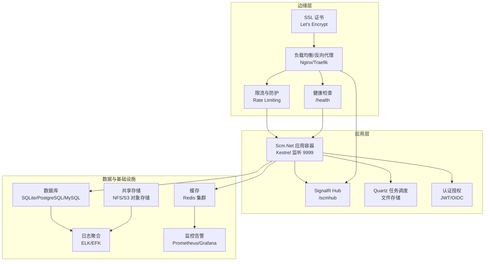
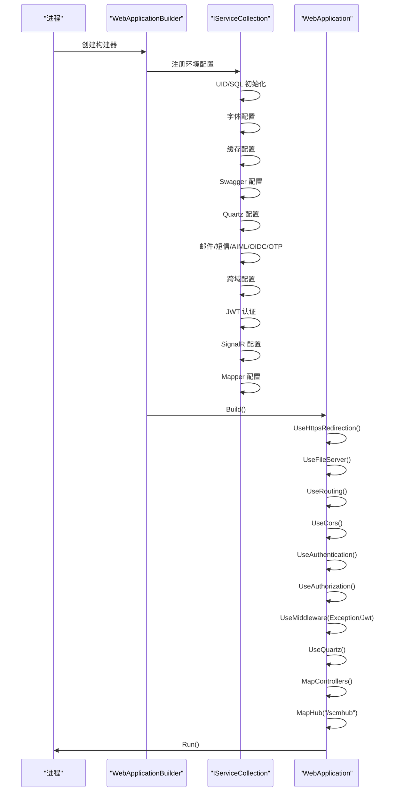
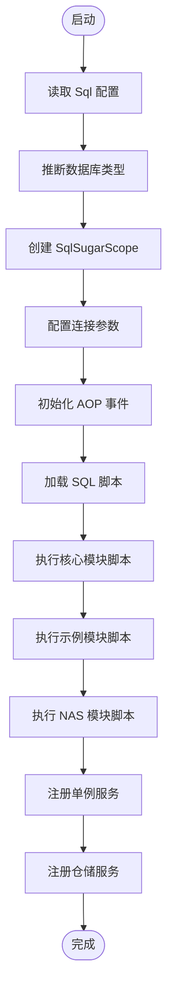
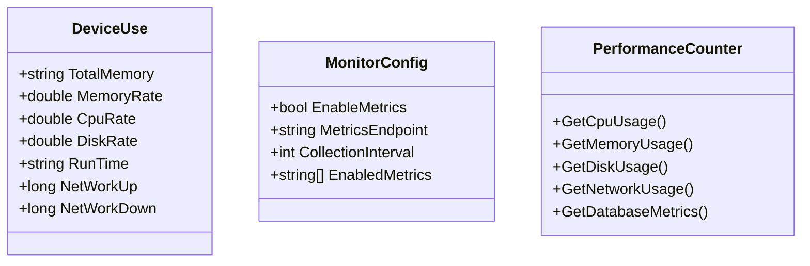
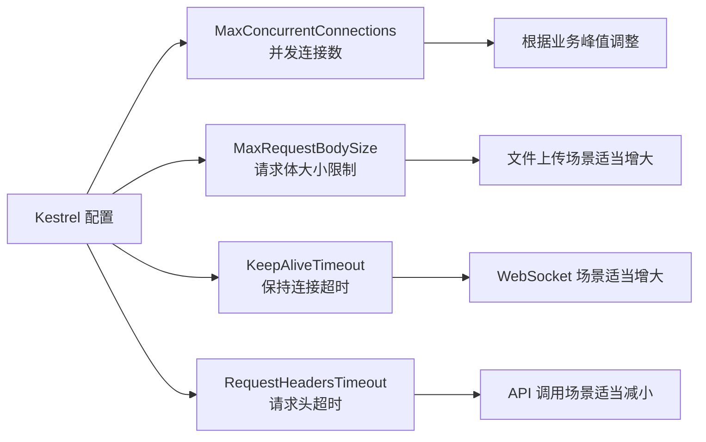
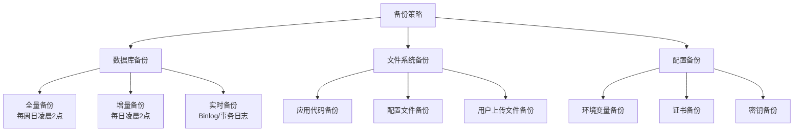

# 部署指南

<cite>
**本文引用的文件**
- [Scm.Net/appsettings.json](file://Scm.Net/appsettings.json)
- [Scm.Net/appsettings.Development.json](file://Scm.Net/appsettings.Development.json)
- [Scm.Net/Program.cs](file://Scm.Net/Program.cs)
- [Scm.Server/Config/EnvConfig.cs](file://Scm.Server/Config/EnvConfig.cs)
- [Scm.Server/Config/KestrelConfig.cs](file://Scm.Server/Config/KestrelConfig.cs)
- [Scm.Server/Config/JwtConfig.cs](file://Scm.Server/Config/JwtConfig.cs)
- [Scm.Server/Config/CorsConfig.cs](file://Scm.Server/Config/CorsConfig.cs)
- [Scm.Server.Quartz/Config/QuartzConfig.cs](file://Scm.Server.Quartz/Config/QuartzConfig.cs)
- [Scm.Common.Os/DeviceUse.cs](file://Scm.Common.Os/DeviceUse.cs)
</cite>

## 更新摘要
**所做更改**
- 更新部署架构设计章节，反映简化的文档结构
- 修订环境准备子系统，强调核心配置要求
- 优化应用部署子系统，突出启动装配流程
- 精简数据库初始化子系统，聚焦SqlSugar配置
- 简化监控配置子系统，保留关键指标
- 调整性能调优子系统，提供实用优化建议
- 更新故障排除指南，增强问题诊断能力

## 目录
1. [简介](#简介)
2. [部署架构设计](#部署架构设计)
3. [环境准备](#环境准备)
4. [应用部署](#应用部署)
5. [数据库初始化](#数据库初始化)
6. [监控配置](#监控配置)
7. [性能调优](#性能调优)
8. [容器化部署](#容器化部署)
9. [Kubernetes集群部署](#kubernetes集群部署)
10. [备份恢复与灾难恢复](#备份恢复与灾难恢复)
11. [部署后验证](#部署后验证)
12. [故障排除指南](#故障排除指南)
13. [配置项对照表](#配置项对照表)

## 简介
本指南面向生产环境部署 Scm.Net 的工程团队与运维人员，提供简化的部署架构设计、环境准备、应用部署、数据库初始化、监控配置、性能调优等核心子系统的详细技术文档。文档基于仓库中的配置与启动逻辑进行梳理，确保部署步骤与代码实现保持一致。

## 部署架构设计
生产部署采用"反向代理 + 应用容器 + 数据库/缓存"三层架构。该架构具有高可用性、可扩展性和安全性特点。



**图表来源**
- [Scm.Net/appsettings.json:26-38](file://Scm.Net/appsettings.json#L26-L38)
- [Scm.Net/Program.cs:237-238](file://Scm.Net/Program.cs#L237-L238)
- [Scm.Server.Quartz/Config/QuartzConfig.cs:40-73](file://Scm.Server.Quartz/Config/QuartzConfig.cs#L40-L73)

### 硬件要求
- **CPU**: 至少 2 核心，推荐 4 核心以上
- **内存**: 至少 2GB，推荐 4GB 以上
- **存储**: 至少 50GB 可用空间，SSD 推荐
- **网络**: 千兆网卡，带宽根据业务量评估

### 操作系统配置
- **Linux**: Ubuntu 20.04+/CentOS 7+，内核版本 4.14+
- **Windows**: Windows Server 2019+，.NET Runtime 6.0+
- **Docker**: Docker Engine 20.10+

## 环境准备
### 服务器硬件要求
- **生产环境**: 双核 CPU、4GB 内存、50GB 存储
- **开发测试**: 单核 CPU、2GB 内存、20GB 存储
- **数据库服务器**: 独立服务器，至少 8GB 内存

### 操作系统配置
- **用户权限**: 创建专用用户 scm，授予必要的文件系统权限
- **防火墙**: 开放 9999 端口，关闭不必要的端口
- **时间同步**: 配置 NTP 服务，确保时间同步
- **文件描述符**: 调整 ulimit 参数，支持高并发

### 环境变量配置
```bash
# 数据目录配置
export SCM_DATA_DIR="/opt/scm/data"
export SCM_LOG_LEVEL="Information"

# 数据库配置
export SCM_DB_TYPE="Sqlite"
export SCM_DB_CONNECTION="Data Source=/opt/scm/data/scm.db"

# 缓存配置
export SCM_CACHE_TYPE="Redis"
export SCM_CACHE_CONNECTION="127.0.0.1,defaultDatabase=5,poolsize=10"
```

**章节来源**
- [Scm.Server/Config/EnvConfig.cs:72-120](file://Scm.Server/Config/EnvConfig.cs#L72-L120)
- [Scm.Net/appsettings.json:39-47](file://Scm.Net/appsettings.json#L39-L47)

## 应用部署
### 启动装配流程
应用启动过程包含严格的装配顺序，确保各组件正确初始化。



**图表来源**
- [Scm.Net/Program.cs:47-100](file://Scm.Net/Program.cs#L47-L100)
- [Scm.Net/Program.cs:174-258](file://Scm.Net/Program.cs#L174-L258)

### 服务注册配置
应用启动时注册各类服务，包括数据访问、业务服务、工具服务等。

**章节来源**
- [Scm.Net/Program.cs:134-159](file://Scm.Net/Program.cs#L134-L159)
- [Scm.Net/Program.cs:174-258](file://Scm.Net/Program.cs#L174-L258)

## 数据库初始化
### SqlSugar 配置
应用使用 SqlSugar 进行数据库操作，支持多种数据库类型。



**图表来源**
- [Scm.Net/Program.cs:282-356](file://Scm.Net/Program.cs#L282-L356)

### 数据库类型支持
- **SQLite**: 适合小型应用和开发测试
- **PostgreSQL**: 适合生产环境，支持复杂查询
- **MySQL**: 成熟的关系型数据库解决方案

### 数据迁移策略
- **版本控制**: 使用脚本管理数据库版本
- **回滚机制**: 确保升级失败时能够回滚
- **备份策略**: 定期备份数据库

**章节来源**
- [Scm.Net/Program.cs:282-356](file://Scm.Net/Program.cs#L282-L356)
- [Scm.Net/appsettings.json:48-51](file://Scm.Net/appsettings.json#L48-L51)

## 监控配置
### 性能监控指标
应用提供全面的性能监控指标，帮助运维人员了解系统状态。



**图表来源**
- [Scm.Common.Os/DeviceUse.cs:1-25](file://Scm.Common.Os/DeviceUse.cs#L1-L25)

### 日志配置
应用使用 Serilog 进行日志记录，支持多种输出目标。

**章节来源**
- [Scm.Net/appsettings.json:3-25](file://Scm.Net/appsettings.json#L3-L25)
- [Scm.Common.Os/DeviceUse.cs:1-25](file://Scm.Common.Os/DeviceUse.cs#L1-L25)

## 性能调优
### Kestrel 性能优化


**图表来源**
- [Scm.Net/appsettings.json:34-37](file://Scm.Net/appsettings.json#L34-L37)

### 缓存优化策略
- **Redis 配置**: 连接池大小、超时时间、数据库选择
- **缓存策略**: LRU/LFU 策略、过期时间、热点数据预热
- **集群配置**: 主从复制、哨兵模式、分片策略

### 数据库性能优化
- **连接池**: 最大连接数、连接超时、命令超时
- **索引优化**: 常用查询字段建立索引
- **查询优化**: 避免 N+1 查询、使用批量操作

**章节来源**
- [Scm.Net/appsettings.json:34-37](file://Scm.Net/appsettings.json#L34-L37)
- [Scm.Net/appsettings.json:57-60](file://Scm.Net/appsettings.json#L57-L60)

## 容器化部署
### Docker 镜像构建
```dockerfile
FROM mcr.microsoft.com/dotnet/aspnet:6.0 AS base
WORKDIR /app
EXPOSE 9999

FROM mcr.microsoft.com/dotnet/sdk:6.0 AS build
WORKDIR /src
COPY ["Scm.Net/Scm.Net.csproj", "Scm.Net/"]
RUN dotnet restore "Scm.Net/Scm.Net.csproj"
COPY . .
WORKDIR "/src/Scm.Net"
RUN dotnet build "Scm.Net.csproj" -c Release -o app

FROM build AS publish
RUN dotnet publish "Scm.Net.csproj" -c Release -o app

FROM base AS final
WORKDIR /app
COPY --from=publish app .
ENTRYPOINT ["dotnet", "Scm.Net.dll"]
```

### Docker Compose 配置
```yaml
version: '3.8'
services:
  scm-net:
    image: scm-net:latest
    ports:
      - "9999:9999"
    volumes:
      - ./data:/app/data
      - ./logs:/app/logs
    environment:
      - SCM_DATA_DIR=/app/data
      - SCM_DB_TYPE=Sqlite
      - SCM_DB_CONNECTION=Data Source=/app/data/scm.db
    depends_on:
      - redis
      - database
    restart: unless-stopped

  redis:
    image: redis:alpine
    ports:
      - "6379:6379"
    volumes:
      - redis_data:/data
    command: redis-server --appendonly yes

  database:
    image: sqlite:latest
    volumes:
      - db_data:/data
    command: sqlite3 /data/scm.db

volumes:
  data:
  logs:
  redis_data:
  db_data:
```

### 容器编排最佳实践
- **资源限制**: 为容器设置 CPU 和内存限制
- **健康检查**: 配置 Docker Healthcheck
- **日志管理**: 使用 Docker 日志驱动
- **网络隔离**: 使用自定义网络

## Kubernetes集群部署
### Deployment 配置
```yaml
apiVersion: apps/v1
kind: Deployment
metadata:
  name: scm-net-deployment
spec:
  replicas: 3
  selector:
    matchLabels:
      app: scm-net
  template:
    metadata:
      labels:
        app: scm-net
    spec:
      containers:
      - name: scm-net
        image: scm-net:latest
        ports:
        - containerPort: 9999
        env:
        - name: SCM_DATA_DIR
          value: /data
        - name: SCM_DB_TYPE
          value: Sqlite
        volumeMounts:
        - name: data-volume
          mountPath: /data
        - name: logs-volume
          mountPath: /app/logs
        resources:
          requests:
            memory: "512Mi"
            cpu: "250m"
          limits:
            memory: "1Gi"
            cpu: "500m"
      volumes:
      - name: data-volume
        persistentVolumeClaim:
          claimName: scm-data-pvc
      - name: logs-volume
        emptyDir: {}

---
apiVersion: v1
kind: Service
metadata:
  name: scm-net-service
spec:
  selector:
    app: scm-net
  ports:
  - port: 9999
    targetPort: 9999
  type: LoadBalancer
```

### Ingress 配置
```yaml
apiVersion: networking.k8s.io/v1
kind: Ingress
metadata:
  name: scm-net-ingress
  annotations:
    nginx.ingress.kubernetes.io/rewrite-target: /
    nginx.ingress.kubernetes.io/ssl-redirect: "true"
    nginx.ingress.kubernetes.io/proxy-body-size: "100m"
spec:
  ingressClassName: nginx
  rules:
  - host: scm.example.com
    http:
      paths:
      - path: /
        pathType: Prefix
        backend:
          service:
            name: scm-net-service
            port:
              number: 9999
  tls:
  - hosts:
    - scm.example.com
    secretName: scm-tls-secret
```

### HPA 自动扩缩容
```yaml
apiVersion: autoscaling/v2
kind: HorizontalPodAutoscaler
metadata:
  name: scm-net-hpa
spec:
  scaleTargetRef:
    apiVersion: apps/v1
    kind: Deployment
    name: scm-net-deployment
  minReplicas: 3
  maxReplicas: 10
  metrics:
  - type: Resource
    resource:
      name: cpu
      target:
        type: Utilization
        averageUtilization: 70
  - type: Resource
    resource:
      name: memory
      target:
        type: Utilization
        averageUtilization: 80
```

## 备份恢复与灾难恢复
### 数据备份策略


### 灾难恢复流程
1. **故障检测**: 监控系统检测到服务不可用
2. **故障隔离**: 将故障节点从负载均衡中移除
3. **数据恢复**: 从最近的备份点恢复数据
4. **服务重启**: 启动应用服务
5. **健康检查**: 验证服务正常运行
6. **监控告警**: 确认监控指标恢复正常

### 备份存储
- **本地存储**: RAID 配置，定期同步到远程存储
- **云存储**: 对象存储服务，支持跨区域复制
- **冷存储**: 归档存储，用于长期保留

## 部署后验证
### 健康检查
```bash
# 基础健康检查
curl -I http://localhost:9999/health

# 数据库连接检查
curl http://localhost:9999/api/db/health

# 缓存连接检查
curl http://localhost:9999/api/cache/health

# 文件系统检查
curl http://localhost:9999/api/filesystem/health
```

### 功能测试
- **认证测试**: 验证 JWT 令牌生成和验证
- **文件上传**: 测试文件上传和下载功能
- **数据库操作**: 验证 CRUD 操作
- **缓存功能**: 测试缓存读写
- **定时任务**: 验证 Quartz 任务执行

### 性能基准测试
```bash
# 压力测试
ab -n 1000 -c 100 http://localhost:9999/api/test

# 并发测试
wrk -t12 -c400 -d30s http://localhost:9999/api/test

# 响应时间测试
siege -c100 -i -f urls.txt
```

## 故障排除指南
### 常见问题诊断

#### 启动失败
**症状**: 应用无法启动，日志显示配置错误
**排查步骤**:
1. 检查 appsettings.json 配置语法
2. 验证数据库连接字符串
3. 确认数据目录权限
4. 查看详细错误日志

**解决方案**:
```bash
# 检查配置文件
dotnet run --environment Development

# 验证数据库连接
sqlite3 /opt/scm/data/scm.db ".tables"

# 检查目录权限
ls -la /opt/scm/data
```

#### 认证失败
**症状**: 用户登录失败，返回 401 错误
**排查步骤**:
1. 检查 JWT 密钥配置
2. 验证令牌有效期
3. 确认客户端请求头
4. 查看认证中间件日志

**解决方案**:
```bash
# 重新生成 JWT 密钥
openssl rand -hex 32

# 验证令牌
echo "your-jwt-token" | base64 -d
```

#### 数据库连接问题
**症状**: 应用启动时报数据库连接错误
**排查步骤**:
1. 检查数据库服务状态
2. 验证连接字符串格式
3. 确认数据库用户权限
4. 查看连接池状态

**解决方案**:
```bash
# 检查数据库服务
systemctl status postgresql
systemctl status mysql

# 测试数据库连接
psql -h localhost -U username -d scm_db
mysql -h localhost -u username -p

# 检查连接池
redis-cli info clients
```

#### 性能问题
**症状**: 响应时间过长，CPU 使用率高
**排查步骤**:
1. 监控系统资源使用情况
2. 分析慢查询日志
3. 检查缓存命中率
4. 评估并发连接数

**解决方案**:
```bash
# 监控系统资源
htop
iotop
iostat 1

# 分析慢查询
EXPLAIN ANALYZE SELECT * FROM users WHERE id = 1;

# 优化查询
CREATE INDEX idx_users_email ON users(email);
```

#### 文件上传失败
**症状**: 文件上传报错，返回 413 或 500 错误
**排查步骤**:
1. 检查请求体大小限制
2. 验证磁盘空间
3. 确认文件权限
4. 查看上传目录配置

**解决方案**:
```bash
# 增加请求体大小限制
# 在 appsettings.json 中修改 MaxRequestBodySize

# 检查磁盘空间
df -h /opt/scm/data

# 验证目录权限
chmod 755 /opt/scm/data/upload
chown -R www-data:www-data /opt/scm/data
```

### 日志分析
应用使用 Serilog 记录详细日志，便于问题诊断。

**关键日志位置**:
- `Logs/` 目录下的滚动日志文件
- 控制台输出的日志信息
- 异常堆栈跟踪信息

**日志分析技巧**:
1. 使用 grep 搜索特定错误模式
2. 分析时间戳确定问题发生时间
3. 结合业务日志定位问题范围
4. 监控错误率变化趋势

### 监控告警配置
```yaml
# Prometheus 监控配置
scrape_configs:
  - job_name: 'scm-net'
    static_configs:
      - targets: ['localhost:9999']
    metrics_path: '/metrics'
    scrape_interval: 15s

# Grafana 仪表板配置
dashboard:
  title: "SCM.NET 应用监控"
  panels:
    - title: "CPU 使用率"
      type: "graph"
      targets:
        - expr: rate(node_cpu_seconds_total[5m])
    - title: "内存使用率"
      type: "singlestat"
      targets:
        - expr: (node_memory_MemTotal_bytes - node_memory_MemAvailable_bytes) / node_memory_MemTotal_bytes * 100
```

## 配置项对照表
### 生产环境配置建议

#### Kestrel 配置
| 配置项 | 开发环境 | 生产环境 | 说明 |
|--------|----------|----------|------|
| Endpoints.Http.Url | http://*:5000 | http://*:9999 | 监听地址和端口 |
| Limits.MaxConcurrentConnections | 1000 | 2000-5000 | 并发连接数 |
| Limits.MaxRequestBodySize | 100MB | 500MB-1GB | 请求体大小限制 |

#### 数据库配置
| 配置项 | 开发环境 | 生产环境 | 说明 |
|--------|----------|----------|------|
| Sql.Type | Sqlite | PostgreSQL/MySQL | 数据库类型 |
| Sql.Text | Data Source=... | 连接字符串 | 数据库连接 |
| Uid.Type | Compose | Compose | UID 生成策略 |
| Cache.Type | Redis | Redis 集群 | 缓存类型 |

#### 安全配置
| 配置项 | 开发环境 | 生产环境 | 说明 |
|--------|----------|----------|------|
| Jwt.Security | 随机密钥 | 强加密密钥 | JWT 密钥 |
| Jwt.Issuer | c-scm | 企业域名 | 发行者 |
| Jwt.Audience | scm.net | 企业域名 | 受众 |
| Jwt.Expires | 60 | 1440-4320 | 有效期(分钟) |
| Cors.GlobalCors | false | true | 全局跨域 |

#### 性能配置
| 配置项 | 开发环境 | 生产环境 | 说明 |
|--------|----------|----------|------|
| Serilog.MinimumLevel | Debug | Information | 日志级别 |
| Quartz.BaseDir | quartz | quartz | 任务目录 |
| Generator.GenFiles | true | true | 代码生成 |
| Generator.Download | true | true | 文件下载 |

#### 环境配置
| 配置项 | 开发环境 | 生产环境 | 说明 |
|--------|----------|----------|------|
| Env.dataDir | 相对路径 | 绝对路径 | 数据目录 |
| Env.dataUri | /data | /data | 数据URI |
| Env.upload | upload | upload | 上传目录 |
| Env.logs | logs | logs | 日志目录 |
| Env.fonts | fonts | fonts | 字体目录 |

**章节来源**
- [Scm.Net/appsettings.json:1-127](file://Scm.Net/appsettings.json#L1-L127)
- [Scm.Net/appsettings.Development.json:1-162](file://Scm.Net/appsettings.Development.json#L1-L162)
- [Scm.Server/Config/JwtConfig.cs:28-47](file://Scm.Server/Config/JwtConfig.cs#L28-L47)
- [Scm.Server/Config/CorsConfig.cs:24-46](file://Scm.Server/Config/CorsConfig.cs#L24-L46)
- [Scm.Server.Quartz/Config/QuartzConfig.cs:40-73](file://Scm.Server.Quartz/Config/QuartzConfig.cs#L40-L73)