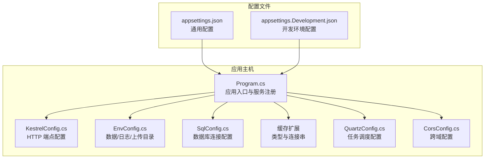
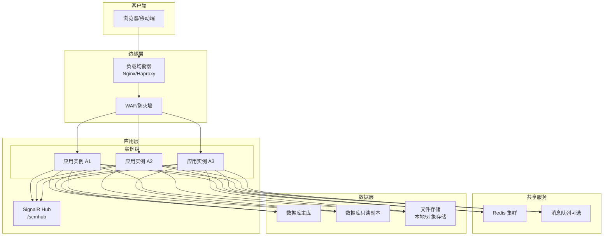
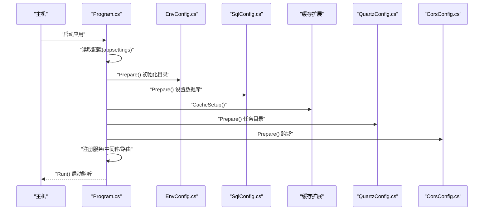

# 部署架构设计

<cite>
**本文引用的文件**
- [Scm.Net/appsettings.json](file://Scm.Net/appsettings.json)
- [Scm.Net/appsettings.Development.json](file://Scm.Net/appsettings.Development.json)
- [Scm.Net/Program.cs](file://Scm.Net/Program.cs)
- [Scm.Server/Config/KestrelConfig.cs](file://Scm.Server/Config/KestrelConfig.cs)
- [Scm.Server/Config/DataConfig.cs](file://Scm.Server/Config/DataConfig.cs)
- [Scm.Server/Config/SqlConfig.cs](file://Scm.Server/Config/SqlConfig.cs)
- [Scm.Server/Config/EnvConfig.cs](file://Scm.Server/Config/EnvConfig.cs)
- [Scm.Server.Quartz/Config/QuartzConfig.cs](file://Scm.Server.Quartz/Config/QuartzConfig.cs)
- [Scm.Server/Config/CorsConfig.cs](file://Scm.Server/Config/CorsConfig.cs)
</cite>

## 目录
1. [简介](#简介)
2. [项目结构](#项目结构)
3. [核心组件](#核心组件)
4. [架构总览](#架构总览)
5. [详细组件分析](#详细组件分析)
6. [依赖关系分析](#依赖关系分析)
7. [性能考量](#性能考量)
8. [故障排查指南](#故障排查指南)
9. [结论](#结论)
10. [附录](#附录)

## 简介
本文件面向 Scm.Net 的生产部署，提供系统架构设计与部署建议，覆盖单机部署与集群部署两种模式，明确 Web 服务器、数据库、缓存、任务调度器与文件存储系统的交互关系，给出负载均衡策略、高可用配置与容灾备份方案，并以图示方式说明网络拓扑、数据流向、端口与安全边界，最后按规模提供从开发测试到生产级高可用集群的部署建议。

## 项目结构
Scm.Net 采用 ASP.NET Core 主机（WebApplicationBuilder/WebApplication）进行启动与配置，核心配置通过 appsettings.json 与环境特定配置（如开发环境）加载，运行时由 Kestrel 承载 HTTP 服务，静态资源通过 FileServer 提供，业务服务通过依赖注入注册，数据库使用 SqlSugar 进行访问，缓存通过扩展方法接入，任务调度使用 Quartz，文件存储由 EnvConfig 统一管理。

**图表来源**
- [Scm.Net/Program.cs:31-258](file://Scm.Net/Program.cs#L31-L258)
- [Scm.Server/Config/KestrelConfig.cs:1-24](file://Scm.Server/Config/KestrelConfig.cs#L1-L24)
- [Scm.Server/Config/EnvConfig.cs:1-280](file://Scm.Server/Config/EnvConfig.cs#L1-L280)
- [Scm.Server/Config/SqlConfig.cs:1-23](file://Scm.Server/Config/SqlConfig.cs#L1-L23)
- [Scm.Server.Quartz/Config/QuartzConfig.cs:1-81](file://Scm.Server.Quartz/Config/QuartzConfig.cs#L1-L81)
- [Scm.Server/Config/CorsConfig.cs:1-49](file://Scm.Server/Config/CorsConfig.cs#L1-L49)
- [Scm.Net/appsettings.json:1-127](file://Scm.Net/appsettings.json#L1-L127)
- [Scm.Net/appsettings.Development.json:1-162](file://Scm.Net/appsettings.Development.json#L1-L162)

**章节来源**
- [Scm.Net/Program.cs:31-258](file://Scm.Net/Program.cs#L31-L258)
- [Scm.Net/appsettings.json:1-127](file://Scm.Net/appsettings.json#L1-L127)
- [Scm.Net/appsettings.Development.json:1-162](file://Scm.Net/appsettings.Development.json#L1-L162)

## 核心组件
- Web 服务器（Kestrel）
  - 通过 KestrelConfig 配置 HTTP 端点，默认监听所有 IP 的指定端口；生产环境建议绑定内网或受信 IP 并启用 HTTPS。
- 数据库（SqlSugar）
  - 通过 SqlConfig 指定数据库类型与连接串；默认使用 SQLite，生产建议使用关系型数据库（如 SQL Server/MySQL），并开启连接池与只读副本。
- 缓存（Redis）
  - 通过 appsettings.json 的 Cache 节点配置 Redis 连接参数（主机、数据库索引、连接池大小），用于会话、令牌缓存与分布式锁。
- 任务调度（Quartz）
  - 通过 QuartzConfig 配置任务数据目录、日志目录与作业文件；支持文件模式或数据库模式，生产建议数据库模式以实现持久化与多实例共享。
- 文件存储（EnvConfig）
  - 通过 EnvConfig 统一管理 dataDir、upload、images、logs、fonts 等目录，支持相对/绝对路径与 URI 映射；生产建议挂载独立磁盘或对象存储（S3/MinIO）并配置 CDN。
- 跨域与安全（Cors/JWT/OIDC/OTP）
  - CorsConfig 控制跨域白名单与凭证；JWT、OIDC、OTP 在配置中定义密钥、算法与过期时间，生产需妥善保管密钥并启用 HTTPS。

**章节来源**
- [Scm.Server/Config/KestrelConfig.cs:1-24](file://Scm.Server/Config/KestrelConfig.cs#L1-L24)
- [Scm.Server/Config/SqlConfig.cs:1-23](file://Scm.Server/Config/SqlConfig.cs#L1-L23)
- [Scm.Net/appsettings.json:48-60](file://Scm.Net/appsettings.json#L48-L60)
- [Scm.Server.Quartz/Config/QuartzConfig.cs:1-81](file://Scm.Server.Quartz/Config/QuartzConfig.cs#L1-L81)
- [Scm.Server/Config/EnvConfig.cs:1-280](file://Scm.Server/Config/EnvConfig.cs#L1-L280)
- [Scm.Server/Config/CorsConfig.cs:1-49](file://Scm.Server/Config/CorsConfig.cs#L1-L49)
- [Scm.Net/appsettings.json:100-126](file://Scm.Net/appsettings.json#L100-L126)

## 架构总览
下图展示生产环境典型拓扑：反向代理（Nginx/Haproxy）作为统一入口，后端多实例通过健康检查与负载均衡分发请求；数据库主从复制，缓存集群化；文件存储可本地直挂或对象存储；任务调度使用数据库模式并配合外部消息队列（可选）。

[此图为概念性拓扑示意，不直接对应具体源码文件，故无“图表来源”标注]

## 详细组件分析

### Web 服务器（Kestrel）与反向代理
- 端口与监听
  - 生产环境建议在 Kestrel 上绑定内网 IP 或受信 IP，并通过反向代理暴露 HTTPS 端口；避免直接对外暴露 HTTP。
- 连接限制
  - 可通过 Kestrel.Limits 配置并发连接数与请求体大小，生产应根据实例规格与业务峰值调优。
- 反向代理
  - Nginx/Haproxy 建议启用健康检查、超时重试、限流与 WAF 规则；对静态资源与 WebSocket（/scmhub）分别优化缓存与长连接。

**章节来源**
- [Scm.Server/Config/KestrelConfig.cs:1-24](file://Scm.Server/Config/KestrelConfig.cs#L1-L24)
- [Scm.Net/appsettings.json:26-38](file://Scm.Net/appsettings.json#L26-L38)

### 数据库（SqlSugar）与高可用
- 连接配置
  - SqlConfig.Type 与 Text 决定数据库类型与连接串；生产建议使用企业级数据库并启用连接池。
- 主从与只读副本
  - 应用实例读取流量可路由至只读副本，写操作仅走主库；结合连接字符串的只读副本配置可降低主库压力。
- 事务与一致性
  - 使用 SqlSugar 的事务封装，确保跨表更新的一致性；对长事务与批量导入建议拆分批次。

**章节来源**
- [Scm.Server/Config/SqlConfig.cs:1-23](file://Scm.Server/Config/SqlConfig.cs#L1-L23)
- [Scm.Net/Program.cs:282-356](file://Scm.Net/Program.cs#L282-L356)

### 缓存（Redis）与会话
- 连接参数
  - Cache.Type 与 Text 指定 Redis 类型与连接串；生产建议使用集群或哨兵模式，配置合理的数据库索引与连接池上限。
- 使用场景
  - 令牌缓存、会话状态、分布式锁与热点数据缓存；建议为不同用途划分数据库索引，避免键冲突。
- 故障与降级
  - 缓存不可用时应快速失败或降级读取，避免级联阻塞；对关键缓存键设置过期策略与监控告警。

**章节来源**
- [Scm.Net/appsettings.json:57-60](file://Scm.Net/appsettings.json#L57-L60)
- [Scm.Net/Program.cs:72-73](file://Scm.Net/Program.cs#L72-L73)

### 任务调度（Quartz）与作业持久化
- 配置要点
  - QuartzConfig.BaseDir/DataDir/LogsDir/JobFile 决定作业定义与日志存放位置；生产建议使用数据库模式持久化作业与状态。
- 实例扩展
  - 通过 AddQuartzClassJobs 注册类作业；建议将耗时任务迁移到后台队列（RabbitMQ/Redis Streams）以提升吞吐。
- 监控与恢复
  - 对失败作业自动重试与报警；定期清理历史日志与作业记录，避免磁盘膨胀。

**章节来源**
- [Scm.Server.Quartz/Config/QuartzConfig.cs:1-81](file://Scm.Server.Quartz/Config/QuartzConfig.cs#L1-L81)
- [Scm.Net/Program.cs:95-99](file://Scm.Net/Program.cs#L95-L99)

### 文件存储（EnvConfig）与静态资源
- 目录管理
  - EnvConfig 统一管理 dataDir、upload、images、logs、fonts 等路径；生产建议将 dataDir 挂载独立磁盘或对象存储。
- 静态资源
  - 通过 FileServer 提供静态文件；生产建议启用 CDN 与压缩，区分版本号与缓存策略。
- 安全边界
  - 对敏感文件（如上传目录）限制访问权限，结合反向代理的访问控制与 WAF 规则。

**章节来源**
- [Scm.Server/Config/EnvConfig.cs:1-280](file://Scm.Server/Config/EnvConfig.cs#L1-L280)
- [Scm.Net/Program.cs:194-201](file://Scm.Net/Program.cs#L194-L201)

### 跨域、认证与安全
- 跨域（CORS）
  - CorsConfig 控制允许的来源、方法、头与凭证；生产建议最小化白名单并启用预检缓存。
- 认证与授权
  - JWT、OIDC、OTP 在配置中定义密钥、算法与过期时间；生产需妥善保管密钥并启用 HTTPS。
- 中间件链
  - 异常中间件、JWT 中间件与路由中间件顺序影响安全与可观测性；生产建议开启请求体缓冲以便审计。

**章节来源**
- [Scm.Server/Config/CorsConfig.cs:1-49](file://Scm.Server/Config/CorsConfig.cs#L1-L49)
- [Scm.Net/appsettings.json:100-126](file://Scm.Net/appsettings.json#L100-L126)
- [Scm.Net/Program.cs:203-233](file://Scm.Net/Program.cs#L203-L233)

## 依赖关系分析
应用启动流程的关键依赖如下：Program 读取配置 → 初始化环境与数据库 → 注册服务 → 启用中间件 → 映射控制器与 SignalR Hub → 运行。

**图表来源**
- [Scm.Net/Program.cs:31-258](file://Scm.Net/Program.cs#L31-L258)
- [Scm.Server/Config/EnvConfig.cs:72-102](file://Scm.Server/Config/EnvConfig.cs#L72-L102)
- [Scm.Server/Config/SqlConfig.cs:10-20](file://Scm.Server/Config/SqlConfig.cs#L10-L20)
- [Scm.Server.Quartz/Config/QuartzConfig.cs:40-73](file://Scm.Server.Quartz/Config/QuartzConfig.cs#L40-L73)
- [Scm.Server/Config/CorsConfig.cs:24-46](file://Scm.Server/Config/CorsConfig.cs#L24-L46)

**章节来源**
- [Scm.Net/Program.cs:31-258](file://Scm.Net/Program.cs#L31-L258)

## 性能考量
- 连接池与并发
  - 数据库连接池大小与 Kestrel 最大并发连接数需匹配实例规格；对高并发场景启用连接复用与请求限流。
- 缓存命中率
  - 对热点数据增加缓存层级（本地缓存+Redis），合理设置过期策略与失效同步。
- 任务与队列
  - 将 CPU 密集或 IO 密集任务异步化，必要时引入消息队列解耦；对定时任务使用 Quartz 数据库模式保证一致性。
- 文件与CDN
  - 静态资源走 CDN，上传文件采用分片与断点续传；对图片进行压缩与格式优化。
- 监控与压测
  - 建立端到端监控（APM/日志/指标），定期进行容量与压力测试，提前发现瓶颈。

[本节为通用指导，无需“章节来源”]

## 故障排查指南
- 启动失败
  - 检查 appsettings 中 Kestrel.Url、数据库连接串、缓存连接串是否正确；确认 dataDir 目录存在且具备读写权限。
- 请求超时
  - 检查 Kestrel.Limits、数据库连接池、Redis 连接池与只读副本延迟；排查慢查询与热点键。
- 任务未执行
  - 确认 Quartz 数据库模式已启用且作业文件存在；查看作业日志与重试策略。
- 文件访问异常
  - 检查 EnvConfig.DataUri 与 FileServer 配置，确认静态资源路径映射正确。
- 跨域与鉴权问题
  - 核对 CorsConfig 白名单与凭证设置；确认 JWT 密钥一致且未过期。

**章节来源**
- [Scm.Net/appsettings.json:26-60](file://Scm.Net/appsettings.json#L26-L60)
- [Scm.Server.Quartz/Config/QuartzConfig.cs:40-73](file://Scm.Server.Quartz/Config/QuartzConfig.cs#L40-L73)
- [Scm.Server/Config/EnvConfig.cs:174-177](file://Scm.Server/Config/EnvConfig.cs#L174-L177)
- [Scm.Server/Config/CorsConfig.cs:24-46](file://Scm.Server/Config/CorsConfig.cs#L24-L46)

## 结论
Scm.Net 的生产部署应以“反向代理 + 多实例 + 数据库主从 + 缓存集群 + 对象存储/CDN + Quartz 数据库模式”为核心架构，结合严格的跨域与认证策略、完善的监控与压测体系，实现高可用、可扩展与易运维。针对不同规模，可按附录建议选择合适的部署形态与资源配置。

[本节为总结性内容，无需“章节来源”]

## 附录

### 不同规模部署建议
- 开发测试环境
  - 单机部署：Kestrel + SQLite + 本地 Redis + 本地文件系统；通过 appsettings.Development.json 调整端口与目录。
  - 建议：启用 Swagger，简化调试；关闭或放宽 CORS 限制。
- 小型生产
  - 单机或多实例（2-3 实例）：反向代理 + 数据库主从 + Redis 哨兵 + 对象存储；Quartz 使用数据库模式。
  - 建议：启用 HTTPS、WAF、日志聚合与基础监控。
- 中型生产
  - 多实例（4-8 实例）+ 负载均衡 + 数据库读写分离 + Redis 集群 + CDN + 消息队列；文件存储对象化。
  - 建议：启用自动扩缩容、金丝雀发布、熔断与降级。
- 大型生产
  - 多可用区/多机房 + 多活容灾 + 数据库多主/全局事务（可选）+ 分布式缓存 + 流批一体的任务平台 + AI/日志/指标一体化平台。
  - 建议：实施混沌工程、自动化运维与安全审计。

[本节为通用指导，无需“章节来源”]

### 端口与安全边界
- 端口
  - 反向代理：80/443（生产建议强制 HTTPS）
  - 应用实例：Kestrel 默认 9999（开发默认 5000），生产建议绑定内网 IP 并通过反向代理暴露
  - 数据库：标准端口（如 3306/1433），仅内网访问
  - 缓存：Redis 标准端口，仅内网访问
- 防火墙
  - 仅开放反向代理端口给公网；内部放行应用实例与共享服务端口；严格限制数据库与缓存访问范围
- 安全边界
  - HTTPS/TLS、WAF/WAF 规则、CORS 白名单、JWT 密钥管理、敏感配置加密存储

**章节来源**
- [Scm.Net/appsettings.json:26-38](file://Scm.Net/appsettings.json#L26-L38)
- [Scm.Net/appsettings.Development.json:26-37](file://Scm.Net/appsettings.Development.json#L26-L37)
- [Scm.Server/Config/CorsConfig.cs:24-46](file://Scm.Server/Config/CorsConfig.cs#L24-L46)