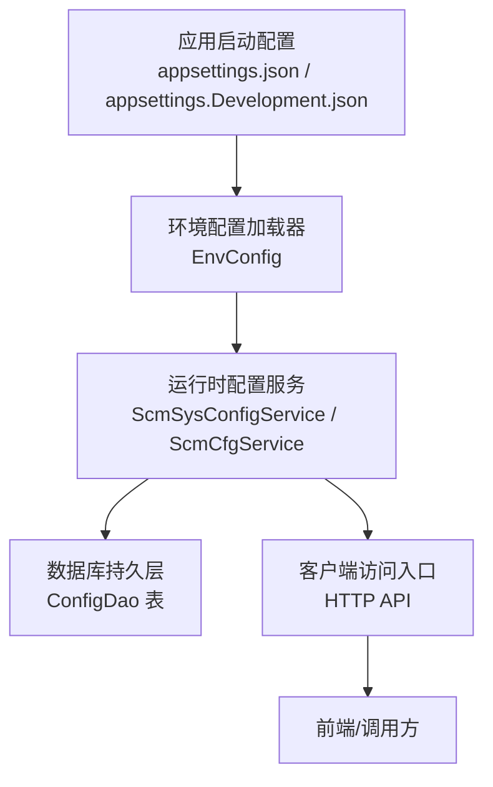
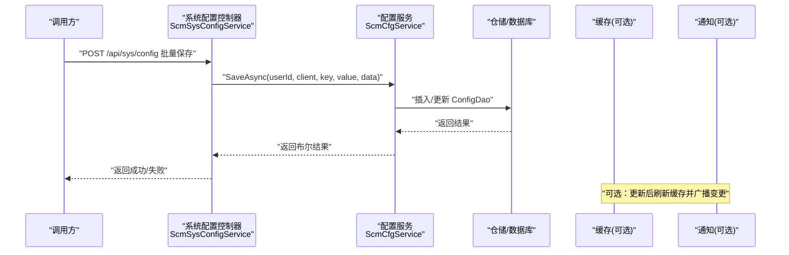
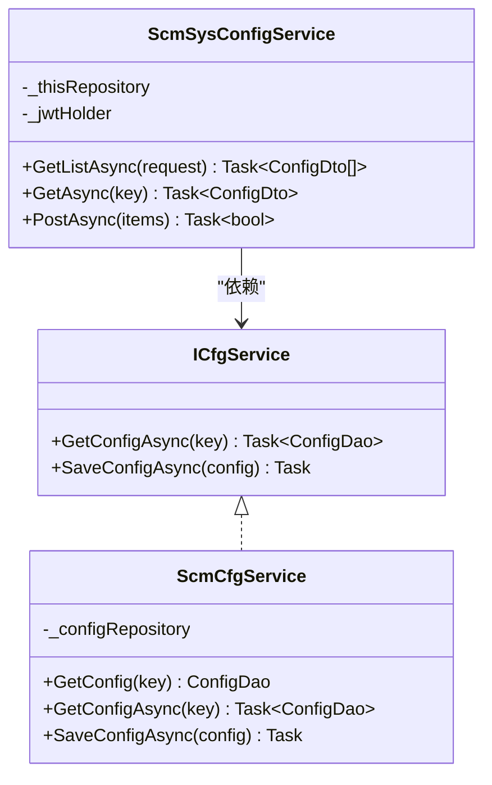
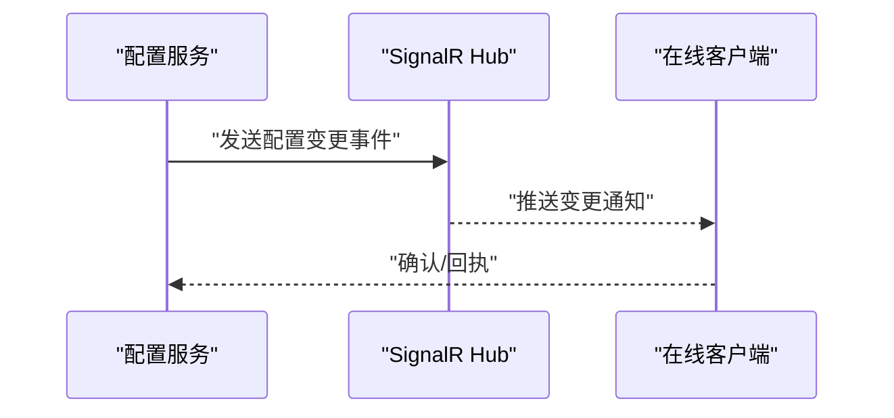
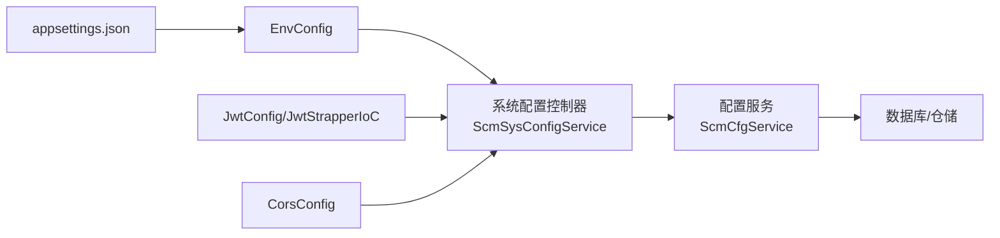

# 动态配置更新

<cite>
**本文引用的文件**
- [Scm.Net/appsettings.json](file://Scm.Net/appsettings.json)
- [Scm.Net/appsettings.Development.json](file://Scm.Net/appsettings.Development.json)
- [Scm.Server/Config/EnvConfig.cs](file://Scm.Server/Config/EnvConfig.cs)
- [Scm.Server/Config/CorsConfig.cs](file://Scm.Server/Config/CorsConfig.cs)
- [Scm.Server/Config/JwtConfig.cs](file://Scm.Server/Config/JwtConfig.cs)
- [Scm.Server/Config/DataConfig.cs](file://Scm.Server/Config/DataConfig.cs)
- [Scm.Server/Config/LogConfig.cs](file://Scm.Server/Config/LogConfig.cs)
- [Scm.Server/ICfgService.cs](file://Scm.Server/ICfgService.cs)
- [Scm.Server.Service/Service/ScmCfgService.cs](file://Scm.Server.Service/Service/ScmCfgService.cs)
- [Scm.Core/Sys/Config/ScmSysConfigService.cs](file://Scm.Core/Sys/Config/ScmSysConfigService.cs)
- [Scm.Core/Sys/ConfigCat/ScmSysConfigCatService.cs](file://Scm.Core/Sys/ConfigCat/ScmSysConfigCatService.cs)
- [Scm.Server.Bearer/JwtStrapperIoC.cs](file://Scm.Server.Bearer/JwtStrapperIoC.cs)
- [Scm.Net/Controllers/DbController.cs](file://Scm.Net/Controllers/DbController.cs)
- [Nas.Server/Msg/NasMessageService.cs](file://Nas.Server/Msg/NasMessageService.cs)
- [Nas.Common/NasWatchEnums.cs](file://Nas.Common/NasWatchEnums.cs)
- [Nas.Dto/Msg/NasMessageDto.cs](file://Nas.Dto/Msg/NasMessageDto.cs)
- [Nas.Server/Msg/ClientExample.md](file://Nas.Server/Msg/ClientExample.md)
- [Scm.Addon/AddonFactory.cs](file://Scm.Addon/AddonFactory.cs)
</cite>

## 目录
1. [简介](#简介)
2. [项目结构](#项目结构)
3. [核心组件](#核心组件)
4. [架构总览](#架构总览)
5. [详细组件分析](#详细组件分析)
6. [依赖关系分析](#依赖关系分析)
7. [性能考量](#性能考量)
8. [故障排查指南](#故障排查指南)
9. [结论](#结论)
10. [附录](#附录)

## 简介
本技术文档围绕 Scm.Net 的“动态配置更新”能力展开，目标是帮助读者理解系统如何在不重启应用的前提下实现配置的热更新与运行时变更。文档将从配置来源、监听与通知、缓存策略、安全性与一致性、API 接口与使用示例、错误处理与回滚、以及性能影响与优化等方面进行全面阐述。

## 项目结构
Scm.Net 将配置分为两大层面：
- 应用启动配置：位于 Scm.Net/appsettings*.json，用于初始化环境、日志、数据库、缓存、跨域、JWT、安全等基础配置。
- 运行时配置：通过系统配置服务持久化到数据库，供业务按需读取与更新。

图表来源
- [Scm.Net/appsettings.json:1-127](file://Scm.Net/appsettings.json#L1-L127)
- [Scm.Net/appsettings.Development.json:1-162](file://Scm.Net/appsettings.Development.json#L1-L162)
- [Scm.Server/Config/EnvConfig.cs:1-280](file://Scm.Server/Config/EnvConfig.cs#L1-L280)
- [Scm.Core/Sys/Config/ScmSysConfigService.cs:1-117](file://Scm.Core/Sys/Config/ScmSysConfigService.cs#L1-L117)
- [Scm.Server.Service/Service/ScmCfgService.cs:1-62](file://Scm.Server.Service/Service/ScmCfgService.cs#L1-L62)

章节来源
- [Scm.Net/appsettings.json:1-127](file://Scm.Net/appsettings.json#L1-L127)
- [Scm.Net/appsettings.Development.json:1-162](file://Scm.Net/appsettings.Development.json#L1-L162)
- [Scm.Server/Config/EnvConfig.cs:1-280](file://Scm.Server/Config/EnvConfig.cs#L1-L280)

## 核心组件
- 配置源与加载
  - 启动配置：appsettings.json 与 appsettings.Development.json 提供 Serilog、Kestrel、Env、Sql、Uid、Cache、Quartz、Email、Oidc、Otp、Generator、Jwt、Security、Project、Cors 等键值。
  - 环境配置：EnvConfig 负责解析 Env 下的数据目录、上传目录、日志目录等，并提供路径拼接与文件读写工具。
- 运行时配置
  - 接口与服务：ICfgService、ScmCfgService；系统配置控制器 ScmSysConfigService 提供查询与批量保存接口。
  - 数据模型：ConfigDao/Dto 对应数据库表字段，支持按用户与客户端维度隔离。
- 安全与跨域
  - JWT：JwtConfig 与 JwtStrapperIoC 组合，负责令牌签发与验证。
  - CORS：CorsConfig 提供全局跨域策略配置。
- 监听与通知
  - 通过 SignalR 在 NAS 子系统中推送文件夹变更与同步状态，作为“配置变更通知”的参考实现。

章节来源
- [Scm.Server/Config/EnvConfig.cs:1-280](file://Scm.Server/Config/EnvConfig.cs#L1-L280)
- [Scm.Server/Config/CorsConfig.cs:1-49](file://Scm.Server/Config/CorsConfig.cs#L1-L49)
- [Scm.Server/Config/JwtConfig.cs:1-48](file://Scm.Server/Config/JwtConfig.cs#L1-L48)
- [Scm.Server/ICfgService.cs:1-11](file://Scm.Server/ICfgService.cs#L1-L11)
- [Scm.Server.Service/Service/ScmCfgService.cs:1-62](file://Scm.Server.Service/Service/ScmCfgService.cs#L1-L62)
- [Scm.Core/Sys/Config/ScmSysConfigService.cs:1-117](file://Scm.Core/Sys/Config/ScmSysConfigService.cs#L1-L117)
- [Scm.Server.Bearer/JwtStrapperIoC.cs:1-35](file://Scm.Server.Bearer/JwtStrapperIoC.cs#L1-L35)

## 架构总览
下图展示了“配置热更新”的端到端流程：调用方通过 HTTP API 更新运行时配置，服务端持久化到数据库，同时可结合缓存与通知机制实现近实时生效与广播。

图表来源
- [Scm.Core/Sys/Config/ScmSysConfigService.cs:103-114](file://Scm.Core/Sys/Config/ScmSysConfigService.cs#L103-L114)
- [Scm.Server.Service/Service/ScmCfgService.cs:49-60](file://Scm.Server.Service/Service/ScmCfgService.cs#L49-L60)

## 详细组件分析

### 配置源与加载（appsettings）
- 关键要点
  - Serilog：控制台与文件输出、最小日志级别、属性注入。
  - Kestrel：端点与请求大小限制。
  - Env：数据目录、上传/图片/日志/字体等路径。
  - Sql/Uid/Cache/Quartz/Email/Oidc/Otp/Generator/Jwt/Security/Project/Cors 等。
- 加载时机
  - 应用启动时由 ASP.NET Core Configuration 读入，随后通过依赖注入传递给各模块。

章节来源
- [Scm.Net/appsettings.json:1-127](file://Scm.Net/appsettings.json#L1-L127)
- [Scm.Net/appsettings.Development.json:1-162](file://Scm.Net/appsettings.Development.json#L1-L162)

### 环境配置（EnvConfig）
- 职责
  - 解析与校验 Env 下的目录路径，统一生成绝对路径。
  - 提供路径拼接、URI 映射、文件读写等工具方法。
- 与配置热更新的关系
  - 该类主要用于静态路径与资源定位，不直接参与运行时配置热更新；但其路径规则可作为“配置项值”的一部分被其他模块消费。

章节来源
- [Scm.Server/Config/EnvConfig.cs:1-280](file://Scm.Server/Config/EnvConfig.cs#L1-L280)

### 运行时配置服务（系统配置）
- 接口与实现
  - 接口：ICfgService 定义异步获取与保存配置的方法。
  - 实现：ScmCfgService 基于仓储操作数据库，支持按 key 查询与保存。
- 控制器
  - ScmSysConfigService 提供 GET 列表/单个查询与 POST 批量保存接口，内部根据当前用户上下文进行权限过滤与去重更新。

图表来源
- [Scm.Server/ICfgService.cs:1-11](file://Scm.Server/ICfgService.cs#L1-L11)
- [Scm.Server.Service/Service/ScmCfgService.cs:1-62](file://Scm.Server.Service/Service/ScmCfgService.cs#L1-L62)
- [Scm.Core/Sys/Config/ScmSysConfigService.cs:1-117](file://Scm.Core/Sys/Config/ScmSysConfigService.cs#L1-L117)

章节来源
- [Scm.Server/ICfgService.cs:1-11](file://Scm.Server/ICfgService.cs#L1-L11)
- [Scm.Server.Service/Service/ScmCfgService.cs:1-62](file://Scm.Server.Service/Service/ScmCfgService.cs#L1-L62)
- [Scm.Core/Sys/Config/ScmSysConfigService.cs:1-117](file://Scm.Core/Sys/Config/ScmSysConfigService.cs#L1-L117)

### 配置分类与目录
- 配置分类服务
  - ScmSysConfigCatService 提供配置分类列表查询，便于管理与分组展示。
- 用途
  - 与运行时配置配合，形成“分类-键值”的完整配置体系。

章节来源
- [Scm.Core/Sys/ConfigCat/ScmSysConfigCatService.cs:1-43](file://Scm.Core/Sys/ConfigCat/ScmSysConfigCatService.cs#L1-L43)

### 安全与跨域（JWT/CORS）
- JWT
  - JwtConfig 提供安全密钥、发行者、受众、过期时间等参数，并在准备阶段进行默认值填充。
  - JwtStrapperIoC 从配置中读取并注册认证中间件，确保 API 访问受保护。
- CORS
  - CorsConfig 提供全局开关、允许来源、方法、头、凭据、预检缓存等配置，并在准备阶段进行空数组初始化与最小值校正。

章节来源
- [Scm.Server/Config/JwtConfig.cs:1-48](file://Scm.Server/Config/JwtConfig.cs#L1-L48)
- [Scm.Server.Bearer/JwtStrapperIoC.cs:1-35](file://Scm.Server.Bearer/JwtStrapperIoC.cs#L1-L35)
- [Scm.Server/Config/CorsConfig.cs:1-49](file://Scm.Server/Config/CorsConfig.cs#L1-L49)

### 监听与通知（SignalR 示例）
- NAS 子系统通过 SignalR 推送文件夹变更与同步状态消息，体现“变更通知”的实现思路。
- 可借鉴该模式，在运行时配置更新后，向订阅者广播变更事件，以实现近实时生效。

图表来源
- [Nas.Server/Msg/NasMessageService.cs:38-99](file://Nas.Server/Msg/NasMessageService.cs#L38-L99)
- [Nas.Dto/Msg/NasMessageDto.cs:113-169](file://Nas.Dto/Msg/NasMessageDto.cs#L113-L169)
- [Nas.Common/NasWatchEnums.cs:1-27](file://Nas.Common/NasWatchEnums.cs#L1-L27)

章节来源
- [Nas.Server/Msg/NasMessageService.cs:38-99](file://Nas.Server/Msg/NasMessageService.cs#L38-L99)
- [Nas.Dto/Msg/NasMessageDto.cs:113-169](file://Nas.Dto/Msg/NasMessageDto.cs#L113-L169)
- [Nas.Common/NasWatchEnums.cs:1-27](file://Nas.Common/NasWatchEnums.cs#L1-L27)
- [Nas.Server/Msg/ClientExample.md:21-137](file://Nas.Server/Msg/ClientExample.md#L21-L137)

### 插件与扩展（AddonFactory）
- 用于加载外部插件清单与实例，体现系统对“可插拔配置”的支持，可作为运行时扩展配置的载体之一。

章节来源
- [Scm.Addon/AddonFactory.cs:1-145](file://Scm.Addon/AddonFactory.cs#L1-L145)

## 依赖关系分析
- 配置加载链路
  - appsettings → EnvConfig → 各模块（如数据库、缓存、日志）。
- 运行时配置链路
  - ScmSysConfigService → ScmCfgService → 数据库仓储。
- 安全链路
  - JwtConfig/JwtStrapperIoC 保障 API 访问安全；CorsConfig 保障跨域访问策略。

图表来源
- [Scm.Net/appsettings.json:1-127](file://Scm.Net/appsettings.json#L1-L127)
- [Scm.Server/Config/EnvConfig.cs:1-280](file://Scm.Server/Config/EnvConfig.cs#L1-L280)
- [Scm.Core/Sys/Config/ScmSysConfigService.cs:1-117](file://Scm.Core/Sys/Config/ScmSysConfigService.cs#L1-L117)
- [Scm.Server.Service/Service/ScmCfgService.cs:1-62](file://Scm.Server.Service/Service/ScmCfgService.cs#L1-L62)
- [Scm.Server/Config/JwtConfig.cs:1-48](file://Scm.Server/Config/JwtConfig.cs#L1-L48)
- [Scm.Server.Bearer/JwtStrapperIoC.cs:1-35](file://Scm.Server.Bearer/JwtStrapperIoC.cs#L1-L35)
- [Scm.Server/Config/CorsConfig.cs:1-49](file://Scm.Server/Config/CorsConfig.cs#L1-L49)

## 性能考量
- 配置读取
  - 建议引入进程内缓存（如内存缓存）以减少数据库频繁访问，缓存键建议包含“用户ID+客户端类型+配置键”，避免误命中。
- 写入与通知
  - 批量保存时采用事务或批量提交，降低数据库压力；通知广播建议异步执行，避免阻塞主流程。
- 路径与文件操作
  - EnvConfig 的路径拼接与文件读写为 IO 密集型，应避免在高频路径中重复计算，必要时缓存结果。
- JWT/CORS
  - 合理设置过期时间与预检缓存，减少鉴权与预检开销。

## 故障排查指南
- 配置未生效
  - 检查运行时配置是否正确保存至数据库，确认用户上下文与客户端类型匹配。
  - 若使用缓存，请检查缓存键与失效策略。
- API 访问失败
  - 核对 Jwt 配置与请求头中的令牌有效性；核对 CORS 配置是否允许来源与方法。
- 文件路径异常
  - 检查 Env 配置的 DataDir、Upload、Images、Logs 等路径是否正确解析与存在。
- 通知未到达
  - 检查 SignalR Hub 是否正常运行，客户端连接状态与事件订阅是否正确。

章节来源
- [Scm.Server/Config/JwtConfig.cs:28-47](file://Scm.Server/Config/JwtConfig.cs#L28-L47)
- [Scm.Server/Config/CorsConfig.cs:24-46](file://Scm.Server/Config/CorsConfig.cs#L24-L46)
- [Scm.Server/Config/EnvConfig.cs:72-120](file://Scm.Server/Config/EnvConfig.cs#L72-L120)
- [Nas.Server/Msg/NasMessageService.cs:85-97](file://Nas.Server/Msg/NasMessageService.cs#L85-L97)

## 结论
Scm.Net 的动态配置更新以“运行时配置服务 + 数据库持久化”为核心，辅以 JWT/CORS 等安全与跨域策略，满足在不重启应用的前提下完成配置变更的需求。通过引入缓存与异步通知机制，可在保证一致性的前提下提升响应速度与用户体验。后续可进一步完善变更审计、版本回滚与灰度发布能力，以增强生产可用性。

## 附录

### API 接口定义（运行时配置）
- 获取配置列表
  - 方法：GET
  - 路径：/api/sys/config
  - 请求参数：SearchRequest（可选 key、client 等）
  - 返回：ConfigDto 列表
- 获取单个配置
  - 方法：GET
  - 路径：/api/sys/config/{key}
  - 返回：ConfigDto
- 批量保存配置
  - 方法：POST
  - 路径：/api/sys/config
  - 请求体：List<ConfigDto>（包含 client、key、value、data）
  - 返回：bool

章节来源
- [Scm.Core/Sys/Config/ScmSysConfigService.cs:36-114](file://Scm.Core/Sys/Config/ScmSysConfigService.cs#L36-L114)

### 使用示例（运行时配置）
- 前端/调用方通过 HTTP 客户端访问上述接口，传入用户上下文与配置项集合，即可完成运行时配置的更新。
- 若启用缓存，应在保存成功后主动刷新对应键的缓存，确保后续读取命中最新值。

章节来源
- [Scm.Core/Sys/Config/ScmSysConfigService.cs:103-114](file://Scm.Core/Sys/Config/ScmSysConfigService.cs#L103-L114)

### 错误处理与回滚
- 错误处理
  - 保存失败时返回错误信息，调用方可根据返回值决定是否重试。
- 回滚机制
  - 当前实现未内置自动回滚，建议在业务层记录变更历史，必要时提供“撤销/恢复”接口。
- 监控告警
  - 建议在保存前后记录审计日志，并在异常时触发告警（如邮件/IM）。

章节来源
- [Scm.Server.Service/Service/ScmCfgService.cs:49-60](file://Scm.Server.Service/Service/ScmCfgService.cs#L49-L60)

### 配置更新对系统性能的影响与优化
- 影响
  - 高频读取：数据库压力上升；高并发写入：锁竞争与事务开销。
  - 通知广播：网络与序列化开销。
- 优化
  - 缓存：热点配置放入本地缓存，设置合理过期与失效策略。
  - 异步：保存与通知解耦，使用后台任务或消息队列。
  - 分片：按用户/租户/客户端维度分片存储，降低锁粒度。
  - 批处理：合并多次更新为一次批量提交。

[本节为通用指导，无需列出具体文件来源]