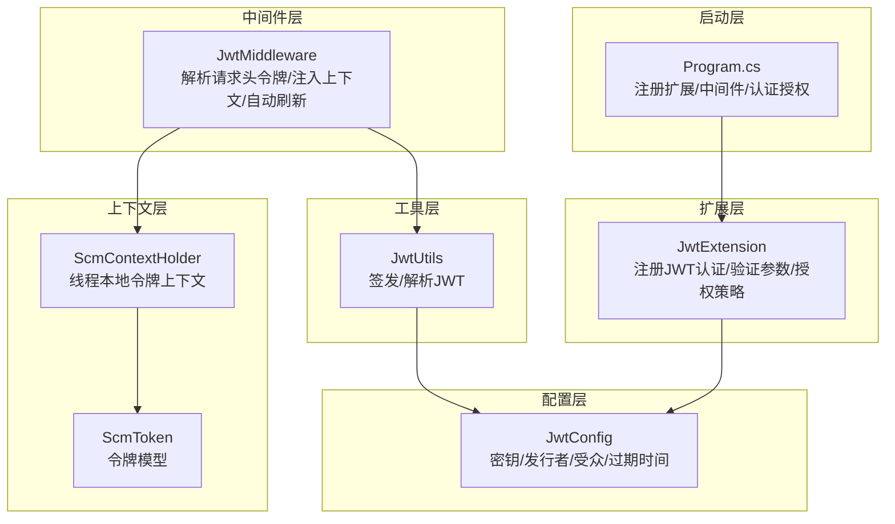
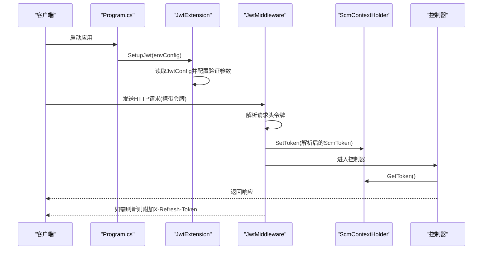
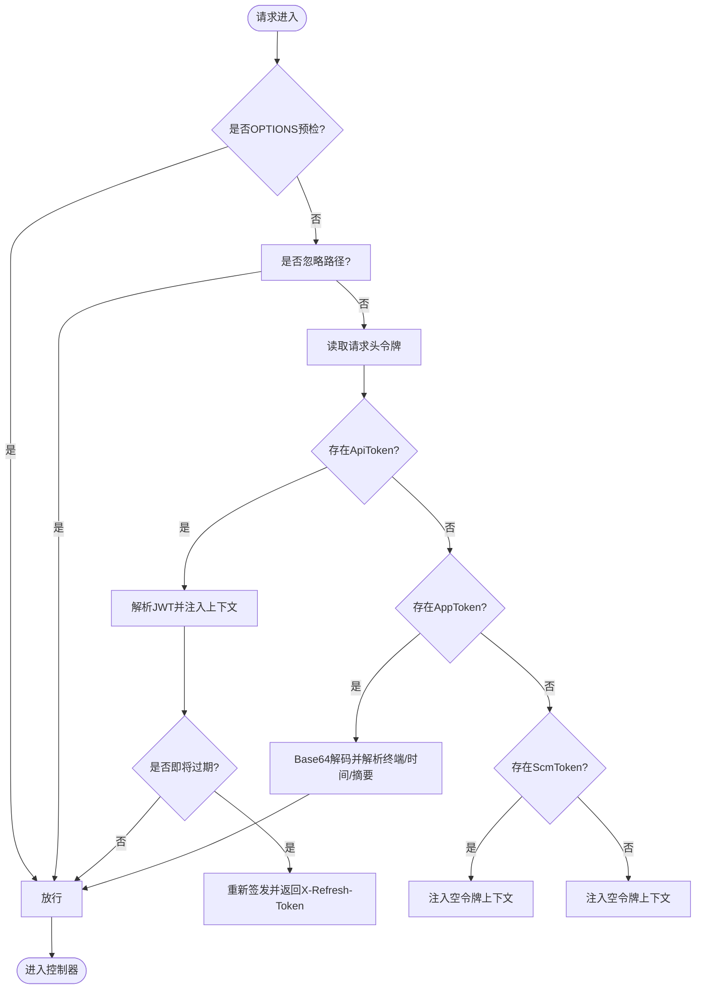
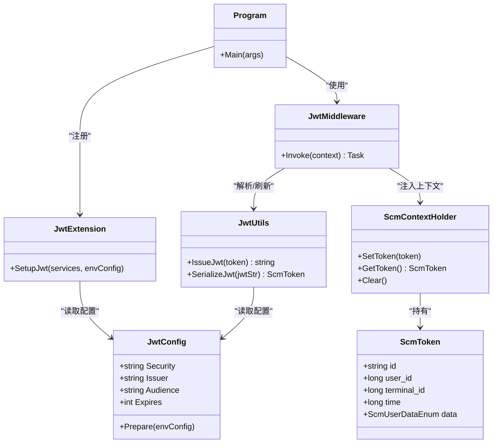
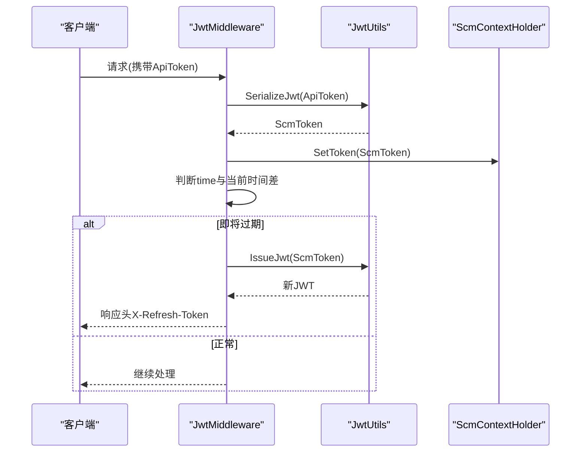

# JWT 认证配置

<cite>
**本文引用的文件列表**
- [JwtConfig.cs](file://Scm.Server/Config/JwtConfig.cs)
- [JwtExtension.cs](file://Scm.Server/Extensions/JwtExtension.cs)
- [JwtUtils.cs](file://Scm.Server/Utils/JwtUtils.cs)
- [JwtMiddleware.cs](file://Scm.Core/Configure/Middleware/JwtMiddleware.cs)
- [ScmToken.cs](file://Scm.Server/Token/ScmToken.cs)
- [ScmContextHolder.cs](file://Scm.Server/Token/ScmContextHolder.cs)
- [Program.cs](file://Scm.Net/Program.cs)
- [appsettings.json](file://Scm.Net/appsettings.json)
- [appsettings.Development.json](file://Scm.Net/appsettings.Development.json)
- [JwtAuthService.cs](file://Scm.Server.Bearer/JwtAuthService.cs)
- [JwtStrapperIoC.cs](file://Scm.Server.Bearer/JwtStrapperIoC.cs)
- [JwtConstant.cs](file://Scm.Server.Bearer/Jwt/JwtConstant.cs)
</cite>

## 目录
1. [简介](#简介)
2. [项目结构](#项目结构)
3. [核心组件](#核心组件)
4. [架构总览](#架构总览)
5. [组件详解](#组件详解)
6. [依赖关系分析](#依赖关系分析)
7. [性能考量](#性能考量)
8. [故障排查指南](#故障排查指南)
9. [结论](#结论)
10. [附录](#附录)

## 简介
本技术文档围绕 Scm.Net 的 JWT 认证配置系统进行深入解析，重点覆盖以下方面：
- JwtConfig 配置类的关键参数与默认值准备机制
- JWT 令牌的生成、验证与刷新流程
- 中间件集成方式与认证控制流
- 开发与生产环境的配置示例与安全策略
- 密钥管理与令牌撤销机制建议
- 最佳实践与常见问题排查

## 项目结构
与 JWT 相关的核心文件分布于多个子项目中，形成“配置-扩展-工具-中间件-上下文”的分层设计：
- 配置层：JwtConfig 提供密钥、发行者、受众、过期时间等配置项
- 扩展层：JwtExtension 将 JWT 配置注入到 ASP.NET Core 依赖注入容器，并设置验证参数与授权策略
- 工具层：JwtUtils 负责令牌签发与解析
- 中间件层：JwtMiddleware 在请求进入控制器前解析并注入用户上下文，支持自动刷新
- 上下文层：ScmContextHolder 提供线程本地的令牌上下文存储
- 启动层：Program.cs 注册扩展与中间件，完成认证与授权管线接入

图表来源
- [JwtConfig.cs:1-48](file://Scm.Server/Config/JwtConfig.cs#L1-L48)
- [JwtExtension.cs:1-73](file://Scm.Server/Extensions/JwtExtension.cs#L1-L73)
- [JwtUtils.cs:1-88](file://Scm.Server/Utils/JwtUtils.cs#L1-L88)
- [JwtMiddleware.cs:1-180](file://Scm.Core/Configure/Middleware/JwtMiddleware.cs#L1-L180)
- [ScmContextHolder.cs:1-45](file://Scm.Server/Token/ScmContextHolder.cs#L1-L45)
- [ScmToken.cs:1-99](file://Scm.Server/Token/ScmToken.cs#L1-L99)
- [Program.cs:160-233](file://Scm.Net/Program.cs#L160-L233)

章节来源
- [Program.cs:160-233](file://Scm.Net/Program.cs#L160-L233)
- [JwtExtension.cs:14-71](file://Scm.Server/Extensions/JwtExtension.cs#L14-L71)
- [JwtConfig.cs:28-47](file://Scm.Server/Config/JwtConfig.cs#L28-L47)

## 核心组件
- JwtConfig：集中式 JWT 配置对象，包含 Security、Issuer、Audience、Expires 等字段，并提供 Prepare 方法用于默认值填充
- JwtExtension：在服务集合中注册 JWT 认证与验证参数，设置默认认证/挑战方案、签发者/受众校验、签名密钥、生命周期校验、消息接收事件等
- JwtUtils：提供 IssueJwt（签发）与 SerializeJwt（解析）两个核心方法，基于配置生成或解析 JWT
- JwtMiddleware：在请求到达控制器前解析请求头中的令牌，注入 ScmContextHolder，并在必要时自动刷新令牌
- ScmContextHolder：线程本地令牌上下文，提供 SetToken、GetToken、Clear 方法
- ScmToken：令牌承载的数据模型，包含用户、终端、摘要、时间戳、数据权限等字段

章节来源
- [JwtConfig.cs:1-48](file://Scm.Server/Config/JwtConfig.cs#L1-L48)
- [JwtExtension.cs:14-71](file://Scm.Server/Extensions/JwtExtension.cs#L14-L71)
- [JwtUtils.cs:13-87](file://Scm.Server/Utils/JwtUtils.cs#L13-L87)
- [JwtMiddleware.cs:42-178](file://Scm.Core/Configure/Middleware/JwtMiddleware.cs#L42-L178)
- [ScmContextHolder.cs:6-45](file://Scm.Server/Token/ScmContextHolder.cs#L6-L45)
- [ScmToken.cs:8-99](file://Scm.Server/Token/ScmToken.cs#L8-L99)

## 架构总览
JWT 认证在 Scm.Net 中通过以下步骤协同工作：
- 应用启动时，Program.cs 调用 services.SetupJwt(envConfig) 注入 JwtExtension
- JwtExtension 读取 JwtConfig 并配置 TokenValidationParameters，启用签发者/受众/签名密钥/生命周期校验
- 请求进入时，JwtMiddleware 从请求头提取令牌，解析后写入 ScmContextHolder
- 控制器通过 ScmContextHolder 获取当前用户上下文；若令牌即将过期，中间件返回 X-Refresh-Token 响应头以触发客户端刷新

图表来源
- [Program.cs:160-233](file://Scm.Net/Program.cs#L160-L233)
- [JwtExtension.cs:14-71](file://Scm.Server/Extensions/JwtExtension.cs#L14-L71)
- [JwtMiddleware.cs:42-138](file://Scm.Core/Configure/Middleware/JwtMiddleware.cs#L42-L138)
- [ScmContextHolder.cs:17-36](file://Scm.Server/Token/ScmContextHolder.cs#L17-L36)

## 组件详解

### JwtConfig 配置参数与默认值准备
- 关键参数
  - Security：对称密钥，用于签名验证
  - Issuer：发行者标识
  - Audience：受众标识
  - Expires：过期时间（分钟）
- 默认值准备
  - 若 Security 为空，则填充固定值
  - 若 Issuer 为空，则填充固定值
  - 若 Audience 为空，则填充固定值
  - 若 Expires 小于 1，则设为 60 分钟

章节来源
- [JwtConfig.cs:10-26](file://Scm.Server/Config/JwtConfig.cs#L10-L26)
- [JwtConfig.cs:28-47](file://Scm.Server/Config/JwtConfig.cs#L28-L47)

### JwtExtension 认证与验证配置
- 注册认证与挑战方案：DefaultAuthenticateScheme 与 DefaultChallengeScheme 均为 JwtBearerDefaults.AuthenticationScheme
- TokenValidationParameters
  - ValidateIssuer/ValidIssuer：签发者校验
  - ValidateAudience/ValidAudience：受众校验
  - ValidateIssuerSigningKey/IgnorerSigningKey：签名密钥校验
  - ValidateLifetime/RequireExpirationTime：生命周期校验
- OnMessageReceived：从请求头读取令牌（例如 ApiToken），并赋给 context.Token
- 授权策略：添加 App 与 Admin 角色策略

章节来源
- [JwtExtension.cs:23-64](file://Scm.Server/Extensions/JwtExtension.cs#L23-L64)
- [JwtExtension.cs:66-70](file://Scm.Server/Extensions/JwtExtension.cs#L66-L70)

### JwtUtils 令牌生成与解析
- IssueJwt：根据 ScmToken 构建声明集合，使用配置中的 Security 与 Issuer/Audience/Expires 签发 JWT
- SerializeJwt：解析 JWT 字符串，提取声明并映射到 ScmToken 对象

章节来源
- [JwtUtils.cs:13-39](file://Scm.Server/Utils/JwtUtils.cs#L13-L39)
- [JwtUtils.cs:46-87](file://Scm.Server/Utils/JwtUtils.cs#L46-L87)

### JwtMiddleware 令牌解析与自动刷新
- 忽略路径：swagger、/scmhub、/api-config、/upload/ 等
- 令牌来源优先级：ApiToken -> AppToken -> ScmToken
- ApiToken 流程：解析 JWT -> 判断是否过期 -> 若过期则重新签发新令牌并通过 X-Refresh-Token 返回
- AppToken 流程：Base64 解码后按 “终端ID:时间戳:摘要” 解析，写入上下文
- 线程上下文：始终通过 ScmContextHolder 注入/清理

图表来源
- [JwtMiddleware.cs:42-138](file://Scm.Core/Configure/Middleware/JwtMiddleware.cs#L42-L138)

章节来源
- [JwtMiddleware.cs:42-178](file://Scm.Core/Configure/Middleware/JwtMiddleware.cs#L42-L178)

### ScmContextHolder 与 ScmToken
- ScmContextHolder：线程本地存储，SetToken/GetToken/Clear 提供线程隔离的令牌上下文
- ScmToken：包含用户、终端、摘要、时间戳、数据权限等字段，提供 FromAppToken 与 IsValidAppToken 辅助方法

章节来源
- [ScmContextHolder.cs:6-45](file://Scm.Server/Token/ScmContextHolder.cs#L6-L45)
- [ScmToken.cs:8-99](file://Scm.Server/Token/ScmToken.cs#L8-L99)

### 启动集成与中间件顺序
- Program.cs 中先注册 SetupJwt，再注册 UseAuthentication/UseAuthorization
- 在异常中间件之后、路由之前注册 JwtMiddleware，确保请求进入控制器前完成令牌解析与上下文注入

章节来源
- [Program.cs:160-233](file://Scm.Net/Program.cs#L160-L233)

### 令牌刷新机制
- 当 ApiToken 的 time 与当前时间差超过阈值（约 30 分钟）时，中间件重新签发新令牌并通过 X-Refresh-Token 响应头返回，客户端可据此刷新本地缓存

章节来源
- [JwtMiddleware.cs:118-135](file://Scm.Core/Configure/Middleware/JwtMiddleware.cs#L118-L135)

### Bearer 项目中的替代实现
- Bearer 项目提供了另一套 JWT 配置与认证实现（JwtStrapperIoC、JwtAuthService、JwtConstant），与主项目存在差异，建议统一使用主项目中的 JwtExtension 与 JwtUtils

章节来源
- [JwtStrapperIoC.cs:13-56](file://Scm.Server.Bearer/JwtStrapperIoC.cs#L13-L56)
- [JwtAuthService.cs:14-67](file://Scm.Server.Bearer/JwtAuthService.cs#L14-L67)
- [JwtConstant.cs:6-12](file://Scm.Server.Bearer/Jwt/JwtConstant.cs#L6-L12)

## 依赖关系分析
- JwtExtension 依赖 JwtConfig 与 AppUtils 获取配置
- JwtUtils 依赖 JwtConfig 与 ScmToken
- JwtMiddleware 依赖 JwtUtils、ScmContextHolder、ScmToken
- Program.cs 依赖 JwtExtension 与 JwtMiddleware

图表来源
- [JwtConfig.cs:1-48](file://Scm.Server/Config/JwtConfig.cs#L1-L48)
- [JwtExtension.cs:14-71](file://Scm.Server/Extensions/JwtExtension.cs#L14-L71)
- [JwtUtils.cs:13-87](file://Scm.Server/Utils/JwtUtils.cs#L13-L87)
- [JwtMiddleware.cs:42-178](file://Scm.Core/Configure/Middleware/JwtMiddleware.cs#L42-L178)
- [ScmContextHolder.cs:6-45](file://Scm.Server/Token/ScmContextHolder.cs#L6-L45)
- [ScmToken.cs:8-99](file://Scm.Server/Token/ScmToken.cs#L8-L99)
- [Program.cs:160-233](file://Scm.Net/Program.cs#L160-L233)

## 性能考量
- 令牌解析与签发均为内存计算，开销较低
- 建议合理设置 Expires，避免频繁刷新导致额外网络往返
- 使用线程本地上下文减少锁竞争
- 对于高并发场景，建议结合缓存与限流策略

## 故障排查指南
- 令牌无效
  - 检查 Issuer/Audience 是否与签发时一致
  - 确认 Security 是否正确且与签发方一致
  - 核对 RequireHttpsMetadata 与 TokenValidationParameters 配置
- 令牌过期
  - 中间件会在即将过期时返回 X-Refresh-Token，客户端应监听并刷新
- 请求未被认证
  - 确认请求头中包含正确的令牌名称（如 ApiToken）
  - 检查 JwtMiddleware 是否被正确注册与顺序放置
- 角色授权失败
  - 确认授权策略已注册（App/Admin）

章节来源
- [JwtExtension.cs:34-63](file://Scm.Server/Extensions/JwtExtension.cs#L34-L63)
- [JwtMiddleware.cs:42-138](file://Scm.Core/Configure/Middleware/JwtMiddleware.cs#L42-L138)

## 结论
Scm.Net 的 JWT 认证体系通过清晰的分层设计实现了“配置-扩展-工具-中间件-上下文”的闭环：JwtConfig 提供集中配置，JwtExtension 注入验证参数，JwtUtils 实现签发与解析，JwtMiddleware 在请求阶段完成令牌解析与自动刷新，ScmContextHolder 提供线程隔离的上下文。该体系具备良好的可维护性与扩展性，适合在多环境部署中保持一致的安全策略。

## 附录

### 配置示例与安全策略

- 开发环境配置要点
  - Jwt.Security：建议使用强随机密钥，避免硬编码
  - Jwt.Issuer/Audience：保持与签发方一致
  - Jwt.Expires：建议较短周期（如 60 分钟），便于测试
  - CORS.ExposedHeaders：包含 X-Refresh-Token，以便前端接收刷新令牌

- 生产环境配置要点
  - Jwt.Security：使用安全的密钥管理（如密钥轮换、硬件安全模块）
  - Jwt.Expires：根据业务需求调整，建议较短周期并配合刷新策略
  - RequireHttpsMetadata：建议开启 HTTPS，避免明文传输
  - 审计与日志：记录认证失败事件，便于追踪

- appsettings.json 示例片段
  - Jwt 节点包含 Security、Issuer、Audience、Expires
  - Cors 节点包含 ExposedHeaders，暴露 X-Refresh-Token

章节来源
- [appsettings.json:100-105](file://Scm.Net/appsettings.json#L100-L105)
- [appsettings.Development.json:112-117](file://Scm.Net/appsettings.Development.json#L112-L117)
- [appsettings.json:124](file://Scm.Net/appsettings.json#L124)

### 令牌安全最佳实践
- 密钥管理
  - 使用强随机密钥，定期轮换
  - 不在客户端存储密钥
- 令牌撤销
  - 建议引入黑名单或短期令牌 + 刷新令牌组合
  - 结合服务端会话状态与令牌哈希进行快速撤销
- 传输安全
  - 强制 HTTPS，避免中间人攻击
  - 限制令牌暴露范围，仅在受信环境中传递
- 日志与监控
  - 记录认证失败与可疑行为
  - 监控异常登录与高频刷新

### 令牌刷新流程（序列图）

图表来源
- [JwtMiddleware.cs:106-138](file://Scm.Core/Configure/Middleware/JwtMiddleware.cs#L106-L138)
- [JwtUtils.cs:13-39](file://Scm.Server/Utils/JwtUtils.cs#L13-L39)