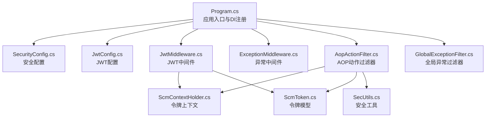
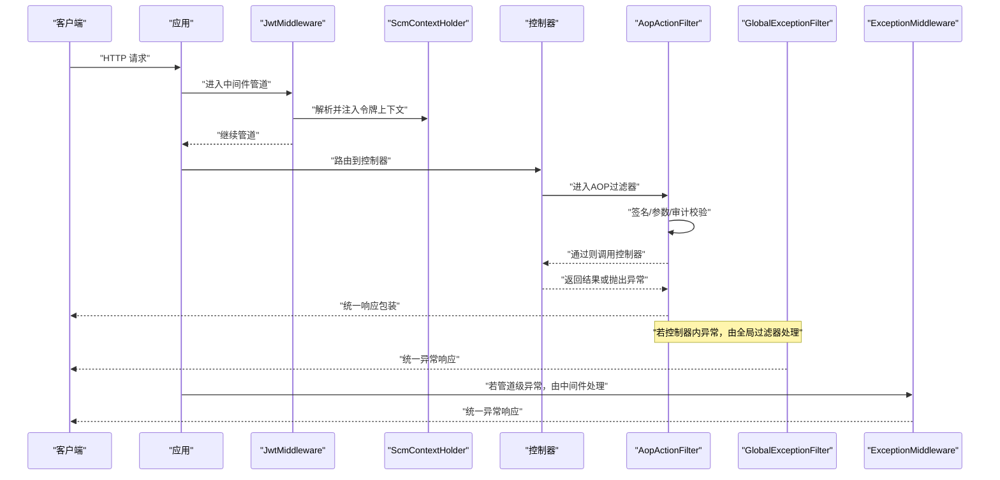
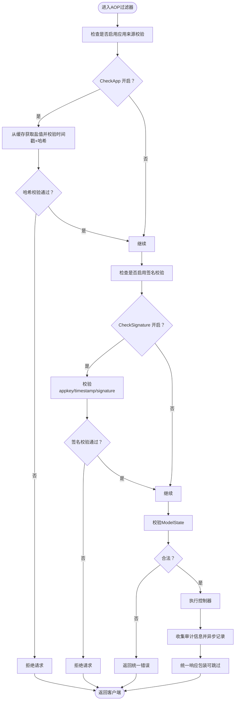
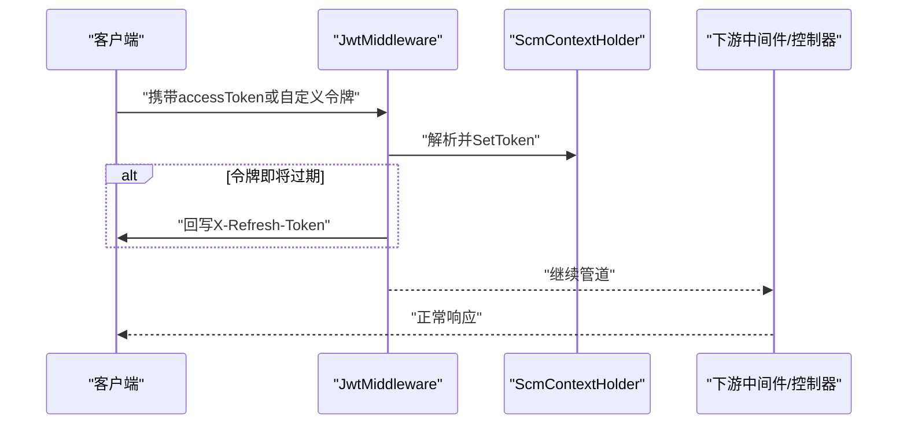
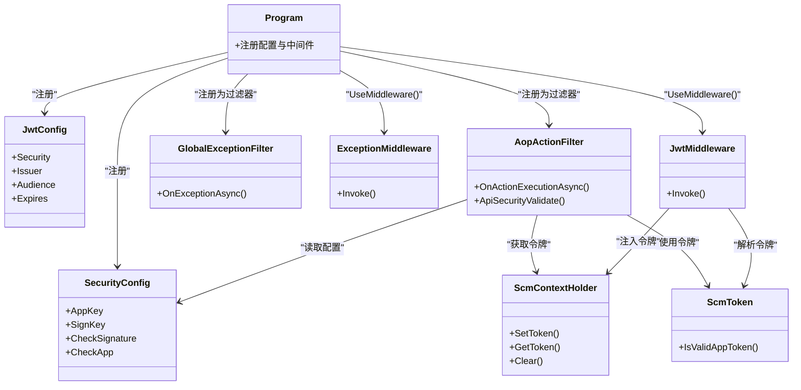

# 安全策略配置

<cite>
**本文引用的文件**
- [SecurityConfig.cs](file://Scm.Server/Config/SecurityConfig.cs)
- [AopActionFilter.cs](file://Scm.Core/Configure/Filters/AopActionFilter.cs)
- [GlobalExceptionFilter.cs](file://Scm.Core/Configure/Filters/GlobalExceptionFilter.cs)
- [ExceptionMiddleware.cs](file://Scm.Core/Configure/Middleware/ExceptionMiddleware.cs)
- [JwtMiddleware.cs](file://Scm.Core/Configure/Middleware/JwtMiddleware.cs)
- [JwtConfig.cs](file://Scm.Server/Config/JwtConfig.cs)
- [ScmContextHolder.cs](file://Scm.Server/Token/ScmContextHolder.cs)
- [ScmToken.cs](file://Scm.Server/Token/ScmToken.cs)
- [Program.cs](file://Scm.Net/Program.cs)
- [ScmSecService.cs](file://Scm.Server.Service/Service/ScmSecService.cs)
- [ISecService.cs](file://Scm.Server/ISecService.cs)
- [SecUtils.cs](file://Scm.Common/Utils/SecUtils.cs)
- [OperatorService.cs](file://Scm.Core/Operator/OperatorService.cs)
- [ScmDevSqlService.cs](file://Scm.Core/Dev/Sql/ScmDevSqlService.cs)
- [DbController.cs](file://Scm.Net/Controllers/DbController.cs)
- [ScmLogApiService.cs](file://Scm.Core/Log/Api/ScmLogApiService.cs)
</cite>

## 目录
1. [引言](#引言)
2. [项目结构](#项目结构)
3. [核心组件](#核心组件)
4. [架构总览](#架构总览)
5. [组件详解](#组件详解)
6. [依赖关系分析](#依赖关系分析)
7. [性能与安全特性](#性能与安全特性)
8. [故障排查指南](#故障排查指南)
9. [结论](#结论)
10. [附录](#附录)

## 引言
本技术文档聚焦 Scm.Net 的安全策略配置体系，围绕 SecurityConfig 安全配置项、AOP 过滤器与全局异常过滤器、JWT 会话与权限控制、输入验证与 SQL 注入防护、XSS 防护、安全审计与威胁检测等主题展开。文档旨在帮助开发者与运维人员理解并正确配置与扩展系统的安全能力。

## 项目结构
Scm.Net 将安全相关能力分布在多个层次：
- 配置层：SecurityConfig、JwtConfig 等配置模型在 Scm.Server.Config 下定义，并由 Program.cs 在运行时加载与注册。
- 中间件层：JwtMiddleware、ExceptionMiddleware 提供认证与异常处理的横切关注点。
- 过滤器层：AopActionFilter（AOP 行为过滤）、GlobalExceptionFilter（全局异常）在 Scm.Core.Configure.Filters 中实现。
- 令牌与上下文：ScmToken、ScmContextHolder 提供会话与上下文数据传递。
- 业务与工具：OperatorService、ScmDevSqlService、SecUtils 等在业务与工具层面体现安全策略落地。

**图表来源**
- [Program.cs:84-161](file://Scm.Net/Program.cs#L84-L161)
- [SecurityConfig.cs:1-44](file://Scm.Server/Config/SecurityConfig.cs#L1-L44)
- [JwtConfig.cs:1-48](file://Scm.Server/Config/JwtConfig.cs#L1-L48)
- [JwtMiddleware.cs:1-180](file://Scm.Core/Configure/Middleware/JwtMiddleware.cs#L1-L180)
- [ExceptionMiddleware.cs:1-41](file://Scm.Core/Configure/Middleware/ExceptionMiddleware.cs#L1-L41)
- [AopActionFilter.cs:1-419](file://Scm.Core/Configure/Filters/AopActionFilter.cs#L1-L419)
- [GlobalExceptionFilter.cs:1-42](file://Scm.Core/Configure/Filters/GlobalExceptionFilter.cs#L1-L42)
- [ScmContextHolder.cs:1-45](file://Scm.Server/Token/ScmContextHolder.cs#L1-L45)
- [ScmToken.cs:1-99](file://Scm.Server/Token/ScmToken.cs#L1-L99)
- [SecUtils.cs:1-144](file://Scm.Common/Utils/SecUtils.cs#L1-L144)

**章节来源**
- [Program.cs:84-161](file://Scm.Net/Program.cs#L84-L161)

## 核心组件
- SecurityConfig：集中式安全配置，支持应用签名校验、应用来源校验等开关，便于统一启用/禁用安全策略。
- AopActionFilter：在 Action 执行前后进行签名验证、参数校验、审计日志记录、统一响应包装等。
- GlobalExceptionFilter：捕获控制器内未处理异常，统一输出与审计。
- ExceptionMiddleware：管道级异常捕获，保证非控制器路径也能被统一处理。
- JwtMiddleware：基于请求头提取与解析令牌，注入 ScmContextHolder，支持刷新与过期处理。
- JwtConfig：JWT 安全密钥、发行者、受众、有效期等配置。
- ScmContextHolder/ScmToken：线程本地存储的令牌上下文，承载用户、终端、时间戳等会话信息。
- SecUtils：提供消息摘要（MD5/SHA256）等安全工具函数，用于签名计算与校验。

**章节来源**
- [SecurityConfig.cs:5-42](file://Scm.Server/Config/SecurityConfig.cs#L5-L42)
- [AopActionFilter.cs:20-44](file://Scm.Core/Configure/Filters/AopActionFilter.cs#L20-L44)
- [GlobalExceptionFilter.cs:17-30](file://Scm.Core/Configure/Filters/GlobalExceptionFilter.cs#L17-L30)
- [ExceptionMiddleware.cs:8-39](file://Scm.Core/Configure/Middleware/ExceptionMiddleware.cs#L8-L39)
- [JwtMiddleware.cs:8-97](file://Scm.Core/Configure/Middleware/JwtMiddleware.cs#L8-L97)
- [JwtConfig.cs:3-47](file://Scm.Server/Config/JwtConfig.cs#L3-L47)
- [ScmContextHolder.cs:6-45](file://Scm.Server/Token/ScmContextHolder.cs#L6-L45)
- [ScmToken.cs:8-99](file://Scm.Server/Token/ScmToken.cs#L8-L99)
- [SecUtils.cs:7-141](file://Scm.Common/Utils/SecUtils.cs#L7-L141)

## 架构总览
下图展示从请求进入至响应返回的完整安全链路，包括 JWT 解析、AOP 签名与参数校验、统一异常处理与审计日志。

**图表来源**
- [Program.cs:219-238](file://Scm.Net/Program.cs#L219-L238)
- [JwtMiddleware.cs:42-97](file://Scm.Core/Configure/Middleware/JwtMiddleware.cs#L42-L97)
- [AopActionFilter.cs:61-276](file://Scm.Core/Configure/Filters/AopActionFilter.cs#L61-L276)
- [GlobalExceptionFilter.cs:32-42](file://Scm.Core/Configure/Filters/GlobalExceptionFilter.cs#L32-L42)
- [ExceptionMiddleware.cs:17-39](file://Scm.Core/Configure/Middleware/ExceptionMiddleware.cs#L17-L39)

## 组件详解

### SecurityConfig 安全配置
- 关键字段
  - AppKey：前端约定的应用标识，用于签名计算。
  - AesKey/DesKey：对称加密密钥（当前注释为暂未使用）。
  - SignKey：签名密钥，参与签名计算。
  - CheckSignature：是否启用签名校验。
  - CheckApp：是否启用应用来源校验（如盐值、时间戳校验）。
- 预处理：Prepare 方法预留环境准备逻辑。
- 使用方式：Program.cs 中读取配置并注册为单例，供 AOP 过滤器与业务模块使用。

**章节来源**
- [SecurityConfig.cs:5-42](file://Scm.Server/Config/SecurityConfig.cs#L5-L42)
- [Program.cs:86-88](file://Scm.Net/Program.cs#L86-L88)

### AOP 动作过滤器（AopActionFilter）
- 忽略列表：对特定 API（如验证码、登录、静态资源）跳过签名与审计。
- 应用来源校验（CheckApp）：当开启时，从缓存获取盐值，结合时间戳与哈希进行校验。
- 签名校验（CheckSignature）：当开启时，要求 appkey、timestamp、signature 三要素齐全；校验时间戳有效性；根据请求方法拼接参数生成签名并与传入签名比对。
- 参数校验：ModelState 不合法时直接返回统一错误。
- 审计日志：收集请求上下文、用户、IP、UA、耗时等信息并异步写入日志服务。
- 统一响应：对对象结果进行统一包装，支持通过特性跳过审计、日志与统一结果包装。
- 权限校验：保留了基于角色与 API 资源的权限判断逻辑（当前注释掉），可按需启用。

**图表来源**
- [AopActionFilter.cs:61-276](file://Scm.Core/Configure/Filters/AopActionFilter.cs#L61-L276)

**章节来源**
- [AopActionFilter.cs:20-44](file://Scm.Core/Configure/Filters/AopActionFilter.cs#L20-L44)
- [AopActionFilter.cs:68-208](file://Scm.Core/Configure/Filters/AopActionFilter.cs#L68-L208)
- [AopActionFilter.cs:283-306](file://Scm.Core/Configure/Filters/AopActionFilter.cs#L283-L306)

### 全局异常过滤器（GlobalExceptionFilter）
- 作用：捕获控制器内的未处理异常，记录日志（含用户、UA、路径等），返回统一错误响应。
- 依赖：IWebHostEnvironment、ILogService、ScmContextHolder。
- 适用范围：控制器内部异常统一处理。

**章节来源**
- [GlobalExceptionFilter.cs:17-30](file://Scm.Core/Configure/Filters/GlobalExceptionFilter.cs#L17-L30)
- [GlobalExceptionFilter.cs:32-42](file://Scm.Core/Configure/Filters/GlobalExceptionFilter.cs#L32-L42)

### 管道级异常中间件（ExceptionMiddleware）
- 作用：在管道级别捕获异常，统一输出 JSON 错误响应，避免异常泄漏。
- 适用范围：非控制器路径或控制器外的异常。

**章节来源**
- [ExceptionMiddleware.cs:8-39](file://Scm.Core/Configure/Middleware/ExceptionMiddleware.cs#L8-L39)

### JWT 中间件与会话管理（JwtMiddleware）
- 作用：从请求中提取 accessToken 或自定义令牌，解析为 ScmToken 并注入 ScmContextHolder。
- 支持刷新：当令牌接近过期时签发新令牌并回写响应头。
- 忽略列表：对 Swagger、静态资源、上传等路径跳过校验。
- 令牌类型：支持 API 令牌与 App 令牌两种模式。

**图表来源**
- [JwtMiddleware.cs:42-138](file://Scm.Core/Configure/Middleware/JwtMiddleware.cs#L42-L138)
- [ScmContextHolder.cs:16-36](file://Scm.Server/Token/ScmContextHolder.cs#L16-L36)

**章节来源**
- [JwtMiddleware.cs:8-97](file://Scm.Core/Configure/Middleware/JwtMiddleware.cs#L8-L97)
- [JwtMiddleware.cs:106-138](file://Scm.Core/Configure/Middleware/JwtMiddleware.cs#L106-L138)
- [ScmContextHolder.cs:6-45](file://Scm.Server/Token/ScmContextHolder.cs#L6-L45)

### JWT 配置（JwtConfig）
- 关键字段：Security（密钥）、Issuer（发行者）、Audience（受众）、Expires（失效时间，分钟）。
- 预处理：对空值进行默认化，确保配置健壮性。

**章节来源**
- [JwtConfig.cs:3-47](file://Scm.Server/Config/JwtConfig.cs#L3-L47)

### 令牌上下文与模型（ScmContextHolder/ScmToken）
- ScmContextHolder：线程本地存储，提供 SetToken/GetToken/Clear，支持父子线程数据传递。
- ScmToken：承载用户、终端、摘要、时间戳、数据权限等会话信息，提供令牌解析与校验辅助方法。

**章节来源**
- [ScmContextHolder.cs:6-45](file://Scm.Server/Token/ScmContextHolder.cs#L6-L45)
- [ScmToken.cs:8-99](file://Scm.Server/Token/ScmToken.cs#L8-L99)

### 输入验证与参数校验
- 控制器参数：AOP 过滤器在执行前校验 ModelState，非法时直接返回统一错误。
- 登录参数：OperatorService 对用户名、密码进行格式校验，防止无效输入进入后续流程。
- SQL 执行：ScmDevSqlService 对 SQL 类型进行识别与分派，避免直接拼接导致的注入风险；DbController 对数据库连接参数进行基础校验。

**章节来源**
- [AopActionFilter.cs:210-221](file://Scm.Core/Configure/Filters/AopActionFilter.cs#L210-L221)
- [OperatorService.cs:239-250](file://Scm.Core/Operator/OperatorService.cs#L239-L250)
- [ScmDevSqlService.cs:247-280](file://Scm.Core/Dev/Sql/ScmDevSqlService.cs#L247-L280)
- [DbController.cs:45-157](file://Scm.Net/Controllers/DbController.cs#L45-L157)

### XSS 防护与敏感词策略
- SecurityConfig 中提供敏感词与上传白名单等字段，但当前未在 AOP 过滤器中直接使用。
- 建议：在业务层对输入输出进行 HTML 转义与白名单过滤，结合 SecurityConfig 的敏感词配置实现统一防护。

**章节来源**
- [SecurityConfig.cs:10-27](file://Scm.Server/Config/SecurityConfig.cs#L10-L27)

### 安全审计与威胁检测
- 审计日志：AOP 过滤器在执行后收集请求上下文、用户、IP、UA、耗时、URL、参数、返回内容摘要等信息并异步记录。
- 威胁检测：保留了基于网络接口与域名的授权 API 校验逻辑（当前注释），可按需启用以限制非授权来源访问。
- 日志服务：ScmLogApiService 提供日志统计与查询能力，便于安全运营与审计。

**章节来源**
- [AopActionFilter.cs:230-268](file://Scm.Core/Configure/Filters/AopActionFilter.cs#L230-L268)
- [AopActionFilter.cs:342-417](file://Scm.Core/Configure/Filters/AopActionFilter.cs#L342-L417)
- [ScmLogApiService.cs:70-122](file://Scm.Core/Log/Api/ScmLogApiService.cs#L70-L122)

### 会话管理与权限控制
- 会话：JwtMiddleware 解析令牌并注入上下文，ScmContextHolder 提供线程本地存储。
- 权限：AOP 过滤器保留了基于角色与 API 资源的权限判断逻辑（当前注释），可按需启用；同时支持通过特性跳过审计/日志/统一结果包装。

**章节来源**
- [JwtMiddleware.cs:106-138](file://Scm.Core/Configure/Middleware/JwtMiddleware.cs#L106-L138)
- [AopActionFilter.cs:283-306](file://Scm.Core/Configure/Filters/AopActionFilter.cs#L283-L306)

## 依赖关系分析
- 配置依赖：Program.cs 读取 SecurityConfig 与 JwtConfig 并注册为服务，AOP 与中间件依赖这些配置。
- 运行时依赖：AOP 过滤器依赖 ILogService、ScmContextHolder、Cache 服务；JwtMiddleware 依赖 ScmContextHolder 与 ScmToken。
- 业务依赖：OperatorService、ScmDevSqlService 等在业务层体现输入验证与 SQL 安全策略。

**图表来源**
- [Program.cs:84-161](file://Scm.Net/Program.cs#L84-L161)
- [SecurityConfig.cs:5-42](file://Scm.Server/Config/SecurityConfig.cs#L5-L42)
- [JwtConfig.cs:3-47](file://Scm.Server/Config/JwtConfig.cs#L3-L47)
- [AopActionFilter.cs:20-44](file://Scm.Core/Configure/Filters/AopActionFilter.cs#L20-L44)
- [GlobalExceptionFilter.cs:17-30](file://Scm.Core/Configure/Filters/GlobalExceptionFilter.cs#L17-L30)
- [ExceptionMiddleware.cs:8-39](file://Scm.Core/Configure/Middleware/ExceptionMiddleware.cs#L8-L39)
- [JwtMiddleware.cs:8-97](file://Scm.Core/Configure/Middleware/JwtMiddleware.cs#L8-L97)
- [ScmContextHolder.cs:6-45](file://Scm.Server/Token/ScmContextHolder.cs#L6-L45)
- [ScmToken.cs:8-99](file://Scm.Server/Token/ScmToken.cs#L8-L99)

**章节来源**
- [Program.cs:84-161](file://Scm.Net/Program.cs#L84-L161)

## 性能与安全特性
- 性能
  - AOP 过滤器仅在必要时进行签名与审计，忽略列表减少不必要的开销。
  - 审计日志采用异步写入，避免阻塞请求。
- 安全
  - 统一异常处理与中间件异常捕获，防止异常细节泄露。
  - 签名与时间戳校验降低重放与伪造风险。
  - 令牌刷新机制提升用户体验与安全性。

[本节为通用建议，无需具体文件分析]

## 故障排查指南
- 签名失败
  - 检查 appkey、timestamp、signature 是否齐全且格式正确。
  - 确认时间戳在允许范围内（默认 20 分钟窗口）。
  - 确认 SignKey 与服务端一致。
- 参数校验失败
  - 查看 ModelState 错误信息，确认必填字段与格式。
- 令牌无效或过期
  - 检查请求头中的 accessToken 或自定义令牌格式。
  - 观察响应头 X-Refresh-Token 是否存在，按需刷新。
- 审计日志缺失
  - 检查是否标注了跳过审计/日志的特性。
  - 确认 ILogService 正常注册与可用。

**章节来源**
- [AopActionFilter.cs:109-138](file://Scm.Core/Configure/Filters/AopActionFilter.cs#L109-L138)
- [AopActionFilter.cs:210-221](file://Scm.Core/Configure/Filters/AopActionFilter.cs#L210-L221)
- [JwtMiddleware.cs:116-138](file://Scm.Core/Configure/Middleware/JwtMiddleware.cs#L116-L138)

## 结论
Scm.Net 的安全策略通过配置驱动与中间件/过滤器协同工作，实现了从令牌解析、签名校验、参数验证到统一异常与审计日志的闭环。SecurityConfig 作为统一入口，配合 AOP 过滤器与 JWT 中间件，既保证了易用性，也为扩展与定制提供了清晰的边界。建议在生产环境中启用签名校验与审计日志，并结合业务场景完善敏感词与上传白名单策略。

[本节为总结性内容，无需具体文件分析]

## 附录

### 安全配置最佳实践
- 输入验证
  - 始终启用 AOP 过滤器的 ModelState 校验。
  - 在业务层对关键字段（用户名、密码、邮箱、手机号）进行格式与长度校验。
- SQL 注入防护
  - 使用 ORM 查询与参数化，避免字符串拼接。
  - 对动态 SQL 进行白名单与最小权限原则控制。
- XSS 防护
  - 对输出内容进行 HTML 转义。
  - 结合 SecurityConfig 的敏感词与上传白名单策略。
- 会话与权限
  - 启用 JWT 令牌刷新与有效期控制。
  - 按需启用基于角色与 API 资源的权限校验。
- 审计与威胁检测
  - 开启统一异常与审计日志。
  - 结合 ScmLogApiService 进行日志统计与告警。

[本节为通用建议，无需具体文件分析]