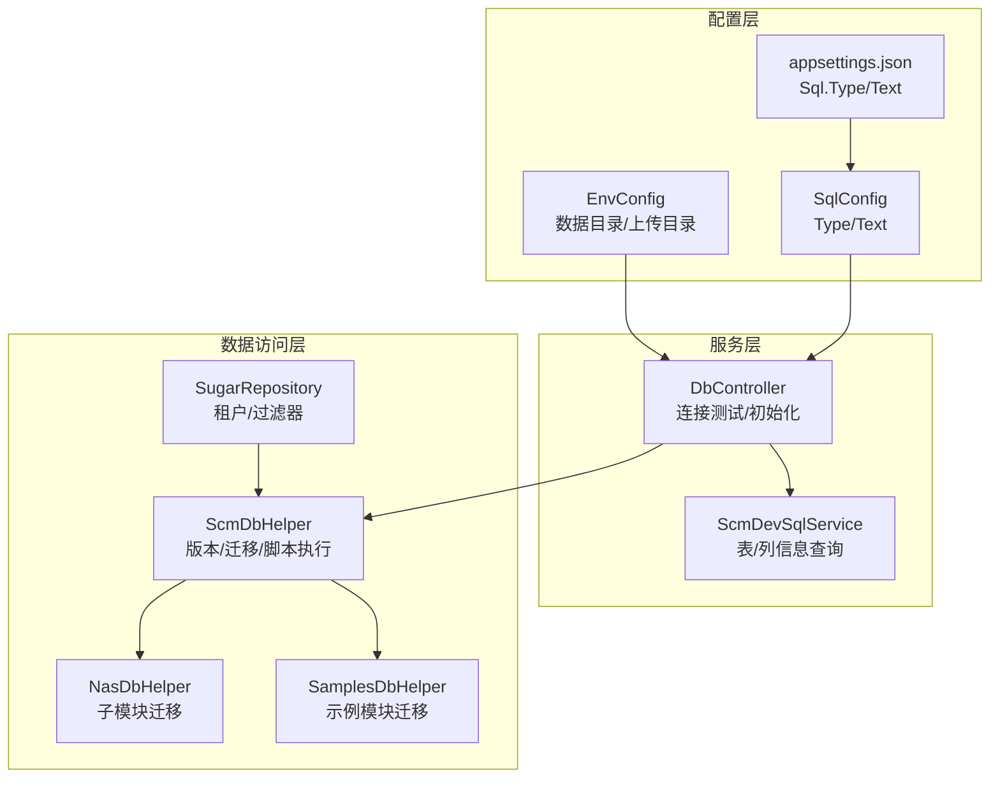
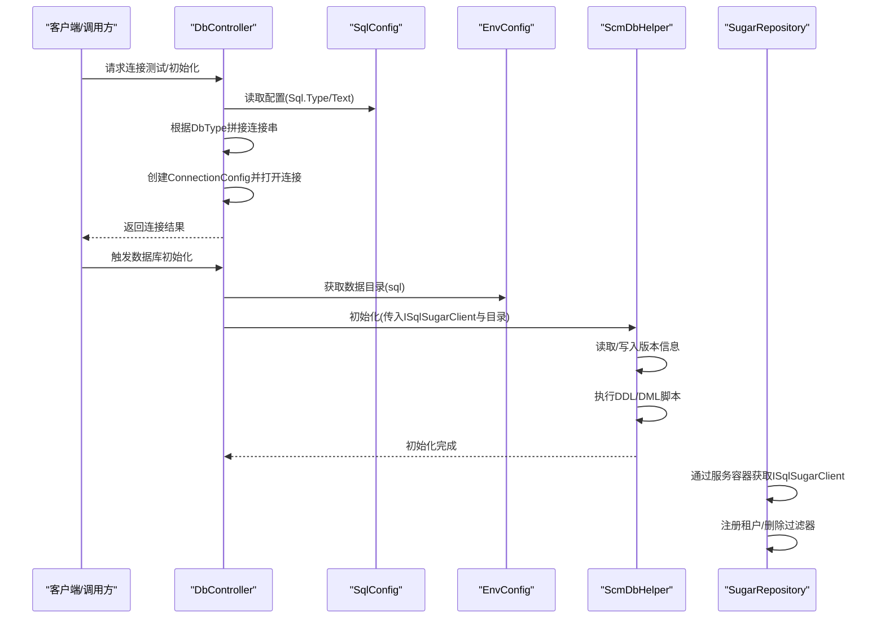
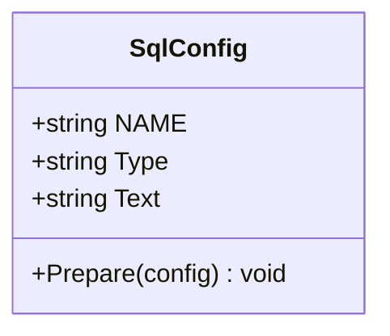
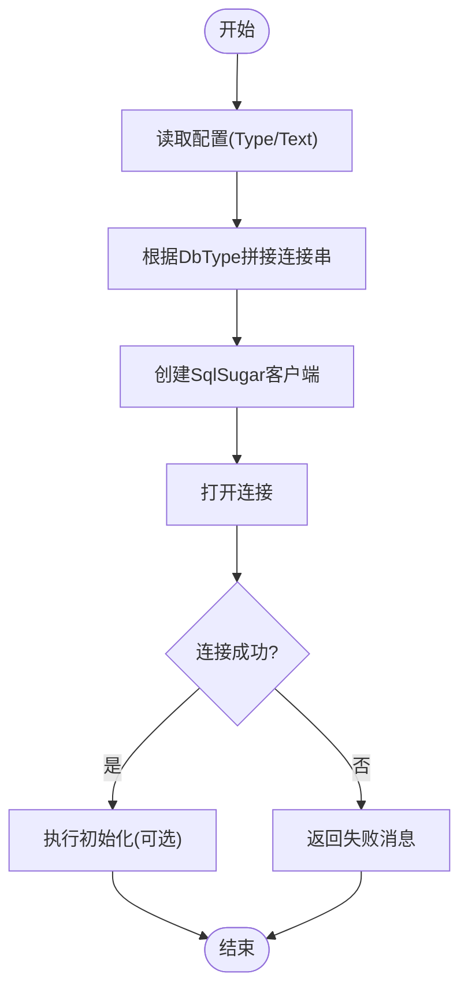
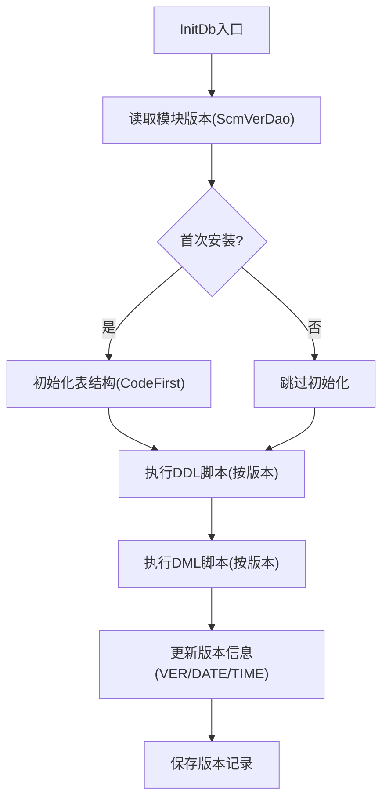
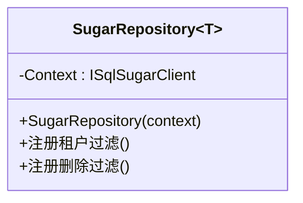
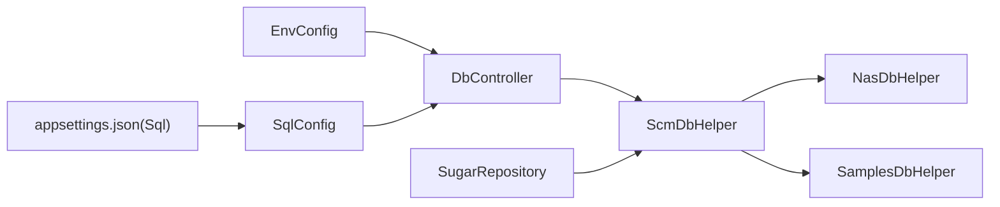

# 数据库配置

<cite>
**本文引用的文件**
- [Scm.Server/Config/SqlConfig.cs](file://Scm.Server/Config/SqlConfig.cs)
- [Scm.Server/Config/EnvConfig.cs](file://Scm.Server/Config/EnvConfig.cs)
- [Scm.Common/Enums/ScmDbTypeEnum.cs](file://Scm.Common/Enums/ScmDbTypeEnum.cs)
- [Scm.Dao/ScmDbHelper.cs](file://Scm.Dao/ScmDbHelper.cs)
- [Nas.Dao/NasDbHelper.cs](file://Nas.Dao/NasDbHelper.cs)
- [Samples.Server.Dao/SamplesDbHelper.cs](file://Samples.Server.Dao/SamplesDbHelper.cs)
- [Scm.Net/appsettings.json](file://Scm.Net/appsettings.json)
- [Scm.Net/appsettings.Development.json](file://Scm.Net/appsettings.Development.json)
- [Scm.Net/Controllers/DbController.cs](file://Scm.Net/Controllers/DbController.cs)
- [Scm.Core/Dev/Sql/ScmDevSqlService.cs](file://Scm.Core/Dev/Sql/ScmDevSqlService.cs)
- [Scm.Dsa.Dba.Sugar/SugarRepository.cs](file://Scm.Dsa.Dba.Sugar/SugarRepository.cs)
</cite>

## 目录
1. [简介](#简介)
2. [项目结构](#项目结构)
3. [核心组件](#核心组件)
4. [架构总览](#架构总览)
5. [详细组件分析](#详细组件分析)
6. [依赖关系分析](#依赖关系分析)
7. [性能考虑](#性能考虑)
8. [故障排查指南](#故障排查指南)
9. [结论](#结论)
10. [附录](#附录)

## 简介
本文面向 Scm.Net 的数据库配置系统，围绕 SqlConfig 类及其在应用中的使用进行深入解析，涵盖以下要点：
- SqlConfig 的实现原理、配置项 Type 与 Text 的含义与设置方式
- 默认值与环境变量处理机制
- 不同数据库类型的连接配置示例（SQLite、SQL Server、MySQL、Oracle、PostgreSQL、DB2、达梦）
- 连接池、性能优化参数与连接安全性建议
- 数据库迁移策略与版本管理最佳实践

## 项目结构
与数据库配置直接相关的关键模块如下：
- 配置模型：SqlConfig（数据库类型与连接字符串）
- 环境配置：EnvConfig（数据目录、上传目录等环境路径）
- 数据库初始化：ScmDbHelper 及其派生（NasDbHelper、SamplesDbHelper）
- 运行时连接与验证：DbController、ScmDevSqlService
- ORM 访问层：SugarRepository（基于 SqlSugar）

图表来源
- [Scm.Server/Config/SqlConfig.cs:1-23](file://Scm.Server/Config/SqlConfig.cs#L1-L23)
- [Scm.Server/Config/EnvConfig.cs:1-280](file://Scm.Server/Config/EnvConfig.cs#L1-L280)
- [Scm.Net/appsettings.json:48-51](file://Scm.Net/appsettings.json#L48-L51)
- [Scm.Net/Controllers/DbController.cs:45-286](file://Scm.Net/Controllers/DbController.cs#L45-L286)
- [Scm.Core/Dev/Sql/ScmDevSqlService.cs:128-171](file://Scm.Core/Dev/Sql/ScmDevSqlService.cs#L128-L171)
- [Scm.Dao/ScmDbHelper.cs:1-779](file://Scm.Dao/ScmDbHelper.cs#L1-L779)
- [Nas.Dao/NasDbHelper.cs:1-166](file://Nas.Dao/NasDbHelper.cs#L1-L166)
- [Samples.Server.Dao/SamplesDbHelper.cs:1-60](file://Samples.Server.Dao/SamplesDbHelper.cs#L1-L60)
- [Scm.Dsa.Dba.Sugar/SugarRepository.cs:1-37](file://Scm.Dsa.Dba.Sugar/SugarRepository.cs#L1-L37)

章节来源
- [Scm.Server/Config/SqlConfig.cs:1-23](file://Scm.Server/Config/SqlConfig.cs#L1-L23)
- [Scm.Server/Config/EnvConfig.cs:1-280](file://Scm.Server/Config/EnvConfig.cs#L1-L280)
- [Scm.Net/appsettings.json:48-51](file://Scm.Net/appsettings.json#L48-L51)
- [Scm.Net/appsettings.Development.json:48-51](file://Scm.Net/appsettings.Development.json#L48-L51)

## 核心组件
- SqlConfig：定义数据库类型 Type 与连接字符串 Text，并提供 Prepare 方法用于默认值填充
- EnvConfig：负责数据目录、上传目录等环境路径的准备与组合
- ScmDbHelper：统一的数据库初始化、版本管理与脚本执行入口
- DbController：对外提供数据库连接测试与初始化流程
- ScmDevSqlService：开发期查询表/列信息，内部使用 SqlSugar 客户端
- SugarRepository：基于 SqlSugar 的仓储基类，支持租户过滤与删除标记过滤

章节来源
- [Scm.Server/Config/SqlConfig.cs:1-23](file://Scm.Server/Config/SqlConfig.cs#L1-L23)
- [Scm.Server/Config/EnvConfig.cs:1-280](file://Scm.Server/Config/EnvConfig.cs#L1-L280)
- [Scm.Dao/ScmDbHelper.cs:1-779](file://Scm.Dao/ScmDbHelper.cs#L1-L779)
- [Scm.Net/Controllers/DbController.cs:45-286](file://Scm.Net/Controllers/DbController.cs#L45-L286)
- [Scm.Core/Dev/Sql/ScmDevSqlService.cs:128-171](file://Scm.Core/Dev/Sql/ScmDevSqlService.cs#L128-L171)
- [Scm.Dsa.Dba.Sugar/SugarRepository.cs:1-37](file://Scm.Dsa.Dba.Sugar/SugarRepository.cs#L1-L37)

## 架构总览
数据库配置从配置文件加载，经由 SqlConfig 填充默认值；DbController 使用该配置构建连接并进行连通性验证；随后通过 ScmDbHelper 完成数据库初始化、版本记录与脚本执行；SugarRepository 提供统一的数据访问能力。

图表来源
- [Scm.Net/Controllers/DbController.cs:45-286](file://Scm.Net/Controllers/DbController.cs#L45-L286)
- [Scm.Server/Config/SqlConfig.cs:1-23](file://Scm.Server/Config/SqlConfig.cs#L1-L23)
- [Scm.Server/Config/EnvConfig.cs:122-172](file://Scm.Server/Config/EnvConfig.cs#L122-L172)
- [Scm.Dao/ScmDbHelper.cs:50-83](file://Scm.Dao/ScmDbHelper.cs#L50-L83)
- [Scm.Dsa.Dba.Sugar/SugarRepository.cs:18-37](file://Scm.Dsa.Dba.Sugar/SugarRepository.cs#L18-L37)

## 详细组件分析

### SqlConfig 组件分析
- 职责：承载数据库类型与连接字符串，提供默认值填充逻辑
- 关键点：
  - Type 缺省时默认为 Sqlite
  - Text 缺省时默认为本地相对路径的 SQLite 数据库文件
- 使用场景：被 DbController 读取以构造连接串；也可作为配置模型绑定到 appsettings 中的 Sql 段

图表来源
- [Scm.Server/Config/SqlConfig.cs:3-21](file://Scm.Server/Config/SqlConfig.cs#L3-L21)

章节来源
- [Scm.Server/Config/SqlConfig.cs:1-23](file://Scm.Server/Config/SqlConfig.cs#L1-L23)
- [Scm.Net/appsettings.json:48-51](file://Scm.Net/appsettings.json#L48-L51)
- [Scm.Net/appsettings.Development.json:48-51](file://Scm.Net/appsettings.Development.json#L48-L51)

### 数据库连接初始化流程
- DbController 根据请求的数据库类型（如 sqlite、sqlserver、mysql、oracle、postgresql、db2、dm）拼接连接串
- 使用 SqlSugar 的 ConnectionConfig 构造客户端并尝试打开连接
- 成功后可继续执行数据库初始化（建表、版本记录、脚本执行）

图表来源
- [Scm.Net/Controllers/DbController.cs:45-211](file://Scm.Net/Controllers/DbController.cs#L45-L211)

章节来源
- [Scm.Net/Controllers/DbController.cs:45-286](file://Scm.Net/Controllers/DbController.cs#L45-L286)

### 数据库迁移与版本管理
- ScmDbHelper 负责：
  - 初始化表结构（CodeFirst）
  - 读取/写入版本信息（ScmVerDao）
  - 执行外部 SQL 脚本（按注释中的版本号条件执行）
- NasDbHelper 与 SamplesDbHelper 继承自 ScmDbHelper，分别对子模块进行独立的迁移与版本维护
- 版本号规则：脚本中通过注释声明版本号，仅执行高于当前版本的变更

图表来源
- [Scm.Dao/ScmDbHelper.cs:50-83](file://Scm.Dao/ScmDbHelper.cs#L50-L83)
- [Scm.Dao/ScmDbHelper.cs:213-287](file://Scm.Dao/ScmDbHelper.cs#L213-L287)
- [Nas.Dao/NasDbHelper.cs:24-57](file://Nas.Dao/NasDbHelper.cs#L24-L57)
- [Samples.Server.Dao/SamplesDbHelper.cs:21-51](file://Samples.Server.Dao/SamplesDbHelper.cs#L21-L51)

章节来源
- [Scm.Dao/ScmDbHelper.cs:1-779](file://Scm.Dao/ScmDbHelper.cs#L1-L779)
- [Nas.Dao/NasDbHelper.cs:1-166](file://Nas.Dao/NasDbHelper.cs#L1-L166)
- [Samples.Server.Dao/SamplesDbHelper.cs:1-60](file://Samples.Server.Dao/SamplesDbHelper.cs#L1-L60)

### 数据访问层与租户过滤
- SugarRepository 通过服务容器获取 ISqlSugarClient
- 自动注册租户过滤器与删除标记过滤器，确保查询自动带入上下文过滤条件

图表来源
- [Scm.Dsa.Dba.Sugar/SugarRepository.cs:13-37](file://Scm.Dsa.Dba.Sugar/SugarRepository.cs#L13-L37)

章节来源
- [Scm.Dsa.Dba.Sugar/SugarRepository.cs:1-37](file://Scm.Dsa.Dba.Sugar/SugarRepository.cs#L1-L37)

## 依赖关系分析
- 配置来源：appsettings.json 中的 Sql 段提供 Type 与 Text；EnvConfig 提供数据目录路径
- 控制器依赖：DbController 依赖 SqlConfig 与 EnvConfig，用于连接测试与初始化
- 数据访问：ScmDbHelper 依赖 SqlSugar 客户端；SugarRepository 依赖服务容器解析 ISqlSugarClient
- 继承扩展：NasDbHelper 与 SamplesDbHelper 继承 ScmDbHelper，复用迁移与版本管理能力

图表来源
- [Scm.Net/appsettings.json:48-51](file://Scm.Net/appsettings.json#L48-L51)
- [Scm.Server/Config/SqlConfig.cs:1-23](file://Scm.Server/Config/SqlConfig.cs#L1-L23)
- [Scm.Server/Config/EnvConfig.cs:1-280](file://Scm.Server/Config/EnvConfig.cs#L1-L280)
- [Scm.Net/Controllers/DbController.cs:45-286](file://Scm.Net/Controllers/DbController.cs#L45-L286)
- [Scm.Dao/ScmDbHelper.cs:1-779](file://Scm.Dao/ScmDbHelper.cs#L1-L779)
- [Nas.Dao/NasDbHelper.cs:1-166](file://Nas.Dao/NasDbHelper.cs#L1-L166)
- [Samples.Server.Dao/SamplesDbHelper.cs:1-60](file://Samples.Server.Dao/SamplesDbHelper.cs#L1-L60)
- [Scm.Dsa.Dba.Sugar/SugarRepository.cs:1-37](file://Scm.Dsa.Dba.Sugar/SugarRepository.cs#L1-L37)

章节来源
- [Scm.Common/Enums/ScmDbTypeEnum.cs:1-23](file://Scm.Common/Enums/ScmDbTypeEnum.cs#L1-L23)

## 性能考虑
- 连接池参数
  - 在各数据库类型拼接连接串时，可加入连接池相关参数（例如最大/最小池大小、连接超时、池开关等），以提升并发与稳定性
  - 示例（概念性说明，非固定实现）：在 MySQL/SQL Server/PostgreSQL/Oracle 等连接串中增加池化参数
- 连接生命周期
  - 使用 using 或显式关闭连接，避免连接泄漏
- 查询优化
  - 合理使用分页、索引与必要字段选择，避免全表扫描
- 并发控制
  - 在高并发场景下，结合连接池参数与事务隔离级别进行调优

[本节为通用指导，不直接分析具体文件]

## 故障排查指南
- 连接失败
  - 检查连接串是否正确（主机、端口、数据库、用户名、密码）
  - 确认数据库服务可达且未启用强制加密导致的握手失败
  - 对于 SQLite，确认数据文件路径存在且具备读写权限
- 初始化失败
  - 查看版本记录是否异常，确认脚本版本注释格式正确
  - 检查 DDL/DML 脚本是否存在语法错误或依赖对象缺失
- 开发期查询异常
  - 确认 SqlSugar 客户端已正确打开
  - 检查租户/删除过滤器是否影响了预期查询

章节来源
- [Scm.Net/Controllers/DbController.cs:179-211](file://Scm.Net/Controllers/DbController.cs#L179-L211)
- [Scm.Core/Dev/Sql/ScmDevSqlService.cs:128-171](file://Scm.Core/Dev/Sql/ScmDevSqlService.cs#L128-L171)
- [Scm.Dao/ScmDbHelper.cs:213-287](file://Scm.Dao/ScmDbHelper.cs#L213-L287)

## 结论
- SqlConfig 提供简洁的数据库类型与连接字符串配置入口，并通过默认值保证最小可用配置
- DbController 将配置转换为实际连接，支持多数据库类型
- ScmDbHelper 及其派生模块实现了标准化的迁移与版本管理流程
- 建议在生产环境中结合连接池参数与安全策略进行优化与加固

[本节为总结性内容，不直接分析具体文件]

## 附录

### 配置项与默认值
- SqlConfig
  - Type：缺省为 Sqlite
  - Text：缺省为本地相对路径的 SQLite 数据库文件
- appsettings.json
  - Sql.Type：默认 Sqlite
  - Sql.Text：默认相对路径的 SQLite 数据库文件

章节来源
- [Scm.Server/Config/SqlConfig.cs:10-20](file://Scm.Server/Config/SqlConfig.cs#L10-L20)
- [Scm.Net/appsettings.json:48-51](file://Scm.Net/appsettings.json#L48-L51)
- [Scm.Net/appsettings.Development.json:48-51](file://Scm.Net/appsettings.Development.json#L48-L51)

### 不同数据库类型的连接配置示例（概念性说明）
- SQLite
  - 连接串示例：Data Source=...（可追加池化、WAL 等参数）
- SQL Server
  - 连接串示例：Data Source=host,port;Initial Catalog=db;User ID=user;Password=pass;TrustServerCertificate=True;Pooling=true
- MySQL
  - 连接串示例：server=host;port=3306;database=db;uid=user;pwd=pass;charset=utf8mb4;sslmode=None;Pooling=true
- Oracle
  - 连接串示例：User Id=user;Password=pass;Data Source=host:port/service;Pooling=true
- PostgreSQL
  - 连接串示例：Host=host;Port=5432;Database=db;Username=user;Password=pass;Pooling=true
- DB2
  - 连接串示例：Server=host:port;Database=db;UID=user;PWD=pass;CharSet=UTF-8
- 达梦（DM）
  - 连接串示例：Driver={DM8 ODBC DRIVER};Server=host:port;Database=db;UID=user;PWD=pass

[本节为通用示例，不直接分析具体文件]

### 数据库迁移与版本管理最佳实践
- 版本注释规范：在 SQL 脚本中使用注释声明版本号（如 Ver:123），仅执行高于当前版本的变更
- 初始化顺序：先建表，再执行 DDL，最后执行 DML
- 版本记录：每次初始化后更新版本号与时间戳
- 子模块迁移：通过继承 ScmDbHelper 的派生类，为每个子模块维护独立版本与脚本

章节来源
- [Scm.Dao/ScmDbHelper.cs:213-287](file://Scm.Dao/ScmDbHelper.cs#L213-L287)
- [Nas.Dao/NasDbHelper.cs:24-57](file://Nas.Dao/NasDbHelper.cs#L24-L57)
- [Samples.Server.Dao/SamplesDbHelper.cs:21-51](file://Samples.Server.Dao/SamplesDbHelper.cs#L21-L51)