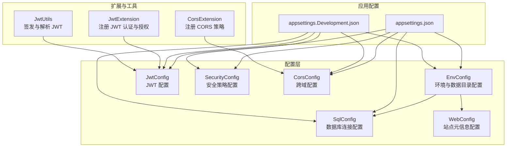
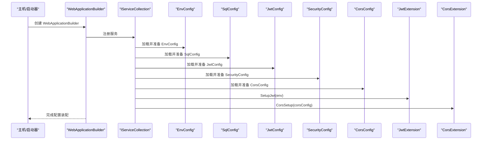
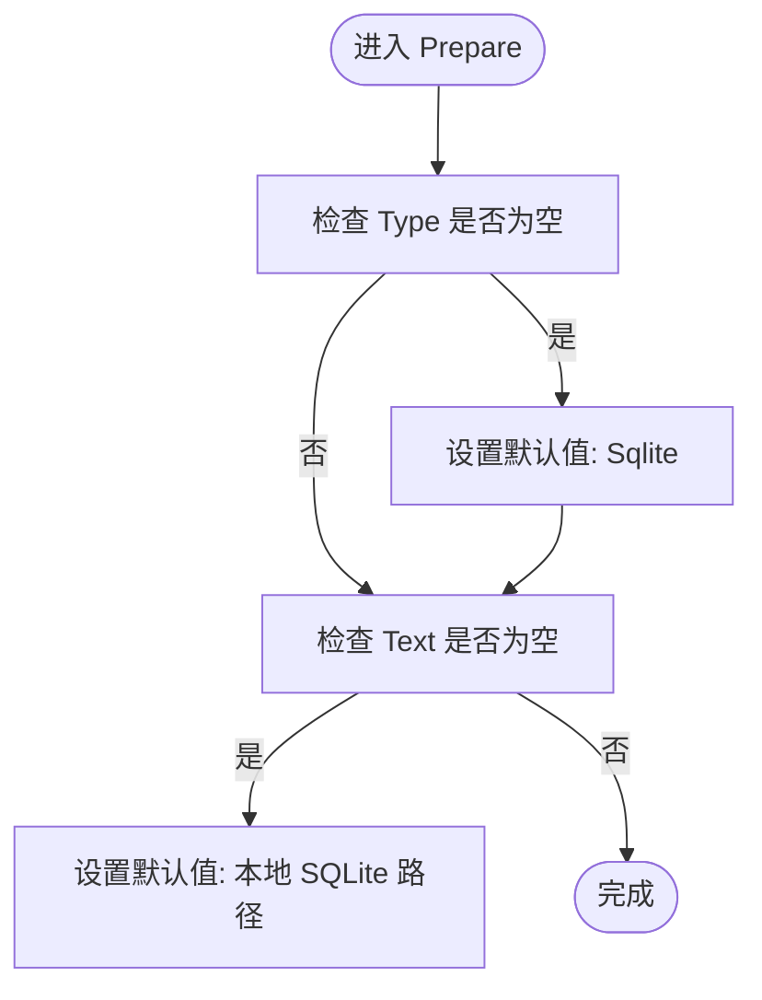
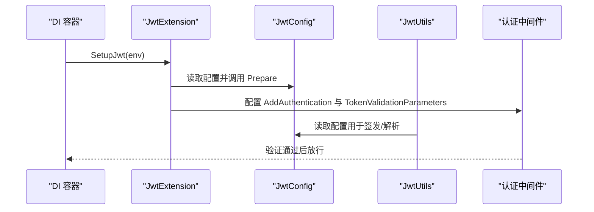
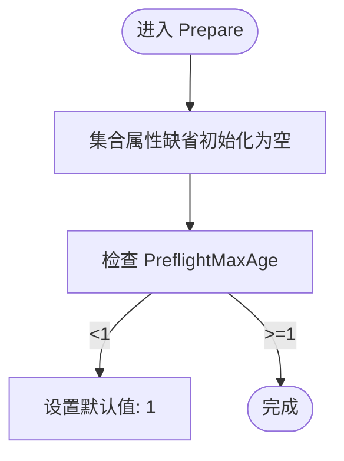
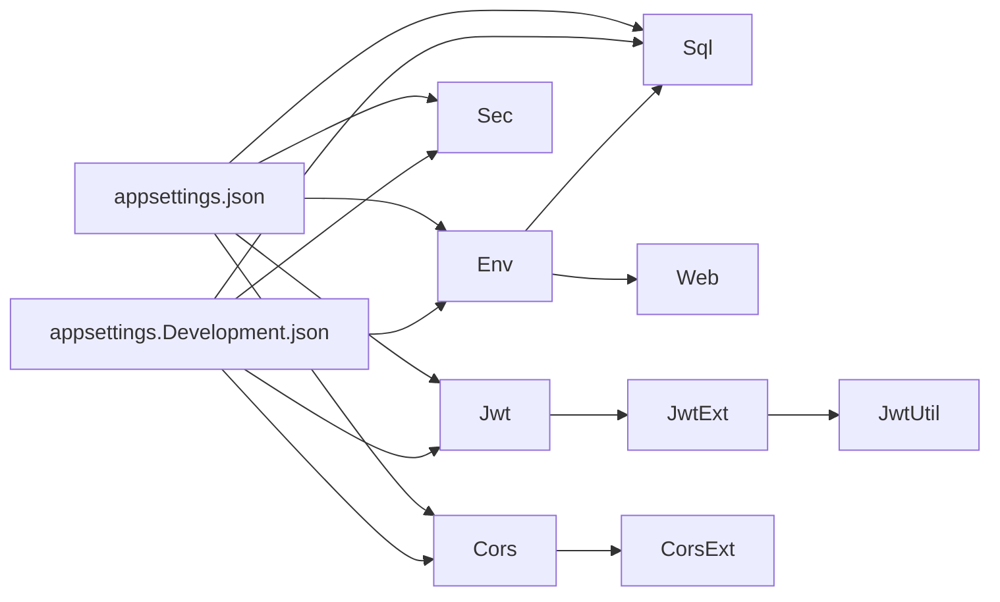

# 核心配置组件

<cite>
**本文引用的文件**
- [SqlConfig.cs](file://Scm.Server/Config/SqlConfig.cs)
- [JwtConfig.cs](file://Scm.Server/Config/JwtConfig.cs)
- [SecurityConfig.cs](file://Scm.Server/Config/SecurityConfig.cs)
- [CorsConfig.cs](file://Scm.Server/Config/CorsConfig.cs)
- [EnvConfig.cs](file://Scm.Server/Config/EnvConfig.cs)
- [WebConfig.cs](file://Scm.Server/Config/WebConfig.cs)
- [JwtExtension.cs](file://Scm.Server/Extensions/JwtExtension.cs)
- [CorsExtension.cs](file://Scm.Server/Extensions/CorsExtension.cs)
- [JwtUtils.cs](file://Scm.Server/Utils/JwtUtils.cs)
- [appsettings.json](file://Scm.Net/appsettings.json)
- [appsettings.Development.json](file://Scm.Net/appsettings.Development.json)
</cite>

## 目录
1. [简介](#简介)
2. [项目结构](#项目结构)
3. [核心组件](#核心组件)
4. [架构总览](#架构总览)
5. [详细组件分析](#详细组件分析)
6. [依赖关系分析](#依赖关系分析)
7. [性能考量](#性能考量)
8. [故障排查指南](#故障排查指南)
9. [结论](#结论)
10. [附录](#附录)

## 简介
本文件聚焦 Scm.Net 的核心配置组件，系统性阐述数据库配置(SqlConfig)、JWT 配置(JwtConfig)、安全配置(SecurityConfig)与跨域配置(CorsConfig)的设计与使用方法。内容涵盖各配置类的属性定义、默认值设定、配置校验与准备流程、配置项之间的依赖关系与优先级、在开发与生产环境中的差异化策略、安全性注意事项以及性能优化建议。同时提供基于实际源码的架构图与流程图，帮助读者快速理解与落地实施。

## 项目结构
核心配置组件位于 Scm.Server/Config 下，围绕环境配置 EnvConfig 提供统一的数据目录、资源路径与默认密码策略；Web 层通过扩展方法将配置注入到依赖注入容器，并在运行时进行准备与校验。应用配置文件 appsettings.json 与 appsettings.Development.json 提供不同环境的默认值与覆盖项。

图表来源
- [EnvConfig.cs:1-280](file://Scm.Server/Config/EnvConfig.cs#L1-L280)
- [SqlConfig.cs:1-23](file://Scm.Server/Config/SqlConfig.cs#L1-L23)
- [JwtConfig.cs:1-48](file://Scm.Server/Config/JwtConfig.cs#L1-L48)
- [SecurityConfig.cs:1-44](file://Scm.Server/Config/SecurityConfig.cs#L1-L44)
- [CorsConfig.cs:1-49](file://Scm.Server/Config/CorsConfig.cs#L1-L49)
- [WebConfig.cs:1-68](file://Scm.Server/Config/WebConfig.cs#L1-L68)
- [JwtExtension.cs:1-73](file://Scm.Server/Extensions/JwtExtension.cs#L1-L73)
- [CorsExtension.cs:1-59](file://Scm.Server/Extensions/CorsExtension.cs#L1-L59)
- [JwtUtils.cs:1-88](file://Scm.Server/Utils/JwtUtils.cs#L1-L88)
- [appsettings.json](file://Scm.Net/appsettings.json)
- [appsettings.Development.json](file://Scm.Net/appsettings.Development.json)

章节来源
- [EnvConfig.cs:1-280](file://Scm.Server/Config/EnvConfig.cs#L1-L280)
- [SqlConfig.cs:1-23](file://Scm.Server/Config/SqlConfig.cs#L1-L23)
- [JwtConfig.cs:1-48](file://Scm.Server/Config/JwtConfig.cs#L1-L48)
- [SecurityConfig.cs:1-44](file://Scm.Server/Config/SecurityConfig.cs#L1-L44)
- [CorsConfig.cs:1-49](file://Scm.Server/Config/CorsConfig.cs#L1-L49)
- [WebConfig.cs:1-68](file://Scm.Server/Config/WebConfig.cs#L1-L68)
- [JwtExtension.cs:1-73](file://Scm.Server/Extensions/JwtExtension.cs#L1-L73)
- [CorsExtension.cs:1-59](file://Scm.Server/Extensions/CorsExtension.cs#L1-L59)
- [JwtUtils.cs:1-88](file://Scm.Server/Utils/JwtUtils.cs#L1-L88)
- [appsettings.json](file://Scm.Net/appsettings.json)
- [appsettings.Development.json](file://Scm.Net/appsettings.Development.json)

## 核心组件
本节对四个核心配置类进行逐项解析，包括属性语义、默认值与准备逻辑、与环境配置的耦合关系以及在扩展与工具类中的使用方式。

- SqlConfig（数据库配置）
  - 属性
    - Type：数据库类型，默认未指定时回退为 Sqlite
    - Text：连接字符串，默认未指定时回退为本地 SQLite 文件路径
  - 准备逻辑
    - 在 Prepare 中对 Type 与 Text 进行空值检查与默认填充
  - 依赖关系
    - 通常由应用启动时读取 appsettings 并结合 EnvConfig 的数据目录生成最终路径
  - 使用场景
    - 开发环境：SQLite 文件便于本地调试
    - 生产环境：可切换为 SQL Server/MySQL 等，需提供完整连接串

- JwtConfig（JWT 配置）
  - 属性
    - Security：安全密钥（HMAC 密钥），用于签发与验证 JWT
    - Issuer：签发者标识
    - Audience：受众标识
    - Expires：过期时间（分钟）
  - 准备逻辑
    - Prepare 对 Security、Issuer、Audience、Expires 进行默认值填充与边界校验
  - 依赖关系
    - 与 EnvConfig 结合，确保密钥与签发参数在运行时得到规范化
  - 使用场景
    - 登录签发令牌、中间件验证令牌、授权策略绑定

- SecurityConfig（安全配置）
  - 属性
    - AppKey：应用编号
    - AesKey/DesKey/SignKey：预留的加密与签名字段（当前未使用）
    - CheckSignature：是否强制校验签名（预留）
    - CheckApp：是否限制应用来源（预留）
  - 准备逻辑
    - 当前 Prepare 为空，保留扩展空间
  - 依赖关系
    - 与业务安全策略解耦，作为未来增强点
  - 使用场景
    - 作为安全策略的承载容器，便于集中管理

- CorsConfig（跨域配置）
  - 属性
    - GlobalCors：是否启用全局跨域策略
    - AllowAnyOrigin/AllowedOrigins：允许任意来源或白名单来源
    - AllowAnyMethod/AllowedMethods：允许任意方法或白名单方法
    - AllowAnyHeader/AllowedHeaders：允许任意头部或白名单头部
    - AllowCredentials：是否允许携带凭据
    - ExposedHeaders：暴露的响应头
    - PreflightMaxAge：预检请求缓存时长（小时）
  - 准备逻辑
    - Prepare 对集合类属性进行空初始化，并对预检时长做最小值约束
  - 依赖关系
    - 与 EnvConfig 无直接耦合，但可与 WebConfig 的站点信息配合
  - 使用场景
    - 前后端分离、第三方集成、移动端调试等

章节来源
- [SqlConfig.cs:1-23](file://Scm.Server/Config/SqlConfig.cs#L1-L23)
- [JwtConfig.cs:1-48](file://Scm.Server/Config/JwtConfig.cs#L1-L48)
- [SecurityConfig.cs:1-44](file://Scm.Server/Config/SecurityConfig.cs#L1-L44)
- [CorsConfig.cs:1-49](file://Scm.Server/Config/CorsConfig.cs#L1-L49)

## 架构总览
下图展示配置组件在应用启动阶段的装配与运行时准备流程，以及与扩展与工具类的交互关系。

图表来源
- [EnvConfig.cs:72-102](file://Scm.Server/Config/EnvConfig.cs#L72-L102)
- [SqlConfig.cs:10-20](file://Scm.Server/Config/SqlConfig.cs#L10-L20)
- [JwtConfig.cs:28-47](file://Scm.Server/Config/JwtConfig.cs#L28-L47)
- [CorsConfig.cs:24-46](file://Scm.Server/Config/CorsConfig.cs#L24-L46)
- [JwtExtension.cs:14-71](file://Scm.Server/Extensions/JwtExtension.cs#L14-L71)
- [CorsExtension.cs:8-56](file://Scm.Server/Extensions/CorsExtension.cs#L8-L56)

## 详细组件分析

### SqlConfig 组件分析
- 设计要点
  - 采用常量 NAME 标识配置段，便于从 IConfiguration 中定位
  - Prepare 方法在运行时对缺省值进行填充，保证最小可用配置
- 默认值与准备规则
  - Type 缺省回退为 Sqlite
  - Text 缺省回退为本地 SQLite 数据库路径
- 与环境配置的关系
  - EnvConfig 负责数据目录与资源路径的解析与创建，SqlConfig 的连接串可结合 EnvConfig 的数据目录生成最终路径
- 使用建议
  - 开发环境推荐 SQLite，便于快速迭代
  - 生产环境建议使用企业级数据库，并在 appsettings 中显式配置连接串

图表来源
- [SqlConfig.cs:10-20](file://Scm.Server/Config/SqlConfig.cs#L10-L20)

章节来源
- [SqlConfig.cs:1-23](file://Scm.Server/Config/SqlConfig.cs#L1-L23)
- [EnvConfig.cs:72-102](file://Scm.Server/Config/EnvConfig.cs#L72-L102)

### JwtConfig 组件分析
- 设计要点
  - 通过常量 Name 标识配置段，便于依赖注入与配置绑定
  - Prepare 对密钥、签发者、受众与过期时间进行默认值与边界校验
- 默认值与准备规则
  - Security：若未提供则回退为固定值（开发用途）
  - Issuer/Audience：若未提供则回退为固定值
  - Expires：小于 1 时回退为 60 分钟
- 与扩展与工具类的交互
  - JwtExtension 将 JwtConfig 注册为强类型配置，并在 AddAuthentication 中使用其参数构建 TokenValidationParameters
  - JwtUtils 通过 AppUtils 获取 JwtConfig 并据此签发与解析 JWT
- 使用建议
  - 生产环境务必替换 Security 为高强度随机密钥，避免硬编码
  - Issuer/Audience 应与前端保持一致，防止令牌不被接受

图表来源
- [JwtExtension.cs:14-71](file://Scm.Server/Extensions/JwtExtension.cs#L14-L71)
- [JwtUtils.cs:13-39](file://Scm.Server/Utils/JwtUtils.cs#L13-L39)
- [JwtConfig.cs:28-47](file://Scm.Server/Config/JwtConfig.cs#L28-L47)

章节来源
- [JwtConfig.cs:1-48](file://Scm.Server/Config/JwtConfig.cs#L1-L48)
- [JwtExtension.cs:1-73](file://Scm.Server/Extensions/JwtExtension.cs#L1-L73)
- [JwtUtils.cs:1-88](file://Scm.Server/Utils/JwtUtils.cs#L1-L88)

### SecurityConfig 组件分析
- 设计要点
  - 作为安全策略的承载容器，当前 Prepare 为空，为后续扩展预留空间
- 属性说明
  - AppKey：应用编号
  - AesKey/DesKey/SignKey：预留字段（当前未使用）
  - CheckSignature/CheckApp：预留开关（当前未使用）
- 使用建议
  - 与业务安全策略解耦，避免与具体实现绑定
  - 后续可在此基础上实现应用来源校验、签名校验等功能

章节来源
- [SecurityConfig.cs:1-44](file://Scm.Server/Config/SecurityConfig.cs#L1-L44)

### CorsConfig 组件分析
- 设计要点
  - 支持 AllowAny 与白名单两种模式，灵活控制来源、方法、头部与凭据
  - PreflightMaxAge 提供预检缓存时长配置
- 默认值与准备规则
  - 集合类属性缺省初始化为空数组
  - PreflightMaxAge 小于 1 时回退为 1
- 与扩展类的交互
  - CorsExtension 根据配置动态构建 CORS 策略，支持 AllowAnyOrigin/Method/Header 与 AllowCredentials 组合
- 使用建议
  - 开发环境可开启 AllowAnyOrigin 与 AllowAnyMethod，生产环境应严格限定白名单
  - 注意 AllowCredentials 与 AllowAnyOrigin 的组合限制

图表来源
- [CorsConfig.cs:24-46](file://Scm.Server/Config/CorsConfig.cs#L24-L46)

章节来源
- [CorsConfig.cs:1-49](file://Scm.Server/Config/CorsConfig.cs#L1-L49)
- [CorsExtension.cs:1-59](file://Scm.Server/Extensions/CorsExtension.cs#L1-L59)

### WebConfig 组件分析
- 设计要点
  - 提供网站元信息与版权占位符替换能力
- 默认值与准备规则
  - SiteName 缺省回退为 "Scm"
  - CopyRight 自动注入年份占位符替换
- 使用建议
  - 与前端模板配合，统一站点标题、关键字与描述
  - 生产环境建议明确版权与备案信息

章节来源
- [WebConfig.cs:1-68](file://Scm.Server/Config/WebConfig.cs#L1-L68)

## 依赖关系分析
- 配置依赖
  - EnvConfig 为其他配置提供基础路径与默认密码策略，SqlConfig 与 WebConfig 可受益于其路径解析
  - JwtConfig 与 CorsConfig 与 EnvConfig 无直接耦合，但通过扩展类在运行时被注入到认证与跨域管道
- 扩展与工具依赖
  - JwtExtension 依赖 JwtConfig 的参数完成认证与授权注册
  - CorsExtension 依赖 CorsConfig 的参数完成 CORS 策略注册
  - JwtUtils 依赖 JwtConfig 完成令牌签发与解析
- 配置优先级
  - appsettings.json 提供默认值，appsettings.Development.json 覆盖默认值
  - 运行时 Prepare 会进一步对缺省值进行回填与边界校验，确保最小可用配置

图表来源
- [appsettings.json](file://Scm.Net/appsettings.json)
- [appsettings.Development.json](file://Scm.Net/appsettings.Development.json)
- [EnvConfig.cs:72-102](file://Scm.Server/Config/EnvConfig.cs#L72-L102)
- [SqlConfig.cs:10-20](file://Scm.Server/Config/SqlConfig.cs#L10-L20)
- [JwtConfig.cs:28-47](file://Scm.Server/Config/JwtConfig.cs#L28-L47)
- [CorsConfig.cs:24-46](file://Scm.Server/Config/CorsConfig.cs#L24-L46)
- [JwtExtension.cs:14-71](file://Scm.Server/Extensions/JwtExtension.cs#L14-L71)
- [CorsExtension.cs:8-56](file://Scm.Server/Extensions/CorsExtension.cs#L8-L56)
- [JwtUtils.cs:13-39](file://Scm.Server/Utils/JwtUtils.cs#L13-L39)

章节来源
- [appsettings.json](file://Scm.Net/appsettings.json)
- [appsettings.Development.json](file://Scm.Net/appsettings.Development.json)
- [EnvConfig.cs:1-280](file://Scm.Server/Config/EnvConfig.cs#L1-L280)
- [SqlConfig.cs:1-23](file://Scm.Server/Config/SqlConfig.cs#L1-L23)
- [JwtConfig.cs:1-48](file://Scm.Server/Config/JwtConfig.cs#L1-L48)
- [SecurityConfig.cs:1-44](file://Scm.Server/Config/SecurityConfig.cs#L1-L44)
- [CorsConfig.cs:1-49](file://Scm.Server/Config/CorsConfig.cs#L1-L49)
- [WebConfig.cs:1-68](file://Scm.Server/Config/WebConfig.cs#L1-L68)
- [JwtExtension.cs:1-73](file://Scm.Server/Extensions/JwtExtension.cs#L1-L73)
- [CorsExtension.cs:1-59](file://Scm.Server/Extensions/CorsExtension.cs#L1-L59)
- [JwtUtils.cs:1-88](file://Scm.Server/Utils/JwtUtils.cs#L1-L88)

## 性能考量
- 数据库连接
  - 开发环境使用 SQLite 可降低部署复杂度，但生产环境建议使用具备连接池与高可用的企业数据库
  - 合理设置连接字符串参数（如连接超时、命令超时）以提升稳定性
- JWT
  - 使用高强度密钥与合理的过期时间，避免频繁签发导致的 CPU 压力
  - 在高并发场景下，建议将令牌验证参数缓存与异步处理结合
- CORS
  - 预检缓存时长应根据前端变更频率合理设置，避免过度缓存导致策略失效
  - 白名单来源与方法应尽量收敛，减少不必要的跨域开销
- 资源路径
  - EnvConfig 对数据目录与资源路径进行统一解析与创建，有助于减少 IO 错误与路径拼接成本

## 故障排查指南
- JWT 验证失败
  - 检查 Issuer/Audience 与签发时是否一致
  - 确认 Security 密钥是否正确且未硬编码
  - 查看认证中间件事件回调中令牌提取逻辑是否生效
- CORS 跨域失败
  - 确认 AllowAnyOrigin 与 AllowedOrigins 的互斥关系
  - 检查 AllowCredentials 与特定来源的组合是否符合规范
  - 核对预检缓存时长与前端请求行为
- 数据库连接异常
  - 确认 SqlConfig 的 Type 与 Text 是否正确
  - 检查 EnvConfig 的数据目录是否存在且可写
- 配置未生效
  - 确认 appsettings 与 appsettings.Development.json 的覆盖顺序
  - 检查扩展方法是否正确注册到服务容器

章节来源
- [JwtExtension.cs:23-64](file://Scm.Server/Extensions/JwtExtension.cs#L23-L64)
- [CorsExtension.cs:15-55](file://Scm.Server/Extensions/CorsExtension.cs#L15-L55)
- [SqlConfig.cs:10-20](file://Scm.Server/Config/SqlConfig.cs#L10-L20)
- [EnvConfig.cs:72-102](file://Scm.Server/Config/EnvConfig.cs#L72-L102)

## 结论
Scm.Net 的核心配置组件通过清晰的职责划分与运行时准备机制，实现了最小可用配置与灵活扩展的平衡。SqlConfig、JwtConfig、SecurityConfig 与 CorsConfig 各司其职，并通过扩展与工具类无缝接入认证、跨域与令牌处理流程。建议在生产环境中严格管理密钥与来源白名单，合理设置过期时间与预检缓存，以兼顾安全性与性能。

## 附录
- 配置示例与环境策略
  - 开发环境
    - SqlConfig：Type=Sqlite，Text=本地数据库路径
    - JwtConfig：Security 未提供时回退为固定值，Expires=60
    - CorsConfig：AllowAnyOrigin=true，AllowAnyMethod=true，PreflightMaxAge=1
    - appsettings.Development.json 用于覆盖默认值
  - 生产环境
    - SqlConfig：Type=SQL Server/MySQL，Text=完整连接串
    - JwtConfig：Security 必须替换为高强度随机密钥，Expires 根据业务调整
    - CorsConfig：AllowAnyOrigin=false，仅配置白名单来源与方法
    - appsettings.json 提供默认值，appsettings.Production.json 覆盖敏感配置
- 安全性建议
  - 严禁在代码中硬编码 Security 与连接串
  - 使用环境变量或密钥管理服务存储敏感配置
  - 定期轮换密钥并更新所有客户端与服务端配置
- 性能优化建议
  - 数据库连接池参数与超时设置
  - JWT 过期时间与刷新策略
  - CORS 预检缓存与白名单收敛

章节来源
- [appsettings.json](file://Scm.Net/appsettings.json)
- [appsettings.Development.json](file://Scm.Net/appsettings.Development.json)
- [SqlConfig.cs:10-20](file://Scm.Server/Config/SqlConfig.cs#L10-L20)
- [JwtConfig.cs:28-47](file://Scm.Server/Config/JwtConfig.cs#L28-L47)
- [CorsConfig.cs:24-46](file://Scm.Server/Config/CorsConfig.cs#L24-L46)