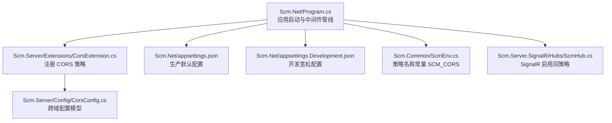
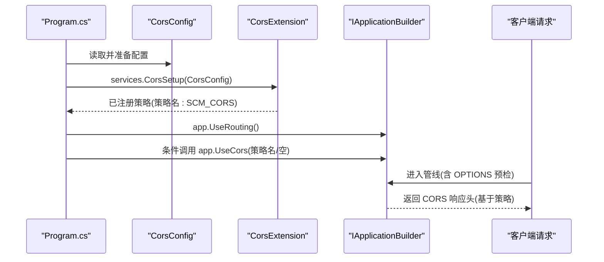
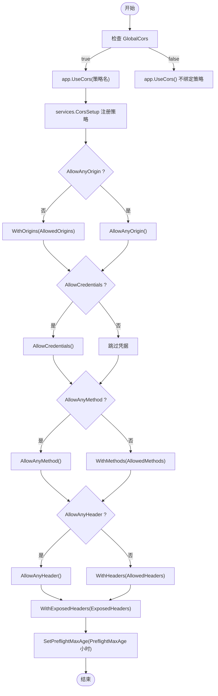
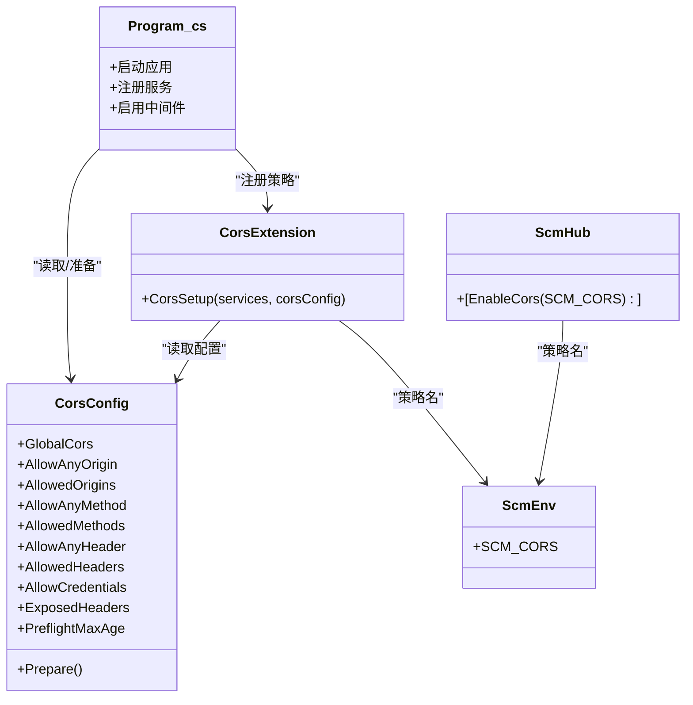

# 跨域策略配置

<cite>
**本文引用的文件**
- [CorsConfig.cs](file://Scm.Server/Config/CorsConfig.cs)
- [CorsExtension.cs](file://Scm.Server/Extensions/CorsExtension.cs)
- [Program.cs](file://Scm.Net/Program.cs)
- [appsettings.json](file://Scm.Net/appsettings.json)
- [appsettings.Development.json](file://Scm.Net/appsettings.Development.json)
- [ScmEnv.cs](file://Scm.Common/ScmEnv.cs)
- [ScmHub.cs](file://Scm.Server.SignalR/Hubs/ScmHub.cs)
</cite>

## 目录
1. [简介](#简介)
2. [项目结构](#项目结构)
3. [核心组件](#核心组件)
4. [架构总览](#架构总览)
5. [组件详解](#组件详解)
6. [依赖关系分析](#依赖关系分析)
7. [性能与安全考量](#性能与安全考量)
8. [故障排查指南](#故障排查指南)
9. [结论](#结论)
10. [附录](#附录)

## 简介
本文围绕 Scm.Net 的跨域策略配置系统，系统性阐述 CorsConfig 类的配置项含义与行为，CORS 中间件的注册与启用流程，以及在不同运行环境（开发/生产）下的配置示例与最佳实践。同时给出移动端与第三方集成场景下的跨域处理建议，并总结安全与性能方面的注意事项。

## 项目结构
与跨域策略直接相关的代码分布在以下模块：
- 配置模型：Scm.Server/Config/CorsConfig.cs
- 扩展注册：Scm.Server/Extensions/CorsExtension.cs
- 应用启动：Scm.Net/Program.cs
- 配置文件：Scm.Net/appsettings.json、Scm.Net/appsettings.Development.json
- 环境常量：Scm.Common/ScmEnv.cs
- SignalR 跨域：Scm.Server.SignalR/Hubs/ScmHub.cs

图表来源
- [Program.cs:126-164](file://Scm.Net/Program.cs#L126-L164)
- [CorsExtension.cs:8-56](file://Scm.Server/Extensions/CorsExtension.cs#L8-L56)
- [CorsConfig.cs:3-47](file://Scm.Server/Config/CorsConfig.cs#L3-L47)
- [appsettings.json:115-126](file://Scm.Net/appsettings.json#L115-L126)
- [appsettings.Development.json:127-138](file://Scm.Net/appsettings.Development.json#L127-L138)
- [ScmEnv.cs:28-30](file://Scm.Common/ScmEnv.cs#L28-L30)
- [ScmHub.cs:9](file://Scm.Server.SignalR/Hubs/ScmHub.cs#L9)

章节来源
- [Program.cs:126-164](file://Scm.Net/Program.cs#L126-L164)
- [CorsExtension.cs:8-56](file://Scm.Server/Extensions/CorsExtension.cs#L8-L56)
- [CorsConfig.cs:3-47](file://Scm.Server/Config/CorsConfig.cs#L3-L47)
- [appsettings.json:115-126](file://Scm.Net/appsettings.json#L115-L126)
- [appsettings.Development.json:127-138](file://Scm.Net/appsettings.Development.json#L127-L138)
- [ScmEnv.cs:28-30](file://Scm.Common/ScmEnv.cs#L28-L30)
- [ScmHub.cs:9](file://Scm.Server.SignalR/Hubs/ScmHub.cs#L9)

## 核心组件
- CorsConfig：定义跨域策略的配置项集合，包括是否全局启用、允许任意源/方法/头、允许凭据、暴露头、预检缓存时长等，并提供 Prepare() 初始化逻辑。
- CorsExtension：将 CorsConfig 转换为 ASP.NET Core 的 AddCors 策略注册，按配置动态构建 WithOrigins/AllowAnyOrigin、WithMethods/AllowAnyMethod、WithHeaders/AllowAnyHeader、AllowCredentials、WithExposedHeaders、SetPreflightMaxAge 等。
- Program.cs：在服务容器中调用 services.CorsSetup，在请求管线中根据配置决定 app.UseCors(策略名) 或 app.UseCors()；并提供开发/生产环境的差异化配置入口。
- appsettings.json 与 appsettings.Development.json：分别提供生产与开发环境的默认 CORS 配置，便于快速切换。
- ScmEnv：提供策略名称常量 SCM_CORS，确保前后端一致引用同一策略。
- ScmHub：通过 [EnableCors(ScmEnv.SCM_CORS)] 使 SignalR 使用相同的跨域策略。

章节来源
- [CorsConfig.cs:3-47](file://Scm.Server/Config/CorsConfig.cs#L3-L47)
- [CorsExtension.cs:8-56](file://Scm.Server/Extensions/CorsExtension.cs#L8-L56)
- [Program.cs:126-164](file://Scm.Net/Program.cs#L126-L164)
- [appsettings.json:115-126](file://Scm.Net/appsettings.json#L115-L126)
- [appsettings.Development.json:127-138](file://Scm.Net/appsettings.Development.json#L127-L138)
- [ScmEnv.cs:28-30](file://Scm.Common/ScmEnv.cs#L28-L30)
- [ScmHub.cs:9](file://Scm.Server.SignalR/Hubs/ScmHub.cs#L9)

## 架构总览
下图展示跨域策略从配置到生效的关键步骤：配置加载 → 策略注册 → 请求管线应用。

图表来源
- [Program.cs:126-164](file://Scm.Net/Program.cs#L126-L164)
- [CorsExtension.cs:8-56](file://Scm.Server/Extensions/CorsExtension.cs#L8-L56)
- [ScmEnv.cs:28-30](file://Scm.Common/ScmEnv.cs#L28-L30)

## 组件详解

### CorsConfig 配置项说明
- GlobalCors：是否在请求管线中启用跨域中间件。
- AllowAnyOrigin/AllowedOrigins：是否允许任意来源，或指定允许的来源列表。
- AllowAnyMethod/AllowedMethods：是否允许任意 HTTP 方法，或指定允许的方法列表。
- AllowAnyHeader/AllowedHeaders：是否允许任意请求头，或指定允许的头列表。
- AllowCredentials：是否允许携带凭据（Cookie/Authorization 头）。
- ExposedHeaders：允许暴露给客户端的响应头列表。
- PreflightMaxAge：预检请求结果缓存时长（小时），最小值会被强制为 1。

Prepare() 行为要点：
- 确保字符串数组字段不为 null，避免后续注册时报错。
- 若预检缓存时长小于 1，则重置为 1。

章节来源
- [CorsConfig.cs:3-47](file://Scm.Server/Config/CorsConfig.cs#L3-L47)

### CORS 中间件注册与启用流程
- 服务注册阶段：调用 services.CorsSetup(corsConfig)，内部使用 AddCors 并以策略名 SCM_CORS 注册策略。
- 请求管线阶段：在 app.UseRouting() 之后，根据 corsConfig.GlobalCors 决定：
  - true：调用 app.UseCors(ScmEnv.SCM_CORS)，对所有匹配路由启用跨域。
  - false：调用 app.UseCors()，不绑定特定策略，通常用于按控制器/动作单独启用。

章节来源
- [CorsExtension.cs:8-56](file://Scm.Server/Extensions/CorsExtension.cs#L8-L56)
- [Program.cs:205-217](file://Scm.Net/Program.cs#L205-L217)
- [ScmEnv.cs:28-30](file://Scm.Common/ScmEnv.cs#L28-L30)

### SignalR 的跨域处理
- 在 Hub 类上标注 [EnableCors(ScmEnv.SCM_CORS)]，使 SignalR 连接与消息流复用统一的跨域策略。
- SignalR 仍受请求管线中的 UseCors 影响，需确保策略允许 WebSocket 握手所需的 Origin/Headers/Credentials。

章节来源
- [ScmHub.cs:9](file://Scm.Server.SignalR/Hubs/ScmHub.cs#L9)

### 不同场景下的配置示例

#### 开发环境（宽松配置）
- 典型特征：GlobalCors=true，AllowAnyOrigin=false（显式列出允许的前端地址），AllowAnyMethod=true，AllowAnyHeader=true，AllowCredentials=true，PreflightMaxAge=1。
- 适用：本地联调、多前端并行开发、Swagger UI 访问等。

章节来源
- [appsettings.Development.json:127-138](file://Scm.Net/appsettings.Development.json#L127-L138)

#### 生产环境（严格配置）
- 典型特征：GlobalCors=false，AllowAnyOrigin=false，仅允许明确的生产域名，AllowAnyMethod/AllowAnyHeader=false，按需精确列出允许的方法与头，AllowCredentials=false 或谨慎开启，PreflightMaxAge>1。
- 适用：线上部署、CDN/反向代理后端、多子域/多站点聚合。

章节来源
- [appsettings.json:115-126](file://Scm.Net/appsettings.json#L115-L126)

### 配置项与行为映射（代码级）

图表来源
- [CorsExtension.cs:17-53](file://Scm.Server/Extensions/CorsExtension.cs#L17-L53)
- [Program.cs:207-217](file://Scm.Net/Program.cs#L207-L217)

## 依赖关系分析
- Program.cs 依赖 CorsConfig 与 CorsExtension，负责在启动时加载配置并注册/启用策略。
- CorsExtension 依赖 CorsConfig 与 ScmEnv，将配置映射为具体策略。
- ScmHub 依赖 ScmEnv，确保与 API 层共享同一策略名。
- appsettings.json 与 appsettings.Development.json 提供运行时配置数据源。

图表来源
- [Program.cs:126-164](file://Scm.Net/Program.cs#L126-L164)
- [CorsConfig.cs:3-47](file://Scm.Server/Config/CorsConfig.cs#L3-L47)
- [CorsExtension.cs:8-56](file://Scm.Server/Extensions/CorsExtension.cs#L8-L56)
- [ScmEnv.cs:28-30](file://Scm.Common/ScmEnv.cs#L28-L30)
- [ScmHub.cs:9](file://Scm.Server.SignalR/Hubs/ScmHub.cs#L9)

章节来源
- [Program.cs:126-164](file://Scm.Net/Program.cs#L126-L164)
- [CorsConfig.cs:3-47](file://Scm.Server/Config/CorsConfig.cs#L3-L47)
- [CorsExtension.cs:8-56](file://Scm.Server/Extensions/CorsExtension.cs#L8-L56)
- [ScmEnv.cs:28-30](file://Scm.Common/ScmEnv.cs#L28-L30)
- [ScmHub.cs:9](file://Scm.Server.SignalR/Hubs/ScmHub.cs#L9)

## 性能与安全考量
- 性能
  - 预检缓存：合理设置 PreflightMaxAge，减少重复 OPTIONS 预检请求，提升移动端与频繁交互场景的体验。
  - 最小化允许范围：仅允许必要的 Origin/Method/Header，有助于减少不必要的预检与复杂度。
  - 凭据与通配：AllowCredentials 与 AllowAnyOrigin/AllowAnyHeader 同时使用会触发浏览器严格限制，需谨慎组合。
- 安全
  - 生产环境建议关闭 AllowAnyOrigin/AllowAnyMethod/AllowAnyHeader，改为白名单。
  - 凭据使用需配合 AllowCredentials 且 Origin 必须为具体值，避免 *。
  - 暴露头需最小化，仅暴露业务必需的响应头。
  - 结合认证授权中间件，确保跨域请求同样受鉴权保护。

[本节为通用指导，无需引用具体文件]

## 故障排查指南
- 症状：移动端或第三方调用出现跨域错误
  - 检查 appsettings 中的 AllowedOrigins 是否包含目标域名，或是否误用了 AllowAnyOrigin。
  - 确认 GlobalCors 与 UseCors 的组合是否正确。
- 症状：携带 Cookie/Authorization 的请求失败
  - 确认 AllowCredentials=true，且 Origin 为具体值而非通配。
  - 检查 AllowedHeaders 是否包含 Authorization。
- 症状：频繁触发 OPTIONS 预检
  - 调整 PreflightMaxAge，合并相同来源/方法/头的请求。
  - 精简 AllowedMethods/AllowedHeaders 列表。
- 症状：SignalR 握手失败
  - 确认 Hub 上标注了 [EnableCors(ScmEnv.SCM_CORS)]，并确保策略允许对应 Origin 与凭据。

章节来源
- [CorsConfig.cs:3-47](file://Scm.Server/Config/CorsConfig.cs#L3-L47)
- [CorsExtension.cs:8-56](file://Scm.Server/Extensions/CorsExtension.cs#L8-L56)
- [Program.cs:205-217](file://Scm.Net/Program.cs#L205-L217)
- [ScmHub.cs:9](file://Scm.Server.SignalR/Hubs/ScmHub.cs#L9)

## 结论
Scm.Net 的跨域策略通过 CorsConfig 与 CorsExtension 实现“配置即策略”，在 Program.cs 中完成注册与启用。开发与生产环境可通过 appsettings 切换不同严格程度的策略。结合 SignalR 的统一策略名，可实现 API 与实时通信的一致跨域行为。建议在生产环境遵循最小权限原则，谨慎启用凭据与通配，以兼顾安全与性能。

[本节为总结性内容，无需引用具体文件]

## 附录

### 配置项速查表
- GlobalCors：是否全局启用跨域中间件
- AllowAnyOrigin/AllowedOrigins：允许来源策略
- AllowAnyMethod/AllowedMethods：允许 HTTP 方法
- AllowAnyHeader/AllowedHeaders：允许请求头
- AllowCredentials：是否允许凭据
- ExposedHeaders：允许暴露的响应头
- PreflightMaxAge：预检缓存时长（小时）

章节来源
- [CorsConfig.cs:3-47](file://Scm.Server/Config/CorsConfig.cs#L3-L47)