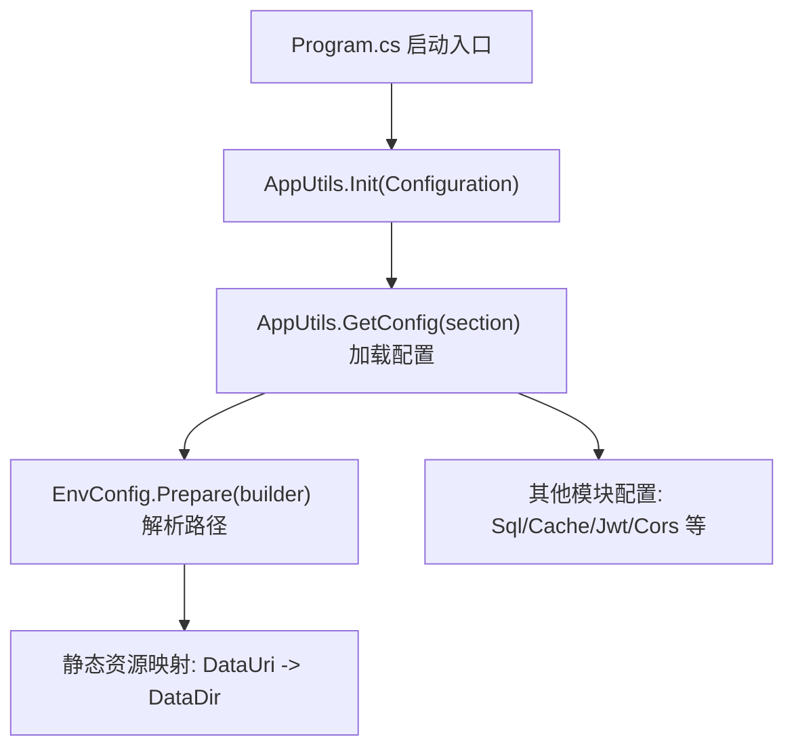
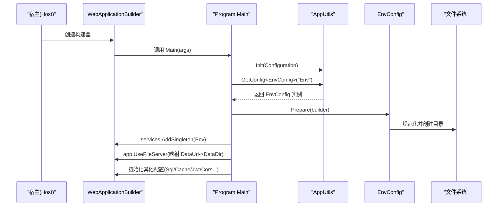
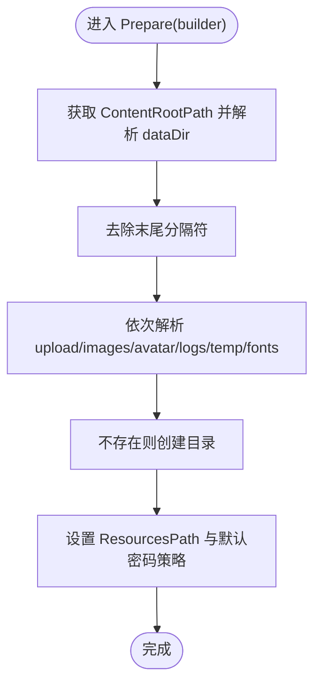
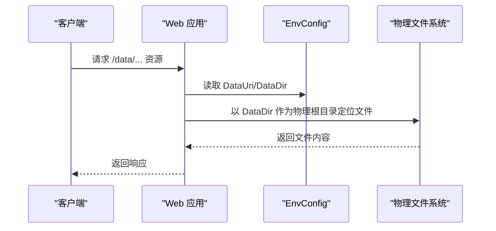
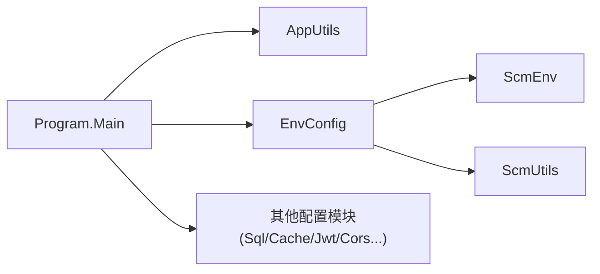

# 环境配置管理

<cite>
**本文档引用的文件**
- [Scm.Net/Program.cs](file://Scm.Net/Program.cs)
- [Scm.Net/appsettings.json](file://Scm.Net/appsettings.json)
- [Scm.Net/appsettings.Development.json](file://Scm.Net/appsettings.Development.json)
- [Scm.Server/Config/EnvConfig.cs](file://Scm.Server/Config/EnvConfig.cs)
- [Scm.Server/Config/DataConfig.cs](file://Scm.Server/Config/DataConfig.cs)
- [Scm.Server/Config/WebConfig.cs](file://Scm.Server/Config/WebConfig.cs)
- [Scm.Server/Utils/AppUtils.cs](file://Scm.Server/Utils/AppUtils.cs)
- [Scm.Common/ScmEnv.cs](file://Scm.Common/ScmEnv.cs)
- [Scm.Common/Utils/ScmUtils.cs](file://Scm.Common/Utils/ScmUtils.cs)
- [Scm.Core/Sys/App/ScmSysAppService.cs](file://Scm.Core/Sys/App/ScmSysAppService.cs)
</cite>

## 目录
1. [简介](#简介)
2. [项目结构](#项目结构)
3. [核心组件](#核心组件)
4. [架构总览](#架构总览)
5. [详细组件分析](#详细组件分析)
6. [依赖关系分析](#依赖关系分析)
7. [性能考虑](#性能考虑)
8. [故障排除指南](#故障排除指南)
9. [结论](#结论)

## 简介
本文件面向 Scm.Net 的环境配置管理，系统性阐述配置加载机制、环境变量与配置文件的优先级策略、EnvConfig 如何解析与落地数据目录、日志目录、上传目录等路径，以及 appsettings.json 的组织方式与环境特定配置覆盖规则。同时给出开发、测试、生产的最佳实践、配置验证与调试技巧。

## 项目结构
Scm.Net 的配置体系围绕 ASP.NET Core 的配置模型展开，采用“基础配置 + 环境特定配置”的叠加方式，结合应用启动流程中的准备阶段，将抽象配置转化为运行时可用的具体路径与行为。

图表来源
- [Scm.Net/Program.cs:33-50](file://Scm.Net/Program.cs#L33-L50)
- [Scm.Server/Utils/AppUtils.cs:16-29](file://Scm.Server/Utils/AppUtils.cs#L16-L29)
- [Scm.Server/Config/EnvConfig.cs:72-102](file://Scm.Server/Config/EnvConfig.cs#L72-L102)

章节来源
- [Scm.Net/Program.cs:33-50](file://Scm.Net/Program.cs#L33-L50)
- [Scm.Server/Utils/AppUtils.cs:16-29](file://Scm.Server/Utils/AppUtils.cs#L16-L29)
- [Scm.Net/appsettings.json:39-47](file://Scm.Net/appsettings.json#L39-L47)
- [Scm.Net/appsettings.Development.json:39-47](file://Scm.Net/appsettings.Development.json#L39-L47)

## 核心组件
- 配置加载器：通过 AppUtils 提供的 GetConfig<T> 从 IConfiguration 中按节区名提取强类型配置对象。
- 环境配置器：EnvConfig 负责将 ContentRootPath 与配置节中的相对路径合并为绝对路径，确保目录存在并进行路径规范化；同时提供统一的路径拼接与 URI 映射能力。
- 其他配置模块：DataConfig、WebConfig 等分别负责共享用户、网站元信息等配置的准备与默认值填充。

章节来源
- [Scm.Server/Utils/AppUtils.cs:26-29](file://Scm.Server/Utils/AppUtils.cs#L26-L29)
- [Scm.Server/Config/EnvConfig.cs:72-102](file://Scm.Server/Config/EnvConfig.cs#L72-L102)
- [Scm.Server/Config/DataConfig.cs:15-21](file://Scm.Server/Config/DataConfig.cs#L15-L21)
- [Scm.Server/Config/WebConfig.cs:56-65](file://Scm.Server/Config/WebConfig.cs#L56-L65)

## 架构总览
下图展示从启动到配置生效的关键流程，包括配置读取、路径解析、静态文件服务挂载与后续模块初始化。

图表来源
- [Scm.Net/Program.cs:33-50](file://Scm.Net/Program.cs#L33-L50)
- [Scm.Net/Program.cs:194-201](file://Scm.Net/Program.cs#L194-L201)
- [Scm.Server/Utils/AppUtils.cs:26-29](file://Scm.Server/Utils/AppUtils.cs#L26-L29)
- [Scm.Server/Config/EnvConfig.cs:72-102](file://Scm.Server/Config/EnvConfig.cs#L72-L102)

## 详细组件分析

### 配置文件结构与加载顺序
- 基础配置：appsettings.json 定义通用配置，如 Serilog、Kestrel、Env、Sql、Uid、Cache、Quartz、Jwt、Security、Cors 等。
- 环境特定配置：appsettings.{Environment}.json 在开发环境（Development）中覆盖基础配置，例如将 Env.dataDir 指向绝对路径 D:/data。
- 环境变量与命令行：ASP.NET Core 配置提供链会进一步覆盖上述文件配置（例如通过环境变量覆盖某些键），但本仓库未显式使用环境变量覆盖 EnvConfig 的场景。

加载顺序与优先级（从高到低）：
1) 环境变量（Environment Variables）
2) 命令行参数（Command Line）
3) appsettings.{Environment}.json（如 Development）
4) appsettings.json
5) 默认值（代码中的默认值）

章节来源
- [Scm.Net/appsettings.json:1-127](file://Scm.Net/appsettings.json#L1-L127)
- [Scm.Net/appsettings.Development.json:1-162](file://Scm.Net/appsettings.Development.json#L1-L162)

### EnvConfig 路径解析与目录准备
EnvConfig 的 Prepare 方法负责：
- 将 dataDir 规范化为不以分隔符结尾的绝对路径；
- 为 upload/images/avatar/logs/temp/fonts 等子目录计算绝对路径并确保目录存在；
- 设置 ResourcesPath 与默认密码模式（Fixed/Random）及默认密码；
- 提供 GetDataPath/GetUploadPath 等便捷方法用于拼接相对 dataDir 的路径。

图表来源
- [Scm.Server/Config/EnvConfig.cs:72-102](file://Scm.Server/Config/EnvConfig.cs#L72-L102)
- [Scm.Server/Config/EnvConfig.cs:104-120](file://Scm.Server/Config/EnvConfig.cs#L104-L120)

章节来源
- [Scm.Server/Config/EnvConfig.cs:72-102](file://Scm.Server/Config/EnvConfig.cs#L72-L102)
- [Scm.Server/Config/EnvConfig.cs:104-120](file://Scm.Server/Config/EnvConfig.cs#L104-L120)
- [Scm.Common/ScmEnv.cs:35-42](file://Scm.Common/ScmEnv.cs#L35-L42)
- [Scm.Common/Utils/ScmUtils.cs:134-147](file://Scm.Common/Utils/ScmUtils.cs#L134-L147)

### 静态资源映射与路径对外暴露
- EnvConfig.DataUri 与 EnvConfig.DataDir 组合，通过 FileServerOptions 将物理目录映射到 Web 路径前缀；
- ToUri 可将物理路径转换为对外可访问的 Web 路径；
- ScmSysAppService 使用 EnvConfig 读取关于页面内容文件，体现配置对业务层的支撑。

图表来源
- [Scm.Net/Program.cs:194-201](file://Scm.Net/Program.cs#L194-L201)
- [Scm.Server/Config/EnvConfig.cs:174-177](file://Scm.Server/Config/EnvConfig.cs#L174-L177)
- [Scm.Core/Sys/App/ScmSysAppService.cs:73-83](file://Scm.Core/Sys/App/ScmSysAppService.cs#L73-L83)

章节来源
- [Scm.Net/Program.cs:194-201](file://Scm.Net/Program.cs#L194-L201)
- [Scm.Server/Config/EnvConfig.cs:174-177](file://Scm.Server/Config/EnvConfig.cs#L174-L177)
- [Scm.Core/Sys/App/ScmSysAppService.cs:73-83](file://Scm.Core/Sys/App/ScmSysAppService.cs#L73-L83)

### 其他配置模块
- DataConfig：准备共享用户 ID 数组，默认包含系统用户 ID。
- WebConfig：准备网站元信息（如版权文案），基于 EnvConfig 的准备结果进行补充。

章节来源
- [Scm.Server/Config/DataConfig.cs:15-21](file://Scm.Server/Config/DataConfig.cs#L15-L21)
- [Scm.Server/Config/WebConfig.cs:56-65](file://Scm.Server/Config/WebConfig.cs#L56-L65)

## 依赖关系分析
- Program.Main 依赖 AppUtils 进行配置读取与服务注册；
- EnvConfig 依赖 ScmEnv 与 ScmUtils 进行路径分隔符与路径转换；
- EnvConfig 作为单例注入，被后续模块（如数据库初始化、字体加载、静态文件服务）使用。

图表来源
- [Scm.Net/Program.cs:33-50](file://Scm.Net/Program.cs#L33-L50)
- [Scm.Server/Utils/AppUtils.cs:26-29](file://Scm.Server/Utils/AppUtils.cs#L26-L29)
- [Scm.Server/Config/EnvConfig.cs:72-102](file://Scm.Server/Config/EnvConfig.cs#L72-L102)
- [Scm.Common/ScmEnv.cs:35-42](file://Scm.Common/ScmEnv.cs#L35-L42)
- [Scm.Common/Utils/ScmUtils.cs:134-147](file://Scm.Common/Utils/ScmUtils.cs#L134-L147)

章节来源
- [Scm.Net/Program.cs:33-50](file://Scm.Net/Program.cs#L33-L50)
- [Scm.Server/Utils/AppUtils.cs:26-29](file://Scm.Server/Utils/AppUtils.cs#L26-L29)
- [Scm.Server/Config/EnvConfig.cs:72-102](file://Scm.Server/Config/EnvConfig.cs#L72-L102)

## 性能考虑
- 目录创建仅在首次准备时执行，避免重复 IO；
- 路径拼接与转换通过 ScmUtils.ToMachinePath/ToWebPath 统一处理，减少平台差异带来的开销；
- 静态文件映射使用 PhysicalFileProvider，建议在生产环境配合 CDN 或反向代理优化静态资源访问。

## 故障排除指南
- 目录权限不足：若 dataDir 或子目录无法创建，请检查运行账户权限与磁盘空间。
- 路径分隔符问题：确保配置中的相对路径使用正斜杠或由 ToMachinePath 正确转换。
- 静态资源 404：确认 DataUri 与 DataDir 的组合映射正确，且请求路径前缀匹配。
- 密码模式异常：DefaultPassMode 仅接受 Fixed/Random，非两者时返回 null；请检查配置节 Env 下的 DefaultPassMode 与 DefaultPassWord。
- 配置未生效：确认 appsettings.{Environment}.json 是否与当前 ASPNETCORE_ENVIRONMENT 匹配，且键名大小写一致。

章节来源
- [Scm.Server/Config/EnvConfig.cs:94-101](file://Scm.Server/Config/EnvConfig.cs#L94-L101)
- [Scm.Net/Program.cs:194-201](file://Scm.Net/Program.cs#L194-L201)
- [Scm.Net/appsettings.Development.json:39-47](file://Scm.Net/appsettings.Development.json#L39-L47)

## 结论
Scm.Net 的环境配置管理遵循 ASP.NET Core 的标准约定，通过“基础配置 + 环境特定配置”的叠加与 AppUtils 的强类型读取，将 EnvConfig 的路径解析与目录准备无缝集成到启动流程中。该设计既保证了灵活性（不同环境差异化配置），又提供了清晰的默认值与路径转换逻辑，便于在开发、测试、生产环境中稳定运行。