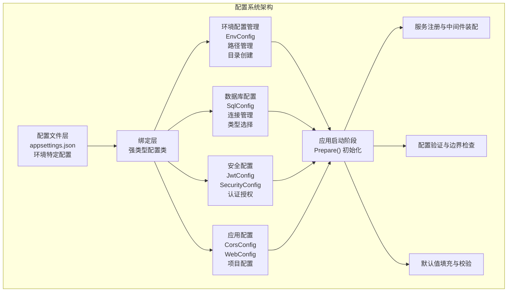
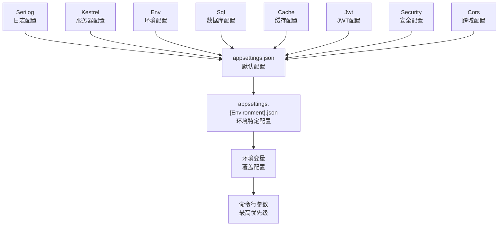

# 配置管理系统

<cite>
**本文引用的文件**
- [appsettings.json](file://Scm.Net/appsettings.json)
- [appsettings.Development.json](file://Scm.Net/appsettings.Development.json)
- [EnvConfig.cs](file://Scm.Server/Config/EnvConfig.cs)
- [JwtConfig.cs](file://Scm.Server/Config/JwtConfig.cs)
- [SecurityConfig.cs](file://Scm.Server/Config/SecurityConfig.cs)
- [SqlConfig.cs](file://Scm.Server/Config/SqlConfig.cs)
- [CorsConfig.cs](file://Scm.Server/Config/CorsConfig.cs)
- [KestrelConfig.cs](file://Scm.Server/Config/KestrelConfig.cs)
- [WebConfig.cs](file://Scm.Server/Config/WebConfig.cs)
- [OidcConfig.cs](file://Scm.Server/Config/OidcConfig.cs)
- [LogConfig.cs](file://Scm.Server/Config/LogConfig.cs)
- [DllConfig.cs](file://Scm.Server/Config/DllConfig.cs)
</cite>

## 更新摘要
**所做更改**
- 更新配置系统架构概述，反映当前简化的配置管理结构
- 修订核心配置组件分析，基于实际存在的配置文件和配置类
- 更新环境配置管理章节，反映实际的配置文件层次结构
- 移除已不存在的动态配置更新章节，因为当前仅保留核心配置功能
- 更新配置验证与热更新章节，反映简化的配置管理能力
- 修订配置文件结构与加载顺序，基于实际的配置节点

## 目录
1. [简介](#简介)
2. [配置系统架构](#配置系统架构)
3. [项目结构](#项目结构)
4. [核心配置组件](#核心配置组件)
5. [详细组件分析](#详细组件分析)
6. [环境配置管理](#环境配置管理)
7. [配置验证与热更新](#配置验证与热更新)
8. [性能考量](#性能考量)
9. [故障排查指南](#故障排查指南)
10. [最佳实践](#最佳实践)
11. [结论](#结论)
12. [附录](#附录)

## 简介
本文件全面阐述 Scm.Net 配置管理系统的架构设计与实现机制。系统采用"JSON 配置 + 强类型配置类"的双层设计，通过核心配置组件实现完整的配置管理：环境配置管理、数据库配置、安全配置、JWT 配置、跨域配置等。文档详细解释配置接口设计、环境配置管理机制，涵盖数据库配置、缓存配置、安全配置、JWT 配置等核心组件，并提供完整的配置选项文档、配置文件结构说明、配置验证策略与安全建议。

## 配置系统架构
Scm.Net 配置管理系统采用分层架构设计，通过核心配置组件协同工作：

**图表来源**
- [EnvConfig.cs:72-102](file://Scm.Server/Config/EnvConfig.cs#L72-L102)
- [SqlConfig.cs:10-20](file://Scm.Server/Config/SqlConfig.cs#L10-L20)
- [JwtConfig.cs:28-47](file://Scm.Server/Config/JwtConfig.cs#L28-L47)
- [SecurityConfig.cs:39-41](file://Scm.Server/Config/SecurityConfig.cs#L39-L41)

## 项目结构
Scm.Net 的配置体系由三层组成：

### 配置文件层
- **默认配置文件**：appsettings.json - 包含基础运行参数
- **环境特定配置**：appsettings.{Environment}.json - 覆盖默认配置
- **环境变量覆盖**：ASP.NET Core 提供的环境变量注入
- **命令行参数**：最高优先级的参数覆盖

### 绑定层
- **强类型配置类**：在 Scm.Server/Config 下定义的配置类
- **配置绑定**：将 JSON 配置映射到对象模型
- **默认值处理**：在 Prepare() 方法中进行默认值填充

### 应用层
- **配置验证**：启动时进行配置完整性检查
- **服务注册**：根据配置注册相应的服务
- **中间件装配**：根据配置装配中间件组件

**章节来源**
- [appsettings.json:1-127](file://Scm.Net/appsettings.json#L1-L127)
- [appsettings.Development.json:1-162](file://Scm.Net/appsettings.Development.json#L1-L162)

## 核心配置组件
系统包含以下核心配置组件：

### 环境配置组件（EnvConfig）
- **职责**：管理数据目录、上传目录、图片目录、日志目录等路径配置
- **功能**：路径规范化、目录自动创建、默认密码生成、URI 映射
- **关键特性**：支持相对/绝对路径、统一路径分隔符、自动目录创建

### 数据库配置组件（SqlConfig）
- **职责**：管理数据库类型与连接字符串
- **功能**：默认 SQLite 配置、连接字符串验证
- **关键特性**：类型安全、默认值保障、环境适配

### 安全配置组件（SecurityConfig & JwtConfig）
- **职责**：管理应用密钥、JWT 配置、签名验证
- **功能**：密钥管理、令牌配置、安全策略
- **关键特性**：生产环境安全加固、默认值保护

### 跨域配置组件（CorsConfig）
- **职责**：管理跨域策略配置
- **功能**：来源控制、方法限制、头管理、凭据处理
- **关键特性**：安全默认值、预检缓存优化

**章节来源**
- [EnvConfig.cs:1-280](file://Scm.Server/Config/EnvConfig.cs#L1-L280)
- [SqlConfig.cs:1-23](file://Scm.Server/Config/SqlConfig.cs#L1-L23)
- [SecurityConfig.cs:1-44](file://Scm.Server/Config/SecurityConfig.cs#L1-L44)
- [JwtConfig.cs:1-48](file://Scm.Server/Config/JwtConfig.cs#L1-L48)
- [CorsConfig.cs:1-49](file://Scm.Server/Config/CorsConfig.cs#L1-L49)

## 详细组件分析

### 环境配置（EnvConfig）
环境配置组件负责管理应用程序的文件系统路径和目录结构：

#### 路径管理功能
- **数据目录管理**：DataDir 支持相对/绝对路径，自动去除末尾分隔符
- **子目录配置**：Upload、Images、Avatar、Logs、Temp、Fonts 等子目录
- **路径规范化**：统一使用系统分隔符，支持相对路径转换为绝对路径

#### 目录管理功能
- **自动创建**：首次启动时自动创建缺失的目录
- **路径拼接**：提供 GetDataPath、GetUploadPath 等路径拼接工具
- **URI 映射**：ToUri 方法将物理路径映射为对外访问 URI

#### 安全与默认值
- **默认密码**：支持 Fixed 和 Random 两种模式，默认固定密码
- **系统集成**：与 ScmEnv 常量集成，确保系统一致性

**章节来源**
- [EnvConfig.cs:72-102](file://Scm.Server/Config/EnvConfig.cs#L72-L102)
- [EnvConfig.cs:104-120](file://Scm.Server/Config/EnvConfig.cs#L104-L120)
- [EnvConfig.cs:123-171](file://Scm.Server/Config/EnvConfig.cs#L123-L171)
- [EnvConfig.cs:174-177](file://Scm.Server/Config/EnvConfig.cs#L174-L177)

### 数据库配置（SqlConfig）
数据库配置组件提供统一的数据库连接管理：

#### 配置管理
- **数据库类型**：Type 字段支持多种数据库类型
- **连接字符串**：Text 字段存储完整的连接字符串
- **默认值处理**：空值时自动设置 SQLite 默认配置

#### 环境适配
- **路径解析**：支持相对路径到绝对路径的转换
- **文件数据库**：SQLite 支持本地文件数据库
- **生产环境**：建议使用专用数据库实例

**章节来源**
- [SqlConfig.cs:10-20](file://Scm.Server/Config/SqlConfig.cs#L10-L20)

### 安全配置（SecurityConfig & JwtConfig）
安全配置组件提供多层次的安全保障：

#### 应用安全（SecurityConfig）
- **密钥管理**：AppKey、AesKey、DesKey、SignKey 字段
- **安全开关**：CheckSignature、CheckApp 控制安全策略
- **预留扩展**：为未来安全功能预留配置项

#### JWT 认证（JwtConfig）
- **令牌配置**：Security、Issuer、Audience、Expires
- **默认值保护**：空值时自动填充安全默认值
- **过期管理**：分钟级过期时间配置

**章节来源**
- [SecurityConfig.cs:39-41](file://Scm.Server/Config/SecurityConfig.cs#L39-L41)
- [JwtConfig.cs:28-47](file://Scm.Server/Config/JwtConfig.cs#L28-L47)

### 跨域配置（CorsConfig）
跨域配置组件提供细粒度的 CORS 策略管理：

#### 策略配置
- **来源控制**：AllowedOrigins 数组，支持精确来源限制
- **方法限制**：AllowedMethods 数组，限制 HTTP 方法
- **头管理**：AllowedHeaders 数组，控制自定义头
- **凭据处理**：AllowCredentials 支持携带认证信息

#### 安全默认值
- **空集合初始化**：防止空引用异常
- **预检缓存**：PreflightMaxAge 最小值保护
- **暴露头**：ExposedHeaders 精确控制响应头

**章节来源**
- [CorsConfig.cs:24-46](file://Scm.Server/Config/CorsConfig.cs#L24-L46)

## 环境配置管理
环境配置管理是配置系统的重要组成部分，支持多环境部署和配置差异化管理。

### 配置文件层次结构
系统支持以下配置文件层次：

**图表来源**
- [appsettings.json:1-127](file://Scm.Net/appsettings.json#L1-L127)
- [appsettings.Development.json:1-162](file://Scm.Net/appsettings.Development.json#L1-L162)

### 现有配置文件结构
基于实际的配置文件，系统支持以下配置节点：

#### 核心配置节点
- **Serilog**：日志配置，包括最小日志级别、输出目标、滚动策略
- **Kestrel**：服务器配置，包括端点、并发连接数、请求体大小限制
- **Env**：环境配置，包括数据目录、上传/图片/日志/字体等子目录
- **Sql**：数据库配置，包括数据库类型与连接字符串
- **Uid**：用户ID配置，包括类型与数据库连接
- **Cache**：缓存配置，包括缓存类型与连接字符串
- **Quartz**：任务调度配置，包括作业文件与目录设置
- **Phone**：短信配置（开发环境）
- **Email**：邮件配置，包括SMTP服务器、端口、用户名、密码
- **Oidc**：OIDC认证配置，包括应用密钥、重定向URI、作用域
- **Otp**：OTP验证配置，包括算法、发行者、数字、周期等
- **Generator**：代码生成器配置，包括模板目录、生成目录等
- **Jwt**：JWT配置，包括安全密钥、发行者、受众、过期时间
- **Security**：安全配置，包括应用密钥、签名密钥、加密密钥
- **Project**：项目配置，包括服务依赖
- **Cors**：跨域配置，包括来源、方法、头、凭据等策略

**章节来源**
- [appsettings.json:1-127](file://Scm.Net/appsettings.json#L1-L127)
- [appsettings.Development.json:1-162](file://Scm.Net/appsettings.Development.json#L1-L162)

### 环境特定配置示例
不同环境的配置差异：

#### 开发环境特点
- **端口配置**：默认监听 5000 端口
- **日志级别**：Debug 级别，详细日志输出
- **数据库路径**：使用绝对路径 D:/data/
- **跨域策略**：更宽松的 CORS 配置
- **Swagger**：包含API文档配置

#### 生产环境特点
- **端口配置**：默认监听 9999 端口
- **日志级别**：Information 级别，生产友好
- **数据库配置**：使用相对路径 ./data/
- **安全策略**：严格的 CORS 和安全配置

**章节来源**
- [appsettings.json:26-38](file://Scm.Net/appsettings.json#L26-L38)
- [appsettings.Development.json:26-38](file://Scm.Net/appsettings.Development.json#L26-L38)
- [appsettings.json:39-47](file://Scm.Net/appsettings.json#L39-L47)
- [appsettings.Development.json:39-47](file://Scm.Net/appsettings.Development.json#L39-L47)

## 配置验证与热更新
配置验证和热更新是确保系统稳定运行的关键机制。

### 配置验证策略
系统采用多层次的配置验证策略：

#### 启动时验证
- **必需字段检查**：确保关键配置字段不为空
- **格式验证**：验证配置格式的正确性
- **边界检查**：检查数值类型的边界值
- **依赖验证**：验证配置间的依赖关系

#### 运行时验证
- **配置热更新验证**：验证动态更新的配置有效性
- **服务可用性检查**：验证配置变更后的服务可用性
- **性能影响评估**：评估配置变更对系统性能的影响

### 热更新安全考虑
- **权限控制**：限制配置更新的权限范围
- **审计日志**：记录所有配置变更操作
- **数据备份**：配置更新前自动备份当前配置
- **异常处理**：配置更新失败时的异常处理机制

**章节来源**
- [SecurityConfig.cs:39-41](file://Scm.Server/Config/SecurityConfig.cs#L39-L41)
- [SqlConfig.cs:10-20](file://Scm.Server/Config/SqlConfig.cs#L10-L20)
- [EnvConfig.cs:266-277](file://Scm.Server/Config/EnvConfig.cs#L266-L277)

## 性能考量
配置系统的设计充分考虑了性能优化：

### 数据库连接优化
- **连接池管理**：合理设置连接池大小和生命周期
- **连接复用**：避免频繁创建和销毁数据库连接
- **异步操作**：使用异步数据库操作提高并发性能

### 缓存策略
- **多级缓存**：应用层缓存 + 分布式缓存
- **缓存失效**：合理的缓存过期策略
- **缓存预热**：启动时预加载常用配置

### 配置加载性能
- **延迟加载**：按需加载配置，避免启动时大量配置读取
- **配置分组**：将相关配置分组，减少配置查找时间
- **内存缓存**：将常用配置缓存在内存中

### 网络优化
- **CDN 配置**：静态资源使用 CDN 加速
- **压缩传输**：配置文件传输时启用压缩
- **批量加载**：支持配置文件的批量加载和解析

## 故障排查指南
配置系统常见问题及解决方案：

### 配置加载问题
- **配置文件找不到**：检查 appsettings.json 路径和权限
- **配置绑定失败**：确认配置节点名称与类属性完全匹配
- **环境配置冲突**：检查环境变量和命令行参数的覆盖关系

### 路径相关问题
- **目录创建失败**：检查文件系统权限和磁盘空间
- **路径解析错误**：确认路径分隔符和相对路径转换
- **URI 映射失败**：检查 DataDir 和 DataUri 的对应关系

### 安全配置问题
- **JWT 验证失败**：确认密钥、发行者、受众配置正确
- **跨域请求被拒绝**：检查 CORS 配置的来源和方法限制
- **安全策略冲突**：验证 SecurityConfig 和 JwtConfig 的协调

### 性能问题
- **启动缓慢**：检查配置文件大小和加载复杂度
- **内存占用过高**：优化配置缓存策略和生命周期
- **并发性能差**：调整数据库连接池和缓存配置

**章节来源**
- [appsettings.json:1-127](file://Scm.Net/appsettings.json#L1-L127)
- [appsettings.Development.json:1-162](file://Scm.Net/appsettings.Development.json#L1-L162)
- [EnvConfig.cs:72-102](file://Scm.Server/Config/EnvConfig.cs#L72-L102)

## 最佳实践
配置管理的最佳实践指导：

### 安全实践
- **密钥管理**：使用环境变量或密钥管理服务存储敏感配置
- **最小权限**：配置文件只授予必要的文件系统权限
- **定期轮换**：定期更换 JWT 密钥和其他敏感配置
- **审计跟踪**：建立完整的配置变更审计日志

### 性能实践
- **配置分层**：将环境差异配置放入环境特定文件
- **缓存策略**：合理设置配置缓存时间和失效策略
- **异步加载**：使用异步方式加载和验证配置
- **监控告警**：建立配置相关的监控和告警机制

### 可维护性实践
- **文档化**：为所有配置添加详细的注释和说明
- **版本控制**：配置文件纳入版本控制系统
- **测试策略**：建立配置变更的测试和验证流程
- **回滚机制**：确保配置变更失败时能够快速回滚

### 部署实践
- **环境分离**：开发、测试、生产环境使用不同的配置
- **自动化部署**：使用 CI/CD 自动化配置部署
- **蓝绿部署**：支持配置的蓝绿部署和渐进式切换
- **健康检查**：配置更新后进行健康检查和服务验证

## 结论
Scm.Net 配置管理系统通过核心配置组件的协同工作，提供了完整的配置管理解决方案。系统采用"JSON 配置 + 强类型配置类"的设计模式，在保证灵活性的同时确保了配置的安全性和可靠性。通过环境配置管理、配置验证和热更新机制，系统能够适应各种部署场景和业务需求。

建议在生产环境中严格遵循配置管理最佳实践，建立完善的配置变更流程和监控机制，确保系统的稳定运行和安全防护。

## 附录

### 配置文件结构详解
系统支持的配置节点及其作用：

#### 核心配置节点
- **Serilog**：日志配置，包括最小日志级别、输出目标、滚动策略
- **Kestrel**：服务器配置，包括端点、并发连接数、请求体大小限制
- **Env**：环境配置，包括数据目录、上传/图片/日志/字体等子目录
- **Sql**：数据库配置，包括数据库类型与连接字符串
- **Uid**：用户ID配置，包括类型与数据库连接
- **Cache**：缓存配置，包括缓存类型与连接字符串
- **Quartz**：任务调度配置，包括作业文件与目录设置
- **Phone**：短信配置（开发环境）
- **Email**：邮件配置，包括SMTP服务器、端口、用户名、密码
- **Oidc**：OIDC认证配置，包括应用密钥、重定向URI、作用域
- **Otp**：OTP验证配置，包括算法、发行者、数字、周期等
- **Generator**：代码生成器配置，包括模板目录、生成目录等
- **Jwt**：JWT配置，包括安全密钥、发行者、受众、过期时间
- **Security**：安全配置，包括应用密钥、签名密钥、加密密钥
- **Project**：项目配置，包括服务依赖
- **Cors**：跨域配置，包括来源、方法、头、凭据等策略

#### 扩展配置节点
- **Swagger**：Swagger API文档配置（开发环境）

**章节来源**
- [appsettings.json:1-127](file://Scm.Net/appsettings.json#L1-L127)
- [appsettings.Development.json:1-162](file://Scm.Net/appsettings.Development.json#L1-L162)

### 配置加载顺序
配置系统采用以下加载顺序，后加载的配置会覆盖前面的配置：

1. **默认配置**：appsettings.json
2. **环境特定配置**：appsettings.{Environment}.json
3. **环境变量**：覆盖配置值
4. **命令行参数**：最高优先级覆盖

### 配置验证清单
部署时需要验证的配置项：

- **数据库连接**：确认连接字符串正确性和可达性
- **文件系统权限**：确认数据目录和子目录的读写权限
- **网络连通性**：确认外部服务（Redis、邮件服务器等）可达
- **安全配置**：确认密钥和证书的有效性
- **性能参数**：确认连接池大小和超时设置合理

### 常见配置问题解决
- **配置不生效**：检查配置文件语法和节点名称
- **路径错误**：确认相对路径转换和绝对路径配置
- **权限问题**：检查文件系统权限和网络访问权限
- **性能问题**：优化配置缓存和连接池设置
- **安全问题**：加强密钥管理和访问控制