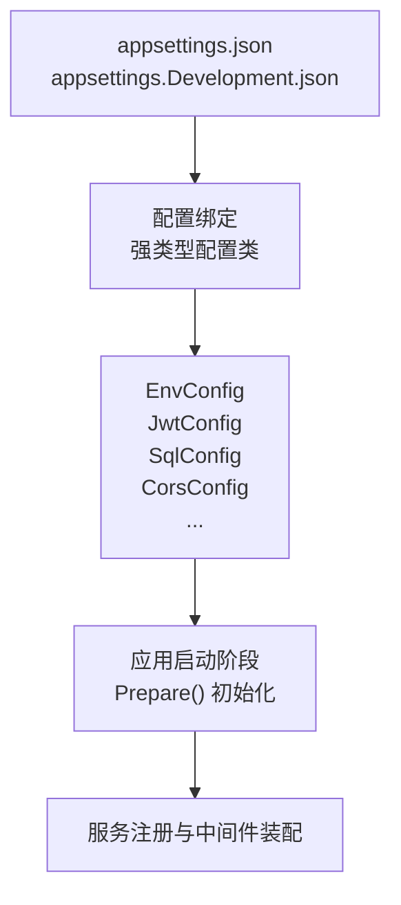
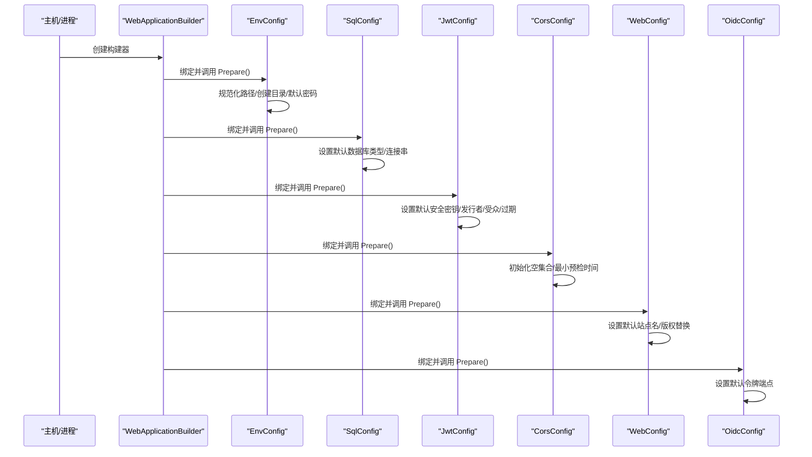
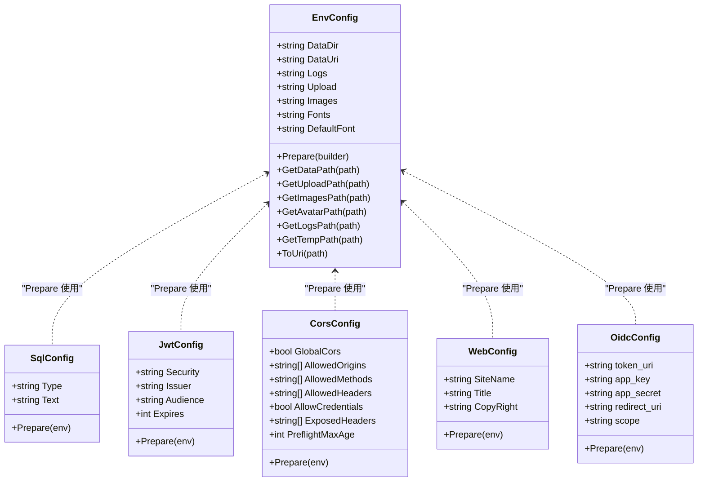

# 配置管理系统

<cite>
**本文引用的文件**
- [appsettings.json](file://Scm.Net/appsettings.json)
- [appsettings.Development.json](file://Scm.Net/appsettings.Development.json)
- [EnvConfig.cs](file://Scm.Server/Config/EnvConfig.cs)
- [JwtConfig.cs](file://Scm.Server/Config/JwtConfig.cs)
- [SecurityConfig.cs](file://Scm.Server/Config/SecurityConfig.cs)
- [DataConfig.cs](file://Scm.Server/Config/DataConfig.cs)
- [SqlConfig.cs](file://Scm.Server/Config/SqlConfig.cs)
- [CorsConfig.cs](file://Scm.Server/Config/CorsConfig.cs)
- [KestrelConfig.cs](file://Scm.Server/Config/KestrelConfig.cs)
- [WebConfig.cs](file://Scm.Server/Config/WebConfig.cs)
- [OidcConfig.cs](file://Scm.Server/Config/OidcConfig.cs)
- [LogConfig.cs](file://Scm.Server/Config/LogConfig.cs)
- [DllConfig.cs](file://Scm.Server/Config/DllConfig.cs)
</cite>

## 目录
1. [简介](#简介)
2. [项目结构](#项目结构)
3. [核心组件](#核心组件)
4. [架构总览](#架构总览)
5. [详细组件分析](#详细组件分析)
6. [依赖关系分析](#依赖关系分析)
7. [性能考量](#性能考量)
8. [故障排查指南](#故障排查指南)
9. [结论](#结论)
10. [附录](#附录)

## 简介
本文件面向 Scm.Net 配置管理系统，系统性阐述配置接口设计、环境配置管理与动态配置更新机制。重点覆盖数据库配置、缓存配置、安全配置、JWT 配置、跨域配置、Web 站点配置、OIDC 配置、日志配置以及项目 DLL 配置等模块。文档提供配置项作用说明、默认值与取值范围、配置文件结构与加载顺序、配置验证策略、热更新注意事项与安全建议，并总结最佳实践与常见问题处理方案。

## 项目结构
Scm.Net 的配置体系由两部分组成：
- 运行时配置文件：基于 ASP.NET Core 的 appsettings.json 与环境特定配置（如 appsettings.Development.json），用于定义运行期参数（数据库连接、缓存、JWT、跨域、站点元信息、OIDC、邮件、生成器等）。
- 运行时配置类：在 Scm.Server/Config 下定义的强类型配置类（如 EnvConfig、JwtConfig、SqlConfig 等），负责将配置文件映射到对象模型，并提供默认值校验与准备逻辑。

图表来源
- [appsettings.json:1-127](file://Scm.Net/appsettings.json#L1-L127)
- [appsettings.Development.json:1-162](file://Scm.Net/appsettings.Development.json#L1-L162)
- [EnvConfig.cs:72-102](file://Scm.Server/Config/EnvConfig.cs#L72-L102)
- [JwtConfig.cs:28-47](file://Scm.Server/Config/JwtConfig.cs#L28-L47)
- [SqlConfig.cs:10-20](file://Scm.Server/Config/SqlConfig.cs#L10-L20)
- [CorsConfig.cs:24-46](file://Scm.Server/Config/CorsConfig.cs#L24-L46)

章节来源
- [appsettings.json:1-127](file://Scm.Net/appsettings.json#L1-L127)
- [appsettings.Development.json:1-162](file://Scm.Net/appsettings.Development.json#L1-L162)

## 核心组件
本节对关键配置组件进行概览式说明，后续章节将逐项展开。

- 环境配置（EnvConfig）
  - 职责：解析并标准化数据目录、上传目录、图片目录、日志目录、字体目录等；提供路径拼接与默认密码生成能力。
  - 关键点：自动创建缺失目录；统一路径分隔符；支持相对/绝对路径；提供 ToUri 映射。

- 数据库配置（SqlConfig）
  - 职责：承载数据库类型与连接字符串；提供默认值保障。
  - 关键点：默认 SQLite 类型与默认数据库路径。

- 缓存配置（Redis/其他）
  - 职责：承载缓存类型与连接字符串；提供默认值保障。
  - 关键点：默认 Redis 连接参数。

- 安全配置（SecurityConfig）
  - 职责：承载应用密钥与签名检查开关等；预留扩展点。
  - 关键点：当前未做默认值处理，需由部署方显式配置。

- JWT 配置（JwtConfig）
  - 职责：承载安全密钥、发行者、受众、过期时间；提供默认值与校验。
  - 关键点：默认安全密钥、发行者、受众、过期时间（分钟）。

- 跨域配置（CorsConfig）
  - 职责：承载全局跨域策略、允许来源、方法、头、凭据等；提供默认值与边界校验。
  - 关键点：空数组初始化与最小预检缓存时间。

- Web 站点配置（WebConfig）
  - 职责：承载站点名称、标题、关键字、版权等；提供默认值与版权年份替换。
  - 关键点：版权信息默认模板与年份替换。

- OIDC 配置（OidcConfig）
  - 职责：承载 OIDC 接入参数（应用密钥、重定向地址、作用域等）；提供默认令牌端点。
  - 关键点：默认令牌端点与空值兜底。

- 日志配置（LogConfig）
  - 职责：作为日志配置命名空间占位；实际日志配置由 appsettings 中的 Serilog 段落驱动。
  - 关键点：日志配置通过 appsettings 的 Serilog 段落生效。

- 项目 DLL 配置（DllConfig）
  - 职责：承载项目依赖的服务 DLL 列表与根目录；提供根目录默认值。
  - 关键点：根目录默认取 ContentRootPath。

章节来源
- [EnvConfig.cs:1-280](file://Scm.Server/Config/EnvConfig.cs#L1-L280)
- [SqlConfig.cs:1-23](file://Scm.Server/Config/SqlConfig.cs#L1-L23)
- [CorsConfig.cs:1-49](file://Scm.Server/Config/CorsConfig.cs#L1-L49)
- [WebConfig.cs:1-68](file://Scm.Server/Config/WebConfig.cs#L1-L68)
- [OidcConfig.cs:1-24](file://Scm.Server/Config/OidcConfig.cs#L1-L24)
- [LogConfig.cs:1-8](file://Scm.Server/Config/LogConfig.cs#L1-L8)
- [DllConfig.cs:1-27](file://Scm.Server/Config/DllConfig.cs#L1-L27)

## 架构总览
下图展示配置从 JSON 到强类型对象的映射流程，以及各配置类在应用启动阶段的准备逻辑。

图表来源
- [EnvConfig.cs:72-102](file://Scm.Server/Config/EnvConfig.cs#L72-L102)
- [SqlConfig.cs:10-20](file://Scm.Server/Config/SqlConfig.cs#L10-L20)
- [JwtConfig.cs:28-47](file://Scm.Server/Config/JwtConfig.cs#L28-L47)
- [CorsConfig.cs:24-46](file://Scm.Server/Config/CorsConfig.cs#L24-L46)
- [WebConfig.cs:56-65](file://Scm.Server/Config/WebConfig.cs#L56-L65)
- [OidcConfig.cs:17-23](file://Scm.Server/Config/OidcConfig.cs#L17-L23)

## 详细组件分析

### 环境配置（EnvConfig）
- 职责与行为
  - 解析 DataDir 并确保末尾无分隔符；按需创建目录。
  - 将 Upload、Images、Avatar、Logs、Temp、Fonts 等子目录规范化为绝对路径并创建。
  - 提供 GetDataPath/GetUploadPath/GetImagesPath/GetAvatarPath/GetLogsPath/GetTempPath 等路径拼接工具。
  - 默认密码模式支持“固定”和“随机”，默认固定密码来自系统常量。
  - 提供 ToUri 将物理路径映射为对外访问 URI。
  - 提供同步/异步的文件读写辅助方法。

- 关键点
  - 路径处理统一使用系统分隔符转换与组合。
  - 目录不存在时自动创建。
  - 默认密码非随机时回退到系统默认值。

章节来源
- [EnvConfig.cs:104-120](file://Scm.Server/Config/EnvConfig.cs#L104-L120)
- [EnvConfig.cs:123-171](file://Scm.Server/Config/EnvConfig.cs#L123-L171)
- [EnvConfig.cs:174-177](file://Scm.Server/Config/EnvConfig.cs#L174-L177)
- [EnvConfig.cs:180-263](file://Scm.Server/Config/EnvConfig.cs#L180-L263)
- [EnvConfig.cs:266-277](file://Scm.Server/Config/EnvConfig.cs#L266-L277)

### 数据库配置（SqlConfig）
- 职责与行为
  - 读取数据库类型与连接字符串。
  - 若为空则设置默认 SQLite 类型与默认数据库路径。

- 关键点
  - 默认类型与默认连接串均在 Prepare 中设定，避免空值导致初始化失败。

章节来源
- [SqlConfig.cs:10-20](file://Scm.Server/Config/SqlConfig.cs#L10-L20)

### 缓存配置（Cache）
- 来源与职责
  - 缓存配置来源于 appsettings 的 Cache 节点，类型为 Redis，默认连接参数已内置。
  - 缓存配置类位于 Scm.Cache 项目中，提供 ICacheConfig 与 ICacheService 接口契约，具体实现由上层服务装配。

- 关键点
  - 生产环境建议使用独立 Redis 实例并开启认证与网络隔离。
  - 连接参数中的数据库索引、池大小等应结合业务并发调整。

章节来源
- [appsettings.json:57-60](file://Scm.Net/appsettings.json#L57-L60)
- [appsettings.Development.json:57-59](file://Scm.Net/appsettings.Development.json#L57-L59)

### 安全配置（SecurityConfig）
- 职责与行为
  - 承载应用密钥、签名密钥、AES/DES 密钥等字段；提供是否强制校验与是否限制 IP 的开关。
  - 当前 Prepare 未做默认值处理，需由部署方显式配置。

- 关键点
  - 密钥字段在开发环境示例中留空，生产环境必须配置真实密钥。
  - 建议启用签名校验与应用白名单以提升安全性。

章节来源
- [SecurityConfig.cs:1-44](file://Scm.Server/Config/SecurityConfig.cs#L1-L44)
- [appsettings.json:106-111](file://Scm.Net/appsettings.json#L106-L111)
- [appsettings.Development.json:118-123](file://Scm.Net/appsettings.Development.json#L118-L123)

### JWT 配置（JwtConfig）
- 职责与行为
  - 承载安全密钥、发行者、受众、过期时间（分钟）。
  - Prepare 中对空值进行默认填充，并对过期时间进行最小值校验。

- 关键点
  - 安全密钥在开发示例中已给出固定值，生产环境必须替换为强随机密钥。
  - 过期时间建议根据业务会话策略设置，避免过长或过短。

章节来源
- [JwtConfig.cs:1-48](file://Scm.Server/Config/JwtConfig.cs#L1-L48)
- [appsettings.json:100-105](file://Scm.Net/appsettings.json#L100-L105)
- [appsettings.Development.json:112-117](file://Scm.Net/appsettings.Development.json#L112-L117)

### 跨域配置（CorsConfig）
- 职责与行为
  - 承载全局跨域开关、允许来源、方法、头、凭据、暴露头与预检缓存时间。
  - Prepare 中对空集合进行初始化，并保证预检缓存时间不小于最小值。

- 关键点
  - 开发环境可放宽来源与方法，生产环境建议精确限定来源与方法。
  - AllowCredentials 与暴露头需谨慎使用，避免泄露敏感响应头。

章节来源
- [CorsConfig.cs:1-49](file://Scm.Server/Config/CorsConfig.cs#L1-L49)
- [appsettings.json:115-126](file://Scm.Net/appsettings.json#L115-L126)
- [appsettings.Development.json:127-138](file://Scm.Net/appsettings.Development.json#L127-L138)

### Web 站点配置（WebConfig）
- 职责与行为
  - 承载站点名称、标题、关键字、描述、版权、备案、外部样式与脚本等。
  - Prepare 中若站点名称为空则设置默认值，并对版权信息进行年份替换。

- 关键点
  - 版权信息支持模板变量替换，便于动态生成当前年份。
  - 站点元信息建议与前端展示保持一致。

章节来源
- [WebConfig.cs:1-68](file://Scm.Server/Config/WebConfig.cs#L1-L68)
- [appsettings.json:112-114](file://Scm.Net/appsettings.json#L112-L114)

### OIDC 配置（OidcConfig）
- 职责与行为
  - 承载 OIDC 接入参数：应用标识、密钥、重定向地址、作用域等。
  - Prepare 中为令牌端点提供默认值，避免空指针。

- 关键点
  - 生产环境需正确配置 app_key、app_secret、redirect_uri 与 scope。
  - 默认令牌端点仅适用于演示场景，需按实际 OIDC 提供商调整。

章节来源
- [OidcConfig.cs:1-24](file://Scm.Server/Config/OidcConfig.cs#L1-L24)
- [appsettings.json:76-81](file://Scm.Net/appsettings.json#L76-L81)
- [appsettings.Development.json:68-73](file://Scm.Net/appsettings.Development.json#L68-L73)

### 日志配置（LogConfig 与 appsettings 中的 Serilog）
- 职责与行为
  - LogConfig 作为命名空间占位；实际日志配置由 appsettings 中的 Serilog 段落驱动。
  - appsettings 中定义了最小日志级别、输出到控制台与文件、滚动策略等。

- 关键点
  - 生产环境建议降低最小日志级别并启用文件滚动，避免磁盘占用过大。
  - 控制台输出仅适合开发调试，生产环境应关闭或限制。

章节来源
- [LogConfig.cs:1-8](file://Scm.Server/Config/LogConfig.cs#L1-L8)
- [appsettings.json:3-25](file://Scm.Net/appsettings.json#L3-L25)
- [appsettings.Development.json:3-25](file://Scm.Net/appsettings.Development.json#L3-L25)

### 项目 DLL 配置（DllConfig）
- 职责与行为
  - 承载项目依赖的服务 DLL 列表与根目录；根目录默认取 ContentRootPath。
  - Prepare 中完成根目录赋值。

- 关键点
  - 服务列表决定运行时加载的模块范围，需与实际编译产物一致。

章节来源
- [DllConfig.cs:1-27](file://Scm.Server/Config/DllConfig.cs#L1-L27)
- [appsettings.json:112-114](file://Scm.Net/appsettings.json#L112-L114)
- [appsettings.Development.json:124-126](file://Scm.Net/appsettings.Development.json#L124-L126)

### Kestrel 配置（KestrelConfig）
- 职责与行为
  - 承载 Kestrel 端点与限制配置（URL、并发连接数上限、请求体大小等）。
  - 该类为配置模型，实际绑定与装配由 ASP.NET Core 完成。

- 关键点
  - 生产环境建议限制 MaxRequestBodySize 并合理设置并发连接数上限。
  - 端口与监听地址需与部署环境一致。

章节来源
- [KestrelConfig.cs:1-24](file://Scm.Server/Config/KestrelConfig.cs#L1-L24)
- [appsettings.json:26-38](file://Scm.Net/appsettings.json#L26-L38)
- [appsettings.Development.json:26-38](file://Scm.Net/appsettings.Development.json#L26-L38)

## 依赖关系分析
配置组件之间的依赖主要体现在“准备阶段”的调用链与数据传递上。

图表来源
- [EnvConfig.cs:72-102](file://Scm.Server/Config/EnvConfig.cs#L72-L102)
- [SqlConfig.cs:10-20](file://Scm.Server/Config/SqlConfig.cs#L10-L20)
- [JwtConfig.cs:28-47](file://Scm.Server/Config/JwtConfig.cs#L28-L47)
- [CorsConfig.cs:24-46](file://Scm.Server/Config/CorsConfig.cs#L24-L46)
- [WebConfig.cs:56-65](file://Scm.Server/Config/WebConfig.cs#L56-L65)
- [OidcConfig.cs:17-23](file://Scm.Server/Config/OidcConfig.cs#L17-L23)

## 性能考量
- 数据库连接
  - 合理设置连接字符串与池大小，避免连接泄漏与抖动。
  - 对于高并发场景，建议使用专用数据库实例并开启连接池优化。

- 缓存
  - Redis 连接池大小与数据库索引需与业务吞吐匹配。
  - 缓存键命名规范与过期策略影响命中率与内存占用。

- 日志
  - 生产环境建议降低最小日志级别并启用文件滚动，避免频繁 IO。
  - 控制台输出仅限开发环境，生产环境应关闭。

- Kestrel
  - 合理设置 MaxRequestBodySize 与并发连接上限，避免资源耗尽。
  - 监听地址与端口需与反向代理/负载均衡配置一致。

## 故障排查指南
- 配置未生效
  - 检查 appsettings.json 与环境特定配置文件是否存在拼写错误或缩进问题。
  - 确认配置节点名称与强类型类属性一致，且属性具备公共 setter。

- 路径异常
  - EnvConfig 在 Prepare 阶段会自动创建目录，若仍报错，检查 DataDir 与子目录权限。
  - 使用 GetDataPath/GetUploadPath 等方法确认路径拼接是否符合预期。

- JWT 登录失败
  - 确认 Security、Issuer、Audience、Expires 已正确配置且未被 Prepare 覆盖为默认值。
  - 检查客户端与服务端的密钥、发行者、受众与过期时间一致。

- 跨域请求被拒绝
  - 检查 AllowedOrigins/AllowedMethods/AllowedHeaders 是否与前端请求一致。
  - 确认 AllowCredentials 与暴露头配置是否满足前端需求。

- OIDC 回调失败
  - 检查 app_key、app_secret、redirect_uri、scope 是否正确。
  - 确认 token_uri 与 OIDC 提供商一致。

- 日志无输出
  - 检查 appsettings 中 Serilog 的最小日志级别与输出配置。
  - 确认日志文件路径存在且有写入权限。

章节来源
- [EnvConfig.cs:72-102](file://Scm.Server/Config/EnvConfig.cs#L72-L102)
- [JwtConfig.cs:28-47](file://Scm.Server/Config/JwtConfig.cs#L28-L47)
- [CorsConfig.cs:24-46](file://Scm.Server/Config/CorsConfig.cs#L24-L46)
- [OidcConfig.cs:17-23](file://Scm.Server/Config/OidcConfig.cs#L17-L23)
- [appsettings.json:3-25](file://Scm.Net/appsettings.json#L3-L25)

## 结论
Scm.Net 的配置系统采用“JSON 配置 + 强类型配置类”的双层设计：前者提供灵活的运行时参数，后者负责默认值校验与准备逻辑。通过在启动阶段集中调用各配置类的 Prepare 方法，系统实现了环境适配、路径规范化、默认值填充与边界校验。建议在生产环境中严格配置密钥与敏感参数，审慎开放跨域与凭据，合理设置数据库与缓存参数，并完善日志与监控策略。

## 附录

### 配置文件结构与加载顺序
- 加载顺序
  - 默认配置：appsettings.json
  - 环境特定配置：appsettings.{Environment}.json（如 Development）
  - 环境变量覆盖（由 ASP.NET Core 提供）
  - 命令行参数覆盖（由 ASP.NET Core 提供）

- 关键节点说明
  - Serilog：日志最小级别、输出目标（控制台/文件）、滚动策略。
  - Kestrel：端点 URL、并发连接上限、请求体大小限制。
  - Env：数据目录、上传/图片/日志/字体等子目录与默认字体。
  - Sql：数据库类型与连接字符串。
  - Cache：缓存类型与连接字符串。
  - Jwt：安全密钥、发行者、受众、过期时间。
  - Security：应用密钥、签名密钥、AES/DES 密钥、校验与限制开关。
  - Cors：全局跨域策略、允许来源/方法/头、凭据、暴露头、预检缓存。
  - Web：站点名称、标题、关键字、描述、版权、备案、外部样式与脚本。
  - Oidc：应用标识、密钥、重定向地址、作用域、令牌端点。
  - Project：服务 DLL 列表与根目录。

章节来源
- [appsettings.json:1-127](file://Scm.Net/appsettings.json#L1-L127)
- [appsettings.Development.json:1-162](file://Scm.Net/appsettings.Development.json#L1-L162)

### 配置验证与热更新
- 验证策略
  - 各配置类在 Prepare 中进行默认值填充与边界校验，避免空值导致初始化失败。
  - 建议在应用启动时进行一次配置校验，输出关键配置摘要。

- 热更新建议
  - 对于日志、跨域、站点元信息等非关键配置，可在运行时通过重新绑定与刷新策略实现平滑更新。
  - 对于数据库、缓存、JWT、安全等关键配置，建议通过重启服务或灰度发布方式更新，避免会话中断与密钥泄露风险。

### 最佳实践
- 安全
  - 生产环境必须配置真实密钥与证书，避免使用示例值。
  - 严格限制跨域来源与方法，谨慎启用 AllowCredentials。
  - 对敏感参数使用环境变量或密钥管理服务注入。

- 性能
  - 合理设置数据库与缓存连接参数，监控连接池使用情况。
  - 控制日志级别与输出目标，避免过度 IO。

- 可维护性
  - 将环境差异参数放入 appsettings.{Environment}.json，减少主配置复杂度。
  - 对关键配置添加注释与变更记录，便于审计与回滚。