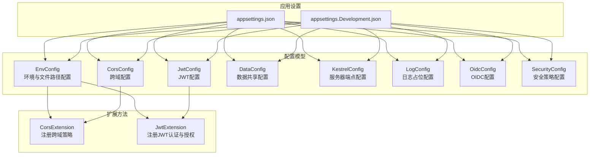
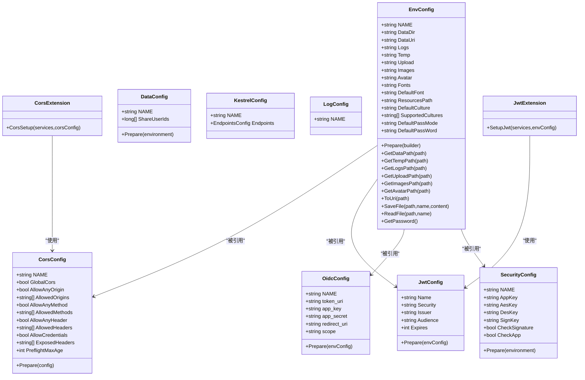
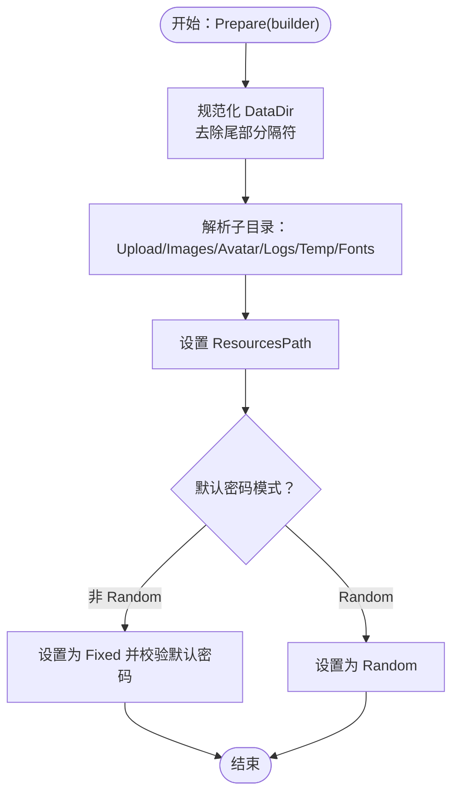
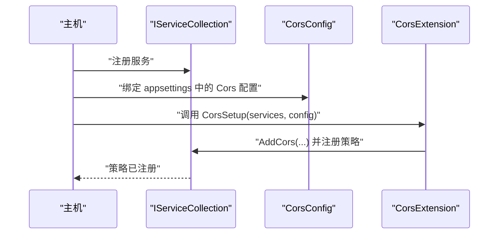
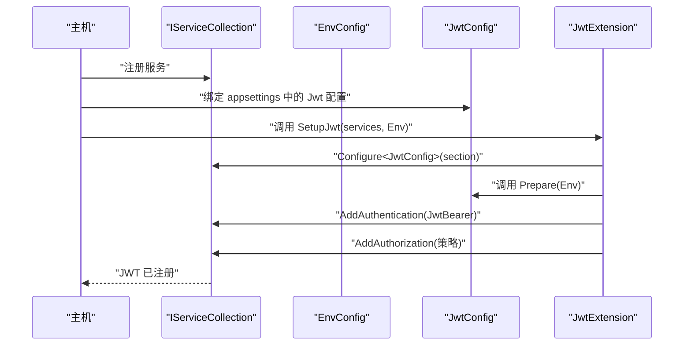
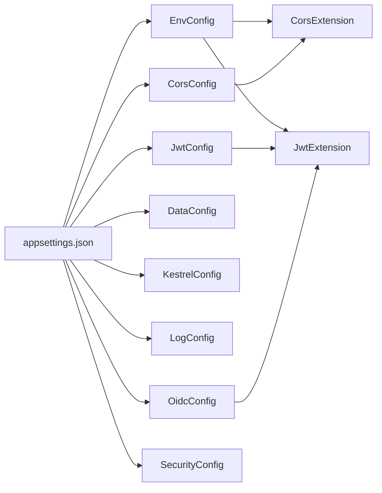

# 配置系统架构

<cite>
**本文引用的文件**
- [Scm.Server/Config/EnvConfig.cs](file://Scm.Server/Config/EnvConfig.cs)
- [Scm.Server/Config/CorsConfig.cs](file://Scm.Server/Config/CorsConfig.cs)
- [Scm.Server/Config/JwtConfig.cs](file://Scm.Server/Config/JwtConfig.cs)
- [Scm.Server/Config/DataConfig.cs](file://Scm.Server/Config/DataConfig.cs)
- [Scm.Server/Config/KestrelConfig.cs](file://Scm.Server/Config/KestrelConfig.cs)
- [Scm.Server/Config/LogConfig.cs](file://Scm.Server/Config/LogConfig.cs)
- [Scm.Server/Config/OidcConfig.cs](file://Scm.Server/Config/OidcConfig.cs)
- [Scm.Server/Config/SecurityConfig.cs](file://Scm.Server/Config/SecurityConfig.cs)
- [Scm.Server/Extensions/CorsExtension.cs](file://Scm.Server/Extensions/CorsExtension.cs)
- [Scm.Server/Extensions/JwtExtension.cs](file://Scm.Server/Extensions/JwtExtension.cs)
- [Scm.Common/ScmEnv.cs](file://Scm.Common/ScmEnv.cs)
- [Scm.Common/Utils/CommonUtils.cs](file://Scm.Common/Utils/CommonUtils.cs)
- [Scm.Net/appsettings.json](file://Scm.Net/appsettings.json)
- [Scm.Net/appsettings.Development.json](file://Scm.Net/appsettings.Development.json)
</cite>

## 目录
1. [简介](#简介)
2. [项目结构](#项目结构)
3. [核心组件](#核心组件)
4. [架构总览](#架构总览)
5. [详细组件分析](#详细组件分析)
6. [依赖关系分析](#依赖关系分析)
7. [性能考量](#性能考量)
8. [故障排查指南](#故障排查指南)
9. [结论](#结论)
10. [附录](#附录)

## 简介
本文件面向 Scm.Net 的配置系统，系统性阐述其设计理念、整体架构与实现细节，重点覆盖以下方面：
- 配置接口设计模式与配置层次结构
- EnvConfig 作为基础配置类的作用与职责边界
- 配置加载机制与生命周期管理
- 配置验证与规范化流程
- 配置变更通知与扩展点
- 自定义配置类的实现指南与最佳实践

## 项目结构
配置系统主要由“配置模型 + 扩展方法 + 应用设置(appsettings)”三部分组成：
- 配置模型：位于 Scm.Server/Config 下，以独立类承载各模块配置项，统一提供 Prepare 方法进行校验与默认值填充
- 扩展方法：位于 Scm.Server/Extensions 下，负责将配置注入到服务容器并应用到运行时环境
- 应用设置：位于 Scm.Net 根目录，采用 JSON 结构按模块分层组织，键名与配置类常量 NAME 对应

图表来源
- [Scm.Server/Config/EnvConfig.cs:1-280](file://Scm.Server/Config/EnvConfig.cs#L1-L280)
- [Scm.Server/Config/CorsConfig.cs:1-49](file://Scm.Server/Config/CorsConfig.cs#L1-L49)
- [Scm.Server/Config/JwtConfig.cs:1-48](file://Scm.Server/Config/JwtConfig.cs#L1-L48)
- [Scm.Server/Config/DataConfig.cs:1-24](file://Scm.Server/Config/DataConfig.cs#L1-L24)
- [Scm.Server/Config/KestrelConfig.cs:1-24](file://Scm.Server/Config/KestrelConfig.cs#L1-L24)
- [Scm.Server/Config/LogConfig.cs:1-8](file://Scm.Server/Config/LogConfig.cs#L1-L8)
- [Scm.Server/Config/OidcConfig.cs:1-24](file://Scm.Server/Config/OidcConfig.cs#L1-L24)
- [Scm.Server/Config/SecurityConfig.cs:1-44](file://Scm.Server/Config/SecurityConfig.cs#L1-L44)
- [Scm.Server/Extensions/CorsExtension.cs:1-59](file://Scm.Server/Extensions/CorsExtension.cs#L1-L59)
- [Scm.Server/Extensions/JwtExtension.cs:1-73](file://Scm.Server/Extensions/JwtExtension.cs#L1-L73)
- [Scm.Net/appsettings.json:1-127](file://Scm.Net/appsettings.json#L1-L127)
- [Scm.Net/appsettings.Development.json:1-162](file://Scm.Net/appsettings.Development.json#L1-L162)

章节来源
- [Scm.Server/Config/EnvConfig.cs:1-280](file://Scm.Server/Config/EnvConfig.cs#L1-L280)
- [Scm.Server/Config/CorsConfig.cs:1-49](file://Scm.Server/Config/CorsConfig.cs#L1-L49)
- [Scm.Server/Config/JwtConfig.cs:1-48](file://Scm.Server/Config/JwtConfig.cs#L1-L48)
- [Scm.Server/Config/DataConfig.cs:1-24](file://Scm.Server/Config/DataConfig.cs#L1-L24)
- [Scm.Server/Config/KestrelConfig.cs:1-24](file://Scm.Server/Config/KestrelConfig.cs#L1-L24)
- [Scm.Server/Config/LogConfig.cs:1-8](file://Scm.Server/Config/LogConfig.cs#L1-L8)
- [Scm.Server/Config/OidcConfig.cs:1-24](file://Scm.Server/Config/OidcConfig.cs#L1-L24)
- [Scm.Server/Config/SecurityConfig.cs:1-44](file://Scm.Server/Config/SecurityConfig.cs#L1-L44)
- [Scm.Server/Extensions/CorsExtension.cs:1-59](file://Scm.Server/Extensions/CorsExtension.cs#L1-L59)
- [Scm.Server/Extensions/JwtExtension.cs:1-73](file://Scm.Server/Extensions/JwtExtension.cs#L1-L73)
- [Scm.Net/appsettings.json:1-127](file://Scm.Net/appsettings.json#L1-L127)
- [Scm.Net/appsettings.Development.json:1-162](file://Scm.Net/appsettings.Development.json#L1-L162)

## 核心组件
- EnvConfig：环境与数据目录配置的核心类，负责计算并标准化数据目录、上传、图片、日志、临时、字体等路径，提供路径拼接、URI 映射、文件读写与默认密码生成等能力
- 各模块配置类：以“NAME 常量 + 属性 + Prepare 方法”的模式组织，分别处理跨域、JWT、数据共享、Kestrel、日志、OIDC、安全等配置
- 扩展方法：将配置类注册到服务容器，并在运行时生效，例如 CORS 策略注册、JWT 认证与授权策略配置
- 应用设置：JSON 配置文件按模块分层，键名与配置类 NAME 常量保持一致，便于自动绑定

章节来源
- [Scm.Server/Config/EnvConfig.cs:1-280](file://Scm.Server/Config/EnvConfig.cs#L1-L280)
- [Scm.Server/Config/CorsConfig.cs:1-49](file://Scm.Server/Config/CorsConfig.cs#L1-L49)
- [Scm.Server/Config/JwtConfig.cs:1-48](file://Scm.Server/Config/JwtConfig.cs#L1-L48)
- [Scm.Server/Config/DataConfig.cs:1-24](file://Scm.Server/Config/DataConfig.cs#L1-L24)
- [Scm.Server/Config/KestrelConfig.cs:1-24](file://Scm.Server/Config/KestrelConfig.cs#L1-L24)
- [Scm.Server/Config/LogConfig.cs:1-8](file://Scm.Server/Config/LogConfig.cs#L1-L8)
- [Scm.Server/Config/OidcConfig.cs:1-24](file://Scm.Server/Config/OidcConfig.cs#L1-L24)
- [Scm.Server/Config/SecurityConfig.cs:1-44](file://Scm.Server/Config/SecurityConfig.cs#L1-L44)
- [Scm.Server/Extensions/CorsExtension.cs:1-59](file://Scm.Server/Extensions/CorsExtension.cs#L1-L59)
- [Scm.Server/Extensions/JwtExtension.cs:1-73](file://Scm.Server/Extensions/JwtExtension.cs#L1-L73)
- [Scm.Net/appsettings.json:1-127](file://Scm.Net/appsettings.json#L1-L127)
- [Scm.Net/appsettings.Development.json:1-162](file://Scm.Net/appsettings.Development.json#L1-L162)

## 架构总览
配置系统遵循“配置模型 + 扩展方法 + 应用设置”的分层架构：
- 配置模型：以独立类承载配置项，统一提供 Prepare 方法完成校验与默认值填充
- 扩展方法：负责将配置注入到服务容器并应用到运行时环境
- 应用设置：JSON 配置文件按模块分层，键名与配置类 NAME 常量对应，便于自动绑定

图表来源
- [Scm.Server/Config/EnvConfig.cs:1-280](file://Scm.Server/Config/EnvConfig.cs#L1-L280)
- [Scm.Server/Config/CorsConfig.cs:1-49](file://Scm.Server/Config/CorsConfig.cs#L1-L49)
- [Scm.Server/Config/JwtConfig.cs:1-48](file://Scm.Server/Config/JwtConfig.cs#L1-L48)
- [Scm.Server/Config/DataConfig.cs:1-24](file://Scm.Server/Config/DataConfig.cs#L1-L24)
- [Scm.Server/Config/KestrelConfig.cs:1-24](file://Scm.Server/Config/KestrelConfig.cs#L1-L24)
- [Scm.Server/Config/LogConfig.cs:1-8](file://Scm.Server/Config/LogConfig.cs#L1-L8)
- [Scm.Server/Config/OidcConfig.cs:1-24](file://Scm.Server/Config/OidcConfig.cs#L1-L24)
- [Scm.Server/Config/SecurityConfig.cs:1-44](file://Scm.Server/Config/SecurityConfig.cs#L1-L44)
- [Scm.Server/Extensions/CorsExtension.cs:1-59](file://Scm.Server/Extensions/CorsExtension.cs#L1-L59)
- [Scm.Server/Extensions/JwtExtension.cs:1-73](file://Scm.Server/Extensions/JwtExtension.cs#L1-L73)

## 详细组件分析

### EnvConfig：基础配置类与路径管理
- 设计要点
  - 以常量 NAME 标识模块名，属性涵盖数据目录、上传、图片、日志、临时、字体、资源路径、默认语言等
  - Prepare 在 WebApplicationBuilder 环境下执行，负责将相对路径解析为绝对路径、创建缺失目录、设置默认密码模式与默认密码
  - 提供路径拼接与 URI 映射方法，统一对外暴露数据目录访问接口
  - 提供文件读写与异步版本，确保 I/O 操作的健壮性
- 生命周期
  - 在应用启动阶段由扩展方法读取 appsettings 并绑定到 EnvConfig 实例，随后调用 Prepare 完成初始化
- 验证与默认值
  - 若未设置默认密码模式，则强制设为固定模式并填充默认密码；若未设置默认密码则使用全局默认值
- 变更通知
  - 该类本身不直接提供事件通知，但可通过扩展方法在 Prepare 后注册到服务容器，供其他组件订阅

图表来源
- [Scm.Server/Config/EnvConfig.cs:72-102](file://Scm.Server/Config/EnvConfig.cs#L72-L102)

章节来源
- [Scm.Server/Config/EnvConfig.cs:1-280](file://Scm.Server/Config/EnvConfig.cs#L1-L280)
- [Scm.Common/ScmEnv.cs:1-45](file://Scm.Common/ScmEnv.cs#L1-L45)

### 跨域配置：CorsConfig 与 CorsExtension
- 设计要点
  - CorsConfig 提供 Origin、Method、Header、Credentials、ExposedHeaders、PreflightMaxAge 等配置项，并在 Prepare 中对空数组与最小值进行规范化
  - CorsExtension 将配置应用到服务容器，构建 CORS 策略并注册到命名策略
- 生命周期
  - 在应用启动时，从 appsettings 读取配置并绑定到 CorsConfig，随后调用 CorsSetup 注册策略
- 验证与默认值
  - 对空集合与小于 1 的预检过期时间进行默认化处理，保证策略可用性

图表来源
- [Scm.Server/Config/CorsConfig.cs:24-46](file://Scm.Server/Config/CorsConfig.cs#L24-L46)
- [Scm.Server/Extensions/CorsExtension.cs:8-56](file://Scm.Server/Extensions/CorsExtension.cs#L8-L56)

章节来源
- [Scm.Server/Config/CorsConfig.cs:1-49](file://Scm.Server/Config/CorsConfig.cs#L1-L49)
- [Scm.Server/Extensions/CorsExtension.cs:1-59](file://Scm.Server/Extensions/CorsExtension.cs#L1-L59)

### JWT 配置：JwtConfig 与 JwtExtension
- 设计要点
  - JwtConfig 提供 Security、Issuer、Audience、Expires 等配置项，并在 Prepare 中进行默认值填充
  - JwtExtension 读取配置并注册 Authentication(JWT Bearer) 与 Authorization 策略
- 生命周期
  - 在应用启动时，从 appsettings 读取配置并绑定到 JwtConfig，随后调用 SetupJwt 完成认证与授权注册
- 验证与默认值
  - 对空字符串的安全密钥、发行者、受众与过期时间进行默认化处理，确保令牌验证参数有效

图表来源
- [Scm.Server/Config/JwtConfig.cs:28-47](file://Scm.Server/Config/JwtConfig.cs#L28-L47)
- [Scm.Server/Extensions/JwtExtension.cs:14-71](file://Scm.Server/Extensions/JwtExtension.cs#L14-L71)

章节来源
- [Scm.Server/Config/JwtConfig.cs:1-48](file://Scm.Server/Config/JwtConfig.cs#L1-L48)
- [Scm.Server/Extensions/JwtExtension.cs:1-73](file://Scm.Server/Extensions/JwtExtension.cs#L1-L73)

### OIDC 配置：OidcConfig
- 设计要点
  - OidcConfig 提供 token_uri、app_key、app_secret、redirect_uri、scope 等配置项，并在 Prepare 中对空的 token_uri 设置默认值
- 生命周期
  - 在应用启动时，从 appsettings 读取配置并绑定到 OidcConfig，随后调用 Prepare 完成默认值填充

章节来源
- [Scm.Server/Config/OidcConfig.cs:1-24](file://Scm.Server/Config/OidcConfig.cs#L1-L24)

### 安全配置：SecurityConfig
- 设计要点
  - SecurityConfig 提供 AppKey、AesKey、DesKey、SignKey、CheckSignature、CheckApp 等配置项，Prepare 留空以便后续扩展
- 生命周期
  - 在应用启动时，从 appsettings 读取配置并绑定到 SecurityConfig

章节来源
- [Scm.Server/Config/SecurityConfig.cs:1-44](file://Scm.Server/Config/SecurityConfig.cs#L1-L44)

### 数据共享配置：DataConfig
- 设计要点
  - DataConfig 提供 ShareUserIds 配置项，并在 Prepare 中确保至少包含系统用户 ID
- 生命周期
  - 在应用启动时，从 appsettings 读取配置并绑定到 DataConfig

章节来源
- [Scm.Server/Config/DataConfig.cs:1-24](file://Scm.Server/Config/DataConfig.cs#L1-L24)

### Kestrel 配置：KestrelConfig
- 设计要点
  - KestrelConfig 以嵌套类形式组织 Endpoints.Http.Url 等配置项，用于控制服务器监听地址与请求大小限制
- 生命周期
  - 在应用启动时，从 appsettings 读取配置并绑定到 KestrelConfig

章节来源
- [Scm.Server/Config/KestrelConfig.cs:1-24](file://Scm.Server/Config/KestrelConfig.cs#L1-L24)

### 日志配置：LogConfig
- 设计要点
  - LogConfig 作为日志模块的占位配置类，当前仅包含模块标识 NAME
- 生命周期
  - 在应用启动时，从 appsettings 读取配置并绑定到 LogConfig

章节来源
- [Scm.Server/Config/LogConfig.cs:1-8](file://Scm.Server/Config/LogConfig.cs#L1-L8)

## 依赖关系分析
- 配置模型之间的耦合度低，均通过 Prepare 方法进行本地化校验与默认值填充
- EnvConfig 作为基础设施类，被其他配置类引用（如在 Prepare 中传入），形成弱依赖
- 扩展方法与配置模型之间通过服务容器建立松耦合绑定关系
- 应用设置与配置模型之间通过键名与 NAME 常量保持强一致性

图表来源
- [Scm.Net/appsettings.json:1-127](file://Scm.Net/appsettings.json#L1-L127)
- [Scm.Server/Config/EnvConfig.cs:1-280](file://Scm.Server/Config/EnvConfig.cs#L1-L280)
- [Scm.Server/Config/CorsConfig.cs:1-49](file://Scm.Server/Config/CorsConfig.cs#L1-L49)
- [Scm.Server/Config/JwtConfig.cs:1-48](file://Scm.Server/Config/JwtConfig.cs#L1-L48)
- [Scm.Server/Config/DataConfig.cs:1-24](file://Scm.Server/Config/DataConfig.cs#L1-L24)
- [Scm.Server/Config/KestrelConfig.cs:1-24](file://Scm.Server/Config/KestrelConfig.cs#L1-L24)
- [Scm.Server/Config/LogConfig.cs:1-8](file://Scm.Server/Config/LogConfig.cs#L1-L8)
- [Scm.Server/Config/OidcConfig.cs:1-24](file://Scm.Server/Config/OidcConfig.cs#L1-L24)
- [Scm.Server/Config/SecurityConfig.cs:1-44](file://Scm.Server/Config/SecurityConfig.cs#L1-L44)
- [Scm.Server/Extensions/CorsExtension.cs:1-59](file://Scm.Server/Extensions/CorsExtension.cs#L1-L59)
- [Scm.Server/Extensions/JwtExtension.cs:1-73](file://Scm.Server/Extensions/JwtExtension.cs#L1-L73)

章节来源
- [Scm.Net/appsettings.json:1-127](file://Scm.Net/appsettings.json#L1-L127)
- [Scm.Net/appsettings.Development.json:1-162](file://Scm.Net/appsettings.Development.json#L1-L162)
- [Scm.Server/Config/EnvConfig.cs:1-280](file://Scm.Server/Config/EnvConfig.cs#L1-L280)
- [Scm.Server/Config/CorsConfig.cs:1-49](file://Scm.Server/Config/CorsConfig.cs#L1-L49)
- [Scm.Server/Config/JwtConfig.cs:1-48](file://Scm.Server/Config/JwtConfig.cs#L1-L48)
- [Scm.Server/Config/DataConfig.cs:1-24](file://Scm.Server/Config/DataConfig.cs#L1-L24)
- [Scm.Server/Config/KestrelConfig.cs:1-24](file://Scm.Server/Config/KestrelConfig.cs#L1-L24)
- [Scm.Server/Config/LogConfig.cs:1-8](file://Scm.Server/Config/LogConfig.cs#L1-L8)
- [Scm.Server/Config/OidcConfig.cs:1-24](file://Scm.Server/Config/OidcConfig.cs#L1-L24)
- [Scm.Server/Config/SecurityConfig.cs:1-44](file://Scm.Server/Config/SecurityConfig.cs#L1-L44)
- [Scm.Server/Extensions/CorsExtension.cs:1-59](file://Scm.Server/Extensions/CorsExtension.cs#L1-L59)
- [Scm.Server/Extensions/JwtExtension.cs:1-73](file://Scm.Server/Extensions/JwtExtension.cs#L1-L73)

## 性能考量
- 配置读取与绑定
  - 使用服务容器的 Configure/Get 绑定方式，避免重复解析 JSON，提升启动阶段性能
- 路径解析与 I/O
  - EnvConfig 在 Prepare 阶段完成路径解析与目录创建，减少运行时重复计算
  - 文件读写提供同步与异步版本，建议在高并发场景优先使用异步接口
- CORS 与 JWT
  - CORS 策略一次性注册，避免每次请求动态构建策略带来的开销
  - JWT 验证参数在启动阶段完成配置，运行时仅进行验证，降低验证成本
- 默认值与校验
  - Prepare 中的默认值填充与边界检查在启动阶段完成，避免运行时分支判断

## 故障排查指南
- 配置未生效
  - 检查 appsettings 中键名与配置类 NAME 常量是否一致
  - 确认扩展方法是否正确调用（如 CorsSetup、SetupJwt）
- 路径异常
  - 检查 EnvConfig.DataDir 与各子目录路径是否可写，确认 Prepare 是否成功创建目录
- JWT 认证失败
  - 核对 Issuer、Audience、Security 等参数是否与签发方一致
  - 检查 TokenValidationParameters 配置与请求头中令牌传递方式
- CORS 跨域失败
  - 核对 AllowedOrigins、AllowedMethods、AllowedHeaders 与 AllowCredentials 配置
  - 检查预检请求的 PreflightMaxAge 设置

章节来源
- [Scm.Server/Config/EnvConfig.cs:1-280](file://Scm.Server/Config/EnvConfig.cs#L1-L280)
- [Scm.Server/Config/CorsConfig.cs:1-49](file://Scm.Server/Config/CorsConfig.cs#L1-L49)
- [Scm.Server/Config/JwtConfig.cs:1-48](file://Scm.Server/Config/JwtConfig.cs#L1-L48)
- [Scm.Server/Extensions/CorsExtension.cs:1-59](file://Scm.Server/Extensions/CorsExtension.cs#L1-L59)
- [Scm.Server/Extensions/JwtExtension.cs:1-73](file://Scm.Server/Extensions/JwtExtension.cs#L1-L73)
- [Scm.Net/appsettings.json:1-127](file://Scm.Net/appsettings.json#L1-L127)
- [Scm.Net/appsettings.Development.json:1-162](file://Scm.Net/appsettings.Development.json#L1-L162)

## 结论
Scm.Net 的配置系统以“配置模型 + 扩展方法 + 应用设置”为核心架构，通过统一的 Prepare 模式完成配置验证与默认值填充，结合服务容器实现零样板代码的注入与应用。EnvConfig 作为基础设施类，承担了路径解析、文件 I/O 与默认密码生成等关键职责；各模块配置类以轻量级结构提供清晰的职责边界；扩展方法将配置落地到运行时环境，形成高内聚、低耦合的配置体系。

## 附录
- 自定义配置类实现指南
  - 定义 NAME 常量与配置属性
  - 实现 Prepare 方法，完成参数校验与默认值填充
  - 在扩展方法中读取配置并注册到服务容器
  - 在 appsettings 中添加对应键名，确保键名与 NAME 常量一致
- 最佳实践
  - 将敏感配置置于环境变量或专用密钥管理服务
  - 在开发与生产环境使用不同的 appsettings.*.json
  - 对路径与文件 I/O 操作进行异常捕获与日志记录
  - 对 CORS 与 JWT 参数进行最小权限原则配置