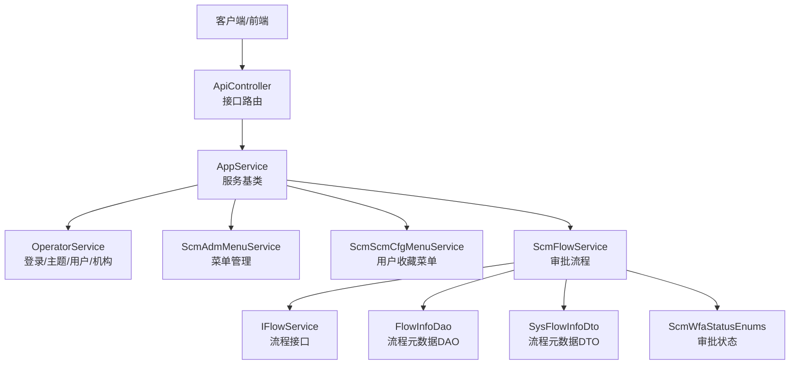
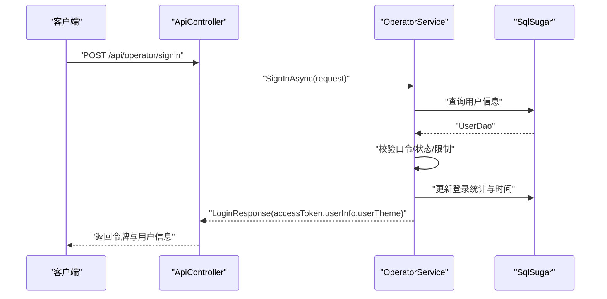
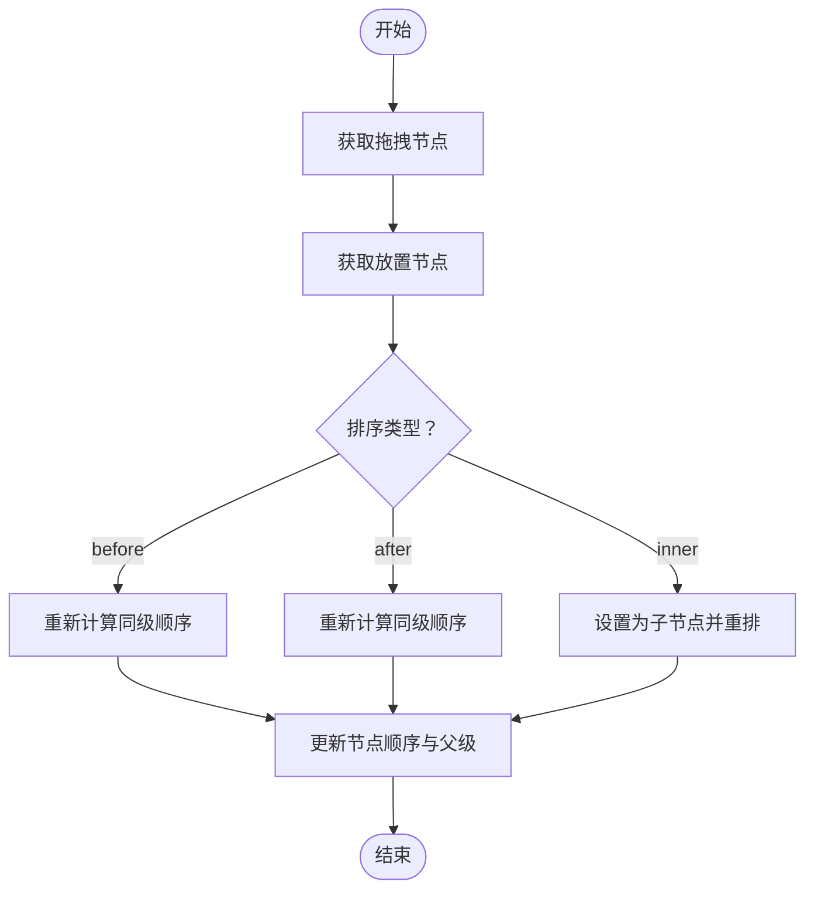
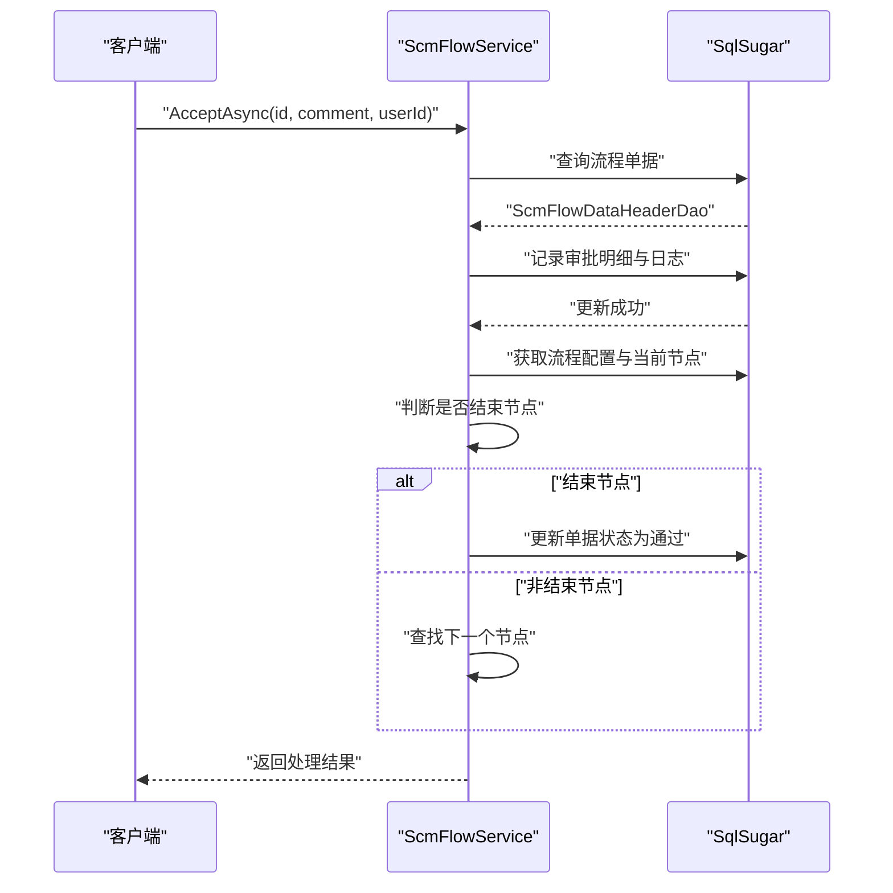
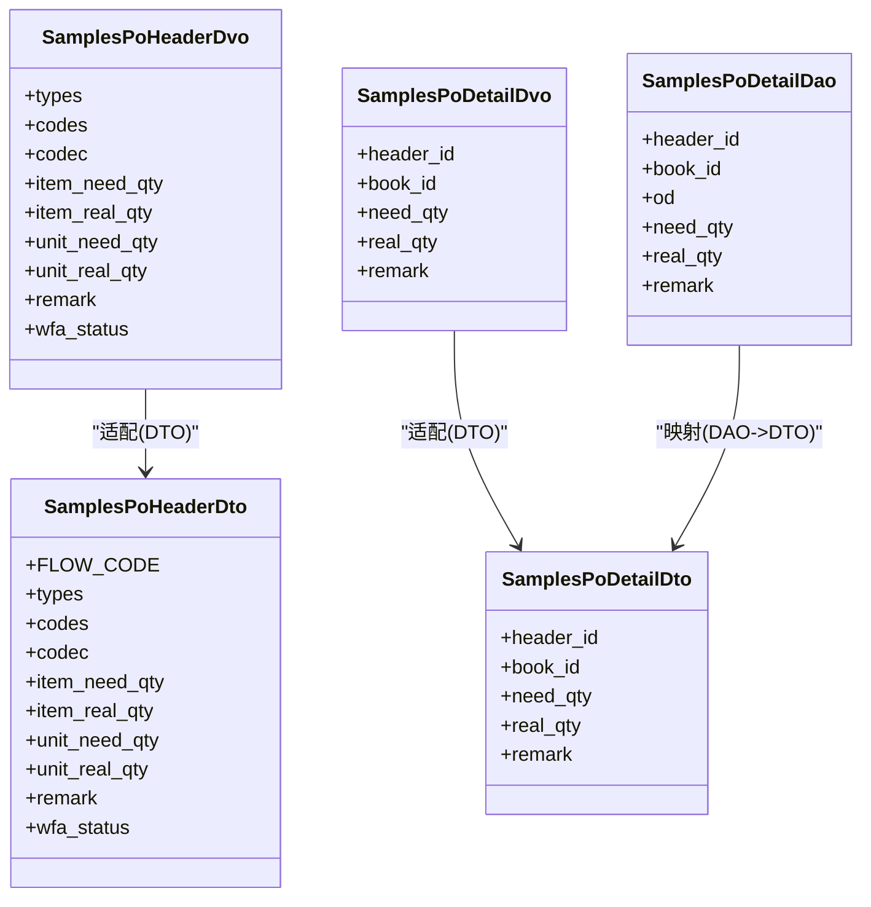
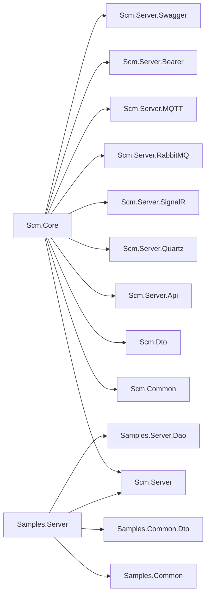

# 应用场景

<cite>
**本文引用的文件**
- [README.en.md](file://README.en.md)
- [Scm.Net/readme.txt](file://Scm.Net/readme.txt)
- [Scm.Net/data/about/Scm.Net/Site.txt](file://Scm.Net/data/about/Scm.Net/Site.txt)
- [Scm.Core/Scm.Core.csproj](file://Scm.Core/Scm.Core.csproj)
- [Scm.Server/Scm.Server.csproj](file://Scm.Server/Scm.Server.csproj)
- [Scm.Server.Api/Scm.Server.Api.csproj](file://Scm.Server.Api/Scm.Server.Api.csproj)
- [Scm.Server.Quartz/Scm.Server.Quartz.csproj](file://Scm.Server.Quartz/Scm.Server.Quartz.csproj)
- [Scm.Server.SignalR/Scm.Server.SignalR.csproj](file://Scm.Server.SignalR/Scm.Server.SignalR.csproj)
- [Scm.Server.Bearer/Scm.Server.Bearer.csproj](file://Scm.Server.Bearer/Scm.Server.Bearer.csproj)
- [Scm.Server.RabbitMQ/Scm.Server.RabbitMQ.csproj](file://Scm.Server.RabbitMQ/Scm.Server.RabbitMQ.csproj)
- [Scm.Server.MQTT/Scm.Server.MQTT.csproj](file://Scm.Server.MQTT/Scm.Server.MQTT.csproj)
- [Scm.Server.Swagger/Scm.Server.Swagger.csproj](file://Scm.Server.Swagger/Scm.Server.Swagger.csproj)
- [Scm.Server/Controllers/ApiController.cs](file://Scm.Server/Controllers/ApiController.cs)
- [Scm.Server/Service/AppService.cs](file://Scm.Server/Service/AppService.cs)
- [Scm.Core/Operator/OperatorService.cs](file://Scm.Core/Operator/OperatorService.cs)
- [Scm.Core/Adm/Menu/ScmAdmMenuService.cs](file://Scm.Core/Adm/Menu/ScmAdmMenuService.cs)
- [Scm.Core/Cfg/Menu/ScmScmCfgMenuService.cs](file://Scm.Core/Cfg/Menu/ScmScmCfgMenuService.cs)
- [Scm.Server/IFlowService.cs](file://Scm.Server/IFlowService.cs)
- [Scm.Dao/Sys/Workflow/FlowInfoDao.cs](file://Scm.Dao/Sys/Workflow/FlowInfoDao.cs)
- [Scm.Dto/Sys/Workflow/SysFlowInfoDto.cs](file://Scm.Dto/Sys/Workflow/SysFlowInfoDto.cs)
- [Scm.Server.Service/Service/ScmFlowService.cs](file://Scm.Server.Service/Service/ScmFlowService.cs)
- [Scm.Common/Enums/ScmWfaStatusEnums.cs](file://Scm.Common/Enums/ScmWfaStatusEnums.cs)
- [Samples.Server/Readme.txt](file://Samples.Server/Readme.txt)
- [Samples.Common/Readme.txt](file://Samples.Common/Readme.txt)
- [Samples.Server/PoHeader/Dvo/SamplesPoHeaderDvo.cs](file://Samples.Server/PoHeader/Dvo/SamplesPoHeaderDvo.cs)
- [Samples.Common.Dto/PoHeader/Dto/SamplesPoHeaderDto.cs](file://Samples.Common.Dto/PoHeader/Dto/SamplesPoHeaderDto.cs)
- [Samples.Server/PoDetail/Dvo/SamplesPoDetailDvo.cs](file://Samples.Server/PoDetail/Dvo/SamplesPoDetailDvo.cs)
- [Samples.Common.Dto/PoDetail/Dto/SamplesPoDetailDto.cs](file://Samples.Common.Dto/PoDetail/Dto/SamplesPoDetailDto.cs)
- [Samples.Server.Dao/PoDetail/Dao/SamplesPoDetailDao.cs](file://Samples.Server.Dao/PoDetail/Dao/SamplesPoDetailDao.cs)
</cite>

## 目录
1. [简介](#简介)
2. [项目结构](#项目结构)
3. [核心组件](#核心组件)
4. [架构总览](#架构总览)
5. [详细组件分析](#详细组件分析)
6. [依赖分析](#依赖分析)
7. [性能考虑](#性能考虑)
8. [故障排查指南](#故障排查指南)
9. [结论](#结论)
10. [附录](#附录)

## 简介
Scm.Net 是一款面向中后台管理系统的快速开发框架，基于 .NET 8/9 与 Vue 3 构建，提供统一的服务层、数据访问层、工作流引擎、认证授权、消息推送、定时任务、插件扩展等能力，适合在企业内部构建各类管理与业务系统。框架通过清晰的分层设计与丰富的示例模块（如“书籍管理”“采购订单管理”等），能够覆盖中后台管理、ERP、CRM、流程审批等多种应用场景。

- 项目定位与目标：快速搭建中后台管理系统，提供可复用的基础设施与示例业务。
- 技术栈：.NET 8/9、SqlSugar ORM、SignalR、Quartz、RabbitMQ/MQTT、Swagger、Vue 3 前端（示例）。
- 适用场景：中后台管理系统、企业资源规划（ERP）、客户关系管理（CRM）、工作流程管理（BPM）、审批流系统、资产管理、库存管理、财务与采购协同等。

章节来源
- [README.en.md:1-38](file://README.en.md#L1-L38)
- [Scm.Net/data/about/Scm.Net/Site.txt:1-5](file://Scm.Net/data/about/Scm.Net/Site.txt#L1-L5)

## 项目结构
Scm.Net 采用多项目分层组织，按职责划分为通用基础库、服务层、数据访问层、DTO 层、示例应用与示例服务等。核心工程如下：
- Scm.Common：通用工具、枚举、异常、安全与通用扩展。
- Scm.Dto：前后端交互 DTO 基类与常用请求/响应模型。
- Scm.Dao：数据访问基类与实体映射。
- Scm.Server：服务端通用能力（控制器基类、中间件、过滤器、缓存、JWT、Swagger 等）。
- Scm.Core：核心业务服务（操作员、菜单、配置、日志、消息、工作流等）。
- Scm.Server.Api：动态 Web API 能力，将服务暴露为接口。
- Scm.Server.Quartz/RabbitMQ/MQTT/SignalR：分布式与异步能力扩展。
- Samples.*：示例模块（书籍、采购订单等），演示业务建模与集成方式。

```mermaid
graph TB
subgraph "示例应用"
SamplesServer["Samples.Server<br/>示例服务层"]
SamplesCommon["Samples.Common<br/>示例公共库"]
SamplesDto["Samples.Common.Dto<br/>示例DTO"]
SamplesDao["Samples.Server.Dao<br/>示例DAO"]
end
subgraph "框架核心"
ScmCommon["Scm.Common<br/>通用工具/枚举/异常"]
ScmDto["Scm.Dto<br/>DTO/请求/响应"]
ScmDao["Scm.Dao<br/>DAO/实体映射"]
ScmServer["Scm.Server<br/>服务端通用能力"]
ScmCore["Scm.Core<br/>核心业务服务"]
ScmServerApi["Scm.Server.Api<br/>动态API"]
ScmServerQuartz["Scm.Server.Quartz<br/>定时任务"]
ScmServerSignalR["Scm.Server.SignalR<br/>消息推送"]
ScmServerRabbitMQ["Scm.Server.RabbitMQ<br/>消息队列"]
ScmServerMQTT["Scm.Server.MQTT<br/>MQTT"]
ScmServerBearer["Scm.Server.Bearer<br/>JWT认证"]
ScmServerSwagger["Scm.Server.Swagger<br/>接口文档"]
end
SamplesServer --> ScmServer
SamplesServer --> ScmServerApi
SamplesServer --> ScmDao
SamplesServer --> ScmDto
SamplesCommon --> ScmCommon
SamplesDto --> ScmDto
SamplesDao --> ScmDao
ScmCore --> ScmServer
ScmCore --> ScmServerApi
ScmCore --> ScmServerBearer
ScmCore --> ScmServerQuartz
ScmCore --> ScmServerSignalR
ScmCore --> ScmServerRabbitMQ
ScmCore --> ScmServerMQTT
ScmCore --> ScmServerSwagger
```

图表来源
- [Scm.Core/Scm.Core.csproj:1-69](file://Scm.Core/Scm.Core.csproj#L1-L69)
- [Scm.Server/Scm.Server.csproj:1-200](file://Scm.Server/Scm.Server.csproj#L1-L200)
- [Scm.Server.Api/Scm.Server.Api.csproj:1-200](file://Scm.Server.Api/Scm.Server.Api.csproj#L1-L200)
- [Scm.Server.Quartz/Scm.Server.Quartz.csproj:1-200](file://Scm.Server.Quartz/Scm.Server.Quartz.csproj#L1-L200)
- [Scm.Server.SignalR/Scm.Server.SignalR.csproj:1-200](file://Scm.Server.SignalR/Scm.Server.SignalR.csproj#L1-L200)
- [Scm.Server.RabbitMQ/Scm.Server.RabbitMQ.csproj:1-200](file://Scm.Server.RabbitMQ/Scm.Server.RabbitMQ.csproj#L1-L200)
- [Scm.Server.MQTT/Scm.Server.MQTT.csproj:1-200](file://Scm.Server.MQTT/Scm.Server.MQTT.csproj#L1-L200)
- [Scm.Server.Bearer/Scm.Server.Bearer.csproj:1-200](file://Scm.Server.Bearer/Scm.Server.Bearer.csproj#L1-L200)
- [Scm.Server.Swagger/Scm.Server.Swagger.csproj:1-200](file://Scm.Server.Swagger/Scm.Server.Swagger.csproj#L1-L200)

章节来源
- [Scm.Core/Scm.Core.csproj:1-69](file://Scm.Core/Scm.Core.csproj#L1-L69)
- [Scm.Server/Scm.Server.csproj:1-200](file://Scm.Server/Scm.Server.csproj#L1-L200)
- [Scm.Server.Api/Scm.Server.Api.csproj:1-200](file://Scm.Server.Api/Scm.Server.Api.csproj#L1-L200)
- [Scm.Server.Quartz/Scm.Server.Quartz.csproj:1-200](file://Scm.Server.Quartz/Scm.Server.Quartz.csproj#L1-L200)
- [Scm.Server.SignalR/Scm.Server.SignalR.csproj:1-200](file://Scm.Server.SignalR/Scm.Server.SignalR.csproj#L1-L200)
- [Scm.Server.RabbitMQ/Scm.Server.RabbitMQ.csproj:1-200](file://Scm.Server.RabbitMQ/Scm.Server.RabbitMQ.csproj#L1-L200)
- [Scm.Server.MQTT/Scm.Server.MQTT.csproj:1-200](file://Scm.Server.MQTT/Scm.Server.MQTT.csproj#L1-L200)
- [Scm.Server.Bearer/Scm.Server.Bearer.csproj:1-200](file://Scm.Server.Bearer/Scm.Server.Bearer.csproj#L1-L200)
- [Scm.Server.Swagger/Scm.Server.Swagger.csproj:1-200](file://Scm.Server.Swagger/Scm.Server.Swagger.csproj#L1-L200)

## 核心组件
- 控制器与服务基类
  - ApiController：Web 接口基类，统一路由与分组。
  - AppService：应用服务基类，提供环境配置、SQL 客户端、缓存、资源持有者等依赖注入点。
- 操作员与认证
  - OperatorService：登录、登出、主题、用户信息、机构信息、注册等，支持口令、短信/邮箱验证码、OIDC/OAuth 登录模式。
- 菜单与配置
  - ScmAdmMenuService：菜单树管理、拖拽排序、批量删除等。
  - ScmScmCfgMenuService：用户收藏菜单、保存/启用/禁用/删除等。
- 工作流与审批
  - IFlowService：流程信息、流程数据、流程单据、启动流程等接口。
  - ScmFlowService：审批通过/拒绝、分支/结束节点处理、状态更新、审批记录等。
  - FlowInfoDao/SysFlowInfoDto：流程元数据持久化与传输对象。
  - ScmWfaStatusEnums：审批状态枚举（待审、审批中、中断、拒绝、通过）。

章节来源
- [Scm.Server/Controllers/ApiController.cs:1-14](file://Scm.Server/Controllers/ApiController.cs#L1-L14)
- [Scm.Server/Service/AppService.cs:1-18](file://Scm.Server/Service/AppService.cs#L1-L18)
- [Scm.Core/Operator/OperatorService.cs:1-800](file://Scm.Core/Operator/OperatorService.cs#L1-L800)
- [Scm.Core/Adm/Menu/ScmAdmMenuService.cs:1-237](file://Scm.Core/Adm/Menu/ScmAdmMenuService.cs#L1-L237)
- [Scm.Core/Cfg/Menu/ScmScmCfgMenuService.cs:1-204](file://Scm.Core/Cfg/Menu/ScmScmCfgMenuService.cs#L1-L204)
- [Scm.Server/IFlowService.cs:1-48](file://Scm.Server/IFlowService.cs#L1-L48)
- [Scm.Server.Service/Service/ScmFlowService.cs:115-352](file://Scm.Server.Service/Service/ScmFlowService.cs#L115-L352)
- [Scm.Dao/Sys/Workflow/FlowInfoDao.cs:1-53](file://Scm.Dao/Sys/Workflow/FlowInfoDao.cs#L1-L53)
- [Scm.Dto/Sys/Workflow/SysFlowInfoDto.cs:1-46](file://Scm.Dto/Sys/Workflow/SysFlowInfoDto.cs#L1-L46)
- [Scm.Common/Enums/ScmWfaStatusEnums.cs:1-30](file://Scm.Common/Enums/ScmWfaStatusEnums.cs#L1-L30)

## 架构总览
Scm.Net 的整体架构围绕“服务层 + 数据访问层 + DTO + 控制器 + 扩展能力（定时任务、消息、认证、文档）”展开，示例应用通过继承框架服务与 DAO，快速落地具体业务。

图表来源
- [Scm.Server/Controllers/ApiController.cs:1-14](file://Scm.Server/Controllers/ApiController.cs#L1-L14)
- [Scm.Server/Service/AppService.cs:1-18](file://Scm.Server/Service/AppService.cs#L1-L18)
- [Scm.Core/Operator/OperatorService.cs:1-800](file://Scm.Core/Operator/OperatorService.cs#L1-L800)
- [Scm.Core/Adm/Menu/ScmAdmMenuService.cs:1-237](file://Scm.Core/Adm/Menu/ScmAdmMenuService.cs#L1-L237)
- [Scm.Core/Cfg/Menu/ScmScmCfgMenuService.cs:1-204](file://Scm.Core/Cfg/Menu/ScmScmCfgMenuService.cs#L1-L204)
- [Scm.Server/IFlowService.cs:1-48](file://Scm.Server/IFlowService.cs#L1-L48)
- [Scm.Server.Service/Service/ScmFlowService.cs:115-352](file://Scm.Server.Service/Service/ScmFlowService.cs#L115-L352)
- [Scm.Dao/Sys/Workflow/FlowInfoDao.cs:1-53](file://Scm.Dao/Sys/Workflow/FlowInfoDao.cs#L1-L53)
- [Scm.Dto/Sys/Workflow/SysFlowInfoDto.cs:1-46](file://Scm.Dto/Sys/Workflow/SysFlowInfoDto.cs#L1-L46)
- [Scm.Common/Enums/ScmWfaStatusEnums.cs:1-30](file://Scm.Common/Enums/ScmWfaStatusEnums.cs#L1-L30)

## 详细组件分析

### 组件一：登录与用户工作台（OperatorService）
- 功能要点
  - 支持多种登录模式：口令、手机/邮箱验证码、OIDC/OAuth。
  - 登录成功后返回令牌、用户信息、主题配置，并记录登录日志。
  - 提供用户主题、机构信息、工作台聚合信息等。
- 典型流程（口令登录）

图表来源
- [Scm.Server/Controllers/ApiController.cs:1-14](file://Scm.Server/Controllers/ApiController.cs#L1-L14)
- [Scm.Core/Operator/OperatorService.cs:142-302](file://Scm.Core/Operator/OperatorService.cs#L142-L302)

章节来源
- [Scm.Core/Operator/OperatorService.cs:133-577](file://Scm.Core/Operator/OperatorService.cs#L133-L577)

### 组件二：菜单与用户收藏（ScmAdmMenuService / ScmScmCfgMenuService）
- 功能要点
  - 管理端：菜单树查询、拖拽排序、批量删除、选项列表等。
  - 用户端：收藏菜单、保存/启用/禁用/删除用户自定义菜单。
- 典型流程（拖拽排序）

图表来源
- [Scm.Core/Adm/Menu/ScmAdmMenuService.cs:156-224](file://Scm.Core/Adm/Menu/ScmAdmMenuService.cs#L156-L224)

章节来源
- [Scm.Core/Adm/Menu/ScmAdmMenuService.cs:1-237](file://Scm.Core/Adm/Menu/ScmAdmMenuService.cs#L1-L237)
- [Scm.Core/Cfg/Menu/ScmScmCfgMenuService.cs:1-204](file://Scm.Core/Cfg/Menu/ScmScmCfgMenuService.cs#L1-L204)

### 组件三：工作流与审批（IFlowService / ScmFlowService）
- 功能要点
  - 流程信息与流程数据的查询与启动。
  - 审批通过/拒绝、分支/结束节点处理、审批记录与状态更新。
  - 审批状态枚举覆盖待审、审批中、中断、拒绝、通过。
- 典型流程（审批通过）

图表来源
- [Scm.Server/IFlowService.cs:1-48](file://Scm.Server/IFlowService.cs#L1-L48)
- [Scm.Server.Service/Service/ScmFlowService.cs:131-183](file://Scm.Server.Service/Service/ScmFlowService.cs#L131-L183)
- [Scm.Common/Enums/ScmWfaStatusEnums.cs:1-30](file://Scm.Common/Enums/ScmWfaStatusEnums.cs#L1-L30)

章节来源
- [Scm.Server/IFlowService.cs:1-48](file://Scm.Server/IFlowService.cs#L1-L48)
- [Scm.Server.Service/Service/ScmFlowService.cs:115-352](file://Scm.Server.Service/Service/ScmFlowService.cs#L115-L352)
- [Scm.Dao/Sys/Workflow/FlowInfoDao.cs:1-53](file://Scm.Dao/Sys/Workflow/FlowInfoDao.cs#L1-L53)
- [Scm.Dto/Sys/Workflow/SysFlowInfoDto.cs:1-46](file://Scm.Dto/Sys/Workflow/SysFlowInfoDto.cs#L1-L46)
- [Scm.Common/Enums/ScmWfaStatusEnums.cs:1-30](file://Scm.Common/Enums/ScmWfaStatusEnums.cs#L1-L30)

### 组件四：示例业务场景（书籍管理 / 采购订单管理）
- 书籍管理
  - 示例 Dvo/Dto/Dao 展示了标准的数据模型与持久化映射方式。
- 采购订单管理（PoHeader/PoDetail）
  - 通过 Dvo/Dto/Dao 将订单头与明细解耦，配合工作流实现审批驱动的业务流转。
  - 示例 DTO 中包含审批状态字段，便于与工作流状态联动。

图表来源
- [Samples.Server/PoHeader/Dvo/SamplesPoHeaderDvo.cs:1-57](file://Samples.Server/PoHeader/Dvo/SamplesPoHeaderDvo.cs#L1-L57)
- [Samples.Common.Dto/PoHeader/Dto/SamplesPoHeaderDto.cs:1-66](file://Samples.Common.Dto/PoHeader/Dto/SamplesPoHeaderDto.cs#L1-L66)
- [Samples.Server/PoDetail/Dvo/SamplesPoDetailDvo.cs:1-39](file://Samples.Server/PoDetail/Dvo/SamplesPoDetailDvo.cs#L1-L39)
- [Samples.Common.Dto/PoDetail/Dto/SamplesPoDetailDto.cs:1-37](file://Samples.Common.Dto/PoDetail/Dto/SamplesPoDetailDto.cs#L1-L37)
- [Samples.Server.Dao/PoDetail/Dao/SamplesPoDetailDao.cs:1-45](file://Samples.Server.Dao/PoDetail/Dao/SamplesPoDetailDao.cs#L1-L45)

章节来源
- [Samples.Server/Readme.txt:1-17](file://Samples.Server/Readme.txt#L1-L17)
- [Samples.Common/Readme.txt:1-9](file://Samples.Common/Readme.txt#L1-L9)
- [Samples.Server/PoHeader/Dvo/SamplesPoHeaderDvo.cs:1-57](file://Samples.Server/PoHeader/Dvo/SamplesPoHeaderDvo.cs#L1-L57)
- [Samples.Common.Dto/PoHeader/Dto/SamplesPoHeaderDto.cs:1-66](file://Samples.Common.Dto/PoHeader/Dto/SamplesPoHeaderDto.cs#L1-L66)
- [Samples.Server/PoDetail/Dvo/SamplesPoDetailDvo.cs:1-39](file://Samples.Server/PoDetail/Dvo/SamplesPoDetailDvo.cs#L1-L39)
- [Samples.Common.Dto/PoDetail/Dto/SamplesPoDetailDto.cs:1-37](file://Samples.Common.Dto/PoDetail/Dto/SamplesPoDetailDto.cs#L1-L37)
- [Samples.Server.Dao/PoDetail/Dao/SamplesPoDetailDao.cs:1-45](file://Samples.Server.Dao/PoDetail/Dao/SamplesPoDetailDao.cs#L1-L45)

## 依赖分析
- 项目间依赖
  - Scm.Core 引入 Scm.Common、Scm.Dto、Scm.Server、Scm.Server.Api、Scm.Server.Quartz、Scm.Server.SignalR、Scm.Server.RabbitMQ、Scm.Server.MQTT、Scm.Server.Bearer、Scm.Server.Swagger 等。
  - Samples.Server 引入 Scm.Server、Samples.Common、Samples.Common.Dto、Samples.Server.Dao、SqlSugar、MiniExcel 等。
- 外部依赖
  - SqlSugarCore：ORM。
  - CsvHelper、Microsoft.AspNetCore.Mvc.Core：通用能力。
  - 插件与第三方库：通过引用本地 DLL 方式集成（如图像、AIML、UID、Workflow 等）。

图表来源
- [Scm.Core/Scm.Core.csproj:10-25](file://Scm.Core/Scm.Core.csproj#L10-L25)
- [Scm.Server/Scm.Server.csproj:1-200](file://Scm.Server/Scm.Server.csproj#L1-L200)
- [Scm.Server.Api/Scm.Server.Api.csproj:1-200](file://Scm.Server.Api/Scm.Server.Api.csproj#L1-L200)
- [Scm.Server.Quartz/Scm.Server.Quartz.csproj:1-200](file://Scm.Server.Quartz/Scm.Server.Quartz.csproj#L1-L200)
- [Scm.Server.SignalR/Scm.Server.SignalR.csproj:1-200](file://Scm.Server.SignalR/Scm.Server.SignalR.csproj#L1-L200)
- [Scm.Server.RabbitMQ/Scm.Server.RabbitMQ.csproj:1-200](file://Scm.Server.RabbitMQ/Scm.Server.RabbitMQ.csproj#L1-L200)
- [Scm.Server.MQTT/Scm.Server.MQTT.csproj:1-200](file://Scm.Server.MQTT/Scm.Server.MQTT.csproj#L1-L200)
- [Scm.Server.Bearer/Scm.Server.Bearer.csproj:1-200](file://Scm.Server.Bearer/Scm.Server.Bearer.csproj#L1-L200)
- [Scm.Server.Swagger/Scm.Server.Swagger.csproj:1-200](file://Scm.Server.Swagger/Scm.Server.Swagger.csproj#L1-L200)
- [Samples.Server/Samples.Server.csproj:10-21](file://Samples.Server/Samples.Server.csproj#L10-L21)

章节来源
- [Scm.Core/Scm.Core.csproj:1-69](file://Scm.Core/Scm.Core.csproj#L1-L69)
- [Samples.Server/Samples.Server.csproj:1-24](file://Samples.Server/Samples.Server.csproj#L1-L24)

## 性能考虑
- 数据访问层
  - 使用 SqlSugar ORM，建议在高频查询上合理使用索引、分页与投影查询，避免全表扫描。
- 缓存策略
  - 利用框架内置缓存服务，对热点配置、字典、验证码等进行缓存，降低数据库压力。
- 并发与事务
  - 在高并发场景下，注意对关键写操作使用事务与乐观锁，避免脏写。
- 异步与线程
  - 服务层广泛采用异步方法，建议保持调用链路异步，减少阻塞。
- 扩展能力
  - Quartz 定时任务、RabbitMQ/MQTT 消息队列、SignalR 实时推送，建议按需启用并合理配置队列与消费者数量。

## 故障排查指南
- 登录问题
  - 验证码/口令错误、账户冻结、登录限制时间、OIDC/OAuth 返回异常等均有明确错误码与日志记录。
- 菜单排序异常
  - 拖拽排序时检查父子关系与顺序编号更新逻辑，确保同级顺序连续且唯一。
- 工作流异常
  - 审批节点缺失、流程配置文件为空、审批状态不一致等问题会记录详细日志，优先检查流程配置与当前节点映射。
- 示例业务
  - 采购订单与明细的 DTO/DAO 映射需保持一致性，避免字段不匹配导致的序列化/持久化异常。

章节来源
- [Scm.Core/Operator/OperatorService.cs:133-577](file://Scm.Core/Operator/OperatorService.cs#L133-L577)
- [Scm.Core/Adm/Menu/ScmAdmMenuService.cs:156-224](file://Scm.Core/Adm/Menu/ScmAdmMenuService.cs#L156-L224)
- [Scm.Server.Service/Service/ScmFlowService.cs:115-352](file://Scm.Server.Service/Service/ScmFlowService.cs#L115-L352)

## 结论
Scm.Net 通过清晰的分层设计与丰富的扩展能力，为企业中后台系统提供了稳定、可扩展的开发基座。其示例模块（书籍管理、采购订单管理）与工作流能力，使得 ERP、CRM、审批流等场景能够快速落地。结合认证授权、消息推送、定时任务与插件机制，Scm.Net 能够适应不同行业与规模企业的多样化需求。

## 附录
- 快速启动
  - 复制示例数据库与 UID 文件，启动项目后访问 http://localhost:2800，默认账户 admin/123456。
- 示例模块说明
  - 示例服务模块依赖框架通用能力与 ORM、Excel 导入导出等工具，便于快速实现 CRUD 与报表功能。

章节来源
- [Scm.Net/readme.txt:1-14](file://Scm.Net/readme.txt#L1-L14)
- [Samples.Server/Readme.txt:1-17](file://Samples.Server/Readme.txt#L1-L17)
- [Samples.Common/Readme.txt:1-9](file://Samples.Common/Readme.txt#L1-L9)