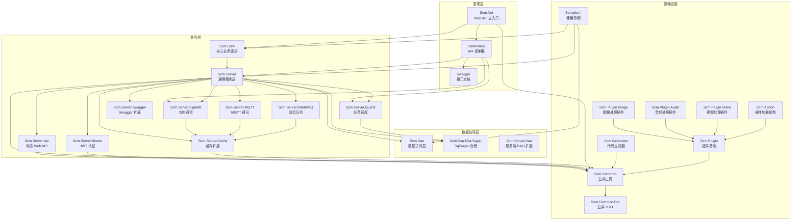
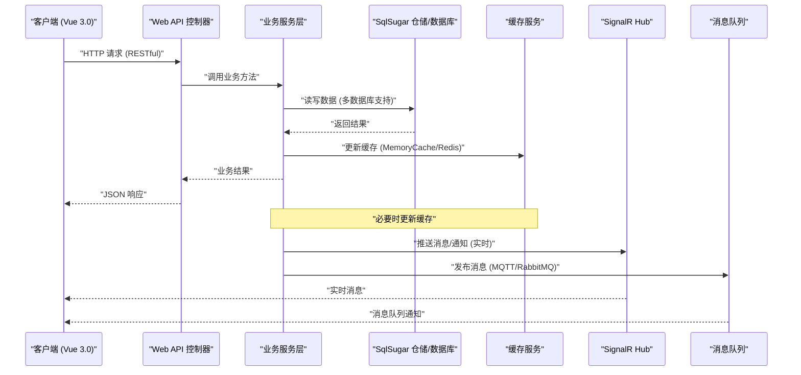
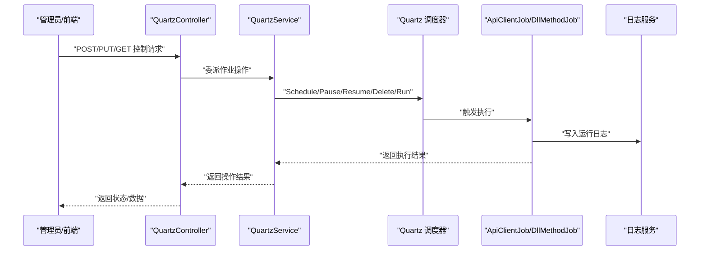
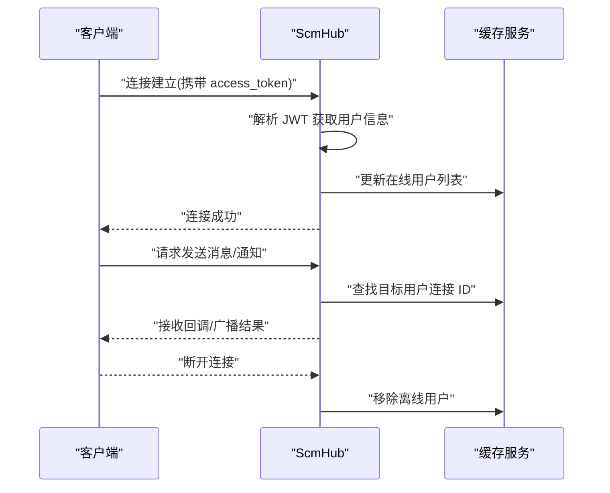
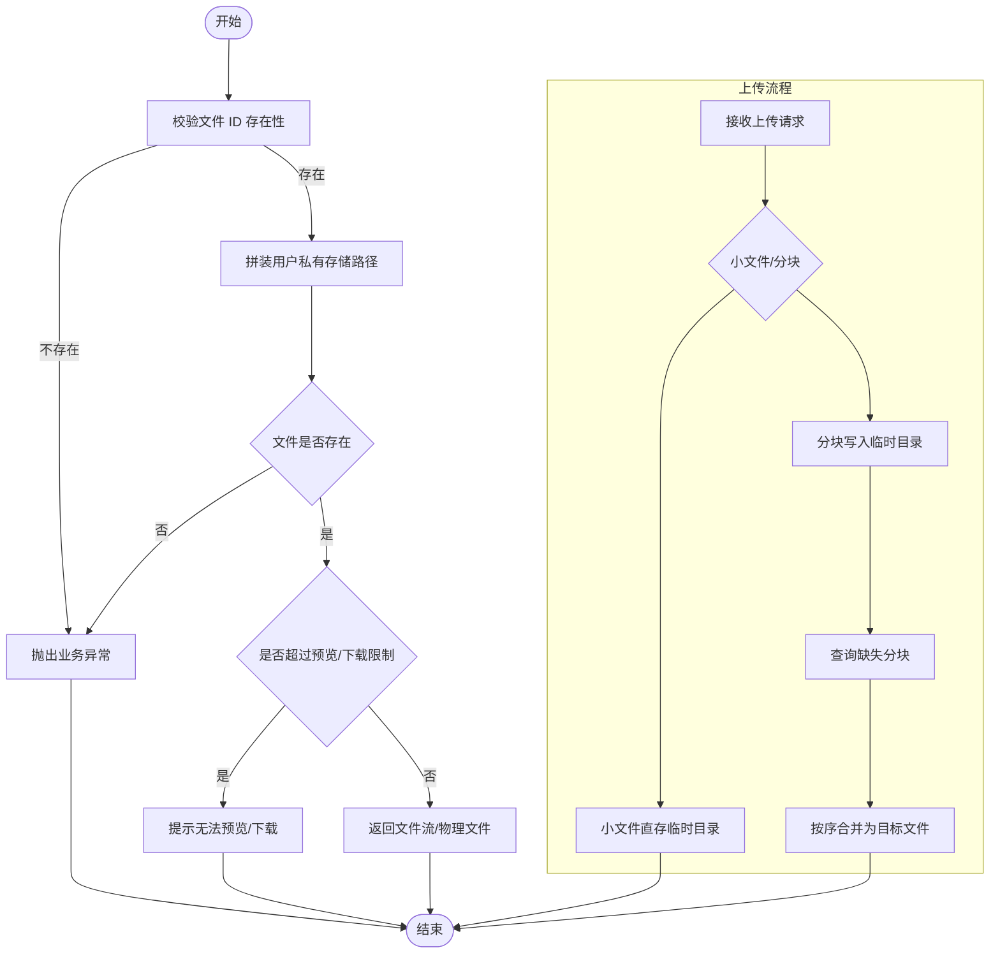
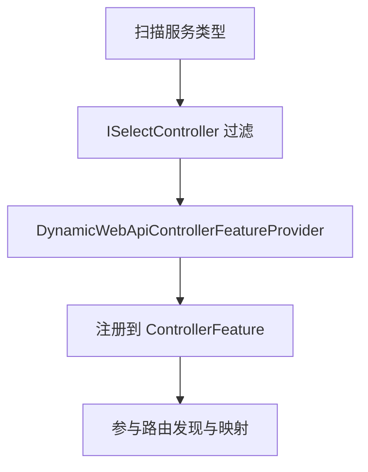
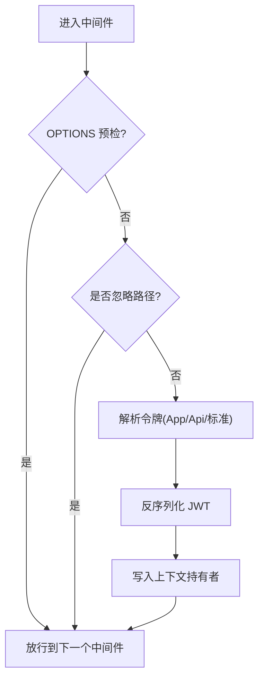
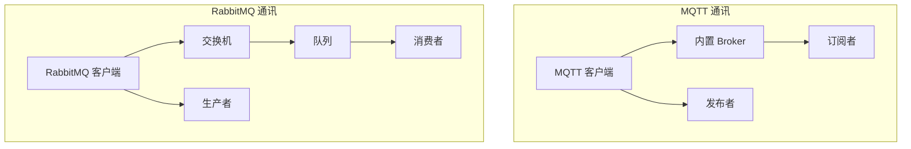
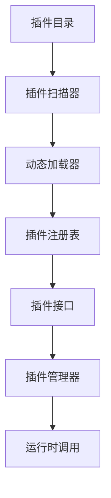
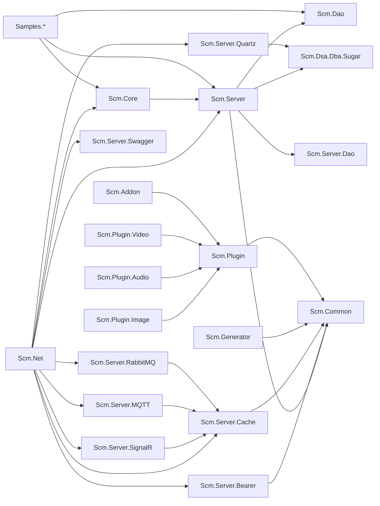

# 技术架构

<cite>
**本文引用的文件**
- [README.md](file://README.md)
- [README.en.md](file://README.en.md)
- [Scm.Net.csproj](file://Scm.Net/Scm.Net.csproj)
- [Program.cs](file://Scm.Net/Program.cs)
- [appsettings.json](file://Scm.Net/appsettings.json)
- [Scm.Core.csproj](file://Scm.Core/Scm.Core.csproj)
- [Scm.Server.csproj](file://Scm.Server/Scm.Server.csproj)
- [Scm.Server.Quartz.csproj](file://Scm.Server.Quartz/Scm.Server.Quartz.csproj)
- [Scm.Server.SignalR.csproj](file://Scm.Server.SignalR/Scm.Server.SignalR.csproj)
- [Scm.Server.MQTT.csproj](file://Scm.Server.MQTT/Scm.Server.MQTT.csproj)
- [Scm.Server.RabbitMQ.csproj](file://Scm.Server.RabbitMQ/Scm.Server.RabbitMQ.csproj)
- [Scm.Server.Bearer.csproj](file://Scm.Server.Bearer/Scm.Server.Bearer.csproj)
- [Scm.Server.Cache.csproj](file://Scm.Server.Cache/Scm.Server.Cache.csproj)
- [Scm.Server.Swagger.csproj](file://Scm.Server.Swagger/Scm.Server.Swagger.csproj)
- [Scm.Generator.csproj](file://Scm.Generator/Scm.Generator.csproj)
- [Scm.Plugin.csproj](file://Scm.Plugin/Scm.Plugin.csproj)
- [Scm.Plugin.Image.csproj](file://Scm.Plugin.Image/Scm.Plugin.Image.csproj)
- [Scm.Plugin.Audio.csproj](file://Scm.Plugin.Audio/Scm.Plugin.Audio.csproj)
- [Scm.Plugin.Video.csproj](file://Scm.Plugin.Video/Scm.Plugin.Video.csproj)
- [Scm.Addon.csproj](file://Scm.Addon/Scm.Addon.csproj)
- [JwtMiddleware.cs](file://Scm.Core/Configure/Middleware/JwtMiddleware.cs)
- [QuartzService.cs](file://Scm.Server.Quartz/QuartzService.cs)
- [ScmHub.cs](file://Scm.Server.SignalR/Hubs/ScmHub.cs)
- [QuartzController.cs](file://Scm.Net/Controllers/QuartzController.cs)
- [NasController.cs](file://Scm.Net/Controllers/NasController.cs)
- [ApiClientJob.cs](file://Scm.Server.Quartz/Jobs/ApiClientJob.cs)
- [DynamicWebApiControllerFeatureProvider.cs](file://Scm.Server.Api/DynamicWebApi/DynamicWebApiControllerFeatureProvider.cs)
</cite>

## 更新摘要
**变更内容**
- 新增后端核心依赖技术栈的详细说明
- 扩展跨平台支持范围（Windows、macOS、Linux、HarmonyOS）
- 完善前端技术栈（Vue 3.0 + Element Plus + i18n）
- 增加完整的项目结构模块说明
- 补充设计原则和主要功能特性
- 扩展插件系统和消息通信模块的架构分析

## 目录
1. [引言](#引言)
2. [项目概述](#项目概述)
3. [技术栈概览](#技术栈概览)
4. [项目结构](#项目结构)
5. [核心组件](#核心组件)
6. [架构总览](#架构总览)
7. [详细组件分析](#详细组件分析)
8. [依赖分析](#依赖分析)
9. [性能考虑](#性能考虑)
10. [故障排查指南](#故障排查指南)
11. [结论](#结论)

## 引言
本文件面向 Scm.Net 项目，系统化梳理其基于 .NET 10 的整体技术架构与实现细节。Scm.Net 是一款基于 **.NET 10.0** 及 **Vue 3.0** 构架的企业中后台管理系统快速开发框架，支持多种异构应用场景。项目采用前后端分离模式，后端基于 .NET 10.0 开发，兼容 .NET 6/7/8/9/10 运行时，前端基于 Vue 3.0 及 Element Plus 开发，支持 i18n 多语言。系统无平台依赖，可直接在多平台（Windows、macOS、Linux、HarmonyOS 等）开发与运行，响应式布局支持多种设备终端（电脑、平板、手机）。

## 项目概述
Scm.Net 项目采用现代化的企业级架构设计，围绕"表现层-业务层-数据访问层"进行模块化拆分，并通过统一的启动程序集中装配各子系统。项目支持多种数据库引擎（MySQL、SQL Server、Oracle、SQLite、MariaDB、PostgreSQL、Firebird、MongoDB 等），提供完整的代码生成器、插件扩展机制和丰富的业务功能模块。

**章节来源**
- [README.md:20-26](file://README.md#L20-L26)
- [README.en.md:14-20](file://README.en.md#L14-L20)

## 技术栈概览

### 后端核心依赖
项目采用成熟稳定的技术栈，确保系统的高性能、可扩展性和可维护性：

| 依赖库 | 用途 | 版本要求 | 特性支持 |
|--------|------|----------|----------|
| [SqlSugarCore](https://www.donet5.com/Home/Doc) | ORM 数据访问 | ≥ 5.0 | 多数据库支持、批量操作、事务管理 |
| [Newtonsoft.Json](https://www.newtonsoft.com/json) | JSON 序列化 | ≥ 13.0 | 高性能序列化、复杂类型处理 |
| [ImageSharp](https://github.com/SixLabors/ImageSharp) | 跨平台图像处理 | ≥ 3.0 | 多格式支持、高性能处理 |
| [MQTTnet](https://github.com/dotnet/MQTTnet) | MQTT 通讯 | ≥ 4.0 | 客户端 + 内置 Broker |
| [RabbitMQ.Client](https://www.rabbitmq.com) | RabbitMQ 消息队列 | ≥ 6.0 | 生产者/消费者模式 |
| [Quartz.NET](https://www.quartz-scheduler.net) | 定时任务调度 | ≥ 3.0 | Cron 表达式、集群支持 |
| SignalR | 实时通讯 | ≥ 8.0 | 消息推送、连接管理 |

### 前端技术栈
- **Vue 3.0**: 最新版本的前端框架，提供更好的性能和开发体验
- **Element Plus**: 基于 Vue 3.0 的桌面端组件库
- **i18n**: 国际化支持，多语言切换
- **响应式布局**: 支持桌面、平板、手机等多种设备

### 跨平台支持
系统支持以下平台：
- **Windows**: 完全支持，推荐开发环境
- **macOS**: 完全支持，原生开发体验
- **Linux**: 完全支持，服务器部署首选
- **HarmonyOS**: 移动端适配，物联网场景支持

**章节来源**
- [README.md:28-39](file://README.md#L28-L39)
- [README.en.md:22-33](file://README.en.md#L22-L33)
- [README.md:25](file://README.md#L25)
- [README.en.md:19](file://README.en.md#L19)

## 项目结构
Scm.Net 采用多项目解决方案，围绕"表现层-业务层-数据访问层"进行模块化拆分，并通过统一的启动程序集中装配各子系统。项目结构清晰，职责分明，便于团队协作和维护。

**图表来源**
- [Scm.Net.csproj:37-48](file://Scm.Net/Scm.Net.csproj#L37-L48)
- [Scm.Core.csproj:10-24](file://Scm.Core/Scm.Core.csproj#L10-L24)
- [Scm.Server.csproj:21-28](file://Scm.Server/Scm.Server.csproj#L21-L28)
- [Scm.Server.Quartz.csproj:16-21](file://Scm.Server.Quartz/Scm.Server.Quartz.csproj#L16-L21)
- [Scm.Server.SignalR.csproj:10-11](file://Scm.Server.SignalR/Scm.Server.SignalR.csproj#L10-L11)
- [Scm.Server.MQTT.csproj:10-11](file://Scm.Server.MQTT/Scm.Server.MQTT.csproj#L10-L11)
- [Scm.Server.RabbitMQ.csproj:10-11](file://Scm.Server.RabbitMQ/Scm.Server.RabbitMQ.csproj#L10-L11)
- [Scm.Server.Bearer.csproj:10-11](file://Scm.Server.Bearer/Scm.Server.Bearer.csproj#L10-L11)
- [Scm.Server.Cache.csproj:10-11](file://Scm.Server.Cache/Scm.Server.Cache.csproj#L10-L11)
- [Scm.Server.Swagger.csproj:10-11](file://Scm.Server.Swagger/Scm.Server.Swagger.csproj#L10-L11)
- [Scm.Generator.csproj:10-11](file://Scm.Generator/Scm.Generator.csproj#L10-L11)
- [Scm.Plugin.csproj:10-11](file://Scm.Plugin/Scm.Plugin.csproj#L10-L11)
- [Scm.Plugin.Image.csproj:10-11](file://Scm.Plugin.Image/Scm.Plugin.Image.csproj#L10-L11)
- [Scm.Plugin.Audio.csproj:10-11](file://Scm.Plugin.Audio/Scm.Plugin.Audio.csproj#L10-L11)
- [Scm.Plugin.Video.csproj:10-11](file://Scm.Plugin.Video/Scm.Plugin.Video.csproj#L10-L11)
- [Scm.Addon.csproj:10-11](file://Scm.Addon/Scm.Addon.csproj#L10-L11)

**章节来源**
- [README.md:40-66](file://README.md#L40-L66)
- [README.en.md:34-56](file://README.en.md#L34-L56)

## 核心组件
Scm.Net 项目的核心组件围绕企业级应用需求设计，提供完整的功能模块和扩展机制。

### 启动与装配
- 在应用启动阶段集中注册日志、环境、数据库、缓存、Swagger、安全、任务调度、信号、映射器等服务与中间件
- 通过配置文件集中管理数据库、缓存、任务调度、JWT、跨域等参数
- 支持多环境配置（Development、Production、Staging）

### 数据访问层
- 基于 SqlSugar 的仓储模式，统一实体映射与 SQL 构造，支持 SQLite/SQL Server 等多种数据库类型
- 提供完整的 CRUD 操作和复杂查询支持
- 支持事务管理和批量操作

### 实时通信
- 基于 SignalR 的 Hub，结合缓存维护在线用户列表，支持按用户推送消息与全局广播
- 支持多种消息格式和消息类型
- 提供连接状态管理和错误处理机制

### 任务调度
- 基于 Quartz.NET 的 Cron 触发器，支持 API 调用型与 DLL 方法型两类作业，提供增删改查与运行控制接口
- 支持集群部署和任务持久化
- 提供详细的调度日志和监控功能

### 动态 Web API
- 通过约定式扫描与特性注册，实现服务到控制器的自动映射，降低样板代码
- 支持 RESTful API 约定和参数验证
- 提供 API 版本控制和文档生成

### 消息通信
- **MQTT 通讯**: 基于 MQTTnet 的轻量级通讯，支持客户端发布/订阅 + 内置 Broker，适用于 IoT 场景
- **RabbitMQ 集成**: 支持生产者/消费者模式的消息队列，提供可靠的消息传递
- **实时推送**: 基于 SignalR 的实时消息推送，支持多种消息类型

### 插件系统
- **插件基础框架**: 提供统一的插件接口和生命周期管理
- **图像处理插件**: 支持条码生成识别、图片水印、图形验证码、头像裁剪等功能
- **音频处理插件**: 提供音频格式转换和元数据解析
- **视频处理插件**: 支持视频转码和格式转换
- **动态插件加载**: 基于 Addon 的动态插件加载机制

### 认证与授权
- **JWT Bearer 认证**: 支持多种令牌格式和自动刷新机制
- **多级权限管理**: 支持公司管理、部门管理、岗位管理、分组管理、用户管理、角色管理
- **全局配置参数**: 支持系统级别的配置管理和动态更新

**章节来源**
- [Program.cs:33-258](file://Scm.Net/Program.cs#L33-L258)
- [appsettings.json:1-127](file://Scm.Net/appsettings.json#L1-L127)
- [README.md:74-94](file://README.md#L74-L94)
- [README.en.md:64-83](file://README.en.md#L64-L83)

## 架构总览
下图展示从客户端请求到业务处理、数据持久化与实时通知的整体流程，体现了 Scm.Net 的完整技术栈和模块化架构。

**图表来源**
- [Program.cs:166-238](file://Scm.Net/Program.cs#L166-L238)
- [ScmHub.cs:25-89](file://Scm.Server.SignalR/Hubs/ScmHub.cs#L25-L89)
- [QuartzService.cs:98-152](file://Scm.Server.Quartz/QuartzService.cs#L98-L152)

## 详细组件分析

### 组件一：任务调度模块（Quartz）
- 设计要点
  - 以 IQuartzService 为核心入口，封装作业的生命周期管理（新增、启动、暂停、删除、立即执行、查询）
  - 支持 Cron 表达式校验与触发器构建；区分 API 调用型与 DLL 方法型两类作业
  - 作业运行日志落库，便于审计与排障
  - 支持集群部署和任务持久化
- 关键流程
  - 初始化：从配置加载作业清单，按状态决定是否启动
  - 运行：根据作业类型选择对应 Job 实现，执行后写入日志
  - 控制：提供 REST 接口对作业进行启停与更新

**图表来源**
- [QuartzController.cs:16-121](file://Scm.Net/Controllers/QuartzController.cs#L16-L121)
- [QuartzService.cs:13-29](file://Scm.Server.Quartz/QuartzService.cs#L13-L29)
- [ApiClientJob.cs:27-95](file://Scm.Server.Quartz/Jobs/ApiClientJob.cs#L27-L95)

**章节来源**
- [QuartzService.cs:36-152](file://Scm.Server.Quartz/QuartzService.cs#L36-L152)
- [QuartzController.cs:38-121](file://Scm.Net/Controllers/QuartzController.cs#L38-L121)
- [ApiClientJob.cs:27-95](file://Scm.Server.Quartz/Jobs/ApiClientJob.cs#L27-L95)

### 组件二：实时通信模块（SignalR）
- 设计要点
  - Hub 维护在线用户列表，基于缓存实现高并发下的用户连接状态管理
  - 通过 JWT 解析用户身份，建立连接后将用户与连接 ID 绑定
  - 提供按用户或全体广播的消息推送接口
  - 支持多种消息格式和消息类型
- 关键流程
  - 建立连接：解析 access_token，写入在线用户缓存
  - 断开清理：移除离线用户，保持缓存一致性
  - 消息发送：根据目标用户连接 ID 发送指定消息

**图表来源**
- [ScmHub.cs:25-89](file://Scm.Server.SignalR/Hubs/ScmHub.cs#L25-L89)
- [ScmHub.cs:95-153](file://Scm.Server.SignalR/Hubs/ScmHub.cs#L95-L153)

**章节来源**
- [ScmHub.cs:25-153](file://Scm.Server.SignalR/Hubs/ScmHub.cs#L25-L153)

### 组件三：文件管理模块（NAS）
- 设计要点
  - 提供文件信息查询、小文件/大文件下载、分块上传、上传校验与合并等完整流程
  - 支持断点续传的大文件下载与安全的临时目录管理
  - 基于多数据库支持的文件元数据管理
- 关键流程
  - 下载：根据文件 ID 查询元数据，校验文件存在性与大小限制，返回物理文件或分片内容
  - 上传：小文件直接保存至临时目录；大文件按分块写入并校验缺失块，最终合并生成目标文件

**图表来源**
- [NasController.cs:50-90](file://Scm.Net/Controllers/NasController.cs#L50-L90)
- [NasController.cs:164-296](file://Scm.Net/Controllers/NasController.cs#L164-L296)
- [NasController.cs:302-464](file://Scm.Net/Controllers/NasController.cs#L302-L464)

**章节来源**
- [NasController.cs:50-464](file://Scm.Net/Controllers/NasController.cs#L50-L464)

### 组件四：动态 Web API（服务到控制器映射）
- 设计要点
  - 通过自定义 ControllerFeatureProvider 与 ISelectController 约束，仅注册符合规则的控制器
  - 配合动态 API 约定，减少手写控制器样板代码，提升开发效率
  - 支持 RESTful API 约定和参数验证
- 关键流程
  - 启动时扫描服务类型，筛选可公开的控制器类
  - 注册到 MVC 特性集合，参与路由发现

**图表来源**
- [DynamicWebApiControllerFeatureProvider.cs:6-19](file://Scm.Server.Api/DynamicWebApi/DynamicWebApiControllerFeatureProvider.cs#L6-L19)

**章节来源**
- [DynamicWebApiControllerFeatureProvider.cs:6-19](file://Scm.Server.Api/DynamicWebApi/DynamicWebApiControllerFeatureProvider.cs#L6-L19)

### 组件五：认证与授权中间件（JWT）
- 设计要点
  - 在请求进入路由前，对特定忽略路径放行，其余请求提取令牌并注入上下文
  - 支持网页口令与应用绑定两种令牌格式，自动刷新过期令牌并回写响应头
  - 集成多级权限管理和全局配置参数
- 关键流程
  - 解析请求头中的应用令牌/接口令牌/标准令牌
  - 反序列化 JWT 并写入上下文持有者，随后交由后续中间件处理

**图表来源**
- [JwtMiddleware.cs:42-97](file://Scm.Core/Configure/Middleware/JwtMiddleware.cs#L42-L97)

**章节来源**
- [JwtMiddleware.cs:42-179](file://Scm.Core/Configure/Middleware/JwtMiddleware.cs#L42-L179)

### 组件六：消息通信模块（MQTT & RabbitMQ）
- 设计要点
  - **MQTT**: 基于 MQTTnet 的轻量级通讯，支持客户端发布/订阅 + 内置 Broker，适用于 IoT 场景
  - **RabbitMQ**: 支持生产者/消费者模式的消息队列，提供可靠的消息传递
  - 统一的消息格式和错误处理机制
- 关键流程
  - MQTT: 客户端连接、主题订阅、消息发布与接收
  - RabbitMQ: 消息生产、队列管理、消息消费与确认

**图表来源**
- [Scm.Server.MQTT.csproj:10-11](file://Scm.Server.MQTT/Scm.Server.MQTT.csproj#L10-L11)
- [Scm.Server.RabbitMQ.csproj:10-11](file://Scm.Server.RabbitMQ/Scm.Server.RabbitMQ.csproj#L10-L11)

**章节来源**
- [Scm.Server.MQTT.csproj:10-11](file://Scm.Server.MQTT/Scm.Server.MQTT.csproj#L10-L11)
- [Scm.Server.RabbitMQ.csproj:10-11](file://Scm.Server.RabbitMQ/Scm.Server.RabbitMQ.csproj#L10-L11)

### 组件七：插件系统模块
- 设计要点
  - **插件基础框架**: 提供统一的插件接口和生命周期管理
  - **图像处理插件**: 支持条码生成识别、图片水印、图形验证码、头像裁剪等功能
  - **音频处理插件**: 提供音频格式转换和元数据解析
  - **视频处理插件**: 支持视频转码和格式转换
  - **动态插件加载**: 基于 Addon 的动态插件加载机制
- 关键流程
  - 插件发现与加载：扫描插件目录，动态加载插件程序集
  - 插件注册与初始化：注册插件接口，执行初始化逻辑
  - 插件调用与卸载：提供统一的插件调用接口，支持插件卸载

**图表来源**
- [Scm.Plugin.csproj:10-11](file://Scm.Plugin/Scm.Plugin.csproj#L10-L11)
- [Scm.Addon.csproj:10-11](file://Scm.Addon/Scm.Addon.csproj#L10-L11)

**章节来源**
- [Scm.Plugin.csproj:10-11](file://Scm.Plugin/Scm.Plugin.csproj#L10-L11)
- [Scm.Plugin.Image.csproj:10-11](file://Scm.Plugin.Image/Scm.Plugin.Image.csproj#L10-L11)
- [Scm.Plugin.Audio.csproj:10-11](file://Scm.Plugin.Audio/Scm.Plugin.Audio.csproj#L10-L11)
- [Scm.Plugin.Video.csproj:10-11](file://Scm.Plugin.Video/Scm.Plugin.Video.csproj#L10-L11)
- [Scm.Addon.csproj:10-11](file://Scm.Addon/Scm.Addon.csproj#L10-L11)

## 依赖分析
- 项目级依赖
  - Scm.Net 引用核心与通用模块，形成"应用层 -> 业务层 -> 数据层"的单向依赖
  - 支持多数据库引擎和多缓存机制的灵活配置
- 组件级依赖
  - Quartz 依赖 SqlSugar 与自定义 DAO/DTO，负责作业与日志持久化
  - SignalR 依赖缓存服务，用于在线用户状态管理
  - 动态 Web API 依赖服务层接口，实现服务到控制器的自动映射
  - 消息通信模块依赖对应的第三方库（MQTTnet、RabbitMQ.Client）
  - 插件系统依赖统一的插件接口和加载机制

**图表来源**
- [Scm.Net.csproj:37-48](file://Scm.Net/Scm.Net.csproj#L37-L48)
- [Scm.Core.csproj:10-24](file://Scm.Core/Scm.Core.csproj#L10-L24)
- [Scm.Server.Quartz.csproj:16-21](file://Scm.Server.Quartz/Scm.Server.Quartz.csproj#L16-L21)
- [Scm.Server.SignalR.csproj:10-11](file://Scm.Server.SignalR/Scm.Server.SignalR.csproj#L10-L11)
- [Scm.Server.MQTT.csproj:10-11](file://Scm.Server.MQTT/Scm.Server.MQTT.csproj#L10-L11)
- [Scm.Server.RabbitMQ.csproj:10-11](file://Scm.Server.RabbitMQ/Scm.Server.RabbitMQ.csproj#L10-L11)
- [Scm.Server.Bearer.csproj:10-11](file://Scm.Server.Bearer/Scm.Server.Bearer.csproj#L10-L11)
- [Scm.Server.Cache.csproj:10-11](file://Scm.Server.Cache/Scm.Server.Cache.csproj#L10-L11)
- [Scm.Server.Swagger.csproj:10-11](file://Scm.Server.Swagger/Scm.Server.Swagger.csproj#L10-L11)

**章节来源**
- [Scm.Net.csproj:37-48](file://Scm.Net/Scm.Net.csproj#L37-L48)
- [Scm.Core.csproj:10-24](file://Scm.Core/Scm.Core.csproj#L10-L24)
- [Scm.Server.Quartz.csproj:16-21](file://Scm.Server.Quartz/Scm.Server.Quartz.csproj#L16-L21)
- [Scm.Server.SignalR.csproj:10-11](file://Scm.Server.SignalR/Scm.Server.SignalR.csproj#L10-L11)
- [Scm.Server.MQTT.csproj:10-11](file://Scm.Server.MQTT/Scm.Server.MQTT.csproj#L10-L11)
- [Scm.Server.RabbitMQ.csproj:10-11](file://Scm.Server.RabbitMQ/Scm.Server.RabbitMQ.csproj#L10-L11)
- [Scm.Server.Bearer.csproj:10-11](file://Scm.Server.Bearer/Scm.Server.Bearer.csproj#L10-L11)
- [Scm.Server.Cache.csproj:10-11](file://Scm.Server.Cache/Scm.Server.Cache.csproj#L10-L11)
- [Scm.Server.Swagger.csproj:10-11](file://Scm.Server.Swagger/Scm.Server.Swagger.csproj#L10-L11)

## 性能考虑
- **数据库层**
  - SqlSugar 支持按需映射与延迟加载，建议在高频查询场景中合理使用索引与分页
  - 不同数据库类型在枚举与整型映射上存在差异，需关注迁移兼容性
  - 支持多数据库引擎，可根据业务场景选择最适合的数据库
- **任务调度**
  - Cron 表达式校验前置，避免无效触发导致资源浪费
  - 作业日志异步写入，降低阻塞风险
  - 支持集群部署，提高任务调度的可用性和扩展性
- **实时通信**
  - 在线用户列表基于内存缓存，建议结合分布式缓存策略以支撑横向扩展
  - 支持多种消息格式，可根据场景选择最优的消息传输方案
- **文件传输**
  - 大文件断点续传与分块合并，注意磁盘 IO 与临时目录清理策略
  - 支持多种文件格式处理，提供高效的文件管理能力
- **消息通信**
  - MQTT 适用于轻量级通讯和 IoT 场景，RabbitMQ 适用于企业级消息队列
  - 支持多种消息格式和传输协议，可根据业务需求选择合适的方案
- **插件系统**
  - 动态插件加载机制，支持热插拔和按需加载
  - 插件隔离机制，确保插件故障不影响主系统稳定性

## 故障排查指南
- **启动与配置**
  - 若服务未监听预期端口，请检查 Kestrel 配置与环境变量
  - 日志输出可通过 Serilog 配置文件调整级别与输出位置
  - 跨平台部署时注意路径分隔符和文件权限问题
- **数据库初始化**
  - 若数据库未初始化或表结构不一致，检查 Sql 配置与脚本目录路径
  - 支持多种数据库引擎，需根据选择正确的连接字符串
- **任务调度**
  - 通过 Quartz 控制器查询作业状态与日志，定位 Cron 表达式与作业参数问题
  - 集群部署时检查任务分配和负载均衡配置
- **实时通信**
  - SignalR 连接失败通常与令牌解析相关，检查 access_token 与 JWT 中间件配置
  - 缓存服务异常会影响在线用户状态管理，检查缓存配置和连接状态
- **文件管理**
  - 下载/查看失败多因文件不存在或超出大小限制，核对文件路径与权限
  - 临时目录权限问题会导致上传失败，检查文件系统权限设置
- **消息通信**
  - MQTT 连接失败检查 Broker 配置和网络连通性
  - RabbitMQ 消息丢失检查队列配置和消费者确认机制
- **插件系统**
  - 插件加载失败检查插件依赖和兼容性
  - 插件冲突影响系统稳定性，检查插件接口实现和资源占用

**章节来源**
- [appsettings.json:26-38](file://Scm.Net/appsettings.json#L26-L38)
- [appsettings.json:3-25](file://Scm.Net/appsettings.json#L3-L25)
- [Program.cs:282-356](file://Scm.Net/Program.cs#L282-L356)
- [QuartzController.cs:38-121](file://Scm.Net/Controllers/QuartzController.cs#L38-L121)
- [ScmHub.cs:25-89](file://Scm.Server.SignalR/Hubs/ScmHub.cs#L25-L89)
- [NasController.cs:164-296](file://Scm.Net/Controllers/NasController.cs#L164-L296)

## 结论
Scm.Net 以 .NET 10 为基础，采用清晰的分层与模块化设计，结合 SqlSugar、SignalR、Quartz.NET、MQTTnet、RabbitMQ.Client 等成熟技术，构建了可扩展、可观测、易维护的企业级后端平台。项目支持跨平台部署（Windows、macOS、Linux、HarmonyOS），提供完整的前端技术栈（Vue 3.0 + Element Plus + i18n），并通过统一的启动装配与配置中心，实现了快速集成与灵活部署。

通过动态 Web API 与任务调度、实时通信、消息队列、插件系统等模块，Scm.Net 满足多样化的业务需求，支持多种数据库引擎和缓存机制，提供完整的代码生成器和丰富的业务功能模块。项目的设计原则强调数据存储的纯粹性、单表操作的简洁性和 JSON 格式的多端兼容性，确保系统的高性能和可扩展性。

随着插件系统的完善和消息通信模块的增强，Scm.Net 已发展成为一个功能完备、架构清晰、易于扩展的企业级开发框架，能够适应各种复杂的业务场景和部署需求。