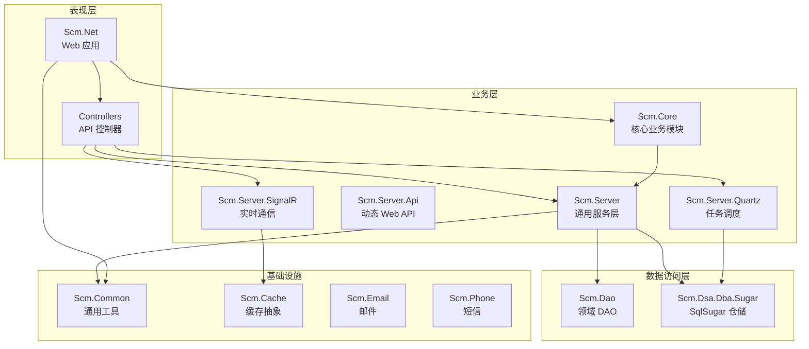
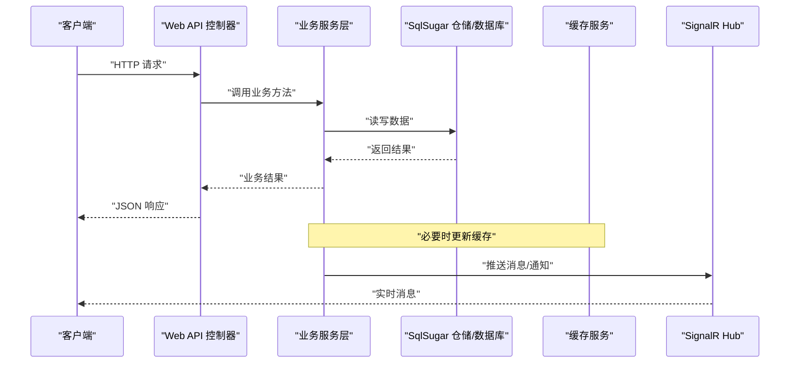
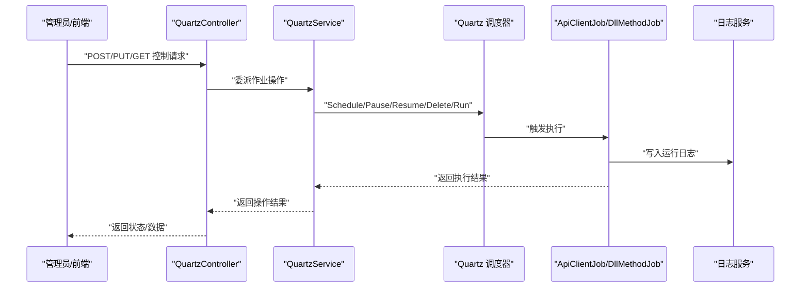
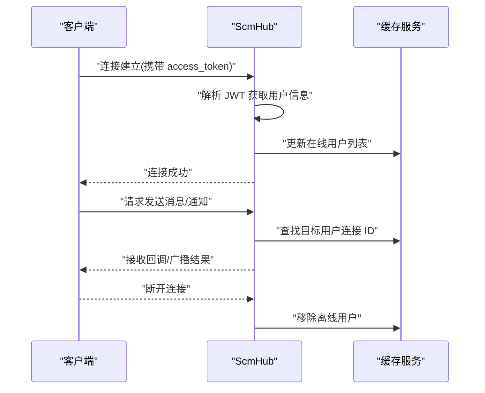
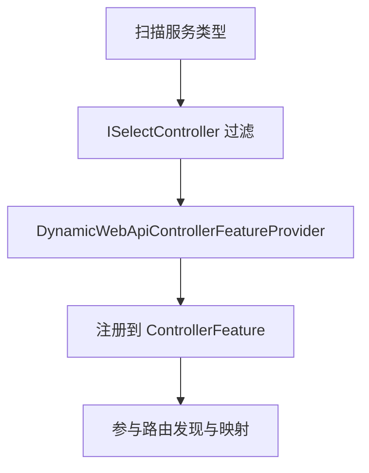
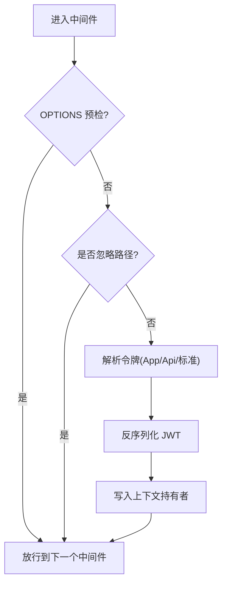
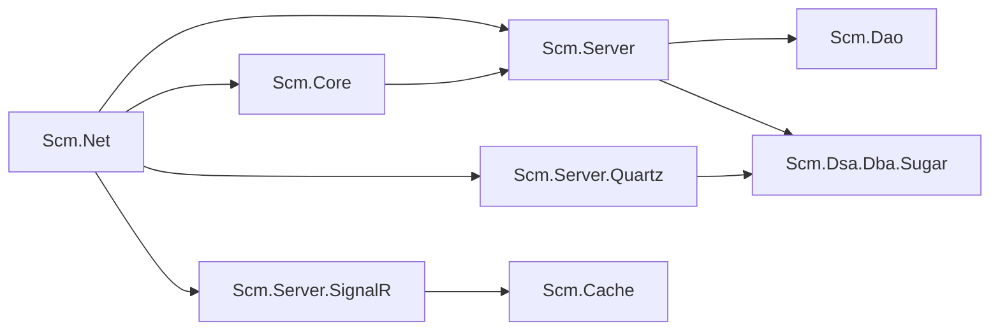

# 技术架构

<cite>
**本文引用的文件**
- [Scm.Net.csproj](file://Scm.Net/Scm.Net.csproj)
- [Program.cs](file://Scm.Net/Program.cs)
- [appsettings.json](file://Scm.Net/appsettings.json)
- [Scm.Core.csproj](file://Scm.Core/Scm.Core.csproj)
- [Scm.Server.csproj](file://Scm.Server/Scm.Server.csproj)
- [Scm.Server.Quartz.csproj](file://Scm.Server.Quartz/Scm.Server.Quartz.csproj)
- [Scm.Server.SignalR.csproj](file://Scm.Server.SignalR/Scm.Server.SignalR.csproj)
- [JwtMiddleware.cs](file://Scm.Core/Configure/Middleware/JwtMiddleware.cs)
- [QuartzService.cs](file://Scm.Server.Quartz/QuartzService.cs)
- [ScmHub.cs](file://Scm.Server.SignalR/Hubs/ScmHub.cs)
- [QuartzController.cs](file://Scm.Net/Controllers/QuartzController.cs)
- [NasController.cs](file://Scm.Net/Controllers/NasController.cs)
- [ApiClientJob.cs](file://Scm.Server.Quartz/Jobs/ApiClientJob.cs)
- [DynamicWebApiControllerFeatureProvider.cs](file://Scm.Server.Api/DynamicWebApi/DynamicWebApiControllerFeatureProvider.cs)
</cite>

## 目录
1. [引言](#引言)
2. [项目结构](#项目结构)
3. [核心组件](#核心组件)
4. [架构总览](#架构总览)
5. [详细组件分析](#详细组件分析)
6. [依赖分析](#依赖分析)
7. [性能考虑](#性能考虑)
8. [故障排查指南](#故障排查指南)
9. [结论](#结论)

## 引言
本文件面向 Scm.Net 项目，系统化梳理其基于 .NET 10 的整体技术架构与实现细节。重点覆盖：
- 基于 ASP.NET Core Web API 的后端服务
- 使用 SqlSugar ORM 的数据访问层
- SignalR 实时通信能力
- Quartz.NET 任务调度体系
- 分层架构与多模块组织方式
- 技术选型与优势分析

## 项目结构
Scm.Net 采用多项目解决方案，围绕“表现层-业务层-数据访问层”进行模块化拆分，并通过统一的启动程序集中装配各子系统。

图表来源
- [Scm.Net.csproj:37-48](file://Scm.Net/Scm.Net.csproj#L37-L48)
- [Scm.Core.csproj:10-24](file://Scm.Core/Scm.Core.csproj#L10-L24)
- [Scm.Server.csproj:21-28](file://Scm.Server/Scm.Server.csproj#L21-L28)
- [Scm.Server.Quartz.csproj:16-21](file://Scm.Server.Quartz/Scm.Server.Quartz.csproj#L16-L21)
- [Scm.Server.SignalR.csproj:10-11](file://Scm.Server.SignalR/Scm.Server.SignalR.csproj#L10-L11)

章节来源
- [Scm.Net.csproj:37-48](file://Scm.Net/Scm.Net.csproj#L37-L48)
- [Scm.Core.csproj:10-24](file://Scm.Core/Scm.Core.csproj#L10-L24)
- [Scm.Server.csproj:21-28](file://Scm.Server/Scm.Server.csproj#L21-L28)
- [Scm.Server.Quartz.csproj:16-21](file://Scm.Server.Quartz/Scm.Server.Quartz.csproj#L16-L21)
- [Scm.Server.SignalR.csproj:10-11](file://Scm.Server.SignalR/Scm.Server.SignalR.csproj#L10-L11)

## 核心组件
- 启动与装配
  - 在应用启动阶段集中注册日志、环境、数据库、缓存、Swagger、安全、任务调度、信号、映射器等服务与中间件。
  - 通过配置文件集中管理数据库、缓存、任务调度、JWT、跨域等参数。
- 数据访问层
  - 基于 SqlSugar 的仓储模式，统一实体映射与 SQL 构造，支持 SQLite/SQL Server 等多种数据库类型。
- 实时通信
  - 基于 SignalR 的 Hub，结合缓存维护在线用户列表，支持按用户推送消息与全局广播。
- 任务调度
  - 基于 Quartz.NET 的 Cron 触发器，支持 API 调用型与 DLL 方法型两类作业，提供增删改查与运行控制接口。
- 动态 Web API
  - 通过约定式扫描与特性注册，实现服务到控制器的自动映射，降低样板代码。

章节来源
- [Program.cs:33-258](file://Scm.Net/Program.cs#L33-L258)
- [appsettings.json:1-127](file://Scm.Net/appsettings.json#L1-L127)
- [Scm.Server.Quartz.csproj:11-13](file://Scm.Server.Quartz/Scm.Server.Quartz.csproj#L11-L13)
- [Scm.Server.SignalR.csproj:10-11](file://Scm.Server.SignalR/Scm.Server.SignalR.csproj#L10-L11)

## 架构总览
下图展示从客户端请求到业务处理、数据持久化与实时通知的整体流程。

图表来源
- [Program.cs:166-238](file://Scm.Net/Program.cs#L166-L238)
- [ScmHub.cs:25-89](file://Scm.Server.SignalR/Hubs/ScmHub.cs#L25-L89)
- [QuartzService.cs:98-152](file://Scm.Server.Quartz/QuartzService.cs#L98-L152)

## 详细组件分析

### 组件一：任务调度模块（Quartz）
- 设计要点
  - 以 IQuartzService 为核心入口，封装作业的生命周期管理（新增、启动、暂停、删除、立即执行、查询）。
  - 支持 Cron 表达式校验与触发器构建；区分 API 调用型与 DLL 方法型两类作业。
  - 作业运行日志落库，便于审计与排障。
- 关键流程
  - 初始化：从配置加载作业清单，按状态决定是否启动。
  - 运行：根据作业类型选择对应 Job 实现，执行后写入日志。
  - 控制：提供 REST 接口对作业进行启停与更新。

图表来源
- [QuartzController.cs:16-121](file://Scm.Net/Controllers/QuartzController.cs#L16-L121)
- [QuartzService.cs:13-29](file://Scm.Server.Quartz/QuartzService.cs#L13-L29)
- [ApiClientJob.cs:27-95](file://Scm.Server.Quartz/Jobs/ApiClientJob.cs#L27-L95)

章节来源
- [QuartzService.cs:36-152](file://Scm.Server.Quartz/QuartzService.cs#L36-L152)
- [QuartzController.cs:38-121](file://Scm.Net/Controllers/QuartzController.cs#L38-L121)
- [ApiClientJob.cs:27-95](file://Scm.Server.Quartz/Jobs/ApiClientJob.cs#L27-L95)

### 组件二：实时通信模块（SignalR）
- 设计要点
  - Hub 维护在线用户列表，基于缓存实现高并发下的用户连接状态管理。
  - 通过 JWT 解析用户身份，建立连接后将用户与连接 ID 绑定。
  - 提供按用户或全体广播的消息推送接口。
- 关键流程
  - 建立连接：解析 access_token，写入在线用户缓存。
  - 断开清理：移除离线用户，保持缓存一致性。
  - 消息发送：根据目标用户连接 ID 发送指定消息。

图表来源
- [ScmHub.cs:25-89](file://Scm.Server.SignalR/Hubs/ScmHub.cs#L25-L89)
- [ScmHub.cs:95-153](file://Scm.Server.SignalR/Hubs/ScmHub.cs#L95-L153)

章节来源
- [ScmHub.cs:25-153](file://Scm.Server.SignalR/Hubs/ScmHub.cs#L25-L153)

### 组件三：文件管理模块（NAS）
- 设计要点
  - 提供文件信息查询、小文件/大文件下载、分块上传、上传校验与合并等完整流程。
  - 支持断点续传的大文件下载与安全的临时目录管理。
- 关键流程
  - 下载：根据文件 ID 查询元数据，校验文件存在性与大小限制，返回物理文件或分片内容。
  - 上传：小文件直接保存至临时目录；大文件按分块写入并校验缺失块，最终合并生成目标文件。

图表来源
- [NasController.cs:50-90](file://Scm.Net/Controllers/NasController.cs#L50-L90)
- [NasController.cs:164-296](file://Scm.Net/Controllers/NasController.cs#L164-L296)
- [NasController.cs:302-464](file://Scm.Net/Controllers/NasController.cs#L302-L464)

章节来源
- [NasController.cs:50-464](file://Scm.Net/Controllers/NasController.cs#L50-L464)

### 组件四：动态 Web API（服务到控制器映射）
- 设计要点
  - 通过自定义 ControllerFeatureProvider 与 ISelectController 约束，仅注册符合规则的控制器。
  - 配合动态 API 约定，减少手写控制器样板代码，提升开发效率。
- 关键流程
  - 启动时扫描服务类型，筛选可公开的控制器类。
  - 注册到 MVC 特性集合，参与路由发现。

图表来源
- [DynamicWebApiControllerFeatureProvider.cs:6-19](file://Scm.Server.Api/DynamicWebApi/DynamicWebApiControllerFeatureProvider.cs#L6-L19)

章节来源
- [DynamicWebApiControllerFeatureProvider.cs:6-19](file://Scm.Server.Api/DynamicWebApi/DynamicWebApiControllerFeatureProvider.cs#L6-L19)

### 组件五：认证与授权中间件（JWT）
- 设计要点
  - 在请求进入路由前，对特定忽略路径放行，其余请求提取令牌并注入上下文。
  - 支持网页口令与应用绑定两种令牌格式，自动刷新过期令牌并回写响应头。
- 关键流程
  - 解析请求头中的应用令牌/接口令牌/标准令牌。
  - 反序列化 JWT 并写入上下文持有者，随后交由后续中间件处理。

图表来源
- [JwtMiddleware.cs:42-97](file://Scm.Core/Configure/Middleware/JwtMiddleware.cs#L42-L97)

章节来源
- [JwtMiddleware.cs:42-179](file://Scm.Core/Configure/Middleware/JwtMiddleware.cs#L42-L179)

## 依赖分析
- 项目级依赖
  - Scm.Net 引用核心与通用模块，形成“应用层 -> 业务层 -> 数据层”的单向依赖。
- 组件级依赖
  - Quartz 依赖 SqlSugar 与自定义 DAO/DTO，负责作业与日志持久化。
  - SignalR 依赖缓存服务，用于在线用户状态管理。
  - 动态 Web API 依赖服务层接口，实现服务到控制器的自动映射。

图表来源
- [Scm.Net.csproj:37-48](file://Scm.Net/Scm.Net.csproj#L37-L48)
- [Scm.Core.csproj:10-24](file://Scm.Core/Scm.Core.csproj#L10-L24)
- [Scm.Server.Quartz.csproj:16-21](file://Scm.Server.Quartz/Scm.Server.Quartz.csproj#L16-L21)
- [Scm.Server.SignalR.csproj:10-11](file://Scm.Server.SignalR/Scm.Server.SignalR.csproj#L10-L11)

章节来源
- [Scm.Net.csproj:37-48](file://Scm.Net/Scm.Net.csproj#L37-L48)
- [Scm.Core.csproj:10-24](file://Scm.Core/Scm.Core.csproj#L10-L24)
- [Scm.Server.Quartz.csproj:16-21](file://Scm.Server.Quartz/Scm.Server.Quartz.csproj#L16-L21)
- [Scm.Server.SignalR.csproj:10-11](file://Scm.Server.SignalR/Scm.Server.SignalR.csproj#L10-L11)

## 性能考虑
- 数据库层
  - SqlSugar 支持按需映射与延迟加载，建议在高频查询场景中合理使用索引与分页。
  - 不同数据库类型在枚举与整型映射上存在差异，需关注迁移兼容性。
- 任务调度
  - Cron 表达式校验前置，避免无效触发导致资源浪费。
  - 作业日志异步写入，降低阻塞风险。
- 实时通信
  - 在线用户列表基于内存缓存，建议结合分布式缓存策略以支撑横向扩展。
- 文件传输
  - 大文件断点续传与分块合并，注意磁盘 IO 与临时目录清理策略。

## 故障排查指南
- 启动与配置
  - 若服务未监听预期端口，请检查 Kestrel 配置与环境变量。
  - 日志输出可通过 Serilog 配置文件调整级别与输出位置。
- 数据库初始化
  - 若数据库未初始化或表结构不一致，检查 Sql 配置与脚本目录路径。
- 任务调度
  - 通过 Quartz 控制器查询作业状态与日志，定位 Cron 表达式与作业参数问题。
- 实时通信
  - SignalR 连接失败通常与令牌解析相关，检查 access_token 与 JWT 中间件配置。
- 文件管理
  - 下载/查看失败多因文件不存在或超出大小限制，核对文件路径与权限。

章节来源
- [appsettings.json:26-38](file://Scm.Net/appsettings.json#L26-L38)
- [appsettings.json:3-25](file://Scm.Net/appsettings.json#L3-L25)
- [Program.cs:282-356](file://Scm.Net/Program.cs#L282-L356)
- [QuartzController.cs:38-121](file://Scm.Net/Controllers/QuartzController.cs#L38-L121)
- [ScmHub.cs:25-89](file://Scm.Server.SignalR/Hubs/ScmHub.cs#L25-L89)
- [NasController.cs:164-296](file://Scm.Net/Controllers/NasController.cs#L164-L296)

## 结论
Scm.Net 以 .NET 10 为基础，采用清晰的分层与模块化设计，结合 SqlSugar、SignalR、Quartz.NET 等成熟技术，构建了可扩展、可观测、易维护的企业级后端平台。通过统一的启动装配与配置中心，实现了快速集成与灵活部署；通过动态 Web API 与任务调度、实时通信等模块，满足多样化的业务需求。