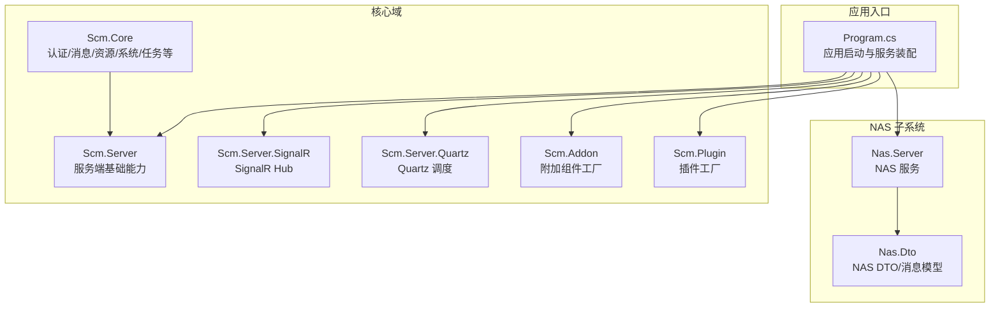
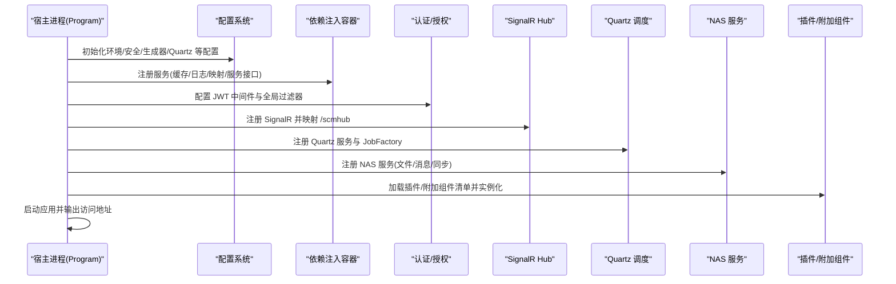
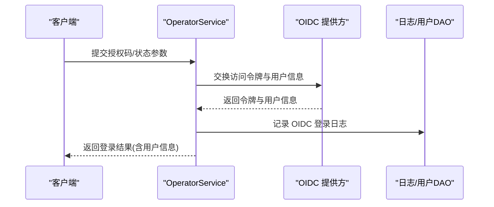
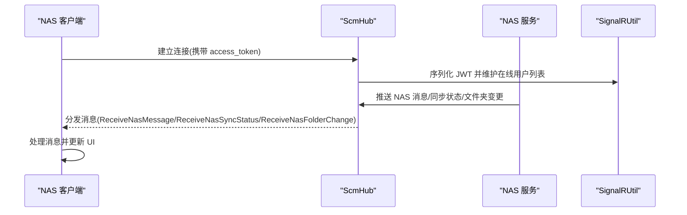
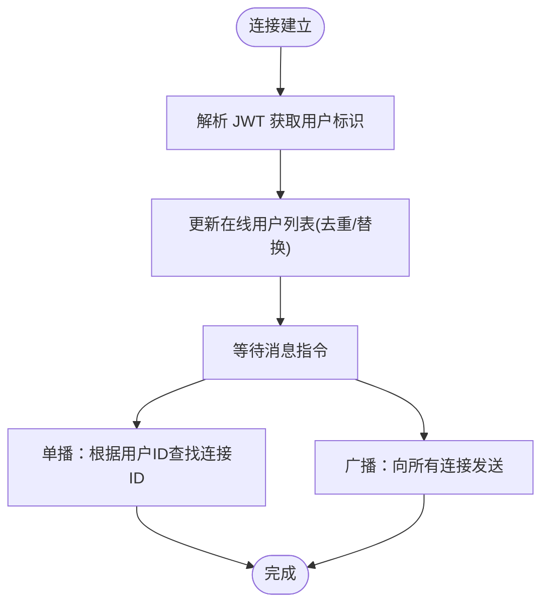
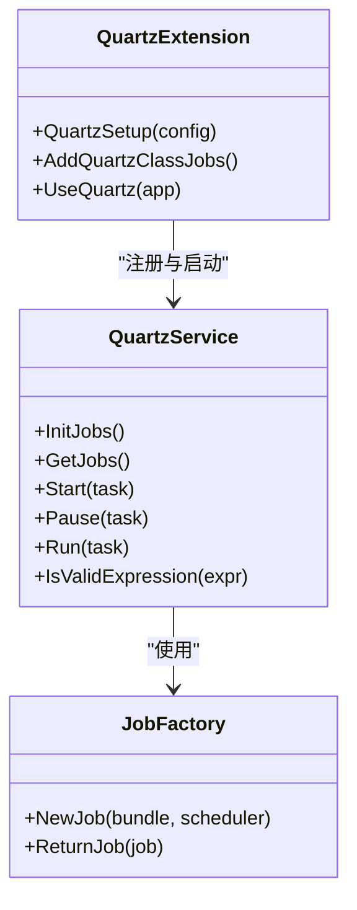
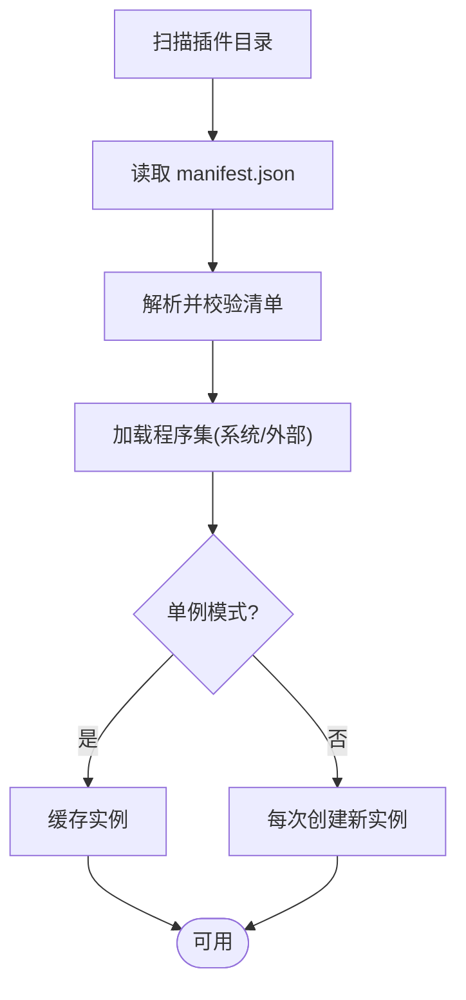
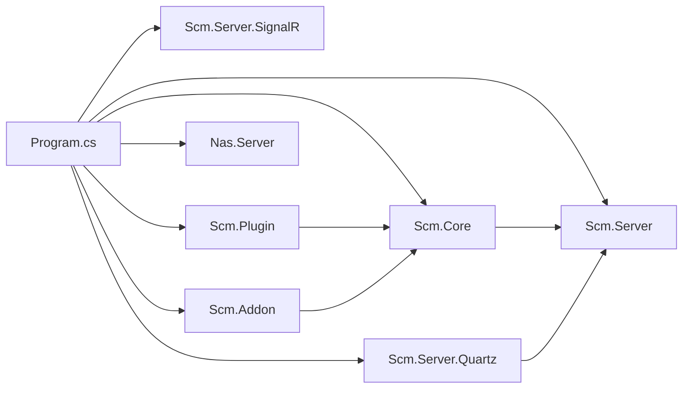

# 核心特性

<cite>
**本文引用的文件**
- [Program.cs](file://Scm.Net/Program.cs)
- [Scm.Core.csproj](file://Scm.Core/Scm.Core.csproj)
- [Scm.Server.csproj](file://Scm.Server/Scm.Server.csproj)
- [Scm.Plugin.csproj](file://Scm.Plugin/Scm.Plugin.csproj)
- [Scm.Server.Quartz.csproj](file://Scm.Server.Quartz/Scm.Server.Quartz.csproj)
- [ScmHub.cs](file://Scm.Server.SignalR/Hubs/ScmHub.cs)
- [QuartzExtension.cs](file://Scm.Server.Quartz/QuartzExtension.cs)
- [QuartzService.cs](file://Scm.Server.Quartz/QuartzService.cs)
- [JobFactory.cs](file://Scm.Server.Quartz/JobFactory.cs)
- [AddonFactory.cs](file://Scm.Addon/AddonFactory.cs)
- [PluginFactory.cs](file://Scm.Plugin/PluginFactory.cs)
- [Manifest.cs（插件）](file://Scm.Plugin/Manifest.cs)
- [Manifest.cs（附加组件）](file://Scm.Addon/Manifest.cs)
- [ScmLoginEnum.cs](file://Scm.Common/Enums/ScmLoginEnum.cs)
- [OtpConfig.cs](file://Scm.Core/Login/Otp/OtpConfig.cs)
- [OtpResult.cs](file://Scm.Core/Login/Otp/OtpResult.cs)
- [OperatorService.cs](file://Scm.Core/Operator/OperatorService.cs)
- [ScmUrUserOtpService.cs](file://Scm.Core/Ur/UserOtp/ScmUrUserOtpService.cs)
- [NasMessageDto.cs](file://Nas.Dto/Msg/NasMessageDto.cs)
- [ClientExample.md](file://Nas.Server/Msg/ClientExample.md)
- [Nas.Server.csproj](file://Nas.Server/Nas.Server.csproj)
- [SignalRUtil.cs](file://Scm.Core/Msg/SignalRUtil.cs)
</cite>

## 目录
1. [简介](#简介)
2. [项目结构](#项目结构)
3. [核心组件](#核心组件)
4. [架构总览](#架构总览)
5. [详细组件分析](#详细组件分析)
6. [依赖关系分析](#依赖关系分析)
7. [性能考量](#性能考量)
8. [故障排查指南](#故障排查指南)
9. [结论](#结论)
10. [附录](#附录)

## 简介
本文件面向 Scm.Net 企业级应用开发框架，系统性梳理并深入解析其核心特性与实现机制，涵盖：
- 多认证支持：密码认证、一次性验证码（OTP，含TOTP/HOTP）、社交登录（OAuth/OIDC/SAML/LDAP）等
- 基于 NAS 协议的文件管理与实时消息推送
- 基于 SignalR 的实时通信
- Quartz.NET 任务调度
- 插件与附加组件扩展体系

通过对各模块的功能说明、技术实现原理、使用场景与配置要点进行逐一剖析，并给出它们如何协同工作的整体视图，帮助开发者快速理解并高效落地。

## 项目结构
Scm.Net 采用分层与领域驱动相结合的组织方式，核心由“服务端入口”、“核心业务域”、“基础设施与扩展”三大部分组成：
- 服务端入口：负责环境初始化、配置装配、中间件与路由注册、SignalR 映射、Quartz 启动等
- 核心业务域：包含认证、消息、资源、系统、任务等子域，支撑企业应用的通用能力
- 基础设施与扩展：提供缓存、日志、信号、任务调度、插件与附加组件加载等通用能力

图表来源
- [Program.cs:33-258](file://Scm.Net/Program.cs#L33-L258)
- [Scm.Core.csproj:10-25](file://Scm.Core/Scm.Core.csproj#L10-L25)
- [Scm.Server.csproj:10-29](file://Scm.Server/Scm.Server.csproj#L10-L29)
- [Scm.Server.Quartz.csproj:10-22](file://Scm.Server.Quartz/Scm.Server.Quartz.csproj#L10-L22)
- [Nas.Server.csproj:10-27](file://Nas.Server/Nas.Server.csproj#L10-L27)

章节来源
- [Program.cs:33-258](file://Scm.Net/Program.cs#L33-L258)

## 核心组件
本节从“多认证支持、NAS 文件管理、SignalR 实时通信、Quartz 任务调度、插件与附加组件扩展”五个维度，逐项说明功能定位、实现要点与典型使用场景。

- 多认证支持
  - 密码认证：基于用户名/口令的登录流程，结合 JWT 中间件与全局过滤器实现统一鉴权
  - OTP 认证：支持 TOTP/HOTP，可配置位数、算法、模板与提供商（邮件/短信），并生成二维码/URI
  - 社交登录：支持 OAuth/OIDC/SAML/LDAP 等协议，统一入口由 OperatorService 统一编排
  - 使用场景：企业内网/混合办公、多终端登录、合规审计与二次验证

- 基于 NAS 协议的文件管理系统
  - 功能：文件/目录操作、同步状态跟踪、变更事件广播
  - 技术：服务端通过 SignalR 推送消息，客户端示例覆盖 .NET 与 JavaScript
  - 使用场景：跨平台文件同步、实时状态反馈、离线后恢复

- 基于 SignalR 的实时通信
  - 功能：在线用户管理、单播/广播消息、强制下线通知
  - 技术：Hub 维护连接与用户映射，结合缓存与 JWT 校验
  - 使用场景：消息提醒、通知中心、会话管理

- Quartz.NET 任务调度
  - 功能：基于 Cron 表达式的定时任务、动态启停、日志与作业持久化
  - 技术：JobFactory 注入容器生命周期，自动扫描 ICustomJob 实现
  - 使用场景：数据导入导出、报表生成、外部接口轮询

- 插件与附加组件扩展体系
  - 功能：按目录结构加载插件/附加组件，支持单例/多实例、反射加载
  - 技术：Manifest 描述元数据，Factory 负责装配与实例化
  - 使用场景：业务能力模块化、第三方能力接入、运行期扩展

章节来源
- [ScmLoginEnum.cs:6-62](file://Scm.Common/Enums/ScmLoginEnum.cs#L6-L62)
- [OtpConfig.cs:10-56](file://Scm.Core/Login/Otp/OtpConfig.cs#L10-L56)
- [OtpResult.cs:3-34](file://Scm.Core/Login/Otp/OtpResult.cs#L3-L34)
- [OperatorService.cs:441-504](file://Scm.Core/Operator/OperatorService.cs#L441-L504)
- [NasMessageDto.cs:70-168](file://Nas.Dto/Msg/NasMessageDto.cs#L70-L168)
- [ClientExample.md:1-203](file://Nas.Server/Msg/ClientExample.md#L1-L203)
- [ScmHub.cs:25-153](file://Scm.Server.SignalR/Hubs/ScmHub.cs#L25-L153)
- [QuartzExtension.cs:17-90](file://Scm.Server.Quartz/QuartzExtension.cs#L17-L90)
- [QuartzService.cs:13-134](file://Scm.Server.Quartz/QuartzService.cs#L13-L134)
- [JobFactory.cs:8-40](file://Scm.Server.Quartz/JobFactory.cs#L8-L40)
- [AddonFactory.cs:6-145](file://Scm.Addon/AddonFactory.cs#L6-L145)
- [PluginFactory.cs:8-147](file://Scm.Plugin/PluginFactory.cs#L8-L147)
- [Manifest.cs（插件）:5-84](file://Scm.Plugin/Manifest.cs#L5-L84)
- [Manifest.cs（附加组件）:5-84](file://Scm.Addon/Manifest.cs#L5-L84)

## 架构总览
下图展示了 Scm.Net 在启动阶段的关键装配与运行时交互，体现多认证、NAS、SignalR、Quartz、插件/附加组件的协同关系。

图表来源
- [Program.cs:33-258](file://Scm.Net/Program.cs#L33-L258)
- [Scm.Server.Quartz.csproj:10-14](file://Scm.Server.Quartz/Scm.Server.Quartz.csproj#L10-L14)
- [Nas.Server.csproj:10-15](file://Nas.Server/Nas.Server.csproj#L10-L15)

章节来源
- [Program.cs:33-258](file://Scm.Net/Program.cs#L33-L258)

## 详细组件分析

### 多认证支持
- 设计要点
  - 登录模式枚举覆盖密码、OTP、社交与多因子等多种模式
  - OTP 配置支持 TOTP/HOTP，可配置位数、算法、模板与邮件/短信提供商
  - 社交登录通过统一入口编排 OIDC/OAuth/SAML/LDAP 流程
- 关键流程（OIDC 登录）
  - 客户端提交授权码，服务端换取访问令牌与用户信息
  - 校验用户与绑定关系，记录日志并返回登录响应
- 使用场景
  - 企业内网双因素登录、移动端扫码登录、第三方账号一键登录

图表来源
- [OperatorService.cs:441-504](file://Scm.Core/Operator/OperatorService.cs#L441-L504)

章节来源
- [ScmLoginEnum.cs:6-62](file://Scm.Common/Enums/ScmLoginEnum.cs#L6-L62)
- [OtpConfig.cs:10-56](file://Scm.Core/Login/Otp/OtpConfig.cs#L10-L56)
- [OtpResult.cs:3-34](file://Scm.Core/Login/Otp/OtpResult.cs#L3-L34)
- [OperatorService.cs:441-504](file://Scm.Core/Operator/OperatorService.cs#L441-L504)
- [ScmUrUserOtpService.cs:87-117](file://Scm.Core/Ur/UserOtp/ScmUrUserOtpService.cs#L87-L117)

### 基于 NAS 协议的文件管理系统与实时消息
- 功能说明
  - 文件/目录变更、同步状态与消息推送
  - 通过 SignalR 将 NAS 消息推送到客户端
- 客户端示例
  - 提供 .NET 与 JavaScript 客户端示例，演示连接、订阅与断开流程
- 使用场景
  - 跨平台文件同步、实时状态反馈、离线后恢复

图表来源
- [ScmHub.cs:25-153](file://Scm.Server.SignalR/Hubs/ScmHub.cs#L25-L153)
- [SignalRUtil.cs:10-34](file://Scm.Core/Msg/SignalRUtil.cs#L10-L34)
- [ClientExample.md:23-129](file://Nas.Server/Msg/ClientExample.md#L23-L129)
- [NasMessageDto.cs:70-168](file://Nas.Dto/Msg/NasMessageDto.cs#L70-L168)

章节来源
- [NasMessageDto.cs:70-168](file://Nas.Dto/Msg/NasMessageDto.cs#L70-L168)
- [ClientExample.md:1-203](file://Nas.Server/Msg/ClientExample.md#L1-L203)
- [ScmHub.cs:25-153](file://Scm.Server.SignalR/Hubs/ScmHub.cs#L25-L153)
- [SignalRUtil.cs:10-34](file://Scm.Core/Msg/SignalRUtil.cs#L10-L34)

### 基于 SignalR 的实时通信
- 功能说明
  - 在线用户管理：连接建立时登记，断开时移除
  - 单播/广播：向指定用户或全体发送消息
  - 强制下线：服务端触发 KickOut 事件
- 技术实现
  - Hub 方法名约定：SendKickOut、SendMessage、SendNotice
  - 通过缓存维护在线用户列表，结合 JWT 校验用户身份

图表来源
- [ScmHub.cs:25-153](file://Scm.Server.SignalR/Hubs/ScmHub.cs#L25-L153)

章节来源
- [ScmHub.cs:25-153](file://Scm.Server.SignalR/Hubs/ScmHub.cs#L25-L153)

### Quartz.NET 任务调度
- 功能说明
  - 支持 DLL 方法与 API 客户端两类作业
  - Cron 表达式调度、作业启停控制、日志与持久化
- 关键实现
  - QuartzExtension：注册服务、选择日志/作业存储（文件/数据库）
  - JobFactory：将 Quartz 作业生命周期托管到 ASP.NET Core 容器
  - QuartzService：初始化作业、调度触发器、按组运行/暂停/启动

图表来源
- [QuartzExtension.cs:17-90](file://Scm.Server.Quartz/QuartzExtension.cs#L17-L90)
- [QuartzService.cs:13-134](file://Scm.Server.Quartz/QuartzService.cs#L13-L134)
- [JobFactory.cs:8-40](file://Scm.Server.Quartz/JobFactory.cs#L8-L40)

章节来源
- [QuartzExtension.cs:17-90](file://Scm.Server.Quartz/QuartzExtension.cs#L17-L90)
- [QuartzService.cs:13-134](file://Scm.Server.Quartz/QuartzService.cs#L13-L134)
- [JobFactory.cs:8-40](file://Scm.Server.Quartz/JobFactory.cs#L8-L40)

### 插件与附加组件扩展体系
- 功能说明
  - 通过目录下的 manifest.json 描述插件/附加组件元数据
  - 支持系统内置与外部程序集两种加载方式
  - 单例/多实例模式，按需反射创建实例
- 关键实现
  - Manifest：type/name/title/dll/uri/entry/args/ver/singleton 等字段
  - Factory：扫描目录、读取清单、加载程序集、实例化对象

图表来源
- [PluginFactory.cs:12-147](file://Scm.Plugin/PluginFactory.cs#L12-L147)
- [AddonFactory.cs:10-145](file://Scm.Addon/AddonFactory.cs#L10-L145)
- [Manifest.cs（插件）:5-84](file://Scm.Plugin/Manifest.cs#L5-L84)
- [Manifest.cs（附加组件）:5-84](file://Scm.Addon/Manifest.cs#L5-L84)

章节来源
- [PluginFactory.cs:12-147](file://Scm.Plugin/PluginFactory.cs#L12-L147)
- [AddonFactory.cs:10-145](file://Scm.Addon/AddonFactory.cs#L10-L145)
- [Manifest.cs（插件）:5-84](file://Scm.Plugin/Manifest.cs#L5-L84)
- [Manifest.cs（附加组件）:5-84](file://Scm.Addon/Manifest.cs#L5-L84)

## 依赖关系分析
- 组件耦合与内聚
  - Program 作为装配中枢，集中注册认证、缓存、Swagger、SignalR、Quartz、插件/附加组件等
  - 核心域通过服务接口与基础设施解耦，便于替换与扩展
- 外部依赖与集成点
  - Quartz：Microsoft.Extensions.Http、Quartz、Quartz.AspNetCore
  - SignalR：Microsoft.AspNetCore.SignalR
  - 数据库：SqlSugarCore
  - 日志：Serilog
- 潜在循环依赖
  - 插件/附加组件与核心域通过 Manifest 与反射弱耦合，避免直接引用导致循环

图表来源
- [Program.cs:33-258](file://Scm.Net/Program.cs#L33-L258)
- [Scm.Core.csproj:10-25](file://Scm.Core/Scm.Core.csproj#L10-L25)
- [Scm.Server.csproj:10-29](file://Scm.Server/Scm.Server.csproj#L10-L29)
- [Scm.Server.Quartz.csproj:10-14](file://Scm.Server.Quartz/Scm.Server.Quartz.csproj#L10-L14)
- [Nas.Server.csproj:10-15](file://Nas.Server/Nas.Server.csproj#L10-L15)

章节来源
- [Program.cs:33-258](file://Scm.Net/Program.cs#L33-L258)
- [Scm.Core.csproj:10-25](file://Scm.Core/Scm.Core.csproj#L10-L25)
- [Scm.Server.csproj:10-29](file://Scm.Server/Scm.Server.csproj#L10-L29)
- [Scm.Server.Quartz.csproj:10-14](file://Scm.Server.Quartz/Scm.Server.Quartz.csproj#L10-L14)
- [Nas.Server.csproj:10-15](file://Nas.Server/Nas.Server.csproj#L10-L15)

## 性能考量
- SignalR
  - 在线用户列表使用内存缓存，建议结合分布式缓存以支持横向扩展
  - 消息序列化采用自定义 JSON 选项，减少循环引用与空值序列化开销
- Quartz
  - JobFactory 将作业生命周期托管容器，避免手动释放造成资源泄漏
  - Cron 表达式校验与作业持久化可降低误配置风险
- NAS
  - 客户端示例提供跨平台实现，建议在高并发场景下优化连接池与消息批处理
- 插件/附加组件
  - 清单解析与程序集加载仅在启动阶段执行，运行期通过缓存复用实例

## 故障排查指南
- 认证相关
  - OIDC 授权码交换失败：检查回调地址、客户端密钥与提供方可达性
  - OTP 校验失败：核对位数、算法、时间偏移与模板参数
- SignalR
  - 连接无法建立：确认 access_token 有效、JWT 中间件顺序正确
  - 消息未送达：检查在线用户列表是否包含目标用户、连接ID是否匹配
- Quartz
  - 作业未执行：确认 Cron 表达式有效性、作业状态为 Running、调度器已启动
  - 作业异常：查看日志服务（文件/数据库）与作业持久化记录
- NAS
  - 客户端收不到消息：确认 Hub 地址与访问权限、网络连通性
- 插件/附加组件
  - 加载失败：检查 manifest.json 结构、程序集路径与权限

章节来源
- [OperatorService.cs:441-504](file://Scm.Core/Operator/OperatorService.cs#L441-L504)
- [OtpResult.cs:18-33](file://Scm.Core/Login/Otp/OtpResult.cs#L18-L33)
- [ScmHub.cs:25-153](file://Scm.Server.SignalR/Hubs/ScmHub.cs#L25-L153)
- [QuartzService.cs:36-134](file://Scm.Server.Quartz/QuartzService.cs#L36-L134)
- [ClientExample.md:1-203](file://Nas.Server/Msg/ClientExample.md#L1-L203)
- [PluginFactory.cs:12-147](file://Scm.Plugin/PluginFactory.cs#L12-L147)
- [AddonFactory.cs:10-145](file://Scm.Addon/AddonFactory.cs#L10-L145)

## 结论
Scm.Net 通过清晰的分层设计与模块化能力，为企业应用提供了从认证、文件管理、实时通信到任务调度与扩展机制的完整解决方案。开发者可在统一的启动流程与配置体系下，快速集成多认证策略、构建 NAS 文件同步与消息推送、启用 Quartz 调度，并通过插件/附加组件实现运行期扩展，显著提升开发效率与系统可维护性。

## 附录
- 配置与使用示例索引
  - 多认证：参考登录模式枚举与 OTP 配置项
  - OIDC 登录：参考服务端登录流程与客户端示例
  - SignalR：参考 Hub 方法与客户端示例
  - Quartz：参考扩展方法与作业接口
  - NAS：参考消息模型与客户端示例
  - 插件/附加组件：参考清单格式与工厂加载流程

章节来源
- [ScmLoginEnum.cs:6-62](file://Scm.Common/Enums/ScmLoginEnum.cs#L6-L62)
- [OtpConfig.cs:10-56](file://Scm.Core/Login/Otp/OtpConfig.cs#L10-L56)
- [OperatorService.cs:441-504](file://Scm.Core/Operator/OperatorService.cs#L441-L504)
- [ScmHub.cs:25-153](file://Scm.Server.SignalR/Hubs/ScmHub.cs#L25-L153)
- [QuartzExtension.cs:17-90](file://Scm.Server.Quartz/QuartzExtension.cs#L17-L90)
- [NasMessageDto.cs:70-168](file://Nas.Dto/Msg/NasMessageDto.cs#L70-L168)
- [ClientExample.md:1-203](file://Nas.Server/Msg/ClientExample.md#L1-L203)
- [Manifest.cs（插件）:5-84](file://Scm.Plugin/Manifest.cs#L5-L84)
- [Manifest.cs（附加组件）:5-84](file://Scm.Addon/Manifest.cs#L5-L84)