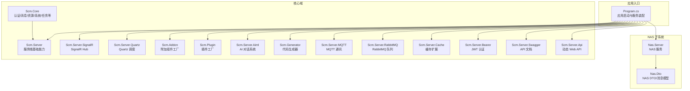
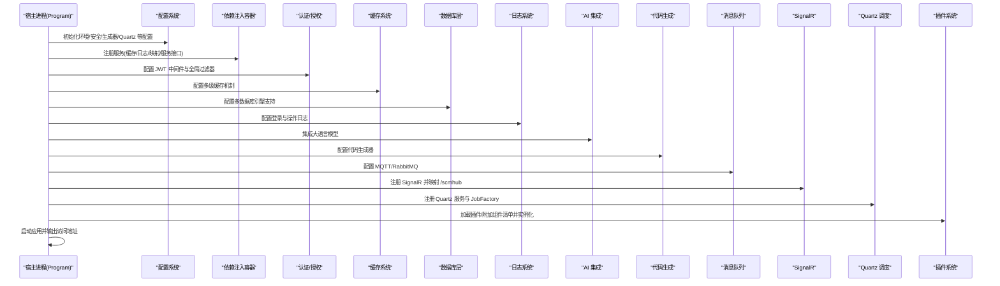
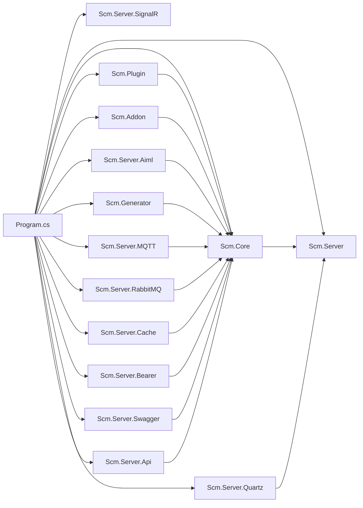

# 核心特性

<cite>
**本文引用的文件**
- [Program.cs](file://Scm.Net/Program.cs)
- [README.md](file://README.md)
- [README.en.md](file://README.en.md)
- [appsettings.json](file://Scm.Net/appsettings.json)
- [Scm.Core.csproj](file://Scm.Core/Scm.Core.csproj)
- [Scm.Server.csproj](file://Scm.Server/Scm.Server.csproj)
- [Scm.Plugin.csproj](file://Scm.Plugin/Scm.Plugin.csproj)
- [Scm.Server.Quartz.csproj](file://Scm.Server.Quartz/Scm.Server.Quartz.csproj)
- [Scm.Server.MQTT.csproj](file://Scm.Server.MQTT/Scm.Server.MQTT.csproj)
- [Scm.Server.RabbitMQ.csproj](file://Scm.Server.RabbitMQ/Scm.Server.RabbitMQ.csproj)
- [Scm.Server.SignalR.csproj](file://Scm.Server.SignalR/Scm.Server.SignalR.csproj)
- [Scm.Server.Swagger.csproj](file://Scm.Server.Swagger/Scm.Server.Swagger.csproj)
- [Scm.Generator.csproj](file://Scm.Generator/Scm.Generator.csproj)
- [Scm.Server.Aiml.csproj](file://Scm.Server.Aiml/Scm.Server.Aiml.csproj)
- [Scm.Server.Bearer.csproj](file://Scm.Server.Bearer/Scm.Server.Bearer.csproj)
- [Scm.Server.Cache.csproj](file://Scm.Server.Cache/Scm.Server.Cache.csproj)
- [Scm.Server.Dao.csproj](file://Scm.Server.Dao/Scm.Server.Dao.csproj)
- [Scm.Plugin.Image.csproj](file://Scm.Plugin.Image/Scm.Plugin.Image.csproj)
- [Scm.Plugin.Audio.csproj](file://Scm.Plugin.Audio/Scm.Plugin.Audio.csproj)
- [Scm.Plugin.Video.csproj](file://Scm.Plugin.Video/Scm.Plugin.Video.csproj)
- [Scm.Addon.csproj](file://Scm.Addon/Scm.Addon.csproj)
- [Scm.Server.Api.csproj](file://Scm.Server.Api/Scm.Server.Api.csproj)
- [Scm.Server.Quartz/QuartzExtension.cs](file://Scm.Server.Quartz/QuartzExtension.cs)
- [Scm.Server.Quartz/QuartzService.cs](file://Scm.Server.Quartz/QuartzService.cs)
- [Scm.Server.Quartz/JobFactory.cs](file://Scm.Server.Quartz/JobFactory.cs)
- [Scm.Server.Quartz/Config/QuartzConfig.cs](file://Scm.Server.Quartz/Config/QuartzConfig.cs)
- [Scm.Server.MQTT/MQTT/MqttBrokerConfig.cs](file://Scm.Server.MQTT/MQTT/MqttBrokerConfig.cs)
- [Scm.Server.RabbitMQ/RabbitMQ/RabbitMQConfig.cs](file://Scm.Server.RabbitMQ/RabbitMQ/RabbitMQConfig.cs)
- [Scm.Server.Cache/Server/CacheConfig.cs](file://Scm.Server.Cache/Server/CacheConfig.cs)
- [Scm.Server.Swagger/Config/SwaggerConfig.cs](file://Scm.Server.Swagger/Config/SwaggerConfig.cs)
- [Scm.Server.Bearer/Jwt/JwtConstant.cs](file://Scm.Server.Bearer/Jwt/JwtConstant.cs)
- [Scm.Server.Api/DynamicWebApi/DynamicWebApiServiceExtensions.cs](file://Scm.Server.Api/DynamicWebApi/DynamicWebApiServiceExtensions.cs)
- [Scm.Generator/GeneratorHelper.cs](file://Scm.Generator/GeneratorHelper.cs)
- [Scm.Server.Aiml/Config/AimlConfig.cs](file://Scm.Server.Aiml/Config/AimlConfig.cs)
- [ScmHub.cs](file://Scm.Server.SignalR/Hubs/ScmHub.cs)
- [AddonFactory.cs](file://Scm.Addon/AddonFactory.cs)
- [PluginFactory.cs](file://Scm.Plugin/PluginFactory.cs)
- [Manifest.cs（插件）](file://Scm.Plugin/Manifest.cs)
- [Manifest.cs（附加组件）](file://Scm.Addon/Manifest.cs)
- [ScmLoginEnum.cs](file://Scm.Common/Enums/ScmLoginEnum.cs)
- [OtpConfig.cs](file://Scm.Core/Login/Otp/OtpConfig.cs)
- [OtpResult.cs](file://Scm.Core/Login/Otp/OtpResult.cs)
- [OperatorService.cs](file://Scm.Core/Operator/OperatorService.cs)
- [ScmUrUserOtpService.cs](file://Scm.Core/Ur/UserOtp/ScmUrUserOtpService.cs)
- [NasMessageDto.cs](file://Nas.Dto/Msg/NasMessageDto.cs)
- [ClientExample.md](file://Nas.Server/Msg/ClientExample.md)
- [Nas.Server.csproj](file://Nas.Server/Nas.Server.csproj)
- [SignalRUtil.cs](file://Scm.Core/Msg/SignalRUtil.cs)
</cite>

## 更新摘要
**所做更改**
- 基于 README.md 和 README.en.md 的核心功能章节重大扩展，从原有的简要描述扩展到包含19个主要功能特性的详细说明
- 新增了数据库支持、缓存机制、日志系统、AI集成、代码生成、权限管理、消息系统、MQTT、RabbitMQ、SignalR、Quartz、图像处理插件、动态插件等完整功能列表
- 更新了项目结构和架构说明，反映了更完整的功能特性
- 增强了配置选项和使用示例的详细程度

## 目录
1. [简介](#简介)
2. [项目结构](#项目结构)
3. [核心组件](#核心组件)
4. [架构总览](#架构总览)
5. [详细组件分析](#详细组件分析)
6. [依赖关系分析](#依赖关系分析)
7. [性能考量](#性能考量)
8. [故障排查指南](#故障排查指南)
9. [结论](#结论)
10. [附录](#附录)

## 简介
Scm.Net 是一款基于 **.NET 10.0** 及 **Vue 3.0** 构架的企业级快速开发框架，专为供应链系统及企业信息化系统设计，支持异构应用场景需求。该框架提供完整的解决方案，涵盖19个主要功能特性，包括多认证支持、数据库引擎、缓存机制、日志系统、AI集成、代码生成、权限管理、消息系统、MQTT、RabbitMQ、SignalR、Quartz、图像处理插件、动态插件等。

框架采用前后端分离模式，后端基于 .NET 10.0 开发，兼容 .NET 6/7/8/9/10 运行时，前端基于 Vue 3.0 及 Element Plus 开发，支持 i18n 多语言。系统无平台依赖，可直接在多平台（Windows、macOS、Linux、HarmonyOS 等）开发与运行，响应式布局支持多种设备终端（电脑、平板、手机）。

**章节来源**
- [README.md:10-26](file://README.md#L10-L26)
- [README.en.md:8-20](file://README.en.md#L8-L20)

## 项目结构
Scm.Net 采用分层与领域驱动相结合的组织方式，核心由"服务端入口"、"核心业务域"、"基础设施与扩展"三大部分组成：

- **服务端入口**：负责环境初始化、配置装配、中间件与路由注册、SignalR 映射、Quartz 启动等
- **核心业务域**：包含认证、消息、资源、系统、任务等子域，支撑企业应用的通用能力
- **基础设施与扩展**：提供缓存、日志、信号、任务调度、插件与附加组件加载等通用能力

**图表来源**
- [Program.cs:33-258](file://Scm.Net/Program.cs#L33-L258)
- [Scm.Core.csproj:10-25](file://Scm.Core/Scm.Core.csproj#L10-L25)
- [Scm.Server.csproj:10-29](file://Scm.Server/Scm.Server.csproj#L10-L29)
- [Scm.Server.Quartz.csproj:10-22](file://Scm.Server.Quartz/Scm.Server.Quartz.csproj#L10-L22)
- [Nas.Server.csproj:10-27](file://Nas.Server/Nas.Server.csproj#L10-L27)

**章节来源**
- [Program.cs:33-258](file://Scm.Net/Program.cs#L33-L258)
- [README.md:40-66](file://README.md#L40-L66)
- [README.en.md:34-56](file://README.en.md#L34-L56)

## 核心组件
基于 README.md 和 README.en.md 的扩展内容，Scm.Net 的核心特性现已涵盖以下19个主要功能模块：

### 1. 多种登录方式支持
- **账户登录**：基于用户名/口令的传统认证方式
- **手机登录**：支持手机号码验证登录
- **邮件登录**：通过邮箱地址进行身份验证
- **第三方 OAuth**：支持 OAuth 第三方认证集成

### 2. 多数据库引擎支持
- **关系型数据库**：MySQL、SQL Server、Oracle、SQLite、MariaDB、PostgreSQL、Firebird
- **NoSQL 数据库**：MongoDB
- **数据库迁移**：支持标准 SQL 引擎的无缝迁移

### 3. 多缓存机制支持
- **内存缓存**：MemoryCache
- **映射缓存**：Map 缓存
- **Redis 缓存**：高性能分布式缓存

### 4. 登录与操作日志系统
- **登录审计**：记录用户登录信息（主机、操作系统、浏览器、终端代码）
- **操作审计**：完整的操作日志追踪
- **终端信息**：详细的用户终端环境记录

### 5. AI 大语言模型集成
- **DeepSeek**：深度求索 AI
- **华为盘古**：华为云盘古大模型
- **阿里通义千问**：通义实验室 Qwen
- **腾讯元宝**：腾讯混元
- **百度文心一言**：百度文心
- **豆包**：字节跳动豆包
- **ChatGPT**：OpenAI GPT 系列

### 6. 代码自动生成器
- **自定义模板**：支持 Entity、DAO、DTO/VO 等多种模板
- **批量生成**：支持多个文件的批量代码生成
- **下载功能**：生成的代码可直接下载使用

### 7. ID 生成器
- **雪花 ID**：Twitter Snowflake 算法
- **序列 ID**：递增序列号
- **格式 ID**：自定义格式的 ID 生成

### 8. 多级权限管理体系
- **公司管理**：企业级组织架构
- **部门管理**：多层次部门结构
- **岗位管理**：职位层级管理
- **分组管理**：用户分组管理
- **用户管理**：用户基本信息管理
- **角色管理**：权限角色分配

### 9. 全局数据字典与配置参数
- **数据字典**：统一的数据字典管理
- **全局配置**：系统级配置参数管理

### 10. 用户留言与实时反馈
- **用户互动**：支持用户之间的留言功能
- **实时通知**：即时的消息推送与反馈

### 11. 自定义审批流程
- **流程定义**：灵活的审批流程设计
- **节点配置**：审批节点的详细配置
- **表单绑定**：审批表单的动态绑定
- **在线审批**：实时的在线审批处理

### 12. MQTT 轻量级通讯
- **客户端发布/订阅**：标准 MQTT 客户端功能
- **内置 Broker**：集成的 MQTT 服务器
- **IoT 场景**：专为物联网应用优化

### 13. RabbitMQ 消息队列
- **发布者/消费者模式**：标准的消息队列模式
- **异步处理**：支持异步任务处理
- **消息持久化**：确保消息可靠传递

### 14. SignalR 实时推送通讯
- **实时通信**：双向实时消息传输
- **在线用户管理**：用户连接状态管理
- **消息广播**：支持单播和广播消息

### 15. Quartz.NET 定时任务调度
- **Cron 表达式**：支持复杂的定时规则
- **作业管理**：动态的任务启停控制
- **日志记录**：完整的任务执行日志

### 16. 图像处理插件
- **条码生成识别**：支持多种条码格式
- **图片水印**：智能图片水印添加
- **图形验证码**：安全的图形验证码生成
- **头像裁剪**：用户头像的智能裁剪

### 17. 动态插件扩展机制
- **Addon 动态加载**：运行时插件加载
- **插件管理**：插件的生命周期管理
- **扩展能力**：支持第三方能力接入

### 18. Swagger API 文档
- **接口文档**：自动生成的 API 文档
- **文档管理**：支持多版本 API 文档
- **在线测试**：提供在线接口测试功能

### 19. 动态 Web API
- **RESTful 接口**：自动生成 RESTful 风格接口
- **路由配置**：灵活的路由规则配置
- **控制器管理**：动态控制器生成

**章节来源**
- [README.md:74-94](file://README.md#L74-L94)
- [README.en.md:64-83](file://README.en.md#L64-L83)
- [appsettings.json:48-126](file://Scm.Net/appsettings.json#L48-L126)

## 架构总览
下图展示了 Scm.Net 在启动阶段的关键装配与运行时交互，体现19个核心功能模块的协同关系：

**图表来源**
- [Program.cs:33-258](file://Scm.Net/Program.cs#L33-L258)
- [appsettings.json:48-126](file://Scm.Net/appsettings.json#L48-L126)

**章节来源**
- [Program.cs:33-258](file://Scm.Net/Program.cs#L33-L258)

## 详细组件分析

### 多认证支持系统
Scm.Net 提供了完整的多认证支持，包括传统账户认证、移动设备认证、邮件认证和第三方 OAuth 认证。系统通过统一的认证入口编排各种登录方式，支持密码认证、一次性验证码（OTP，含 TOTP/HOTP）、社交登录（OAuth/OIDC/SAML/LDAP）等。

**设计要点**
- 登录模式枚举覆盖密码、OTP、社交与多因子等多种模式
- OTP 配置支持 TOTP/HOTP，可配置位数、算法、模板与邮件/短信提供商
- 社交登录通过统一入口编排 OIDC/OAuth/SAML/LDAP 流程
- JWT 中间件与全局过滤器实现统一鉴权

**使用场景**
- 企业内网/混合办公的多终端登录
- 合规审计与二次验证需求
- 第三方账号的一键登录体验

**章节来源**
- [ScmLoginEnum.cs:6-62](file://Scm.Common/Enums/ScmLoginEnum.cs#L6-L62)
- [OtpConfig.cs:10-56](file://Scm.Core/Login/Otp/OtpConfig.cs#L10-L56)
- [OtpResult.cs:3-34](file://Scm.Core/Login/Otp/OtpResult.cs#L3-L34)
- [OperatorService.cs:441-504](file://Scm.Core/Operator/OperatorService.cs#L441-L504)
- [ScmUrUserOtpService.cs:87-117](file://Scm.Core/Ur/UserOtp/ScmUrUserOtpService.cs#L87-L117)

### 数据库引擎与缓存系统
系统支持多种数据库引擎，包括 MySQL、SQL Server、Oracle、SQLite、MariaDB、PostgreSQL、Firebird 和 MongoDB，同时提供 MemoryCache、Map、Redis 等多种缓存机制。这种设计确保了系统的灵活性和可扩展性。

**数据库支持特性**
- 标准 SQL 引擎的无缝迁移能力
- 单表操作优化，最多不超过两张表
- JSON 格式的数据交互，提升数据可扩展性

**缓存机制特性**
- 多级缓存架构，支持内存和分布式缓存
- 智能缓存策略，提升系统性能
- 缓存配置的灵活管理

**章节来源**
- [README.md:78-79](file://README.md#L78-L79)
- [README.en.md:68-69](file://README.en.md#L68-L69)
- [Scm.Server.Cache/Server/CacheConfig.cs:1-22](file://Scm.Server.Cache/Server/CacheConfig.cs#L1-L22)

### AI 集成与代码生成系统
Scm.Net 集成了多家知名的大语言模型，包括 DeepSeek、华为盘古、阿里通义千问、腾讯元宝、百度文心一言、豆包和 ChatGPT。同时提供强大的代码生成功能，支持自定义模板和批量代码生成。

**AI 集成特性**
- 多模型支持，可根据需求选择合适的 AI 服务
- 智能对话处理，支持自然语言交互
- 模型配置的灵活管理

**代码生成特性**
- 支持 Entity、DAO、DTO/VO 等多种模板类型
- 自定义模板开发，满足特殊需求
- 批量代码生成，提升开发效率
- 生成代码的直接下载功能

**章节来源**
- [README.md:81-82](file://README.md#L81-L82)
- [README.en.md:71-72](file://README.en.md#L71-L72)
- [Scm.Generator/GeneratorHelper.cs:1-17](file://Scm.Generator/GeneratorHelper.cs#L1-L17)

### 权限管理与消息系统
系统提供多级权限管理体系，支持公司、部门、岗位、分组、用户、角色的完整权限控制。同时具备完善的消息系统，支持用户留言、实时反馈和审批流程。

**权限管理特性**
- 多层级组织架构支持
- 灵活的角色权限分配
- 细粒度的权限控制
- 审批流程的自定义配置

**消息系统特性**
- 用户间的实时留言功能
- 系统通知和反馈机制
- 审批流程的消息推送
- 实时状态更新通知

**章节来源**
- [README.md:84-88](file://README.md#L84-L88)
- [README.en.md:74-77](file://README.en.md#L74-L77)

### 通讯与任务调度系统
Scm.Net 提供了完整的通讯和任务调度解决方案，包括 MQTT 轻量级通讯、RabbitMQ 消息队列、SignalR 实时推送和 Quartz.NET 任务调度。

**MQTT 通讯特性**
- 集成的 MQTT Broker，支持内置服务器
- 轻量级通讯协议，适合 IoT 场景
- 客户端发布/订阅功能
- 可配置的身份验证机制

**RabbitMQ 集成特性**
- 标准的发布者/消费者模式
- 消息持久化确保可靠性
- 异步任务处理能力
- 高性能消息传输

**SignalR 实时通讯特性**
- 双向实时消息传输
- 在线用户连接管理
- 单播和广播消息支持
- 强制下线通知功能

**Quartz 任务调度特性**
- Cron 表达式支持复杂定时规则
- 动态作业启停控制
- 作业日志和持久化
- 任务执行状态监控

**章节来源**
- [README.md:89-93](file://README.md#L89-L93)
- [README.en.md:78-83](file://README.en.md#L78-L83)
- [Scm.Server.MQTT/MQTT/MqttBrokerConfig.cs:1-38](file://Scm.Server.MQTT/MQTT/MqttBrokerConfig.cs#L1-L38)
- [Scm.Server.RabbitMQ/RabbitMQ/RabbitMQConfig.cs:1-42](file://Scm.Server.RabbitMQ/RabbitMQ/RabbitMQConfig.cs#L1-L42)

### 插件扩展与图像处理系统
系统提供了强大的插件扩展机制和专业的图像处理功能，支持动态插件加载和丰富的图像处理能力。

**插件扩展特性**
- 动态插件加载机制
- Manifest 清单管理
- 单例和多实例模式支持
- 第三方能力接入

**图像处理功能**
- 条码生成和识别
- 图片水印添加
- 图形验证码生成
- 头像智能裁剪
- 音频和视频处理能力

**章节来源**
- [README.md:94-94](file://README.md#L94-L94)
- [README.en.md:82-83](file://README.en.md#L82-L83)
- [Scm.Plugin.Image/ScmImage.cs](file://Scm.Plugin.Image/ScmImage.cs)

### API 文档与动态 Web API
Scm.Net 提供了完整的 API 文档系统和动态 Web API 功能，支持自动生成 API 文档和 RESTful 接口。

**Swagger 文档特性**
- 自动生成的 API 文档
- 多版本文档管理
- 在线接口测试功能
- 详细的接口说明

**动态 Web API 特性**
- 自动化的 RESTful 接口生成
- 灵活的路由规则配置
- 动态控制器管理
- 支持多种 HTTP 动词

**章节来源**
- [README.md:59-59](file://README.md#L59-L59)
- [README.en.md:50-50](file://README.en.md#L50-L50)
- [Scm.Server.Swagger/Config/SwaggerConfig.cs:1-44](file://Scm.Server.Swagger/Config/SwaggerConfig.cs#L1-L44)
- [Scm.Server.Api/DynamicWebApi/DynamicWebApiServiceExtensions.cs:1-133](file://Scm.Server.Api/DynamicWebApi/DynamicWebApiServiceExtensions.cs#L1-L133)

## 依赖关系分析
Scm.Net 的依赖关系体现了清晰的分层架构和模块化设计：

**核心依赖**
- **ORM 框架**：SqlSugarCore 用于数据访问层
- **JSON 序列化**：Newtonsoft.Json 支持
- **图像处理**：ImageSharp 提供跨平台图像处理能力
- **消息队列**：MQTTnet 和 RabbitMQ.Client
- **任务调度**：Quartz.NET
- **实时通信**：SignalR

**组件耦合与内聚**
- Program 作为装配中枢，集中注册认证、缓存、Swagger、SignalR、Quartz、插件/附加组件等
- 核心域通过服务接口与基础设施解耦，便于替换与扩展
- 外部依赖通过配置系统统一管理

**潜在循环依赖**
- 插件/附加组件与核心域通过 Manifest 与反射弱耦合，避免直接引用导致循环
- 各功能模块通过接口抽象实现松耦合

**图表来源**
- [Program.cs:33-258](file://Scm.Net/Program.cs#L33-L258)
- [Scm.Core.csproj:10-25](file://Scm.Core/Scm.Core.csproj#L10-L25)
- [Scm.Server.csproj:10-29](file://Scm.Server/Scm.Server.csproj#L10-L29)

**章节来源**
- [Program.cs:33-258](file://Scm.Net/Program.cs#L33-L258)

## 性能考量
基于 Scm.Net 的19个核心功能特性，需要考虑以下性能优化策略：

**认证与缓存性能**
- 多级缓存架构，支持内存和分布式缓存
- JWT Token 缓存减少重复验证开销
- 登录日志异步写入，避免阻塞主流程

**数据库性能**
- 单表操作优化，最多两张表关联
- JSON 格式数据传输，减少字段冗余
- 数据库连接池配置优化

**AI 集成性能**
- AI 请求缓存机制
- 异步 AI 处理，避免阻塞主线程
- 模型选择的智能路由

**消息系统性能**
- MQTT Broker 配置优化
- RabbitMQ 消息持久化策略
- SignalR 连接池管理

**任务调度性能**
- Quartz 作业池配置
- Cron 表达式预编译
- 作业执行状态监控

**图像处理性能**
- 图像处理异步执行
- 缓存处理结果
- 批量处理优化

**插件系统性能**
- 插件加载缓存
- 动态加载延迟策略
- 插件生命周期管理

## 故障排查指南
针对 Scm.Net 的19个核心功能特性，提供相应的故障排查指导：

**认证相关问题**
- OIDC 授权码交换失败：检查回调地址、客户端密钥与提供方可达性
- OTP 校验失败：核对位数、算法、时间偏移与模板参数
- JWT Token 过期：检查过期时间配置和刷新机制

**数据库连接问题**
- 连接字符串错误：验证数据库类型和连接参数
- 迁移失败：检查数据库权限和版本兼容性
- 查询性能问题：分析 SQL 执行计划

**缓存系统问题**
- 缓存失效：检查缓存配置和过期策略
- 缓存穿透：实现合理的缓存策略
- 缓存雪崩：分布式缓存一致性

**AI 集成问题**
- 模型调用失败：检查 API 密钥和网络连接
- 响应超时：调整超时配置和重试机制
- 成本控制：监控 API 调用次数和费用

**代码生成问题**
- 模板加载失败：检查模板文件路径和权限
- 生成失败：验证数据库连接和表结构
- 下载问题：检查文件权限和存储空间

**权限管理问题**
- 权限验证失败：检查用户角色和权限配置
- 审批流程异常：查看流程定义和节点配置
- 数据访问限制：验证用户权限和数据范围

**消息系统问题**
- MQTT 连接失败：检查 Broker 配置和网络
- RabbitMQ 消息丢失：验证持久化设置
- SignalR 消息未送达：检查连接状态和用户映射

**任务调度问题**
- Quartz 作业未执行：确认 Cron 表达式和调度器状态
- 作业异常：查看作业日志和异常堆栈
- 任务冲突：检查作业锁和并发控制

**图像处理问题**
- 图像处理失败：检查文件格式和权限
- 插件加载失败：验证插件清单和依赖
- 性能问题：分析处理时间和资源使用

**插件系统问题**
- 插件加载失败：检查 manifest.json 结构和程序集路径
- 插件冲突：验证插件依赖和版本兼容性
- 运行时异常：查看插件日志和错误信息

**章节来源**
- [OperatorService.cs:441-504](file://Scm.Core/Operator/OperatorService.cs#L441-L504)
- [OtpResult.cs:18-33](file://Scm.Core/Login/Otp/OtpResult.cs#L18-L33)
- [ScmHub.cs:25-153](file://Scm.Server.SignalR/Hubs/ScmHub.cs#L25-L153)
- [QuartzService.cs:36-134](file://Scm.Server.Quartz/QuartzService.cs#L36-L134)
- [ClientExample.md:1-203](file://Nas.Server/Msg/ClientExample.md#L1-L203)
- [PluginFactory.cs:12-147](file://Scm.Plugin/PluginFactory.cs#L12-L147)
- [AddonFactory.cs:10-145](file://Scm.Addon/AddonFactory.cs#L10-L145)

## 结论
Scm.Net 通过其19个核心功能特性的完整集成，为企业应用开发提供了从认证、数据库、缓存、日志、AI 集成到代码生成、权限管理、消息系统、MQTT、RabbitMQ、SignalR、Quartz、图像处理插件、动态插件等全方位的解决方案。该框架采用清晰的分层设计与模块化能力，支持多数据库引擎、多缓存机制、多认证方式、多级权限管理，以及丰富的扩展能力。

开发者可以在统一的启动流程与配置体系下，快速集成各种认证策略、构建实时通讯系统、启用任务调度、实现 AI 集成，并通过插件/附加组件实现运行期扩展。这种设计显著提升了开发效率与系统可维护性，为企业数字化转型提供了坚实的技术基础。

## 附录
**配置与使用示例索引**
- **多认证**：参考登录模式枚举与 OTP 配置项
- **数据库配置**：参考 appsettings.json 中的 Sql 配置
- **缓存配置**：参考 appsettings.json 中的 Cache 配置
- **AI 集成**：参考 AimlConfig 配置
- **代码生成**：参考 Generator 配置
- **权限管理**：参考角色和用户管理接口
- **消息系统**：参考 SignalR Hub 和消息服务
- **MQTT 配置**：参考 MqttBrokerConfig
- **RabbitMQ 配置**：参考 RabbitMQConfig
- **任务调度**：参考 QuartzExtension 和 QuartzService
- **图像处理**：参考图像插件 API
- **插件系统**：参考 Manifest.cs 和工厂加载流程
- **API 文档**：参考 Swagger 配置
- **动态 API**：参考 DynamicWebApi 配置

**章节来源**
- [README.md:74-94](file://README.md#L74-L94)
- [README.en.md:64-83](file://README.en.md#L64-L83)
- [appsettings.json:48-126](file://Scm.Net/appsettings.json#L48-L126)
- [ScmLoginEnum.cs:6-62](file://Scm.Common/Enums/ScmLoginEnum.cs#L6-L62)
- [OtpConfig.cs:10-56](file://Scm.Core/Login/Otp/OtpConfig.cs#L10-L56)
- [OperatorService.cs:441-504](file://Scm.Core/Operator/OperatorService.cs#L441-L504)
- [ScmHub.cs:25-153](file://Scm.Server.SignalR/Hubs/ScmHub.cs#L25-L153)
- [QuartzExtension.cs:17-90](file://Scm.Server.Quartz/QuartzExtension.cs#L17-L90)
- [NasMessageDto.cs:70-168](file://Nas.Dto/Msg/NasMessageDto.cs#L70-L168)
- [ClientExample.md:1-203](file://Nas.Server/Msg/ClientExample.md#L1-L203)
- [Manifest.cs（插件）:5-84](file://Scm.Plugin/Manifest.cs#L5-L84)
- [Manifest.cs（附加组件）:5-84](file://Scm.Addon/Manifest.cs#L5-L84)