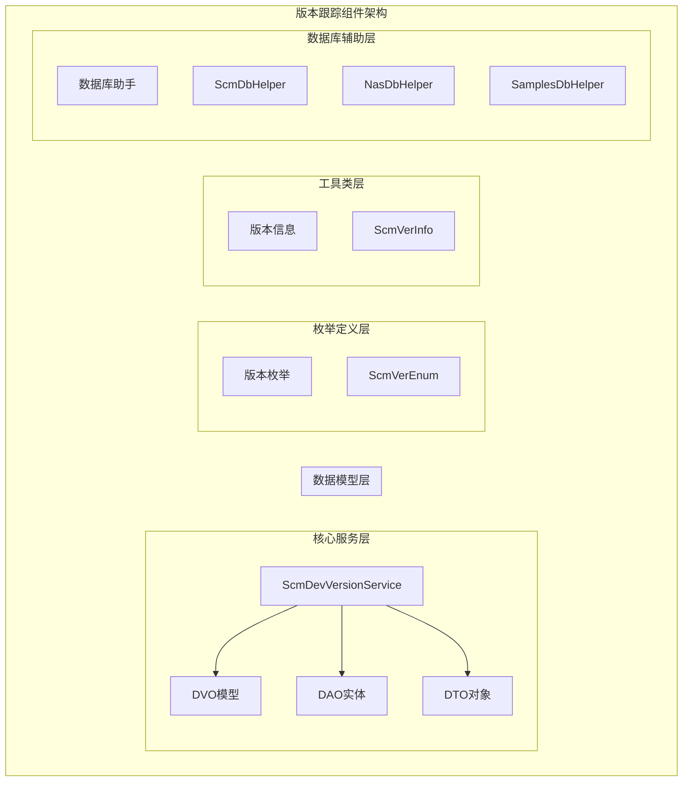
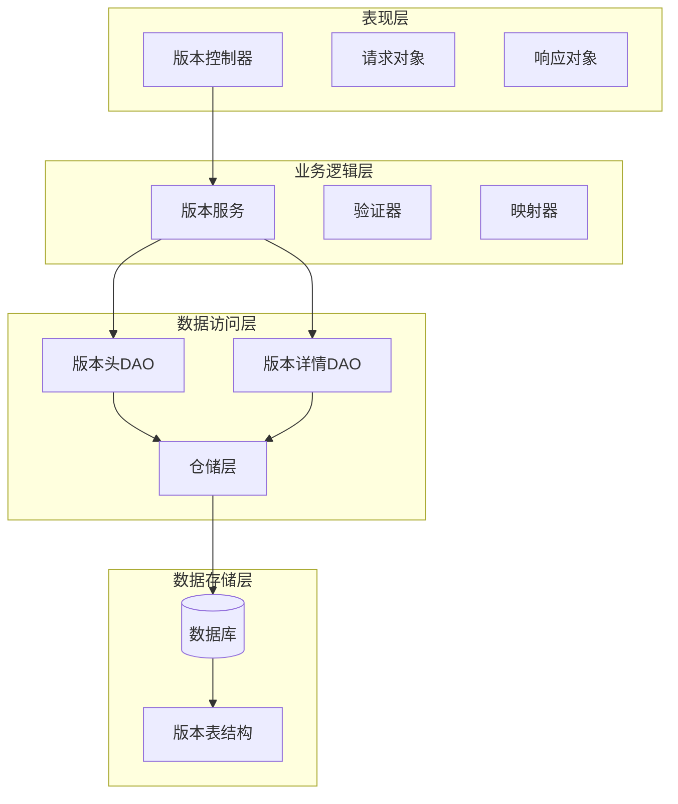
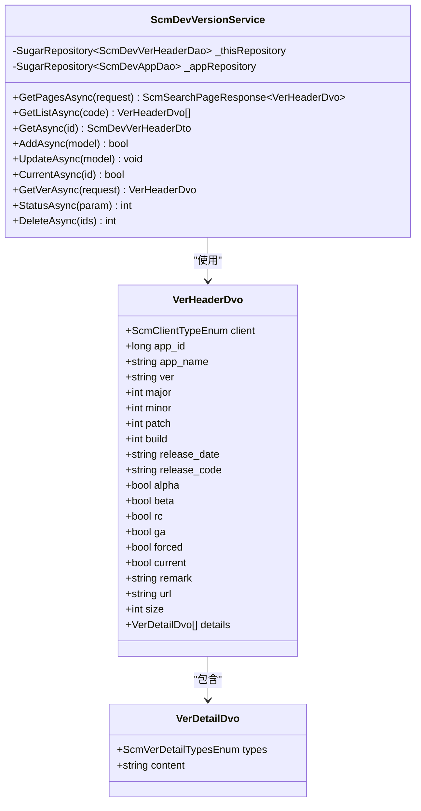
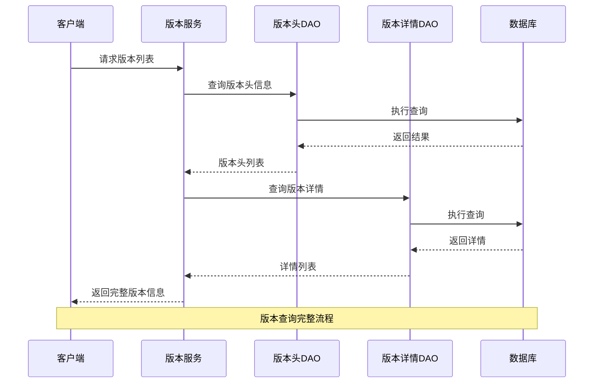
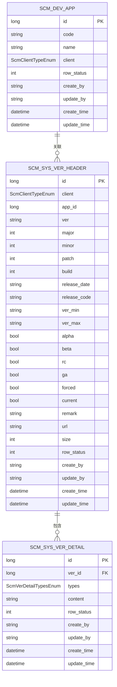
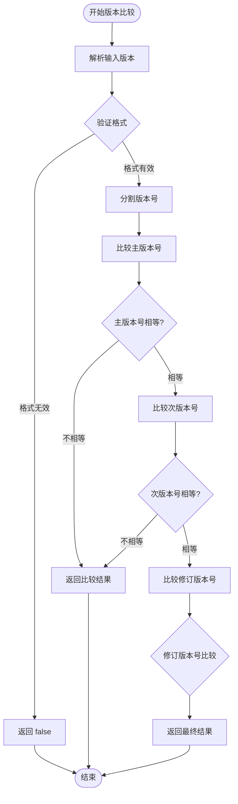
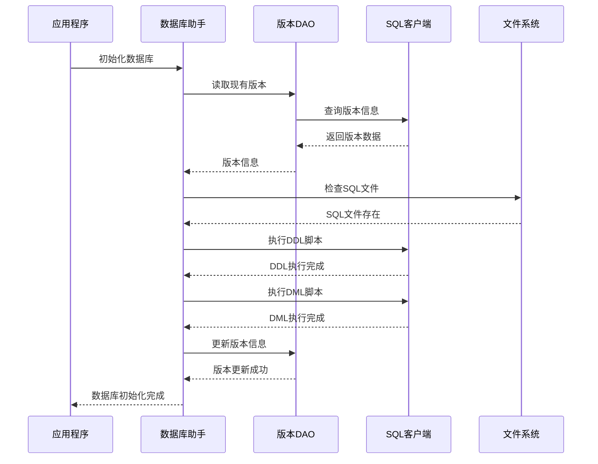
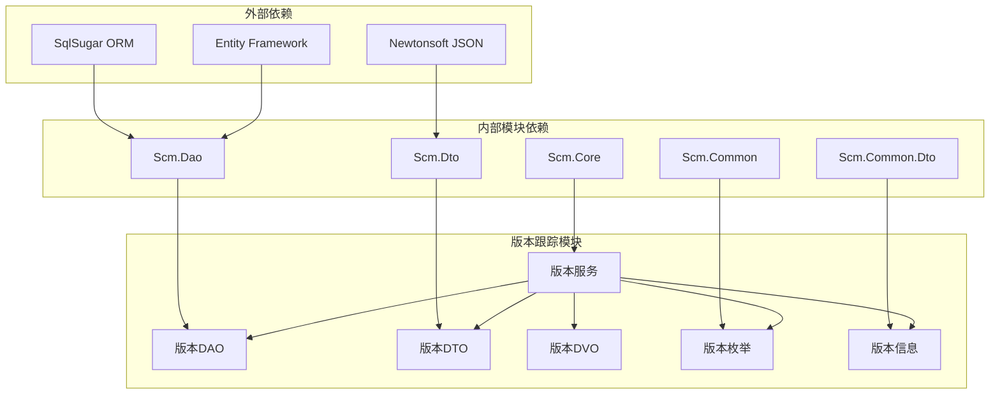

# 版本跟踪组件

<cite>
**本文档引用的文件**
- [ScmDevVersionService.cs](file://Scm.Core/Dev/Version/ScmDevVersionService.cs)
- [VerHeaderDvo.cs](file://Scm.Core/Dev/Version/Dvo/VerHeaderDvo.cs)
- [VerDetailDvo.cs](file://Scm.Core/Dev/Version/Dvo/VerDetailDvo.cs)
- [ScmDevVerHeaderDao.cs](file://Scm.Dao/Dev/ScmDevVerHeaderDao.cs)
- [ScmDevVerDetailDao.cs](file://Scm.Dao/Dev/ScmDevVerDetailDao.cs)
- [ScmDevVerHeaderDto.cs](file://Scm.Dto/Dev/ScmDevVerHeaderDto.cs)
- [ScmDevVerDetailDto.cs](file://Scm.Dto/Dev/ScmDevVerDetailDto.cs)
- [ScmVerEnum.cs](file://Scm.Common/Enums/ScmVerEnum.cs)
- [ScmVerInfo.cs](file://Scm.Common.Dto/ScmVerInfo.cs)
- [SearchRequest.cs](file://Scm.Core/Dev/Version/Dvo/SearchRequest.cs)
- [GetVerRequest.cs](file://Scm.Core/Dev/Version/Dvo/GetVerRequest.cs)
- [ScmVerDao.cs](file://Scm.Server.Dao/ScmVerDao.cs)
- [ScmDbHelper.cs](file://Scm.Dao/ScmDbHelper.cs)
- [NasDbHelper.cs](file://Nas.Dao/NasDbHelper.cs)
- [SamplesDbHelper.cs](file://Samples.Server.Dao/SamplesDbHelper.cs)
</cite>

## 目录
1. [引言](#引言)
2. [项目结构](#项目结构)
3. [核心组件](#核心组件)
4. [架构概览](#架构概览)
5. [详细组件分析](#详细组件分析)
6. [依赖关系分析](#依赖关系分析)
7. [性能考虑](#性能考虑)
8. [故障排除指南](#故障排除指南)
9. [结论](#结论)

## 引言

版本跟踪组件是 Scm.Net 开发框架中的核心功能模块，负责管理系统版本控制、应用升级管理和数据库版本迁移。该组件提供了完整的版本生命周期管理，包括版本信息维护、升级策略配置、版本比较算法和自动迁移机制。

组件采用分层架构设计，包含数据访问层、业务逻辑层和服务接口层，支持多客户端类型的应用版本管理，为开发者提供了统一的版本控制解决方案。

## 项目结构

版本跟踪组件在项目中采用模块化组织方式，主要分布在以下目录结构中：

**图表来源**
- [ScmDevVersionService.cs:1-224](file://Scm.Core/Dev/Version/ScmDevVersionService.cs#L1-L224)
- [ScmDevVerHeaderDao.cs:1-132](file://Scm.Dao/Dev/ScmDevVerHeaderDao.cs#L1-L132)
- [ScmVerEnum.cs:1-23](file://Scm.Common/Enums/ScmVerEnum.cs#L1-L23)

**章节来源**
- [ScmDevVersionService.cs:1-224](file://Scm.Core/Dev/Version/ScmDevVersionService.cs#L1-L224)
- [ScmDevVerHeaderDao.cs:1-132](file://Scm.Dao/Dev/ScmDevVerHeaderDao.cs#L1-L132)
- [ScmDevVerDetailDao.cs:1-32](file://Scm.Dao/Dev/ScmDevVerDetailDao.cs#L1-L32)

## 核心组件

版本跟踪组件由多个核心组件构成，每个组件都有明确的职责分工：

### 1. 版本服务控制器
ScmDevVersionService 是版本管理的核心控制器，提供完整的 CRUD 操作和业务逻辑处理。

### 2. 数据传输对象
包含版本头信息和版本详情的数据传输对象，用于前后端数据交换。

### 3. 数据访问对象
封装了数据库操作逻辑，提供类型安全的数据访问接口。

### 4. 版本信息工具类
提供版本比较、版本解析和版本验证等功能。

**章节来源**
- [ScmDevVersionService.cs:14-27](file://Scm.Core/Dev/Version/ScmDevVersionService.cs#L14-L27)
- [ScmDevVerHeaderDto.cs:10-118](file://Scm.Dto/Dev/ScmDevVerHeaderDto.cs#L10-L118)
- [ScmDevVerHeaderDao.cs:12-131](file://Scm.Dao/Dev/ScmDevVerHeaderDao.cs#L12-L131)

## 架构概览

版本跟踪组件采用经典的三层架构模式，实现了清晰的关注点分离：

**图表来源**
- [ScmDevVersionService.cs:34-45](file://Scm.Core/Dev/Version/ScmDevVersionService.cs#L34-L45)
- [ScmDevVerHeaderDao.cs:11](file://Scm.Dao/Dev/ScmDevVerHeaderDao.cs#L11)
- [ScmDevVerDetailDao.cs:11](file://Scm.Dao/Dev/ScmDevVerDetailDao.cs#L11)

## 详细组件分析

### 版本服务组件

版本服务组件是整个版本跟踪系统的核心，负责处理所有版本相关的业务逻辑。

#### 类结构图

**图表来源**
- [ScmDevVersionService.cs:14-224](file://Scm.Core/Dev/Version/ScmDevVersionService.cs#L14-L224)
- [VerHeaderDvo.cs:9-120](file://Scm.Core/Dev/Version/Dvo/VerHeaderDvo.cs#L9-L120)
- [VerDetailDvo.cs:10-23](file://Scm.Core/Dev/Version/Dvo/VerDetailDvo.cs#L10-L23)

#### 核心业务流程

版本服务组件提供了完整的版本管理流程：

**图表来源**
- [ScmDevVersionService.cs:34-76](file://Scm.Core/Dev/Version/ScmDevVersionService.cs#L34-L76)
- [ScmDevVersionService.cs:185-201](file://Scm.Core/Dev/Version/ScmDevVersionService.cs#L185-L201)

**章节来源**
- [ScmDevVersionService.cs:34-201](file://Scm.Core/Dev/Version/ScmDevVersionService.cs#L34-L201)

### 数据模型组件

数据模型组件定义了版本跟踪系统中的核心数据结构，包括版本头信息和版本详情。

#### 数据模型关系图

**图表来源**
- [ScmDevVerHeaderDao.cs:11-131](file://Scm.Dao/Dev/ScmDevVerHeaderDao.cs#L11-L131)
- [ScmDevVerDetailDao.cs:11-29](file://Scm.Dao/Dev/ScmDevVerDetailDao.cs#L11-L29)

#### 版本枚举定义

版本跟踪系统使用了丰富的枚举类型来定义版本状态和类型：

| 枚举类型 | 值 | 描述 |
|---------|----|------|
| ScmVerDetailTypesEnum | None=0 | 无类型 |
| ScmVerDetailTypesEnum | BugFix=1 | 错误修复 |
| ScmVerDetailTypesEnum | New=2 | 新功能 |
| ScmVerDetailTypesEnum | Remove=3 | 功能移除 |
| ScmVerDetailTypesEnum | Upgrade=4 | 性能优化 |

**章节来源**
- [ScmDevVerHeaderDao.cs:17-130](file://Scm.Dao/Dev/ScmDevVerHeaderDao.cs#L17-L130)
- [ScmDevVerDetailDao.cs:21-29](file://Scm.Dao/Dev/ScmDevVerDetailDao.cs#L21-L29)
- [ScmVerEnum.cs:10-21](file://Scm.Common/Enums/ScmVerEnum.cs#L10-L21)

### 版本信息工具组件

版本信息工具组件提供了版本比较和版本解析的核心算法。

#### 版本比较算法流程

**图表来源**
- [ScmVerInfo.cs:84-162](file://Scm.Common.Dto/ScmVerInfo.cs#L84-L162)

**章节来源**
- [ScmVerInfo.cs:7-165](file://Scm.Common.Dto/ScmVerInfo.cs#L7-L165)

### 数据库版本管理组件

数据库版本管理组件负责处理应用程序的数据库初始化和版本迁移。

#### 数据库初始化流程

**图表来源**
- [ScmDbHelper.cs:51-83](file://Scm.Dao/ScmDbHelper.cs#L51-L83)
- [NasDbHelper.cs:24-51](file://Nas.Dao/NasDbHelper.cs#L24-L51)

**章节来源**
- [ScmDbHelper.cs:51-97](file://Scm.Dao/ScmDbHelper.cs#L51-L97)
- [NasDbHelper.cs:14-51](file://Nas.Dao/NasDbHelper.cs#L14-L51)
- [SamplesDbHelper.cs:21-59](file://Samples.Server.Dao/SamplesDbHelper.cs#L21-L59)

## 依赖关系分析

版本跟踪组件的依赖关系体现了清晰的分层架构设计：

**图表来源**
- [ScmDevVersionService.cs:1-7](file://Scm.Core/Dev/Version/ScmDevVersionService.cs#L1-L7)
- [ScmDevVerHeaderDao.cs:1-4](file://Scm.Dao/Dev/ScmDevVerHeaderDao.cs#L1-L4)

**章节来源**
- [ScmDevVersionService.cs:1-7](file://Scm.Core/Dev/Version/ScmDevVersionService.cs#L1-L7)
- [ScmDevVerHeaderDao.cs:1-4](file://Scm.Dao/Dev/ScmDevVerHeaderDao.cs#L1-L4)

## 性能考虑

版本跟踪组件在设计时充分考虑了性能优化：

### 数据库性能优化
- 使用索引优化查询性能
- 实现分页查询避免大数据集加载
- 采用批量操作减少数据库往返

### 内存使用优化
- 实现延迟加载机制
- 使用流式处理大数据文件
- 优化对象生命周期管理

### 缓存策略
- 实现版本信息缓存
- 支持多级缓存架构
- 提供缓存失效策略

## 故障排除指南

### 常见问题及解决方案

#### 版本查询失败
**问题描述**: 版本查询接口返回空结果
**可能原因**:
- 数据库连接异常
- 版本记录不存在
- 权限不足

**解决步骤**:
1. 检查数据库连接字符串
2. 验证版本记录是否存在
3. 确认用户权限设置

#### 版本比较异常
**问题描述**: 版本比较算法返回错误结果
**可能原因**:
- 版本格式不符合规范
- 版本号包含非法字符
- 比较逻辑错误

**解决步骤**:
1. 验证版本格式 (主.次.修订)
2. 检查版本号范围限制
3. 调试比较算法逻辑

#### 数据库初始化失败
**问题描述**: 应用启动时数据库初始化失败
**可能原因**:
- SQL脚本执行错误
- 数据库权限不足
- 表结构冲突

**解决步骤**:
1. 检查SQL语法正确性
2. 验证数据库用户权限
3. 清理冲突的表结构

**章节来源**
- [ScmVerInfo.cs:127-162](file://Scm.Common.Dto/ScmVerInfo.cs#L127-L162)
- [ScmDbHelper.cs:85-97](file://Scm.Dao/ScmDbHelper.cs#L85-L97)

## 结论

版本跟踪组件作为 Scm.Net 开发框架的重要组成部分，提供了完整的企业级版本管理解决方案。组件采用模块化设计，具有良好的可扩展性和可维护性。

通过统一的版本管理接口、完善的版本比较算法和智能的数据库迁移机制，版本跟踪组件能够满足各种复杂应用场景的需求。同时，组件的设计充分考虑了性能优化和故障排除，为生产环境的稳定运行提供了保障。

未来可以进一步增强的功能包括：版本回滚机制、增量更新支持、版本发布自动化和多租户版本隔离等特性，以适应更复杂的版本管理需求。