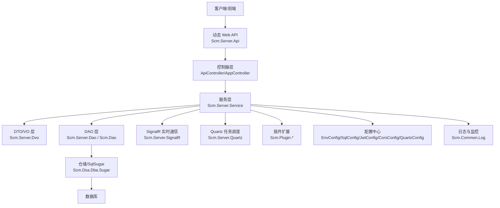
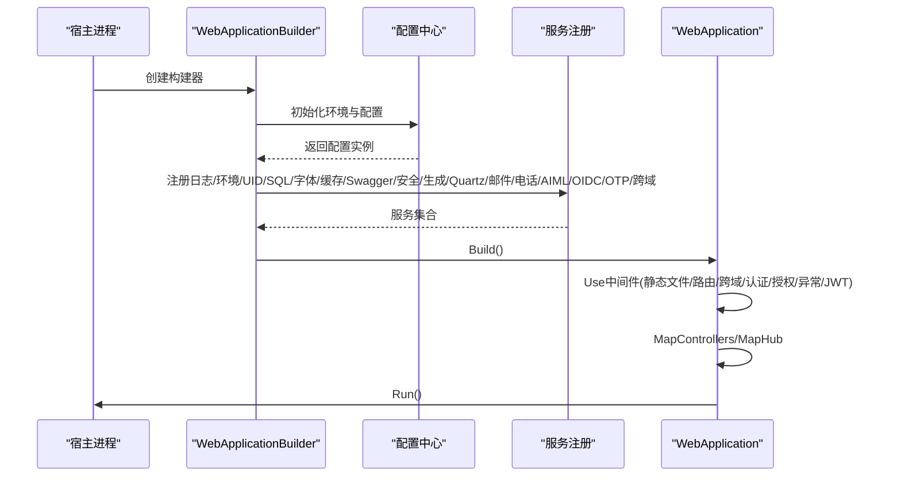
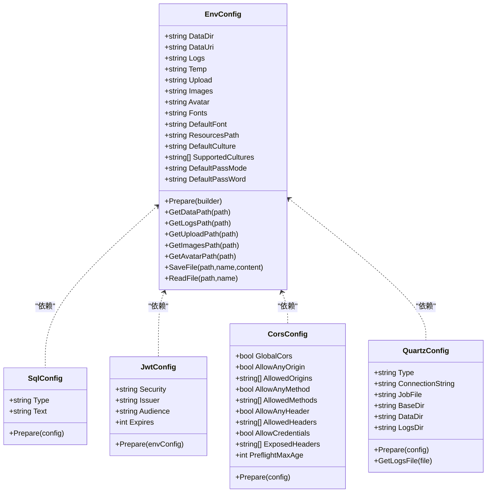
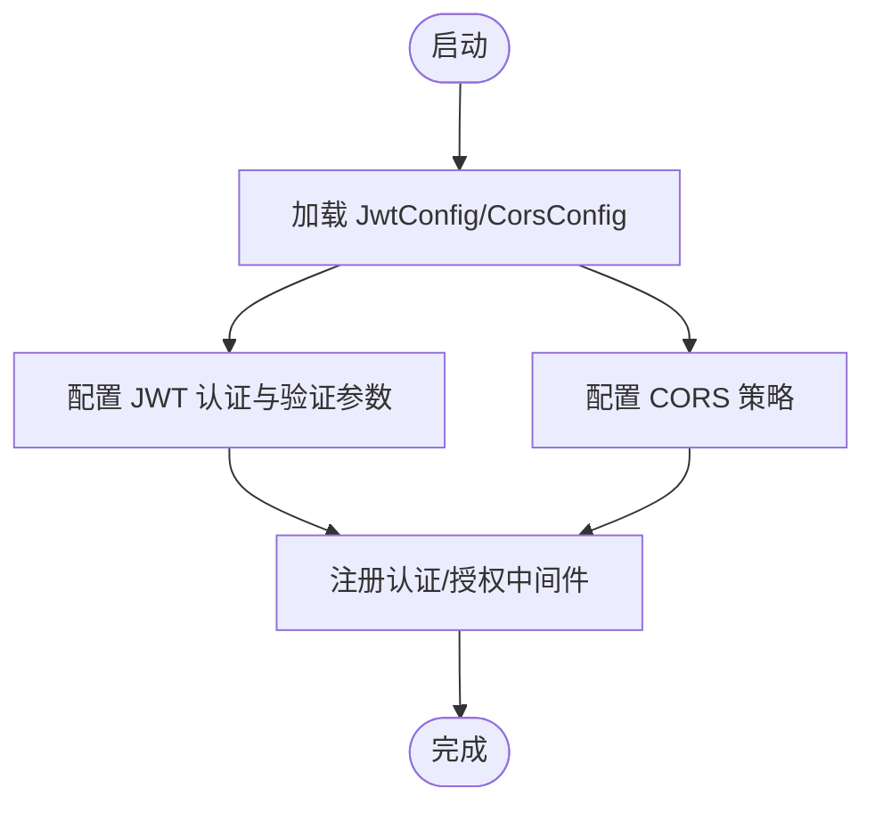
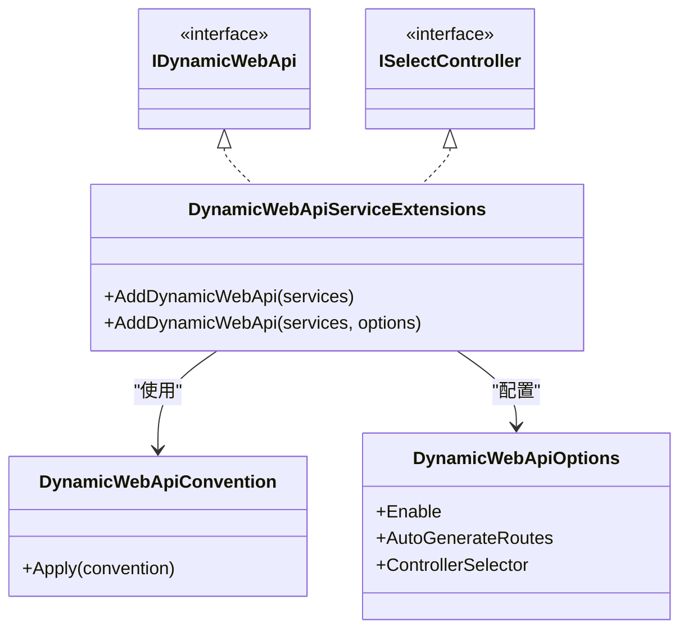
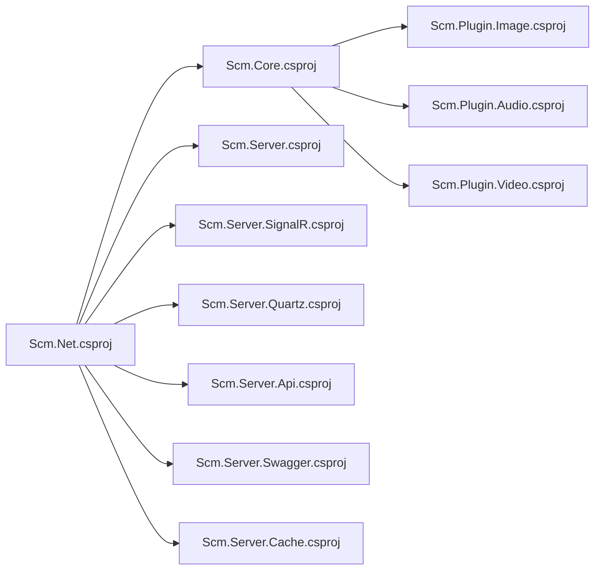

# 项目概述

<cite>
**本文引用的文件**
- [Scm.Net/Program.cs](file://Scm.Net/Program.cs)
- [Scm.Net/Scm.Net.csproj](file://Scm.Net/Scm.Net.csproj)
- [Scm.Core/Scm.Core.csproj](file://Scm.Core/Scm.Core.csproj)
- [Scm.Server/Scm.Server.csproj](file://Scm.Server/Scm.Server.csproj)
- [Scm.Server/Config/EnvConfig.cs](file://Scm.Server/Config/EnvConfig.cs)
- [Scm.Server/Config/SqlConfig.cs](file://Scm.Server/Config/SqlConfig.cs)
- [Scm.Server/Config/JwtConfig.cs](file://Scm.Server/Config/JwtConfig.cs)
- [Scm.Server/Config/CorsConfig.cs](file://Scm.Server/Config/CorsConfig.cs)
- [Scm.Server.Quartz/Config/QuartzConfig.cs](file://Scm.Server.Quartz/Config/QuartzConfig.cs)
- [Scm.Server/Extensions/JwtExtension.cs](file://Scm.Server/Extensions/JwtExtension.cs)
- [Scm.Server/Extensions/CorsExtension.cs](file://Scm.Server/Extensions/CorsExtension.cs)
- [Scm.Server.Swagger/SwaggerExtension.cs](file://Scm.Server.Swagger/SwaggerExtension.cs)
- [Scm.Server.SignalR/Scm.Server.SignalR.csproj](file://Scm.Server.SignalR/Scm.Server.SignalR.csproj)
- [Scm.Server.Quartz/Scm.Server.Quartz.csproj](file://Scm.Server.Quartz/Scm.Server.Quartz.csproj)
- [Scm.Server.Api/Scm.Server.Api.csproj](file://Scm.Server.Api/Scm.Server.Api.csproj)
- [Scm.Server.Bearer/Scm.Server.Bearer.csproj](file://Scm.Server.Bearer/Scm.Server.Bearer.csproj)
- [Scm.Server.Cache/Scm.Server.Cache.csproj](file://Scm.Server.Cache/Scm.Server.Cache.csproj)
- [Scm.Server.MQTT/Scm.Server.MQTT.csproj](file://Scm.Server.MQTT/Scm.Server.MQTT.csproj)
- [Scm.Server.RabbitMQ/Scm.Server.RabbitMQ.csproj](file://Scm.Server.RabbitMQ/Scm.Server.RabbitMQ.csproj)
- [Scm.Server.Service/Scm.Server.Service.csproj](file://Scm.Server.Service/Scm.Server.Service.csproj)
- [Scm.Server.Dao/Scm.Server.Dao.csproj](file://Scm.Server.Dao/Scm.Server.Dao.csproj)
- [Scm.Server.Dvo/Scm.Server.Dvo.csproj](file://Scm.Server.Dvo/Scm.Server.Dvo.csproj)
- [Scm.Server.Aiml/Scm.Server.Aiml.csproj](file://Scm.Server.Aiml/Scm.Server.Aiml.csproj)
- [Scm.Server/Controllers/AppController.cs](file://Scm.Server/Controllers/AppController.cs)
- [Scm.Server/Controllers/ApiController.cs](file://Scm.Server/Controllers/ApiController.cs)
- [Scm.Server.Api/DynamicWebApi/DynamicWebApiServiceExtensions.cs](file://Scm.Server.Api/DynamicWebApi/DynamicWebApiServiceExtensions.cs)
- [Scm.Server.Api/DynamicWebApi/DynamicWebApiConvention.cs](file://Scm.Server.Api/DynamicWebApi/DynamicWebApiConvention.cs)
- [Scm.Server.Api/DynamicWebApi/IDynamicWebApi.cs](file://Scm.Server.Api/DynamicWebApi/IDynamicWebApi.cs)
- [Scm.Server.Api/DynamicWebApi/ISelectController.cs](file://Scm.Server.Api/DynamicWebApi/ISelectController.cs)
- [Scm.Server.Api/DynamicWebApi/AppConsts.cs](file://Scm.Server.Api/DynamicWebApi/AppConsts.cs)
- [Scm.Server.Api/DynamicWebApi/Attributes/ScmDynamicActionAttribute.cs](file://Scm.Server.Api/DynamicWebApi/Attributes/ScmDynamicActionAttribute.cs)
- [Scm.Server.Api/DynamicWebApi/Helpers/ControllerHelper.cs](file://Scm.Server.Api/DynamicWebApi/Helpers/ControllerHelper.cs)
- [Scm.Server.Api/DynamicWebApi/Helpers/EntityHelper.cs](file://Scm.Server.Api/DynamicWebApi/Helpers/EntityHelper.cs)
- [Scm.Server.Api/DynamicWebApi/Helpers/ServiceHelper.cs](file://Scm.Server.Api/DynamicWebApi/Helpers/ServiceHelper.cs)
- [Scm.Server.Api/DynamicWebApi/Options/DynamicWebApiOptions.cs](file://Scm.Server.Api/DynamicWebApi/Options/DynamicWebApiOptions.cs)
- [Scm.Server.Api/DynamicWebApi/Options/DynamicWebApiOptionsSetup.cs](file://Scm.Server.Api/DynamicWebApi/Options/DynamicWebApiOptionsSetup.cs)
- [Scm.Server.Api/DynamicWebApi/Options/DynamicWebApiOptionsValidator.cs](file://Scm.Server.Api/DynamicWebApi/Options/DynamicWebApiOptionsValidator.cs)
- [Scm.Server.Api/DynamicWebApi/Helpers/ScmDynamicWebApiHelper.cs](file://Scm.Server.Api/DynamicWebApi/Helpers/ScmDynamicWebApiHelper.cs)
- [Scm.Server.Api/DynamicWebApi/Helpers/ScmDynamicWebApiHelper.cs](file://Scm.Server.Api/DynamicWebApi/Helpers/ScmDynamicWebApiHelper.cs)
- [Scm.Server.Api/DynamicWebApi/Helpers/ScmDynamicWebApiHelper.cs](file://Scm.Server.Api/DynamicWebApi/Helpers/ScmDynamicWebApiHelper.cs)
- [Scm.Server.Api/DynamicWebApi/Helpers/ScmDynamicWebApiHelper.cs](file://Scm.Server.Api/DynamicWebApi/Helpers/ScmDynamicWebApiHelper.cs)
- [Scm.Server.Api/DynamicWebApi/Helpers/ScmDynamicWebApiHelper.cs](file://Scm.Server.Api/DynamicWebApi/Helpers/ScmDynamicWebApiHelper.cs)
- [Scm.Server.Api/DynamicWebApi/Helpers/ScmDynamicWebApiHelper.cs](file://Scm.Server.Api/DynamicWebApi/Helpers/ScmDynamicWebApiHelper.cs)
- [Scm.Server.Api/DynamicWebApi/Helpers/ScmDynamicWebApiHelper.cs](file://Scm.Server.Api/DynamicWebApi/Helpers/ScmDynamicWebApiHelper.cs)
- [Scm.Server.Api/DynamicWebApi/Helpers/ScmDynamicWebApiHelper.cs](file://Scm.Server.Api/DynamicWebApi/Helpers/ScmDynamicWebApiHelper.cs)
- [Scm.Server.Api/DynamicWebApi/Helpers/ScmDynamicWebApiHelper.cs](file://Scm.Server.Api/DynamicWebApi/Helpers/ScmDynamicWebApiHelper.cs)
- [Scm.Server.Api/DynamicWebApi/Helpers/ScmDynamicWebApiHelper.cs](file://Scm.Server.Api/DynamicWebApi/Helpers/ScmDynamicWebApiHelper.cs)
- [Scm.Server.Api/DynamicWebApi/Helpers/ScmDynamicWebApiHelper.cs](file://Scm.Server.Api/DynamicWebApi/Helpers/ScmDynamicWebApiHelper.cs)
- [Scm.Server.Api/DynamicWebApi/Helpers/ScmDynamicWebApiHelper.cs](file://Scm.Server.Api/DynamicWebApi/Helpers/ScmDynamicWebApiHelper.cs)
- [Scm.Server.Api/DynamicWebApi/Helpers/ScmDynamicWebApiHelper.cs](file://......)
</cite>

## 目录
1. [引言](#引言)
2. [项目结构](#项目结构)
3. [核心组件](#核心组件)
4. [架构总览](#架构总览)
5. [详细组件分析](#详细组件分析)
6. [依赖分析](#依赖分析)
7. [性能考虑](#性能考虑)
8. [故障排查指南](#故障排查指南)
9. [结论](#结论)
10. [附录](#附录)

## 引言
Scm.Net 是面向企业级应用开发的 .NET 10 快速开发框架，专注于中后台管理系统与多租户、多模块的企业应用。其设计理念围绕“可扩展、可插拔、可运维”的多层架构展开，通过统一的配置中心、动态 Web API、ORM 集成、任务调度、实时通信与插件体系，为企业提供从数据建模到业务编排的一体化能力。

该框架在企业应用开发中的定位是“高内聚、低耦合”的基础设施平台，既可作为独立后端服务，也可与前端生态（如 Vue3）配合构建一体化解决方案。相比传统框架，Scm.Net 的优势体现在：
- 统一的环境与配置模型，简化部署与运维
- 动态 Web API 与 DTO/VO 分层，降低重复开发成本
- 基于 SqlSugar 的 ORM 集成与单元化事务过滤器
- Quartz 任务调度与日志闭环
- SignalR 实时通信与 Hub 扩展
- 插件化扩展点（图像、音频、视频等）
- 完善的认证授权与跨域策略

## 项目结构
Scm.Net 采用多项目分层组织方式，按功能域划分模块，形成清晰的层次边界与职责分离：
- 应用入口层：Scm.Net（ASP.NET Core Web 应用）
- 核心能力层：Scm.Core（业务能力聚合）、Scm.Server（服务层基础设施）
- 数据访问层：Scm.Dao、Scm.Server.Dao、Scm.Dsa.Dba.Sugar（SqlSugar 封装）
- DTO/VO 层：Scm.Dto、Scm.Common.Dto、Scm.Server.Dvo
- 插件扩展层：Scm.Plugin.*（图像、音频、视频等）
- 工具与通用层：Scm.Common、Scm.Common.Log、Scm.Common.Time、Scm.Common.Excel 等
- 第三方集成：Scm.Server.SignalR、Scm.Server.Quartz、Scm.Server.Api、Scm.Server.Bearer、Scm.Server.Swagger、Scm.Server.Cache、Scm.Server.MQTT、Scm.Server.RabbitMQ、Scm.Server.Service、Scm.Server.Dao、Scm.Server.Dvo、Scm.Server.Aiml

```mermaid
graph TB
subgraph "应用入口层"
A["Scm.Net<br/>ASP.NET Core 应用"]
end
subgraph "核心能力层"
B["Scm.Core<br/>业务能力聚合"]
C["Scm.Server<br/>服务层基础设施"]
end
subgraph "数据访问层"
D["Scm.Dao<br/>领域 DAO"]
E["Scm.Server.Dao<br/>服务 DAO"]
F["Scm.Dsa.Dba.Sugar<br/>SqlSugar 封装"]
end
subgraph "DTO/VO 层"
G["Scm.Dto"]
H["Scm.Common.Dto"]
I["Scm.Server.Dvo"]
end
subgraph "插件扩展层"
J["Scm.Plugin.Image"]
K["Scm.Plugin.Audio"]
L["Scm.Plugin.Video"]
end
subgraph "工具与通用层"
M["Scm.Common"]
N["Scm.Common.Log"]
O["Scm.Common.Time"]
P["Scm.Common.Excel"]
end
subgraph "第三方集成"
Q["Scm.Server.SignalR"]
R["Scm.Server.Quartz"]
S["Scm.Server.Api"]
T["Scm.Server.Bearer"]
U["Scm.Server.Swagger"]
V["Scm.Server.Cache"]
W["Scm.Server.MQTT"]
X["Scm.Server.RabbitMQ"]
Y["Scm.Server.Service"]
Z["Scm.Server.Dao"]
AA["Scm.Server.Dvo"]
BB["Scm.Server.Aiml"]
end
A --> B
A --> C
B --> D
B --> E
B --> F
B --> G
B --> H
B --> I
B --> J
B --> K
B --> L
B --> M
B --> N
B --> O
B --> P
C --> Q
C --> R
C --> S
C --> T
C --> U
C --> V
C --> W
C --> X
C --> Y
C --> Z
C --> AA
C --> BB
```

图表来源
- [Scm.Net/Scm.Net.csproj:37-49](file://Scm.Net/Scm.Net.csproj#L37-L49)
- [Scm.Core/Scm.Core.csproj:10-25](file://Scm.Core/Scm.Core.csproj#L10-L25)
- [Scm.Server/Scm.Server.csproj:10-29](file://Scm.Server/Scm.Server.csproj#L10-L29)

章节来源
- [Scm.Net/Scm.Net.csproj:1-86](file://Scm.Net/Scm.Net.csproj#L1-L86)
- [Scm.Core/Scm.Core.csproj:1-69](file://Scm.Core/Scm.Core.csproj#L1-L69)
- [Scm.Server/Scm.Server.csproj:1-44](file://Scm.Server/Scm.Server.csproj#L1-L44)

## 核心组件
- 环境与配置中心：EnvConfig 提供统一的数据目录、日志、临时、上传、图像、头像、字体等路径管理，并提供读写文件能力；SqlConfig、JwtConfig、CorsConfig、QuartzConfig 等负责各自子系统的默认值与准备逻辑。
- 启动与装配：Program.cs 负责构建 WebApplicationBuilder，注册日志、环境、UID、SQL、字体、缓存、Swagger、安全、代码生成、Quartz、邮件、电话、Aiml、OIDC、OTP、跨域、服务、全局过滤器、JWT、SignalR、Mapper、路由与 Hub 映射。
- 服务层基础设施：Scm.Server 提供 JWT 认证、跨域策略、Mapper、DAO/Service 抽象、动态 Web API 扩展等。
- 数据访问层：Scm.Dao/Scm.Server.Dao 提供基础 DAO 接口与实现；Scm.Dsa.Dba.Sugar 提供 SqlSugar 封装与仓储模式。
- 实时通信：Scm.Server.SignalR 提供 Hub 与结果响应封装。
- 任务调度：Scm.Server.Quartz 提供 Quartz 配置、作业与日志 DAO、作业工厂与服务。
- 动态 Web API：Scm.Server.Api 提供动态控制器发现、约定与选项配置，支持按服务自动暴露 API。
- 插件系统：Scm.Plugin.* 提供图像、音频、视频等插件接口与实现。
- 通用工具：Scm.Common、Scm.Common.Log、Scm.Common.Time、Scm.Common.Excel 等提供常用工具类与扩展。

章节来源
- [Scm.Server/Config/EnvConfig.cs:1-280](file://Scm.Server/Config/EnvConfig.cs#L1-L280)
- [Scm.Server/Config/SqlConfig.cs:1-23](file://Scm.Server/Config/SqlConfig.cs#L1-L23)
- [Scm.Server/Config/JwtConfig.cs:1-48](file://Scm.Server/Config/JwtConfig.cs#L1-L48)
- [Scm.Server/Config/CorsConfig.cs:1-49](file://Scm.Server/Config/CorsConfig.cs#L1-L49)
- [Scm.Server.Quartz/Config/QuartzConfig.cs:1-81](file://Scm.Server.Quartz/Config/QuartzConfig.cs#L1-L81)
- [Scm.Net/Program.cs:1-366](file://Scm.Net/Program.cs#L1-L366)
- [Scm.Server/Extensions/JwtExtension.cs:1-73](file://Scm.Server/Extensions/JwtExtension.cs#L1-L73)
- [Scm.Server/Extensions/CorsExtension.cs:1-59](file://Scm.Server/Extensions/CorsExtension.cs#L1-L59)
- [Scm.Server/Scm.Server.csproj:1-44](file://Scm.Server/Scm.Server.csproj#L1-L44)
- [Scm.Server.Api/DynamicWebApi/DynamicWebApiServiceExtensions.cs](file://Scm.Server.Api/DynamicWebApi/DynamicWebApiServiceExtensions.cs)

## 架构总览
Scm.Net 采用“入口应用 + 核心能力 + 服务层 + 数据层 + 插件扩展 + 工具通用层”的多层架构，结合动态 Web API、ORM、任务调度、实时通信与插件化扩展，形成完整的企业级开发平台。

图表来源
- [Scm.Server.Api/DynamicWebApi/DynamicWebApiServiceExtensions.cs](file://Scm.Server.Api/DynamicWebApi/DynamicWebApiServiceExtensions.cs)
- [Scm.Server/Controllers/ApiController.cs](file://Scm.Server/Controllers/ApiController.cs)
- [Scm.Server/Controllers/AppController.cs](file://Scm.Server/Controllers/AppController.cs)
- [Scm.Server/Scm.Server.csproj:10-29](file://Scm.Server/Scm.Server.csproj#L10-L29)
- [Scm.Server.SignalR/Scm.Server.SignalR.csproj](file://Scm.Server.SignalR/Scm.Server.SignalR.csproj)
- [Scm.Server.Quartz/Scm.Server.Quartz.csproj](file://Scm.Server.Quartz/Scm.Server.Quartz.csproj)
- [Scm.Server/Config/EnvConfig.cs:1-280](file://Scm.Server/Config/EnvConfig.cs#L1-L280)

## 详细组件分析

### 启动与装配流程（Program.cs）
- 初始化配置与日志
- 环境配置与单位/UID/SQL/字体/缓存/Swagger/安全/代码生成/Quartz/邮件/电话/AIML/OIDC/OTP/跨域
- 注册服务：日志、字典、配置、安全、分类、标签、流程等
- 全局过滤器：AOP、全局异常、工作单元
- JWT 与跨域中间件
- SignalR Hub 映射
- Quartz 启动与映射

图表来源
- [Scm.Net/Program.cs:33-258](file://Scm.Net/Program.cs#L33-L258)

章节来源
- [Scm.Net/Program.cs:1-366](file://Scm.Net/Program.cs#L1-L366)

### 配置系统（EnvConfig/SqlConfig/JwtConfig/CorsConfig/QuartzConfig）
- EnvConfig：统一管理数据目录、日志、临时、上传、图像、头像、字体、资源路径与默认密码模式；提供路径拼接、文件读写、URI 转换等能力。
- SqlConfig：数据库类型与连接字符串默认值准备。
- JwtConfig：安全密钥、发行者、受众、失效时间默认值准备。
- CorsConfig：跨域策略配置，默认值与预检缓存设置。
- QuartzConfig：任务调度数据目录、日志目录与作业文件准备。

图表来源
- [Scm.Server/Config/EnvConfig.cs:1-280](file://Scm.Server/Config/EnvConfig.cs#L1-L280)
- [Scm.Server/Config/SqlConfig.cs:1-23](file://Scm.Server/Config/SqlConfig.cs#L1-L23)
- [Scm.Server/Config/JwtConfig.cs:1-48](file://Scm.Server/Config/JwtConfig.cs#L1-L48)
- [Scm.Server/Config/CorsConfig.cs:1-49](file://Scm.Server/Config/CorsConfig.cs#L1-L49)
- [Scm.Server.Quartz/Config/QuartzConfig.cs:1-81](file://Scm.Server.Quartz/Config/QuartzConfig.cs#L1-L81)

章节来源
- [Scm.Server/Config/EnvConfig.cs:1-280](file://Scm.Server/Config/EnvConfig.cs#L1-L280)
- [Scm.Server/Config/SqlConfig.cs:1-23](file://Scm.Server/Config/SqlConfig.cs#L1-L23)
- [Scm.Server/Config/JwtConfig.cs:1-48](file://Scm.Server/Config/JwtConfig.cs#L1-L48)
- [Scm.Server/Config/CorsConfig.cs:1-49](file://Scm.Server/Config/CorsConfig.cs#L1-L49)
- [Scm.Server.Quartz/Config/QuartzConfig.cs:1-81](file://Scm.Server.Quartz/Config/QuartzConfig.cs#L1-L81)

### 认证与跨域（JwtExtension/CorsExtension）
- JwtExtension：注册并配置 JWT 认证方案、令牌验证参数、消息接收事件（从请求头提取令牌），并添加角色授权策略。
- CorsExtension：根据配置动态注册跨域策略，支持任意源/方法/头、凭据与预检缓存。

图表来源
- [Scm.Server/Extensions/JwtExtension.cs:14-71](file://Scm.Server/Extensions/JwtExtension.cs#L14-L71)
- [Scm.Server/Extensions/CorsExtension.cs:8-56](file://Scm.Server/Extensions/CorsExtension.cs#L8-L56)

章节来源
- [Scm.Server/Extensions/JwtExtension.cs:1-73](file://Scm.Server/Extensions/JwtExtension.cs#L1-L73)
- [Scm.Server/Extensions/CorsExtension.cs:1-59](file://Scm.Server/Extensions/CorsExtension.cs#L1-L59)

### 动态 Web API（Scm.Server.Api）
- 通过动态 Web API 扩展，自动发现服务并生成控制器，支持约定式路由与控制器选择。
- 提供选项配置、验证器与帮助器，确保 API 生成的一致性与可维护性。

图表来源
- [Scm.Server.Api/DynamicWebApi/DynamicWebApiServiceExtensions.cs](file://Scm.Server.Api/DynamicWebApi/DynamicWebApiServiceExtensions.cs)
- [Scm.Server.Api/DynamicWebApi/DynamicWebApiConvention.cs](file://Scm.Server.Api/DynamicWebApi/DynamicWebApiConvention.cs)
- [Scm.Server.Api/DynamicWebApi/IDynamicWebApi.cs](file://Scm.Server.Api/DynamicWebApi/IDynamicWebApi.cs)
- [Scm.Server.Api/DynamicWebApi/ISelectController.cs](file://Scm.Server.Api/DynamicWebApi/ISelectController.cs)
- [Scm.Server.Api/DynamicWebApi/AppConsts.cs](file://Scm.Server.Api/DynamicWebApi/AppConsts.cs)
- [Scm.Server.Api/DynamicWebApi/Options/DynamicWebApiOptions.cs](file://Scm.Server.Api/DynamicWebApi/Options/DynamicWebApiOptions.cs)

章节来源
- [Scm.Server.Api/DynamicWebApi/DynamicWebApiServiceExtensions.cs](file://Scm.Server.Api/DynamicWebApi/DynamicWebApiServiceExtensions.cs)
- [Scm.Server.Api/DynamicWebApi/DynamicWebApiConvention.cs](file://Scm.Server.Api/DynamicWebApi/DynamicWebApiConvention.cs)
- [Scm.Server.Api/DynamicWebApi/IDynamicWebApi.cs](file://Scm.Server.Api/DynamicWebApi/IDynamicWebApi.cs)
- [Scm.Server.Api/DynamicWebApi/ISelectController.cs](file://Scm.Server.Api/DynamicWebApi/ISelectController.cs)
- [Scm.Server.Api/DynamicWebApi/AppConsts.cs](file://Scm.Server.Api/DynamicWebApi/AppConsts.cs)
- [Scm.Server.Api/DynamicWebApi/Options/DynamicWebApiOptions.cs](file://Scm.Server.Api/DynamicWebApi/Options/DynamicWebApiOptions.cs)

### 实时通信（SignalR）
- 通过 Scm.Server.SignalR 提供 Hub 与结果响应封装，便于在应用中集成实时通信能力。

章节来源
- [Scm.Server.SignalR/Scm.Server.SignalR.csproj](file://Scm.Server.SignalR/Scm.Server.SignalR.csproj)

### 任务调度（Quartz）
- 通过 Scm.Server.Quartz 提供 Quartz 配置、作业与日志 DAO、作业工厂与服务，支持文件/数据库两种存储模式与作业文件管理。

章节来源
- [Scm.Server.Quartz/Scm.Server.Quartz.csproj](file://Scm.Server.Quartz/Scm.Server.Quartz.csproj)
- [Scm.Server.Quartz/Config/QuartzConfig.cs:1-81](file://Scm.Server.Quartz/Config/QuartzConfig.cs#L1-L81)

### 数据访问与 ORM（SqlSugar）
- 通过 Scm.Dsa.Dba.Sugar 提供 SqlSugar 封装与仓储模式，支持实体键类型、枚举与数值类型的数据库适配，以及 SQL 执行事件钩子。

章节来源
- [Scm.Net/Program.cs:282-356](file://Scm.Net/Program.cs#L282-L356)
- [Scm.Server/Scm.Server.csproj:10-19](file://Scm.Server/Scm.Server.csproj#L10-L19)

### 插件系统（Scm.Plugin.*）
- 通过 Scm.Plugin.Image、Scm.Plugin.Audio、Scm.Plugin.Video 等插件模块提供图像处理、音频解析、视频处理等扩展能力，遵循统一的插件接口与工厂模式。

章节来源
- [Scm.Plugin.Image/Scm.Plugin.Image.csproj](file://Scm.Plugin.Image/Scm.Plugin.Image.csproj)
- [Scm.Plugin.Audio/Scm.Plugin.Audio.csproj](file://Scm.Plugin.Audio/Scm.Plugin.Audio.csproj)
- [Scm.Plugin.Video/Scm.Plugin.Video.csproj](file://Scm.Plugin.Video/Scm.Plugin.Video.csproj)

## 依赖分析
- 项目引用关系：Scm.Net 引用多个核心模块（Scm.Core、Scm.Server、Scm.Server.SignalR、Scm.Server.Quartz、Scm.Server.Api、Scm.Server.Swagger、Scm.Server.Cache 等），体现入口应用对核心能力的聚合。
- 包依赖关系：Scm.Net 使用 Serilog、ImageSharp、Newtonsoft.Json 等包；Scm.Server 使用 Mapster、JwtBearer、System.Linq.Dynamic.Core 等包。
- 外部库引用：通过 Reference 引入若干本地 DLL（如 Scm.Common.File、Scm.Common.Http、Scm.Uid 等），用于特定功能扩展。

图表来源
- [Scm.Net/Scm.Net.csproj:37-49](file://Scm.Net/Scm.Net.csproj#L37-L49)
- [Scm.Core/Scm.Core.csproj:10-25](file://Scm.Core/Scm.Core.csproj#L10-L25)

章节来源
- [Scm.Net/Scm.Net.csproj:1-86](file://Scm.Net/Scm.Net.csproj#L1-L86)
- [Scm.Core/Scm.Core.csproj:1-69](file://Scm.Core/Scm.Core.csproj#L1-L69)

## 性能考虑
- ORM 与查询优化：通过 SqlSugar 的实体键类型与枚举适配，减少数据库类型不匹配导致的隐式转换开销；利用 AOP OnLogExecuting 进行 SQL 观察与调优。
- 缓存策略：通过缓存配置与服务扩展，结合业务场景进行热点数据缓存，降低数据库压力。
- 实时通信：SignalR 在高并发下建议结合连接池与消息分区策略，避免单点瓶颈。
- 任务调度：Quartz 作业应避免长时间阻塞操作，必要时拆分为轻量任务并异步执行。
- 文件与静态资源：EnvConfig 对数据目录与 URI 的统一管理有助于静态资源映射与缓存命中率提升。

## 故障排查指南
- 启动失败：检查 EnvConfig 的数据目录、日志目录、上传目录是否可写；确认数据库文件是否存在且可访问。
- 认证失败：核对 JwtConfig 的 Issuer、Audience、Security 是否与前端一致；检查中间件顺序与令牌传递方式。
- 跨域问题：核对 CorsConfig 的 AllowedOrigins/Methods/Headers 设置；确认预检缓存时间与凭据配置。
- API 未生成：检查 Scm.Server.Api 的动态 Web API 扩展是否正确注册，服务是否实现接口约定。
- 任务调度异常：检查 QuartzConfig 的 BaseDir/DataDir/LogsDir 是否存在且可写，作业文件路径是否正确。

章节来源
- [Scm.Server/Config/EnvConfig.cs:72-120](file://Scm.Server/Config/EnvConfig.cs#L72-L120)
- [Scm.Server/Config/JwtConfig.cs:28-47](file://Scm.Server/Config/JwtConfig.cs#L28-L47)
- [Scm.Server/Config/CorsConfig.cs:24-46](file://Scm.Server/Config/CorsConfig.cs#L24-L46)
- [Scm.Server.Quartz/Config/QuartzConfig.cs:40-73](file://Scm.Server.Quartz/Config/QuartzConfig.cs#L40-L73)

## 结论
Scm.Net 以多层架构与模块化设计为核心，结合动态 Web API、ORM、任务调度、实时通信与插件体系，为企业级应用开发提供了高内聚、低耦合、易扩展的基础设施平台。通过统一的配置中心与完善的中间件链路，Scm.Net 能够快速落地中后台管理系统，并具备良好的可运维性与扩展性。

## 附录
- 技术栈概览
  - 运行时与框架：.NET 10、ASP.NET Core
  - ORM：SqlSugar
  - 实时通信：SignalR
  - 任务调度：Quartz.NET
  - 日志：Serilog
  - 图像处理：ImageSharp
  - JSON 序列化：Newtonsoft.Json
  - 映射：Mapster
  - 动态 API：Scm.Server.Api
  - 认证授权：JWT Bearer
  - 跨域：CORS
  - 缓存：自定义缓存服务
  - 插件：图像/音频/视频插件