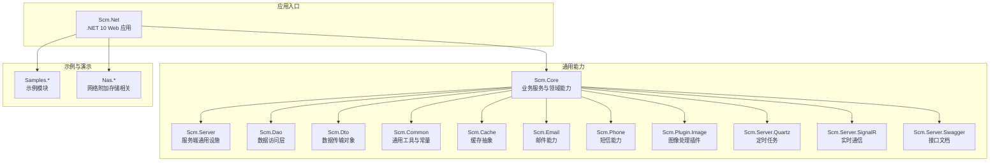
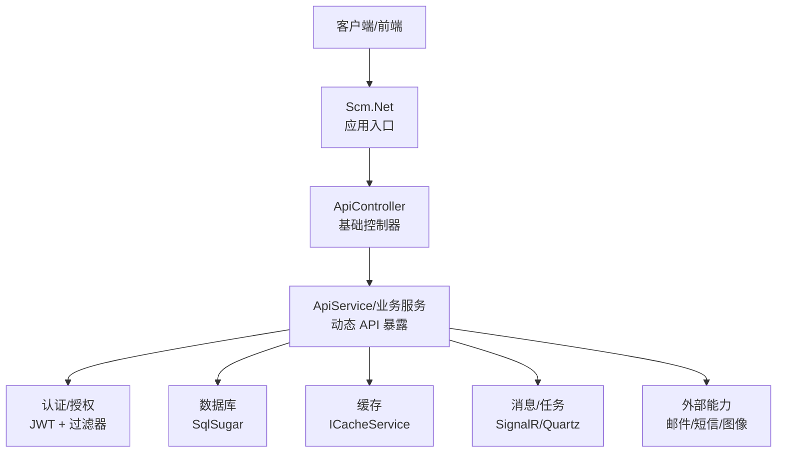
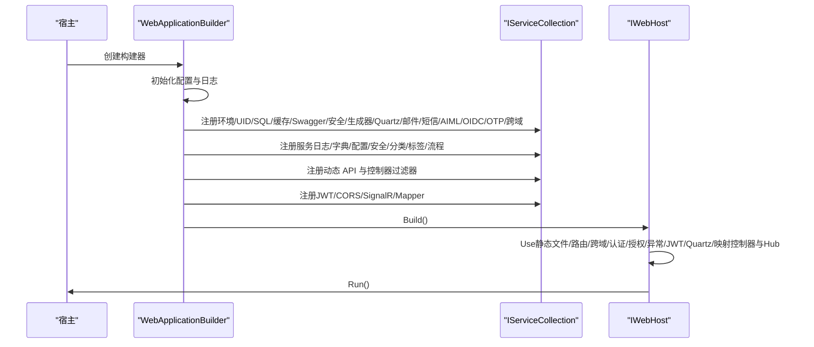
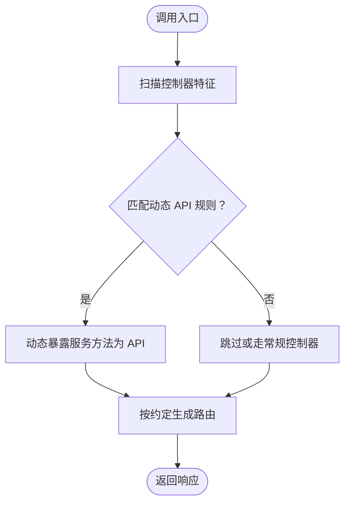
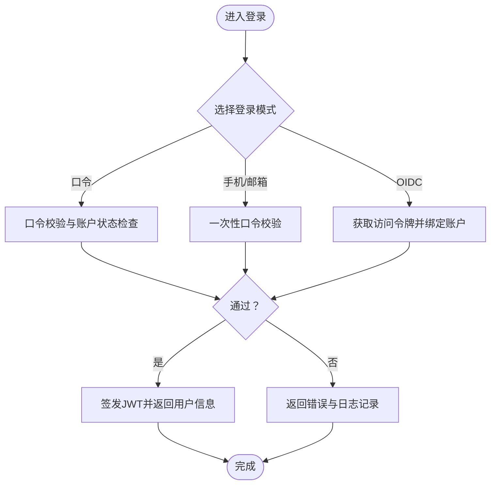

# 项目简介

<cite>
**本文引用的文件**
- [README.en.md](file://README.en.md)
- [Program.cs](file://Scm.Net/Program.cs)
- [Scm.Net.csproj](file://Scm.Net/Scm.Net.csproj)
- [Scm.Core.csproj](file://Scm.Core/Scm.Core.csproj)
- [Scm.Common.csproj](file://Scm.Common/Scm.Common.csproj)
- [readme.txt](file://Scm.Net/readme.txt)
- [ScmAboutService.cs](file://Scm.Core/About/ScmAboutService.cs)
- [ScmEnv.cs](file://Scm.Common/ScmEnv.cs)
- [OperatorService.cs](file://Scm.Core/Operator/OperatorService.cs)
- [OtpAuth.cs](file://Scm.Core/Login/Otp/OtpAuth.cs)
- [AppService.cs](file://Scm.Server/Service/AppService.cs)
- [ApiController.cs](file://Scm.Server/Controllers/ApiController.cs)
- [DynamicWebApiControllerFeatureProvider.cs](file://Scm.Server.Api/DynamicWebApi/DynamicWebApiControllerFeatureProvider.cs)
</cite>

## 目录
1. [引言](#引言)
2. [项目结构](#项目结构)
3. [核心组件](#核心组件)
4. [架构总览](#架构总览)
5. [详细组件分析](#详细组件分析)
6. [依赖关系分析](#依赖关系分析)
7. [性能与可扩展性](#性能与可扩展性)
8. [故障排查指南](#故障排查指南)
9. [结论](#结论)
10. [附录](#附录)

## 引言
Scm.Net 是一款面向中后台管理系统的快速开发框架，基于 .NET 10 构建，采用模块化与插件化设计，提供统一的企业级能力沉淀与复用，覆盖认证授权、工作流、消息、定时任务、文件与图像处理、报表导出等常见业务场景。项目通过清晰的分层与约定式接口，帮助团队在较短时间内搭建稳定、可维护、可扩展的中后台应用。

- 核心定位：以“服务即接口”的理念，提供可动态暴露的 Web API 服务层，配套完善的基础设施（缓存、日志、定时任务、消息推送）与通用业务能力（字典、配置、菜单、主题、组织与角色等），降低重复开发成本。
- 设计理念：分层清晰、职责单一、可插拔扩展、约定优于配置。通过配置驱动与模块化装配，实现“开箱即用 + 按需扩展”。

## 项目结构
项目采用多项目解决方案（Solution）组织，按“领域/能力”维度拆分为若干子项目，形成“公共基础 -> 通用能力 -> 应用入口”的层次化结构。

图示来源
- [Scm.Net.csproj:37-49](file://Scm.Net/Scm.Net.csproj#L37-L49)
- [Scm.Core.csproj:10-25](file://Scm.Core/Scm.Core.csproj#L10-L25)
- [Scm.Common.csproj:1-22](file://Scm.Common/Scm.Common.csproj#L1-L22)

章节来源
- [Scm.Net.csproj:1-86](file://Scm.Net/Scm.Net.csproj#L1-L86)
- [Scm.Core.csproj:1-69](file://Scm.Core/Scm.Core.csproj#L1-L69)
- [Scm.Common.csproj:1-22](file://Scm.Common/Scm.Common.csproj#L1-L22)

## 核心组件
- 应用入口与启动装配
  - 基于 ASP.NET Core 6+ 的最小可运行宿主，集中初始化环境、数据库、缓存、Swagger、安全、任务调度、消息、信号灯等基础设施。
  - 通过配置中心加载各类能力的配置并完成注册，确保“按需启用、按需装配”。

- 服务层与动态 API
  - 提供统一的 ApiService 基类与 ApiController 基础控制器，结合动态 Web API 特性，实现“服务即接口”，减少样板代码。
  - 支持按组暴露接口（如 Scm、About 等），便于文档化与权限控制。

- 认证与会话
  - 支持多种登录模式：口令登录、手机/邮箱一次性口令登录、OIDC 联合登录等；内置 JWT 中间件与全局异常过滤器，保障安全与可观测性。

- 通用能力
  - 缓存、日志、定时任务、邮件/短信、图像处理、文件资源管理、主题与菜单、配置与字典、工作流等，均可通过 NuGet 包或项目引用按需引入。

章节来源
- [Program.cs:33-258](file://Scm.Net/Program.cs#L33-L258)
- [ApiController.cs:1-14](file://Scm.Server/Controllers/ApiController.cs#L1-L14)
- [DynamicWebApiControllerFeatureProvider.cs:1-20](file://Scm.Server.Api/DynamicWebApi/DynamicWebApiControllerFeatureProvider.cs#L1-L20)
- [OperatorService.cs:133-200](file://Scm.Core/Operator/OperatorService.cs#L133-L200)
- [OtpAuth.cs:1-91](file://Scm.Core/Login/Otp/OtpAuth.cs#L1-L91)

## 架构总览
下图展示了 Scm.Net 的典型运行时架构：应用入口负责装配与路由，服务层承载业务逻辑并通过动态 API 暴露接口，底层依赖数据库、缓存与第三方能力（邮件、短信、图像处理、定时任务、实时通信）。

图示来源
- [Program.cs:147-238](file://Scm.Net/Program.cs#L147-L238)
- [ApiController.cs:8-13](file://Scm.Server/Controllers/ApiController.cs#L8-L13)
- [AppService.cs:9-16](file://Scm.Server/Service/AppService.cs#L9-L16)

## 详细组件分析

### 组件一：应用入口与启动装配（Program.cs）
- 职责
  - 初始化配置与环境（环境变量、数据目录、字体、UID、SQL 等）。
  - 注册服务（缓存、Swagger、安全、代码生成、Quartz、邮件、短信、Aiml、OIDC、OTP、跨域等）。
  - 配置中间件链路（静态文件、路由、跨域、认证、授权、异常处理、SignalR、Quartz 映射）。
  - 启动应用并输出访问提示。

- 关键流程（启动序列）

图示来源
- [Program.cs:33-258](file://Scm.Net/Program.cs#L33-L258)

章节来源
- [Program.cs:33-258](file://Scm.Net/Program.cs#L33-L258)

### 组件二：服务层与动态 API（ApiService/ApiController）
- 职责
  - ApiService 作为服务基类，封装通用依赖（环境配置、数据库、缓存、资源持有者、日志服务等）。
  - ApiController 作为 Web 控制器基类，统一路由前缀与分组，配合动态 API 特性自动暴露服务方法。

- 动态 API 流程

图示来源
- [DynamicWebApiControllerFeatureProvider.cs:6-19](file://Scm.Server.Api/DynamicWebApi/DynamicWebApiControllerFeatureProvider.cs#L6-L19)
- [ApiController.cs:8-13](file://Scm.Server/Controllers/ApiController.cs#L8-L13)
- [AppService.cs:9-16](file://Scm.Server/Service/AppService.cs#L9-L16)

章节来源
- [ApiController.cs:1-14](file://Scm.Server/Controllers/ApiController.cs#L1-L14)
- [DynamicWebApiControllerFeatureProvider.cs:1-20](file://Scm.Server.Api/DynamicWebApi/DynamicWebApiControllerFeatureProvider.cs#L1-L20)
- [AppService.cs:1-18](file://Scm.Server/Service/AppService.cs#L1-L18)

### 组件三：认证与登录（OperatorService 与 OTP 抽象）
- 职责
  - 提供多种登录模式：口令、手机/邮箱一次性口令、OIDC 联合登录；支持自动注册与模板用户策略。
  - 内置登录日志与用户行为记录，支持验证码校验、账户状态检查、登录限制等安全策略。
  - OTP 抽象类定义生成/验证口令的统一接口，便于扩展不同算法与渠道。

- 登录流程（简化）

图示来源
- [OperatorService.cs:133-200](file://Scm.Core/Operator/OperatorService.cs#L133-L200)
- [OtpAuth.cs:34-77](file://Scm.Core/Login/Otp/OtpAuth.cs#L34-L77)

章节来源
- [OperatorService.cs:133-200](file://Scm.Core/Operator/OperatorService.cs#L133-L200)
- [OtpAuth.cs:1-91](file://Scm.Core/Login/Otp/OtpAuth.cs#L1-L91)

### 组件四：关于信息与默认配置（ScmAboutService 与 ScmEnv）
- ScmAboutService：按编码与分区读取 about 目录下的文本信息，支持默认回退，便于展示项目说明、版本信息等。
- ScmEnv：提供系统常量（日期时间格式、默认密码、跨域名、字体名、路径分隔符等），统一默认值与约定。

章节来源
- [ScmAboutService.cs:1-55](file://Scm.Core/About/ScmAboutService.cs#L1-L55)
- [ScmEnv.cs:1-45](file://Scm.Common/ScmEnv.cs#L1-L45)

## 依赖关系分析
- 技术栈与目标框架
  - 应用入口与核心库均以 .NET 10 为目标框架，保证对最新语言特性的利用与性能收益。
  - 通用库部分仍保持 netstandard2.0，以兼容旧版组件与跨平台共享。

- 项目间依赖
  - Scm.Net 引用 Scm.Core、Scm.Server.* 系列与示例模块，形成“入口 -> 能力 -> 示例”的依赖链。
  - Scm.Core 再依赖 Scm.Common、DTO、Server、Email、Phone、Image、Quartz、SignalR、Swagger 等，形成“能力聚合”。

- 外部依赖
  - ORM：SqlSugar（含实体映射与日志钩子）。
  - 日志：Serilog（配置化、异步写入、控制台与文件）。
  - 图像处理：ImageSharp（字体加载与默认字体设置）。
  - JSON：Newtonsoft.Json（ASP.NET Core MVC 新生 JSON 扩展）。

章节来源
- [Scm.Net.csproj:4-10](file://Scm.Net/Scm.Net.csproj#L4-L10)
- [Scm.Core.csproj:4-8](file://Scm.Core/Scm.Core.csproj#L4-L8)
- [Scm.Common.csproj:4-5](file://Scm.Common/Scm.Common.csproj#L4-L5)
- [Program.cs:27-364](file://Scm.Net/Program.cs#L27-L364)

## 性能与可扩展性
- 性能特性
  - 使用 SqlSugar 进行高性能 ORM 访问，支持日志拦截与参数替换，便于诊断与优化。
  - ImageSharp 与字体配置在启动阶段完成，避免运行时重复初始化。
  - Serilog 异步写入与多 Sink，兼顾性能与可观测性。

- 可扩展性
  - 插件化能力（图像、音频、视频等）通过接口抽象与工厂模式解耦。
  - 动态 API 机制降低控制器样板代码，提升接口扩展效率。
  - Quartz 与 SignalR 提供任务编排与实时通信能力，满足复杂业务场景。

## 故障排查指南
- 启动与访问
  - 按 readme.txt 提示准备数据库与 UID 文件，启动后根据控制台提示访问本地地址。
  - 若无法访问，检查 Kestrel 配置与跨域设置，确认中间件顺序与授权策略。

- 登录问题
  - 核对登录模式与参数，检查验证码、账户状态、登录限制与口令加密规则。
  - OIDC 登录需确认回调地址、应用密钥与用户绑定关系。

- 数据库与 SQL
  - 确认连接字符串与数据库类型，关注枚举与长整型在 SQLite 下的映射差异。
  - 利用 SqlSugar 的 OnLogExecuting 钩子输出实际执行 SQL，辅助定位问题。

章节来源
- [readme.txt:1-14](file://Scm.Net/readme.txt#L1-L14)
- [Program.cs:278-356](file://Scm.Net/Program.cs#L278-L356)
- [OperatorService.cs:225-419](file://Scm.Core/Operator/OperatorService.cs#L225-L419)

## 结论
Scm.Net 以 .NET 10 为基础，围绕“服务即接口”的理念，构建了覆盖中后台管理系统的完整能力体系。通过清晰的分层、模块化的项目结构、完善的基础设施与动态 API 机制，显著降低开发成本并提升交付效率。对于需要快速搭建企业级中后台应用的团队，Scm.Net 提供了稳健、可扩展且易于上手的框架选择。

## 附录

### 名称释义与设计思想
- Scm：源于“系统配置管理”或“软件配置管理”的缩写，强调对系统配置、资源、主题、菜单、字典等的统一管理与沉淀。
- 设计思想：以“约定优于配置”为核心，通过统一的环境配置、服务注册、中间件链与动态 API，实现“开箱即用 + 按需扩展”。

### 技术选型与 .NET 10 选择
- 选择 .NET 10 的原因
  - 最新 LTS/非 LTS 发布周期带来的性能与语言特性提升。
  - 对现代 Web 开发（如 Minimal API、改进的 DI、更强的 JSON 支持）的良好支持。
  - 与 SqlSugar、ImageSharp、Serilog 等生态工具的兼容性与稳定性。

### 版本演进与社区贡献
- 版本演进
  - 项目早期以 .NET 6/7 为主，逐步迁移至 .NET 10，以获得更佳性能与生态支持。
  - 服务层持续完善，动态 API 与中间件链逐步标准化。
- 社区贡献
  - 采用开放协作模式，鼓励通过分支与 Pull Request 参与贡献。
  - 提供示例模块与文档，便于新成员快速上手。

章节来源
- [README.en.md:1-38](file://README.en.md#L1-L38)
- [Scm.Net.csproj:4-10](file://Scm.Net/Scm.Net.csproj#L4-L10)