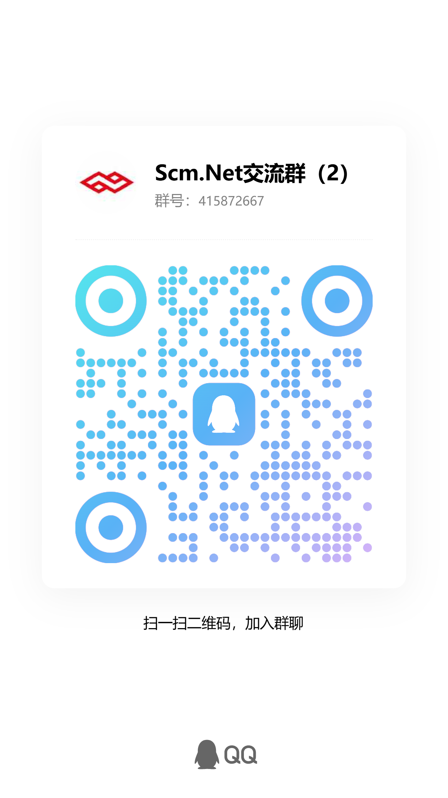

<p align="center">
  
</p>

<h1 align="center">Scm.Net</h1>

<p align="center">
  <a href="https://gitee.com/leadiot/scm.net">
    
  </a>
  <a href="https://dotnet.microsoft.com">
    
  </a>
  <a href="https://vuejs.org/">
    
  </a>
  <a href="https://element-plus.org/">
    
  </a>
  
  
</p>

<p align="center">
  <b>Enterprise-Grade Admin Rapid Development Framework</b> — Built on .NET 10.0 + Vue 3.0 with a front-end/back-end separation architecture.
</p>

<p align="center">
  Frontend: <a href="https://gitee.com/leadiot/scm.vue">Scm.Vue</a> ｜
  <a href="http://www.c-scm.net">Live Demo</a> ｜
  <a href="https://gitee.com/leadiot/scm.net/wikis/%E9%A1%B9%E7%9B%AE%E4%BB%8B%E7%BB%8D">Online Docs</a>
</p>

---

## 📖 Introduction

**Scm.Net** is an enterprise-grade admin system rapid development framework. It adopts a front-end/back-end separation architecture and comes with built-in enterprise core capabilities including permission management, code generation, workflow engine, real-time messaging, and data visualization.

The author has years of experience developing supply chain systems and enterprise information systems, often dealing with heterogeneous application scenarios. This project was built by consolidating experience from multiple projects, aiming to help developers quickly set up a complete, extensible development framework.

Products already built on this framework include:

| Product | Description |
| --- | --- |
| **OMS** | Order Management System |
| **WMS** | Warehouse Management System |
| **TMS** | Transportation Management System |
| **DMS** | Distribution Management System |
| **BMS** | Billing Management System |
| **YMS** | Yard Management System |
| **EAM** | Enterprise Asset Management |
| **IOT** | IoT Management System |

> The project is still being actively improved. Contributions and discussions are welcome.

---

## ✨ Key Features

### Authentication & Security

- **Multiple Login Methods** — Account, phone, email, OAuth, OIDC, SAML, and other third-party federated login
- **Biometrics** — Face recognition, fingerprint recognition, voiceprint recognition interfaces reserved
- **Two-Factor Authentication** — TOTP-based OTP one-time passwords
- **Data Encryption** — AES/DES parameter encryption and signing between front-end and back-end
- **JWT Authentication** — Bearer Token-based authentication with auto-refresh
- **Permission Control** — Six-level permission system: Company / Department / Position / Group / User / Role

### System & Framework

- **Multi-Database Support** — SQLite, MySQL, MariaDB, PostgreSQL, SQL Server, Oracle, Firebird, MongoDB
- **Multi-Cache Mechanism** — MemoryCache, Dictionary, Redis
- **Dynamic API** — Automatic service registration as Web APIs — no manual Controller coding needed
- **Code Generator** — Auto-generates entities, DAOs, DTOs/VOs with custom template support
- **Workflow Engine** — Visual process designer, node configuration, form binding, online approval
- **Scheduled Tasks** — Quartz.NET integration with dynamic task management
- **Real-Time Communication** — SignalR WebSocket-based real-time push and online chat

### Business Capabilities

- **MQTT Communication** — Lightweight IoT communication protocol with built-in Broker support
- **RabbitMQ Message Queue** — Publisher/Consumer pattern integration
- **AI Large Language Models** — Integration with DeepSeek, Huawei Pangu, Tongyi Qianwen, Tencent Yuanbao, Baidu ERNIE, Doubao, ChatGPT
- **Image Processing** — Barcode generation/recognition, image watermarking, CAPTCHA, avatar cropping
- **Data Visualization** — ECharts charting integration, dashboard layout
- **File Management** — File upload, import/export, online preview
- **ID Generator** — Snowflake ID, Sequence ID, Formatted ID, and more
- **Plugin System** — Plugin/Addon dynamic loading mechanism

### Platform Compatibility

- **Cross-Platform** — Supports Windows, macOS, Linux, HarmonyOS
- **Responsive Layout** — Desktop, tablet, and mobile device support
- **Multi-Tenant Architecture** — Extensible to multi-tenant, multi-organization applications

---

## 🛠 Technology Stack

### Backend Core Dependencies

| Technology | Version | Description |
| --- | --- | --- |
| [.NET](https://dotnet.microsoft.com) | 10.0 | Cross-platform runtime, compatible with .NET 6/7/8/9/10 |
| [SqlSugarCore](https://www.donet5.com/Home/Doc) | - | ORM data access framework |
| [ImageSharp](https://github.com/SixLabors/ImageSharp) | ^3.1.12 | Cross-platform image processing |
| [MQTTnet](https://github.com/dotnet/MQTTnet) | - | MQTT communication (client + built-in Broker) |
| [RabbitMQ.Client](https://www.rabbitmq.com) | - | RabbitMQ message queue |
| [Quartz.NET](https://www.quartz-scheduler.net) | - | Scheduled task scheduling |
| [SignalR](https://learn.microsoft.com/en-us/aspnet/core/signalr) | - | Real-time Web communication |
| [Mapster](https://mapster.dev/) | 10.0.7 | Object mapping |
| [Serilog](https://serilog.net/) | 4.3.1 | Structured logging |
| [Newtonsoft.Json](https://www.newtonsoft.com/json) | - | JSON serialization |
| [JWT Bearer](https://github.com/aspnet/AspNetCore) | 10.0.8 | Authentication & authorization |

### Frontend (Scm.Vue)

| Technology | Version | Description |
| --- | --- | --- |
| [Vue](https://vuejs.org/) | ^3.5.32 | Progressive JavaScript framework |
| [Vite](https://vitejs.dev/) | ^8.0.3 | Next-gen frontend build tool |
| [Element Plus](https://element-plus.org/) | ^2.13.6 | Vue 3 desktop UI library |
| [Pinia](https://pinia.vuejs.org/) | ^3.0.0 | State management |
| [ECharts](https://echarts.apache.org/) | ^6.0.0 | Data visualization |
| [Axios](https://axios-http.com/) | ^1.7.0 | HTTP client |

---

## 🔧 System Requirements

| Tool | Minimum Version | Download |
| --- | --- | --- |
| .NET SDK | ≥ 10.0 | [https://dotnet.microsoft.com](https://dotnet.microsoft.com) |
| Visual Studio | ≥ 2026 | [https://visualstudio.microsoft.com](https://visualstudio.microsoft.com) |
| Node.js | ≥ 18.0.0 | [https://nodejs.org](https://nodejs.org) |

---

## 🚀 Quick Start

### 1. Clone the Repository

```bash
git clone https://gitee.com/leadiot/scm.net.git
```

### 2. Configure the Database

Edit `Scm.Net/appsettings.json` to set your database connection string:

```json
{
  "Sql": {
    "Type": "Sqlite",
    "Text": "Data Source=data/scm.db;"
  }
}
```

> The database is initialized automatically on first run.

### 3. Start the Backend

```bash
cd Scm.Net
dotnet run
```

### 4. Start the Frontend (requires Scm.Vue)

```bash
git clone https://gitee.com/leadiot/scm.vue.git
cd Scm.Vue
npm install
npm run dev
```

Visit `http://localhost:5000/swagger` to verify the backend APIs, and `http://localhost:2800` to access the frontend.

> Detailed guides: [Environment Setup](https://gitee.com/leadiot/scm.net/wikis/%E7%8E%AF%E5%A2%83%E6%90%AD%E5%BB%BA%E6%95%99%E7%A8%8B) | [Database Configuration](https://gitee.com/leadiot/scm.net/wikis/%E6%95%B0%E6%8D%AE%E5%BA%93%E9%85%8D%E7%BD%AE)

---

## 🌐 Configuration

### appsettings.json Key Sections

| Section | Description |
| --- | --- |
| `Sql` | Database connection (Type supports Sqlite, MySQL, PostgreSQL, SqlServer, Oracle, etc.) |
| `Cache` | Cache configuration (Type supports MemoryCache, Dictionary, Redis) |
| `Uid` | ID generator configuration |
| `Jwt` | JWT authentication (Security Key, Issuer, Audience, Expires) |
| `Kestrel` | HTTP listening endpoint (default port 9999) |
| `Cors` | Cross-origin resource sharing configuration |
| `Quartz` | Scheduled task scheduling configuration |
| `Email` | Email service (SMTP) |
| `Oidc` | Third-party federated login configuration |
| `Otp` | One-time password (TOTP) configuration |
| `Generator` | Code generator configuration |
| `Serilog` | Structured logging configuration |

---

## 📁 Project Structure

| Project | Description |
| --- | --- |
| `Scm.Net` | Web API entry point (Program.cs, Controllers) |
| `Scm.Core` | Core business logic layer |
| `Scm.Dao` | Data access layer (DAO) |
| `Scm.Dto` | Data transfer objects (DTO) |
| `Scm.Common` | Common enums, utility classes |
| `Scm.Common.Dto` | Shared DTO definitions |
| `Scm.Common.Excel` | Excel import/export |
| `Scm.Common.Log` | Logging |
| `Scm.Common.Os` | OS-related utilities |
| `Scm.Dsa.Dba.Sugar` | SqlSugar repository base class wrapper |
| `Scm.Dsa.Dfa.Json` | JSON data format conversion |
| `Scm.Server` | Server core (interface definitions + base services) |
| `Scm.Server.Api` | Dynamic API registration |
| `Scm.Server.Bearer` | JWT Bearer authentication extension |
| `Scm.Server.Cache` | Cache extension (MemoryCache / Dictionary / Redis) |
| `Scm.Server.Dao` | Server-side DAO extension |
| `Scm.Server.Dvo` | Server-side DTO/VO mapping |
| `Scm.Server.MQTT` | MQTT communication (client + built-in Broker) |
| `Scm.Server.RabbitMQ` | RabbitMQ message queue integration |
| `Scm.Server.SignalR` | SignalR real-time communication |
| `Scm.Server.Quartz` | Quartz scheduled task scheduling |
| `Scm.Server.Swagger` | Swagger documentation extension |
| `Scm.Server.Aiml` | AI large language model integration |
| `Scm.Server.Service` | Business service extension registration |
| `Scm.Email` | Email sending service |
| `Scm.Phone` | SMS sending service |
| `Scm.Generator` | Code generator (supports custom templates) |
| `Scm.Plugin.Image` | Image processing plugin (barcode, watermark, CAPTCHA) |
| `Samples.*` | Usage example projects |
| `Test` | Test projects |

### Directory Layout

```
Scm.Net/
├── Scm.Net/                     # Web API main project
│   ├── Controllers/             #   - API controllers
│   ├── Resources/               #   - Resources (logo, fonts)
│   ├── data/                    #   - Data files (SQLite DB, uploads)
│   ├── Program.cs               #   - Application entry and startup config
│   └── appsettings.json         #   - Application configuration
├── Scm.Core/                    # Core business logic
├── Scm.Dao/                     # Data access layer
├── Scm.Dto/                     # Data transfer objects
├── Scm.Common/                  # Common utility classes
├── Scm.Common.Dto/              # Shared DTOs
├── Scm.Common.Excel/            # Excel processing
├── Scm.Common.Log/              # Logging
├── Scm.Common.Os/               # OS utilities
├── Scm.Dsa.Dba.Sugar/           # SqlSugar repository base
├── Scm.Dsa.Dfa.Json/            # JSON format processing
├── Scm.Server/                  # Server core
├── Scm.Server.*/                # Server extension modules
├── Scm.Email/                   # Email service
├── Scm.Phone/                   # SMS service
├── Scm.Generator/               # Code generator
├── Samples.*/                   # Sample projects
├── Libs/                        # Pre-compiled libraries
├── Test/                        # Test projects
├── Scm.Net.sln                  # Solution file
└── LICENSE                      # MIT License
```

---

## 📄 API Endpoints

| Controller | Function |
| --- | --- |
| `DbController` | Data query operations |
| `CaptchaController` | CAPTCHA image generation |
| `UploadController` | File upload |
| `DownloadController` | File download |
| `GeneratorController` | Code generation |
| `QuartzController` | Scheduled task management |
| `HbController` | Heartbeat check |
| `OnLineController` | Online user management |
| `TestController` | Test endpoints |

> Visit `http://localhost:5000/swagger` after startup for the full API documentation.

---

## 📐 Design Principles

1. **Database for Storage Only** — No database-specific features are used beyond CRUD; the system can be smoothly migrated to any standard SQL engine
2. **Single-Table Operations** — In principle, only single-table operations are allowed (at most two tables); query efficiency is improved through data redundancy design
3. **JSON Data Exchange** — All multi-end data exchange is based on JSON format, keeping overhead low while maximizing extensibility
4. **Snake Case DTOs** — DTOs consistently use snake_case naming to adapt to heterogeneous application scenarios

---

## 🎨 Screenshots (Frontend Scm.Vue)

### Workspace Mode

| Feature | Screenshot |
| --- | --- |
| Dashboard |  |
| User Management |  |
| File Management |  |
| Calendar |  |
| Email |  |
| System Monitor |  |
| Online Docs |  |

### Cloud Desktop Mode

| Feature | Screenshot |
| --- | --- |
| Desktop Home |  |
| Cloud File Manager |  |
| Notepad |  |
| Image Viewer |  |
| Audio Player |  |
| To-Do List |  |
| Terminal |  |

### Mobile

 |  | 

> More screenshots can be found in the [project documentation](https://gitee.com/leadiot/scm.net/wikis).

---

## 🧪 Demo Account

| Role | Username | Password |
| --- | --- | --- |
| Admin | `admin` | `123456` |

> Demo site: http://www.c-scm.net

---

## 🌍 Browser Support

| Browser | Minimum Version |
| --- | --- |
|  | Chrome >= 88 |
|  | Firefox >= 78 |
|  | Safari >= 14 |
|  | Edge >= 88 |

Desktop:

| | **Chrome ≥88** | **Firefox ≥78** | **Edge ≥88** | **Safari ≥14** |
| --- | :---: | :---: | :---: | :---: |
| **Windows** | ✅ | ✅ | ✅ | ✅ |
| **macOS** | ✅ | ✅ | ✅ | ✅ |
| **Linux** | ✅ | ✅ | ✅ | N/A |

Mobile:

| | **Chrome** | **Safari** | **Android WebView** |
| --- | :---: | :---: | :---: |
| **iOS** | ✅ | ✅ | N/A |
| **Android** | ✅ | N/A | Android 5.0+ ✅ |

> IE 11 and below are not supported.

---

## 📦 Build & Deploy

```bash
# Publish backend
cd Scm.Net
dotnet publish -c Release -o ./Publish

# Build frontend (requires Scm.Vue)
cd ../Scm.Vue
npm run build

# Deploy the dist/ folder to the backend's wwwroot or serve via Nginx/IIS independently
```

> **Note**: For production, properly configure the `Kestrel` listen address and `Cors` cross-origin settings in `appsettings.json`.

---

## 🔗 Related Links

- [Frontend Project Scm.Vue](https://gitee.com/leadiot/scm.vue) — Vue 3 + Vite + Element Plus frontend framework
- [Online Documentation](https://gitee.com/leadiot/scm.net/wikis/%E9%A1%B9%E7%9B%AE%E4%BB%8B%E7%BB%8D) — Complete development docs
- [Environment Setup Guide](https://gitee.com/leadiot/scm.net/wikis/%E7%8E%AF%E5%A2%83%E6%90%AD%E5%BB%BA%E6%95%99%E7%A8%8B) — Set up the development environment from scratch
- [Database Configuration Guide](https://gitee.com/leadiot/scm.net/wikis/%E6%95%B0%E6%8D%AE%E5%BA%93%E9%85%8D%E7%BD%AE) — Multi-database engine configuration guide
- [Live Demo](http://www.c-scm.net) — Experience the system

---

## 📄 License

This project is open-sourced under the [MIT License](LICENSE). Free use, modification, and distribution are permitted. Commercial use must retain the original copyright notice.

---

## 💬 Community

### QQ Group

[](https://qm.qq.com/cgi-bin/qm/qr?k=415872667)



### Special Thanks

1. ORM Framework **[SqlSugar](https://gitee.com/dotnetchina/SqlSugar)**
2. Dynamic API inspiration from **[Panda.DynamicWebApi](https://gitee.com/mirrors/Panda.DynamicWebApi)**
3. Thanks to all community contributors who submitted Issues and PRs

### Support

If this project helps you, feel free to support the author's continued maintenance:


