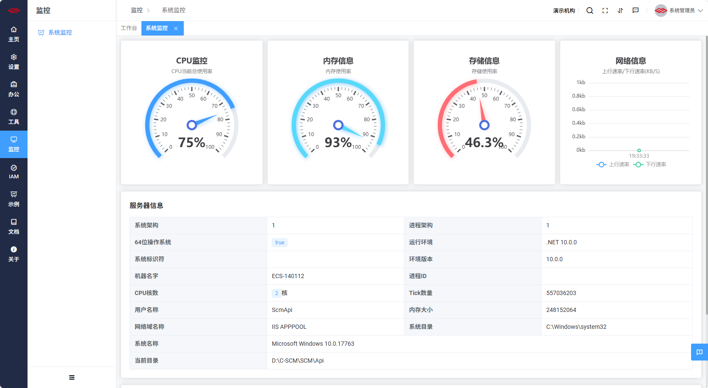
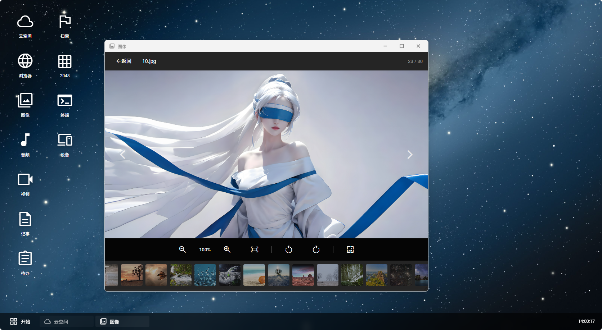
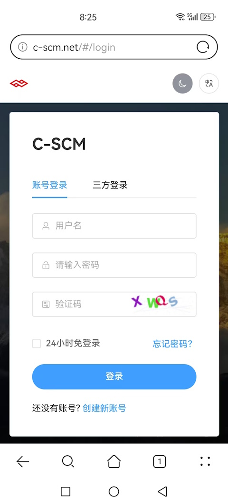
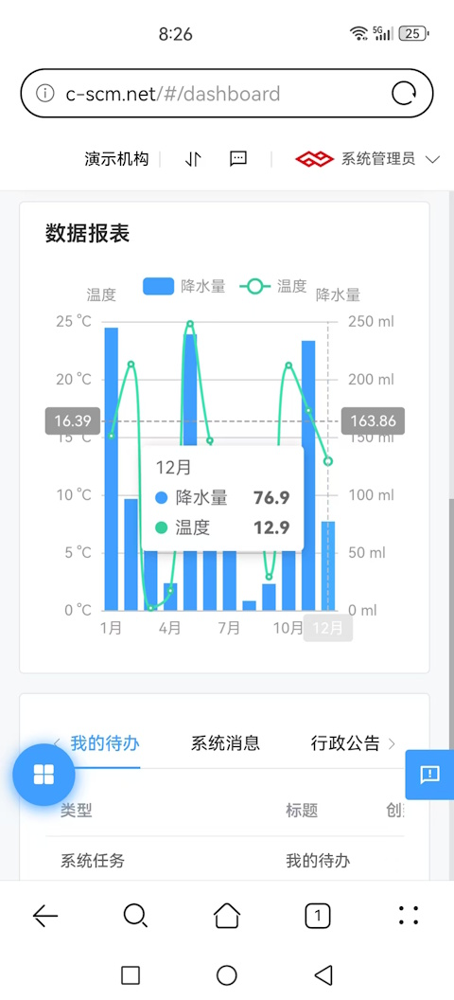
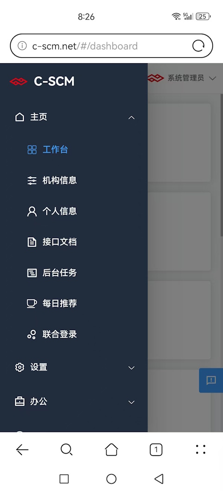

# Scm.Net

[](LICENSE)
[](https://dotnet.microsoft.com)
[](https://vuejs.org)
[](https://github.com)

## Overview

**Scm.Net** is a rapid enterprise back-office development framework built on **.NET 10.0** and **Vue 3.0**. It is designed for supply chain management systems and general enterprise information systems, supporting heterogeneous application scenarios.

Products built on this framework include: **OMS** (Order Management), **WMS** (Warehouse Management), **TMS** (Transportation Management), **DMS** (Delivery Management), **BMS** (Billing Management), **YMS** (Yard Management), **EAM** (Asset Management), **IOT** (IoT Management), and more.

## Architecture

1. Frontend/backend separation architecture;
2. Backend based on **.NET 10.0**, compatible with .NET 6/7/8/9/10 runtimes;
3. Frontend based on **[Vue 3.0](https://vuejs.org)** + **[Element Plus](https://element-plus.org)**, with i18n support;
4. Cross-platform: **Windows**, **macOS**, **Linux**, **HarmonyOS**;
5. Responsive layout supporting **Desktop**, **Tablet**, and **Mobile**.

### Backend Core Dependencies

| Library | Purpose |
| --- | --- |
| [SqlSugarCore](https://www.donet5.com/Home/Doc) | ORM / Data Access |
| [Newtonsoft.Json](https://www.newtonsoft.com/json) | JSON Serialization |
| [ImageSharp](https://github.com/SixLabors/ImageSharp) | Cross-platform Image Processing |
| [MQTTnet](https://github.com/dotnet/MQTTnet) | MQTT Communication (Client + Built-in Broker) |
| [RabbitMQ.Client](https://www.rabbitmq.com) | RabbitMQ Message Queue |
| [Quartz.NET](https://www.quartz-scheduler.net) | Job Scheduling |
| SignalR | Real-time Communication |

## Project Structure

| Project | Description |
| --- | --- |
| `Scm.Net` | Web API Entry Point |
| `Scm.Core` | Core Business Logic |
| `Scm.Dao` | Data Access Layer |
| `Scm.Dto` | Data Transfer Objects |
| `Scm.Common` | Common Enums & Utilities |
| `Scm.Dsa.Dba.Sugar` | SqlSugar Repository Base |
| `Scm.Server.Bearer` | JWT Bearer Auth Extension |
| `Scm.Server.Cache` | Cache Extension (MemoryCache / Redis) |
| `Scm.Server.MQTT` | MQTT Communication (Client + Built-in Broker) |
| `Scm.Server.RabbitMQ` | RabbitMQ Integration |
| `Scm.Server.SignalR` | SignalR Real-time Communication |
| `Scm.Server.Quartz` | Quartz Job Scheduler |
| `Scm.Server.Swagger` | Swagger Documentation Extension |
| `Scm.Generator` | Code Generator (Custom Templates) |
| `Scm.Plugin.Image` | Image Plugin (Barcode, Watermark, CAPTCHA) |
| `Scm.Plugin.Audio` | Audio Processing Plugin |
| `Scm.Plugin.Video` | Video Transcoding Plugin |
| `Scm.Addon` | Dynamic Plugin Loader |

## Design Principles

1. The database is used **only for data storage**. No database-specific features beyond CRUD are used, enabling seamless migration to any standard SQL engine.
2. **Single-table operations** only (max two tables per operation); some data redundancy is allowed to improve query performance.
3. **JSON-based** multi-platform data exchange for extensibility and low noise.
4. DTOs uniformly use **snake_case** naming to support heterogeneous integrations.

## Key Features

1. Customizable dashboard layout;
2. Multiple **login methods**: account, phone, email, OAuth (third-party);
3. Multiple **database engines**: MySQL, SQL Server, Oracle, SQLite, MariaDB, PostgreSQL, Firebird, MongoDB;
4. Multiple **cache mechanisms**: MemoryCache, Map, Redis;
5. **Login & operation audit logs** with terminal info (host, OS, browser, device);
6. Integration with multiple **AI LLMs**: DeepSeek, Huawei Pangu, Alibaba Qwen, Tencent Yuanbao, Baidu ERNIE, Doubao, ChatGPT;
7. **Code generator** with custom template support (Entity, DAO, DTO/VO);
8. Built-in **ID Generator**: Snowflake ID, Sequence ID, Format ID;
9. **Multi-level permission management**: Company → Department → Position → Role → User;
10. **Global data dictionary** and **global config parameters**;
11. **User messaging** and real-time feedback;
12. **Custom approval workflow** (definition, nodes, form binding, online approval);
13. **MQTT** lightweight communication (pub/sub client + built-in Broker, IoT-ready);
14. **RabbitMQ** message queue (producer/consumer pattern);
15. **SignalR** real-time push notifications;
16. **Quartz.NET** job scheduling;
17. **Image processing plugins** (barcode generation/recognition, watermark, CAPTCHA, avatar crop);
18. **Dynamic plugin extension** mechanism (Addon loader).

## Quick Start

### 1. Prerequisites

| Tool | Version | Download |
| --- | --- | --- |
| .NET SDK | ≥ 10.0 | [Download](https://dotnet.microsoft.com) |
| Visual Studio | ≥ 2026 | [Download](https://visualstudio.microsoft.com) |
| MariaDB / MySQL | ≥ 10.3 | [Download](https://mariadb.org) |

### 2. Clone the Repository

```bash
git clone https://gitee.com/openscm/scm.net.git
```

### 3. Configure Database

Edit `Scm.Net/appsettings.json`:

```json
{
  "Sql": {
    "Type": "Sqlite",
    "Text": "Data Source=D:/data/scm.db;"
  },
}
```

Import the initialization scripts from the `data/` directory.

### 4. Run Backend

```bash
cd Scm.Net
dotnet run
```

Verify at `http://localhost:5000/swagger`.

### 5. Run Frontend

```bash
cd Scm.Vue
npm install
npm run dev
```

For detailed setup instructions, see the [Environment Setup Guide](wikis/%E7%8E%AF%E5%A2%83%E6%90%AD%E5%BB%BA%E6%95%99%E7%A8%8B).

## Demo

[Live Demo](http://www.c-scm.net)

> For demo credentials, please visit the [demo instructions page](wikis/%E6%BC%94%E7%A4%BA%E8%AF%B4%E6%98%8E).

## Browser Support

All modern browsers are supported (IE is **not** supported):


|               | Chrome ≥88 | Firefox ≥78 | Edge ≥88 | Safari ≥14 |
| ---           | :---:      | :---:       | :---:    | :---:      |
| **Windows**   | ✅         | ✅          | ✅       | ✅         |
| **macOS**     | ✅         | ✅          | ✅       | ✅         |
| **Linux**     | ✅         | ✅          | ✅       | N/A        |
| **iOS**       | ✅         | ✅          | ✅       | ✅         |
| **Android**   | ✅         | ✅          | ✅       | N/A        |

## FAQ

[View FAQ](wikis/%E5%B8%B8%E8%A7%81%E9%97%AE%E9%A2%98)

## Contributing

1. Fork the repository
2. Create your feature branch: `git checkout -b feature/your-feature`
3. Commit your changes: `git commit -m 'feat: add your feature'`
4. Push to the branch: `git push origin feature/your-feature`
5. Open a Pull Request

## License

[](LICENSE)

This project is licensed under the **MIT License**. See [LICENSE](LICENSE) for details.

## Screenshots

**Dashboard Mode**





**Cloud Desktop Mode**





**Mobile**





## Acknowledgements

1. ORM Framework: **[SqlSugar](https://gitee.com/dotnetchina/SqlSugar)**
2. Dynamic API inspired by **[Panda.DynamicWebApi](https://gitee.com/mirrors/Panda.DynamicWebApi)**
3. Thanks to all community contributors who submitted Issues and PRs.

## Community

**QQ Group**

[](https://qm.qq.com)


