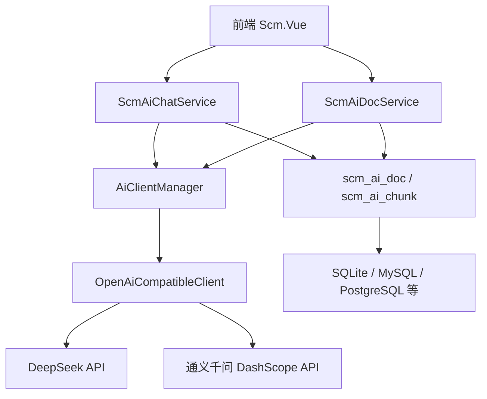
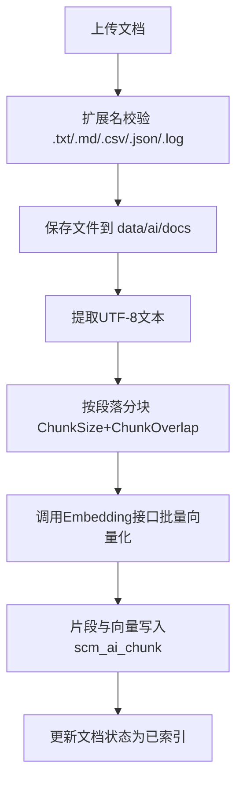
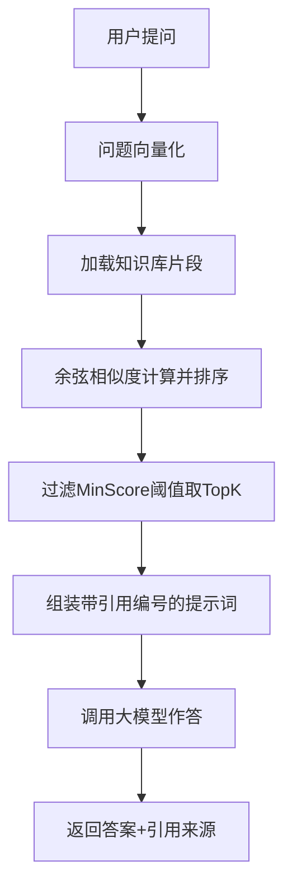

# AI 大模型集成文档

## 概述

本文档介绍 Scm.Net 框架中 AI 大模型集成模块的设计与使用方法。模块基于 **OpenAI 兼容协议**实现，当前内置支持以下服务：

| 服务 | 标识 | 能力 |
|------|------|------|
| DeepSeek | `deepseek` | 智能对话（deepseek-chat、deepseek-reasoner） |
| 通义千问（DashScope） | `qwen` | 智能对话（qwen-plus、qwen-turbo、qwen-max 等）、文本向量化（text-embedding-v3） |

提供的核心能力：

1. **智能问答** — 多轮对话、系统提示词、服务商/模型可切换
2. **流式输出** — SSE（Server-Sent Events）逐字输出，提升对话体验
3. **RAG 知识库问答** — 文档上传、自动分块、向量化索引、相似度检索、带引用来源作答

> 说明：DeepSeek 暂未提供向量化（Embedding）接口，因此 RAG 的向量化默认使用通义千问的 `text-embedding-v3`，对话默认使用 DeepSeek，两者可在配置中自由互换。

## 架构设计

### 模块结构

```
Scm.Core/Ai/
├── Config/
│   └── AiConfig.cs              # AI配置（双服务商 + RAG参数）
├── Provider/
│   ├── OpenAiCompatibleClient.cs # OpenAI兼容协议HTTP客户端
│   └── AiClientManager.cs        # 客户端工厂（实例缓存、批量向量化）
├── Rag/
│   └── AiRagCore.cs              # 建表辅助、文本提取、分块、余弦相似度
├── Dvo/
│   ├── AiDvo.cs                  # 请求/响应DTO（snake_case）
│   └── SearchRequest.cs          # 文档分页查询条件
├── AiStreamResult.cs             # SSE流式透传IActionResult
├── ScmAiChatService.cs           # 智能问答 / 流式问答 / RAG问答
└── ScmAiDocService.cs            # 知识库文档管理

Scm.Dao/Ai/
├── ScmAiDocDao.cs                # 表 scm_ai_doc（知识库文档）
└── ScmAiChunkDao.cs              # 表 scm_ai_chunk（文档片段+向量）

Scm.Common/Enums/
└── AiDocStatusEnum.cs            # 文档索引状态枚举
```

### 调用链路



两个 Service 均继承框架动态 API 约定（实现 `IApiService`），无需手写 Controller，启动时自动注册为 DI 服务并暴露为 Web API。知识库表通过 SqlSugar `CodeFirst` 在首次访问时自动创建，兼容框架支持的所有数据库。

## 配置说明

配置位于 `Scm.Net/appsettings.json` 的 `Ai` 节点：

```json
"Ai": {
  "ChatProvider": "deepseek",
  "EmbeddingProvider": "qwen",
  "DeepSeek": {
    "BaseUrl": "https://api.deepseek.com/v1",
    "ApiKey": "",
    "ChatModel": "deepseek-chat",
    "Timeout": 300
  },
  "Qwen": {
    "BaseUrl": "https://dashscope.aliyuncs.com/compatible-mode/v1",
    "ApiKey": "",
    "ChatModel": "qwen-plus",
    "EmbeddingModel": "text-embedding-v3",
    "Timeout": 300
  },
  "Rag": {
    "DocDir": "ai/docs",
    "ChunkSize": 500,
    "ChunkOverlap": 50,
    "TopK": 4,
    "MinScore": 0.2,
    "EmbedBatch": 6
  }
}
```

### 配置项说明

| 配置项 | 类型 | 默认值 | 说明 |
|--------|------|--------|------|
| `Ai:ChatProvider` | string | `deepseek` | 默认对话服务，支持：`deepseek`、`qwen` |
| `Ai:EmbeddingProvider` | string | `qwen` | 默认向量化服务，支持：`deepseek`、`qwen` |
| `Ai:DeepSeek:BaseUrl` | string | DeepSeek官方地址 | OpenAI兼容协议服务地址 |
| `Ai:DeepSeek:ApiKey` | string | 空 | 接口秘钥（敏感值，建议走环境变量） |
| `Ai:DeepSeek:ChatModel` | string | `deepseek-chat` | 默认对话模型 |
| `Ai:DeepSeek:Timeout` | int | 300 | 请求超时时间（秒） |
| `Ai:Qwen:*` | - | - | 同上，通义千问（DashScope OpenAI兼容模式） |
| `Ai:Qwen:EmbeddingModel` | string | `text-embedding-v3` | 向量化模型 |
| `Ai:Rag:DocDir` | string | `ai/docs` | 知识库文档目录（相对于 dataDir） |
| `Ai:Rag:ChunkSize` | int | 500 | 分块大小（字符数） |
| `Ai:Rag:ChunkOverlap` | int | 50 | 相邻分块重叠字符数，保证语义连续性 |
| `Ai:Rag:TopK` | int | 4 | 检索返回的最相似片段数量 |
| `Ai:Rag:MinScore` | double | 0.2 | 余弦相似度最低阈值，低于该值的片段不参与作答 |
| `Ai:Rag:EmbedBatch` | int | 6 | 向量化每批文本条数 |

### 秘钥配置（重要）

`ApiKey` 属于敏感配置，**不要直接提交到代码库**，推荐以下两种方式（参见《配置管理安全化文档》）：

**方式一：环境变量（推荐生产环境）**

```bash
# Windows
setx SCM__AI__DEEPSEEK__APIKEY "你的DeepSeek秘钥"
setx SCM__AI__QWEN__APIKEY "你的DashScope秘钥"

# Linux / macOS
export SCM__AI__DEEPSEEK__APIKEY="你的DeepSeek秘钥"
export SCM__AI__QWEN__APIKEY="你的DashScope秘钥"
```

**方式二：User Secrets（推荐开发环境）**

```bash
cd Scm.Net
dotnet user-secrets set "Ai:DeepSeek:ApiKey" "你的DeepSeek秘钥" --project Scm.Net
dotnet user-secrets set "Ai:Qwen:ApiKey" "你的DashScope秘钥" --project Scm.Net
```

## API 接口说明

所有接口均需携带 JWT 令牌（`Authorization: Bearer {token}`），Swagger/Scalar 分组名为 `Ai`。

### 1. 智能问答

`POST /api/ScmAiChat/Chat`

请求体：

```json
{
  "provider": "deepseek",
  "model": "",
  "system": "你是一个企业中台助手，回答要简洁专业。",
  "messages": [
    { "role": "user", "content": "什么是动态API？" }
  ],
  "temperature": 0.7
}
```

| 字段 | 必填 | 说明 |
|------|------|------|
| provider | 否 | `deepseek` / `qwen`，为空使用配置的 ChatProvider |
| model | 否 | 指定模型，为空使用配置的默认模型 |
| system | 否 | 系统提示词 |
| messages | 是 | 对话消息列表，role 支持 system/user/assistant，可传多轮历史 |
| temperature | 否 | 温度参数（0~2），默认 0.7 |

响应体：

```json
{
  "content": "动态API是一种自动将Service类暴露为Web API的机制……",
  "provider": "deepseek",
  "model": "deepseek-chat"
}
```

### 2. 流式问答（SSE）

`POST /api/ScmAiChat/ChatStream`

请求体与智能问答相同，响应为 `text/event-stream` 流，格式与 OpenAI 流式协议一致：

```
data: {"choices":[{"delta":{"content":"动"}}]}

data: {"choices":[{"delta":{"content":"态"}}]}

data: [DONE]
```

前端可用 `EventSource` 或 `fetch` + `ReadableStream` 逐条解析 `delta.content` 拼接展示。

### 3. 知识库问答（RAG）

`POST /api/ScmAiChat/Ask`

请求体：

```json
{
  "question": "框架支持哪些数据库？",
  "doc_id": 0,
  "top_k": 4,
  "provider": "deepseek",
  "model": ""
}
```

| 字段 | 必填 | 说明 |
|------|------|------|
| question | 是 | 问题内容 |
| doc_id | 否 | 限定在某篇文档内检索，0 表示全部文档 |
| top_k | 否 | 检索片段数量，0 使用配置默认值 |

响应体：

```json
{
  "content": "框架支持 SQLite、MySQL、PostgreSQL 等数据库[1]。",
  "provider": "deepseek",
  "model": "deepseek-chat",
  "sources": [
    {
      "doc_id": 1234567890,
      "doc_name": "框架说明.md",
      "chunk_no": 3,
      "score": 0.65,
      "content": "Scm.Net 支持 SQLite、MySQL、MariaDB、PostgreSQL……"
    }
  ]
}
```

### 4. 上传并索引文档

`POST /api/ScmAiDoc/Upload`（multipart/form-data）

| 表单项 | 必填 | 说明 |
|--------|------|------|
| file | 是 | 文档文件，支持 `.txt`、`.md`、`.csv`、`.json`、`.log` |
| remark | 否 | 备注 |

上传后同步执行：保存文件 → 提取文本 → 分块 → 向量化 → 入库，返回文档信息（含索引状态）。返回的 `status` 字段：`0`待索引、`1`索引中、`2`已索引、`3`索引失败（失败原因见 `remark`）。

### 5. 文档分页查询

`GET /api/ScmAiDoc/Pages?page=1&limit=20&key=关键字&status=2`

### 6. 重建文档索引

`POST /api/ScmAiDoc/Rebuild`，请求体：`{ "id": 1234567890 }`

### 7. 删除文档

`DELETE /api/ScmAiDoc?ids=1,2,3`（逗号分隔，同时删除片段与磁盘文件）

## RAG 实现原理

### 索引流程



分块策略：优先按段落（换行）切分并合并到 `ChunkSize` 大小的块中，相邻块保留 `ChunkOverlap` 字符的重叠，避免语义被截断；超过 `ChunkSize` 的单段落强制按长度切分。

### 问答流程



提示词约束模型仅依据检索到的资料作答，资料未覆盖的内容会明确回复"资料中未提及"，并在句末标注引用编号（如 `[1]`），前端可据此展示来源溯源。

### 数据表结构

**scm_ai_doc（知识库文档表）**

| 字段 | 类型 | 说明 |
|------|------|------|
| id | long | 唯一编号（主键） |
| names | string(128) | 文档名称 |
| exts | string(16) | 文件扩展名 |
| file_path | string(256) | 文件相对路径（相对 dataDir） |
| file_size | long | 文件大小（字节） |
| char_count | long | 文本字符数 |
| chunk_count | int | 片段数量 |
| status | int | 索引状态：0待索引、1索引中、2已索引、3失败 |
| remark | string(512) | 备注/失败原因 |
| row_status / create_* / update_* | - | 框架标准审计字段 |

**scm_ai_chunk（文档片段表）**

| 字段 | 类型 | 说明 |
|------|------|------|
| id | long | 唯一编号（主键） |
| doc_id | long | 所属文档ID |
| chunk_no | int | 片段序号 |
| content | text | 片段文本 |
| dim | int | 向量维度 |
| vector | text | 向量数据（JSON数组） |

向量以 JSON 文本存储，检索时加载到内存计算余弦相似度，该方案无数据库特性依赖、适配框架支持的所有数据库，适用于中小规模知识库（万级片段以内）。

## 扩展指南

### 新增 OpenAI 兼容的大模型服务

由于客户端基于通用的 OpenAI 兼容协议（`OpenAiCompatibleClient`），接入 Moonshot、智谱、豆包等任何兼容服务通常只需：

1. 在 `AiConfig` 中新增服务商配置节与标识常量；
2. 扩展 `AiConfig.GetProvider()` 的分支；
3. 在 `appsettings.json` 配置 BaseUrl / ApiKey / 模型名。

### 扩展文档解析格式

当前仅支持纯文本类文档。如需支持 PDF / Word，可在 `Scm.Core/Ai/Rag/AiRagCore.cs` 中：

1. `AiDocReader.AcceptExts` 追加扩展名；
2. `AiDocReader.ReadText()` 按扩展名分发到对应解析器（如 `UglyToad.PdfDocument`、`DocumentFormat.OpenXml`）。

### 接入向量数据库

片段规模较大时，可将 `ScmAiChatService.SearchChunksAsync` 中的内存余弦检索替换为 Milvus / PostgreSQL pgvector 等向量数据库检索，其余流程无需改动。

## 注意事项

1. **DeepSeek 无向量化接口**：RAG 场景必须配置一个支持 Embedding 的服务（默认 `qwen`），否则上传文档会报"AI服务未配置"。
2. **超时设置**：大模型响应较慢，默认超时 300 秒；文档索引（Embedding 批量调用）为同步流程，超大文档建议拆分后上传。
3. **流式接口**：`ChatStream` 返回原始 SSE 流（标注了 `NoJsonResult`，不走统一响应包装），前端需按 SSE 协议解析。
4. **建表时机**：`scm_ai_doc` / `scm_ai_chunk` 在 AI 服务首次被访问时通过 CodeFirst 自动创建，无需手工执行 DDL。
5. **文档格式**：知识库目前仅支持 `.txt/.md/.csv/.json/.log` 纯文本格式，二进制文档请先转换。
